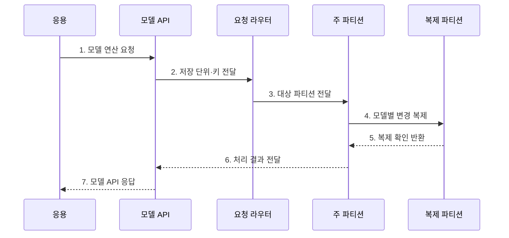

---
sidebar:
  order: 102
  label: "102. NoSQL 유형: 문서·키값·컬럼·그래프 (NoSQL Types)"
  badge:
    text: "기출 · 70%"
    variant: note
title: "NoSQL 유형: 문서·키값·컬럼·그래프 (NoSQL Types)"
date: "2026-07-27T23:59:59+09:00"
tags:
  - "notes-software"
weight: 102
extra:
  question_no: "102"
  source_status: "기출"
  source_history: "131회, 137회"
  priority: 70
  priority_note: "131·137회 반복, NoSQL 유형 선택 핵심"
---

## 미리 알고가기

- **NoSQL(Not Only SQL)**: 관계형 표 이외의 키값·문서·와이드 컬럼·그래프 모델을 주로 사용하는 데이터베이스 범주
- **자바스크립트 객체 표기법(JavaScript Object Notation, JSON)**: 이름과 값의 계층 구조로 문서 데이터를 표현하는 형식
- **문서형(Document Store)**: 중첩 필드와 가변 구조를 가진 문서를 식별자 단위로 저장·조회한다.
- **키값형(Key-Value Store)**: 고유 키와 불투명한 값의 쌍으로 저장해 키 기반 직접 조회를 제공한다.
- **와이드 컬럼형(Wide-Column Store)**: 행 키 아래 필요한 열 묶음을 분산 저장해 대규모 희소 데이터를 처리한다.
- **그래프형(Graph Database)**: 정점·간선·속성으로 개체와 관계를 저장해 연결 탐색을 지원한다.
- **정점(Vertex)**: 그래프에서 사람·상품 같은 개체를 나타내는 요소
- **간선(Edge)**: 두 정점 사이의 관계·방향·속성을 나타내는 요소
- **파티션(Partition)**: 분산 저장과 처리를 위해 데이터를 나눈 논리 단위
- **복제(Replication)**: 가용성·읽기 확장을 위해 같은 데이터의 사본을 여러 노드에 유지하는 기술
- **일관성(Consistency)**: 여러 읽기와 사본에서 데이터 규칙과 최신 상태가 유지되는 성질

## Ⅰ. 개요

- 정의/개념: 키값·문서·열·그래프를 쓰는 **비관계형 DB 분류**
- 배경/필요성: 접근 패턴별 확장·질의 최적화

### 쉽게 이해하기 (학습용)

- 모든 자료를 같은 표에 넣지 않고 문서, 사물함, 열 묶음, 관계망 중 사용 방식에 맞는 보관함을 고른다.

## Ⅱ. 특징

- **모델 특화**: 문서·키·열·관계 연산 제공
- **접근 우선**: 조회에서 키·중복 구조 역설계
- **책임 이동**: 정합성 일부를 응용에서 처리

### 쉽게 이해하기 (학습용)

- 자주 묻는 질문에는 빠르게 답하지만 다른 형태의 질문은 어렵기 때문에 조회 방식부터 정하고 모델을 선택해야 한다.

## Ⅲ. 구조 및 구성요소

| 구성요소 | 책임 |
|:---|:---|
| 접근 패턴 | 조회·갱신·집계 단위 정의 |
| 데이터 모델 | 문서·키값·열·그래프 구조 결정 |
| 모델 API | 모델별 연산 제공 |
| 파티션·복제 | 데이터 위치와 사본 관리 |
| 일관성 정책 | 읽기·쓰기 확인 수준 결정 |

### 쉽게 이해하기 (학습용)

- 질문 형태에 맞는 보관함과 조회 방법, 사본 규칙을 묶는다.

## Ⅳ. 흐름도

**동작 원리**

- **1. 모델 연산 요청**: 키와 연산을 전달
- **2. 저장 단위·키 전달**: 라우팅 정보를 생성
- **3. 대상 파티션 전달**: 저장 위치로 전달
- **4. 모델별 변경 복제**: 사본에 전파
- **5. 복제 확인 반환**: 정책 수준을 확인
- **6. 처리 결과 전달**: API에 결과를 전달
- **7. 모델 API 응답**: 응용에 반환

### 쉽게 이해하기 (학습용)

- 자료 형태에 맞는 보관함과 지점을 찾아 저장하고 필요한 수의 사본을 확인한다.

## Ⅴ. 종류 및 비교

| 판단 기준 | 문서형 | 키값형 | 그래프형 |
|:---|:---|:---|:---|
| 적용 기준 | 가변 속성 객체 | 세션·캐시 | 관계·경로 탐색 |
| 핵심 특징 | 중첩 문서·필드 질의 | 키로 값 직접 접근 | 정점·간선 순회 |
| 한계 | 문서 간 정합성 | 값 내부 검색 제한 | 분산 순회 비용 |

> 선택 기준: 제품 분류보다 **필요 연산의 성능·일관성 보장** 확인

### 쉽게 이해하기 (학습용)

- 상품 객체는 문서, 세션은 키값, 센서 기록은 와이드 컬럼, 친구 추천은 그래프 모델이 잘 맞는다.

## Ⅵ. 실무 고려사항 및 대책

| 고려사항 | 대책 | 효과 |
|:---|:---|:---|
| 접근 패턴 | 핵심 조회·갱신 목록 검증 | 모델 오선택 방지 |
| 키 설계 | 분포·지역성 실데이터 시험 | 핫 파티션 감소 |
| 데이터 중복 | 원본·대사·재구축 정의 | 복사본 불일치 복구 |
| 일관성 | 연산별 최신성·원자성 확인 | 업무 보장 명확화 |
| 제품 종속 | 반출·백업·전환 비용 검증 | 전환 위험 통제 |

> **적용 사례**: 상품별 속성이 크게 다르고 상품 단위로 읽고 쓴다면 문서형을 검토하되 가격·재고의 트랜잭션 경계는 별도로 확인

### 쉽게 이해하기 (학습용)

- 담기 편한 모양보다 실제로 자주 찾고 함께 바꾸는 단위에 맞는 보관함을 고른다.

## Ⅶ. 결론

- **조회·갱신·일관성·전환 비용**으로 NoSQL 유형을 결정

### 쉽게 이해하기 (학습용)

- 가장 자주 묻고 고치는 방식에 맞는 보관함을 고르고 사본과 복구 규칙까지 정한다.
