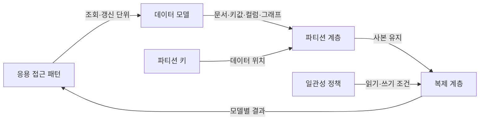
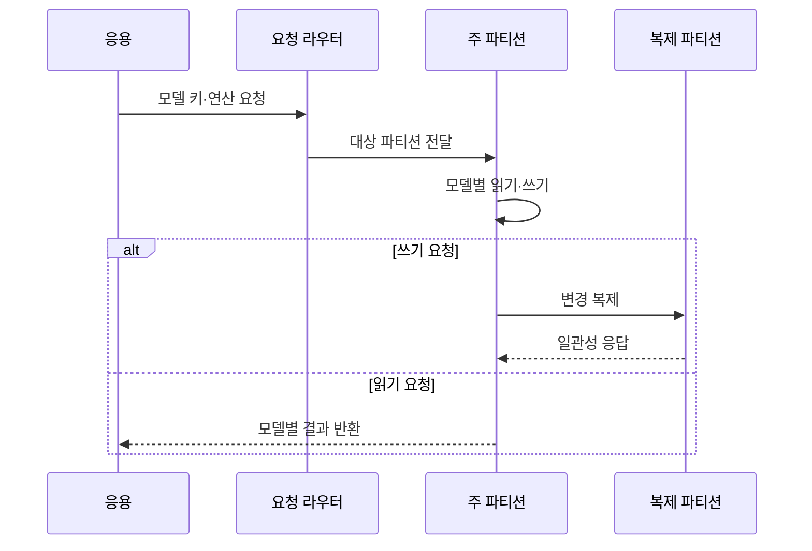

---
sidebar:
  order: 102
  label: "102. NoSQL 유형 — 문서·키값·컬럼·그래프 (NoSQL Types)"
  badge:
    text: "기출 · 70%"
    variant: note
title: "NoSQL 유형 — 문서·키값·컬럼·그래프 (NoSQL Types)"
date: "2026-07-27T23:59:59+09:00"
tags:
  - "notes-software"
weight: 102
extra:
  question_no: "102"
  source_status: "기출"
  source_history: "131회, 137회"
  priority: 70
  priority_note: "131·137회 반복, NoSQL 유형 선택 핵심"
---

## 미리 알고가기

- **비관계형 데이터베이스(Not Only SQL, NoSQL)**: ‘노에스큐엘’로 읽고 SQL만을 뜻하지 않는다는 문구의 핵심 글자를 딴 명칭이며, 관계형 표 외 다양한 데이터 모델과 분산 확장을 지원함
- **자바스크립트 객체 표기법(JavaScript Object Notation, JSON)**: ‘제이슨’으로 읽고 영문 핵심 글자를 딴 약어이며, 이름-값 구조의 문서 데이터를 표현하는 형식
- **문서형(Document Store)**: 중첩 필드와 가변 구조를 가진 문서를 식별자 단위로 저장·조회함
- **키값형(Key-Value Store)**: 고유 키와 불투명한 값의 쌍으로 저장해 키 기반 직접 조회를 제공함
- **와이드 컬럼형(Wide-Column Store)**: 행 키 아래 필요한 열 묶음을 분산 저장해 대규모 희소 데이터를 처리함
- **그래프형(Graph Database)**: 정점·간선·속성으로 개체와 관계를 저장해 연결 탐색을 지원함
- **정점(Vertex)**: 그래프에서 사람·상품 같은 개체를 나타내는 요소
- **간선(Edge)**: 두 정점 사이의 관계·방향·속성을 나타내는 요소
- **파티션(Partition)**: 분산 저장과 처리를 위해 데이터를 나눈 논리 단위
- **복제(Replication)**: 가용성·읽기 확장을 위해 같은 데이터의 사본을 여러 노드에 유지하는 기술
- **일관성(Consistency)**: 여러 읽기와 사본에서 데이터 규칙과 최신 상태가 유지되는 성질

## Ⅰ. 개요

- 정의/개념: 조회 패턴에 맞는 **비관계형 모델로 저장·처리**
- 기존 한계: 고정 관계형 스키마의 **가변 구조·수평 확장 제약**

### 쉽게 이해하기 (학습용)

- 모든 자료를 같은 표에 넣지 않고 문서, 사물함, 열 묶음, 관계망 중 사용 방식에 맞는 보관함을 고른다.

## Ⅱ. 특징

- 모델별 **저장 단위·조회 연산 특화**
- 파티션·복제 기반의 **수평 확장**
- 애플리케이션의 **스키마·일관성 책임 증가**

### 쉽게 이해하기 (학습용)

- 자주 묻는 질문에는 빠르게 답하지만 다른 형태의 질문은 어렵기 때문에 조회 방식부터 정하고 모델을 선택해야 한다.

## Ⅲ. 아키텍처 및 구성요소

| 구성요소 | 책임 |
|:---|:---|
| 응용 접근 패턴 | **조회·갱신 단위** 정의 |
| 데이터 모델 | 데이터의 **저장·질의 구조** 결정 |
| 파티션 키 | 데이터의 **노드 위치·분포** 결정 |
| 복제 계층 | 사본의 **가용성·읽기 확장** |
| 일관성 정책 | 읽기·쓰기의 **최신성 수준** 결정 |

> 요약: 접근 패턴이 모델을, 파티션·복제가 분산 특성을 결정

### 쉽게 이해하기 (학습용)

- 무엇을 한 번에 찾고 바꾸는지에 맞춰 보관함을 정하고 자료 위치와 복사본 확인 규칙을 설계한다.

## Ⅳ. 원리 및 절차 흐름

| 절차 | 설명 |
|:---|:---|
| 모델 요청 | 문서·키·열·관계의 **연산 표현** |
| 파티션 전달 | 키 기반 **대상 노드 라우팅** |
| 모델별 처리 | 전용 구조의 **읽기·쓰기 실행** |
| 변경 복제 | 가용성용 **사본 전파** |
| 일관성 응답 | 요구 사본 수의 **확인·완료 판정** |
| 결과 반환 | 모델이 지원하는 **직접 질의 결과** |

> 요약: 모델 키로 라우팅하고 일관성 정책에 따라 복제 확인

### 쉽게 이해하기 (학습용)

- 요청에 맞는 보관함과 지점을 찾아 자료를 처리하고 정해진 수의 복사본이 반영됐는지 확인한다.

## Ⅴ. 종류 및 비교

| NoSQL 유형 | 문서형 | 키값형 | 와이드 컬럼형 | 그래프형 |
|:---|:---|:---|:---|:---|
| 적용 기준 | 가변 구조·**객체 단위 조회** | 키 기반 **초고속 단건 조회** | 대규모 **희소·시계열 데이터** | 다단계 **관계 탐색** |
| 핵심 특징 | 중첩 문서의 **필드 질의** | 키의 **직접 값 접근** | 행 키의 **분산 열 묶음** | 정점·간선의 **연결 순회** |
| 한계 | 문서 간 **조인·중복 관리** | 값 내부 **조건 검색 제한** | 파티션 키·**질의 유연성 제한** | 대규모 전역 집계·**분산 비용** |

> 요약: 객체·키·희소 열·관계 탐색의 주 접근 패턴으로 선택

### 쉽게 이해하기 (학습용)

- 상품 객체는 문서, 세션은 키값, 센서 기록은 와이드 컬럼, 친구 추천은 그래프 모델이 잘 맞는다.

## Ⅵ. 실무 사례

1. 상품 카탈로그는 **JSON 문서형**으로 가변 속성 저장
2. 친구 추천은 **정점·간선 그래프 탐색**으로 관계 계산

### 쉽게 이해하기 (학습용)

- 상품마다 다른 속성은 한 문서에 담고, 사람 사이의 여러 단계 연결은 관계망을 따라 찾는다.

## Ⅶ. 결론

- 객체는 **문서**, 단건은 **키값**, 희소 열은 **컬럼**, 관계는 **그래프**

### 쉽게 이해하기 (학습용)

- 제품 이름이 아니라 가장 빈번한 조회와 갱신 단위, 일관성 요구를 기준으로 모델을 선택한다.
