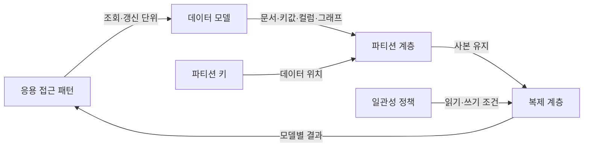
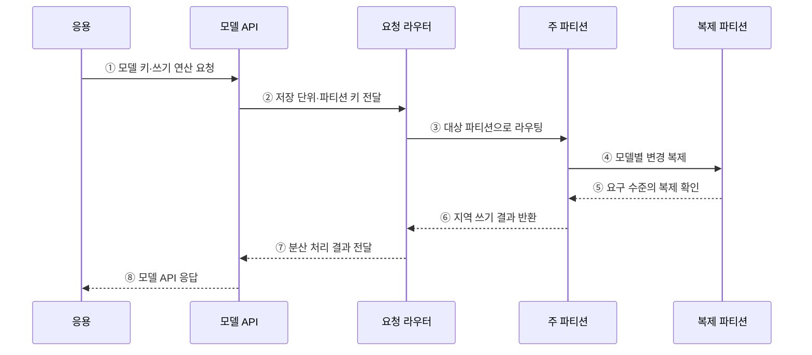

---
sidebar:
  order: 102
  label: "102. NoSQL 유형 — 문서·키값·컬럼·그래프 (NoSQL Types)"
  badge:
    text: "기출 · 70%"
    variant: note
title: "NoSQL 유형 — 문서·키값·컬럼·그래프 (NoSQL Types)"
date: "2026-07-27T23:59:59+09:00"
tags:
  - "notes-software"
weight: 102
extra:
  question_no: "102"
  source_status: "기출"
  source_history: "131회, 137회"
  priority: 70
  priority_note: "131·137회 반복, NoSQL 유형 선택 핵심"
---

## 미리 알고가기

- **NoSQL(Not Only SQL)**: 관계형 표 이외의 키값·문서·와이드 컬럼·그래프 모델을 주로 사용하는 데이터베이스 범주
- **자바스크립트 객체 표기법(JavaScript Object Notation, JSON)**: 이름과 값의 계층 구조로 문서 데이터를 표현하는 형식
- **문서형(Document Store)**: 중첩 필드와 가변 구조를 가진 문서를 식별자 단위로 저장·조회함
- **키값형(Key-Value Store)**: 고유 키와 불투명한 값의 쌍으로 저장해 키 기반 직접 조회를 제공함
- **와이드 컬럼형(Wide-Column Store)**: 행 키 아래 필요한 열 묶음을 분산 저장해 대규모 희소 데이터를 처리함
- **그래프형(Graph Database)**: 정점·간선·속성으로 개체와 관계를 저장해 연결 탐색을 지원함
- **정점(Vertex)**: 그래프에서 사람·상품 같은 개체를 나타내는 요소
- **간선(Edge)**: 두 정점 사이의 관계·방향·속성을 나타내는 요소
- **파티션(Partition)**: 분산 저장과 처리를 위해 데이터를 나눈 논리 단위
- **복제(Replication)**: 가용성·읽기 확장을 위해 같은 데이터의 사본을 여러 노드에 유지하는 기술
- **일관성(Consistency)**: 여러 읽기와 사본에서 데이터 규칙과 최신 상태가 유지되는 성질

## Ⅰ. 개요

- NoSQL은 키값·문서·와이드 컬럼·그래프처럼 특정 데이터 구조와 접근 패턴에 맞춘 데이터베이스 범주이다.
- 관계형 DB도 유연한 스키마와 수평 확장을 지원할 수 있으므로 제품 계열이 아니라 **주요 조회·갱신 패턴과 일관성 요구**로 선택해야 한다.

### 쉽게 이해하기 (학습용)

- 모든 자료를 같은 표에 넣지 않고 문서, 사물함, 열 묶음, 관계망 중 사용 방식에 맞는 보관함을 고른다.

## Ⅱ. 특징

- **모델 특화**: 저장 단위와 질의 연산을 문서·키·열 묶음·관계 탐색에 맞춘다.
- **접근 패턴 우선**: 필요한 질의에서 역으로 키·중복·집계 구조를 설계한다.
- **분산 지원**: 많은 제품이 파티션·복제로 수평 확장과 가용성을 제공한다.
- **책임 이동**: 제품에 따라 조인·스키마·트랜잭션·정합성 책임이 애플리케이션으로 이동한다.

### 쉽게 이해하기 (학습용)

- 자주 묻는 질문에는 빠르게 답하지만 다른 형태의 질문은 어렵기 때문에 조회 방식부터 정하고 모델을 선택해야 한다.

## Ⅲ. 아키텍처 및 구성요소

**도표안 A — 구조도**

**도표안 B — sequenceDiagram**

| 구성요소 | 역할 |
|:---|:---|
| 접근 패턴 | 조회 조건·결과·갱신·트랜잭션 단위 정의 |
| 데이터 모델 | 문서·키값·와이드 컬럼·그래프 저장 구조 결정 |
| 모델 API | 모델에 맞는 키·필드·열·순회 연산 제공 |
| 파티션·복제 | 데이터 위치와 사본 수·가용성 관리 |
| 일관성 정책 | 읽기·쓰기 확인 수준과 최신성 결정 |

**동작 원리**

- ① 응용이 선택한 모델의 키와 쓰기 연산을 API에 요청한다.
- ② 모델 API가 저장 단위와 파티션 키를 라우터에 전달한다.
- ③ 라우터가 키에 해당하는 주 파티션으로 요청을 보낸다.
- ④ 주 파티션이 모델별 구조를 갱신하고 변경을 복제 파티션에 전달한다.
- ⑤ 복제 파티션이 설정된 일관성 수준의 확인을 반환한다.
- ⑥ 주 파티션이 지역 쓰기 결과를 라우터에 반환한다.
- ⑦ 라우터가 분산 처리 결과를 모델 API에 전달한다.
- ⑧ 모델 API가 응용에 성공 또는 오류를 응답한다.

### 쉽게 이해하기 (학습용)

- 자료 형태에 맞는 보관함과 지점을 찾아 저장하고 필요한 수의 사본을 확인한다.

## Ⅳ. 종류 및 비교

| 유형 | 저장 단위·연산 | 적합한 상황 | 주요 한계 |
|:---|:---|:---|:---|
| 문서형 | 중첩 문서와 필드 질의 | 가변 속성의 객체·콘텐츠 | 문서 간 조인·중복 정합성 |
| 키값형 | 키로 불투명한 값 직접 접근 | 세션·캐시·장바구니 | 값 내부 조건 검색 제한 |
| 와이드 컬럼형 | 행 키 아래 희소 열 묶음 | 대규모 시계열·이벤트 | 파티션 키 의존·질의 유연성 |
| 그래프형 | 정점·간선의 연결 순회 | 추천·경로·사기 관계 분석 | 전역 집계·분산 순회 비용 |

> 실제 제품은 여러 모델을 함께 지원할 수 있으므로 분류 이름보다 필요한 연산의 성능·일관성 보장을 확인해야 한다.

### 쉽게 이해하기 (학습용)

- 상품 객체는 문서, 세션은 키값, 센서 기록은 와이드 컬럼, 친구 추천은 그래프 모델이 잘 맞는다.

## Ⅴ. 실무 고려사항 및 대책

| 고려사항 | 위험 | 대책 |
|:---|:---|:---|
| 접근 패턴 | 저장 편의만 보고 모델 선택 | 핵심 조회·갱신·집계 목록으로 후보 검증 |
| 키 설계 | 핫 파티션·팬아웃 | 분포·지역성·성장성을 실제 데이터로 시험 |
| 중복 | 읽기 최적화 복사본의 불일치 | 원본·갱신 경로·대사·재구축 절차 정의 |
| 일관성 | 제품 기본값을 업무 보장으로 오해 | 연산별 최신성·원자성·격리 수준 확인 |
| 스키마 | 무제약 문서·열의 품질 저하 | 버전·검증·마이그레이션 규칙 운영 |
| 종속성 | 전용 API·질의 언어에 고착 | 데이터 반출·백업 복구·전환 비용 검증 |

> **적용 사례**: 상품별 속성이 크게 다르고 상품 단위로 읽고 쓴다면 문서형을 검토하되 가격·재고의 트랜잭션 경계는 별도로 확인한다.

### 쉽게 이해하기 (학습용)

- 담기 편한 모양보다 실제로 자주 찾고 함께 바꾸는 단위에 맞는 보관함을 고른다.

## Ⅵ. 결론

- NoSQL 유형은 데이터 모양보다 핵심 조회·갱신 연산을 효율적으로 처리하는 모델로 선택해야 한다.
- 파티션·복제·일관성·중복 관리와 운영 복구 비용까지 검증해야 모델 특화의 이점을 얻을 수 있다.

### 쉽게 이해하기 (학습용)

- 가장 자주 묻고 고치는 방식에 맞는 보관함을 고르고 사본과 복구 규칙까지 정한다.
