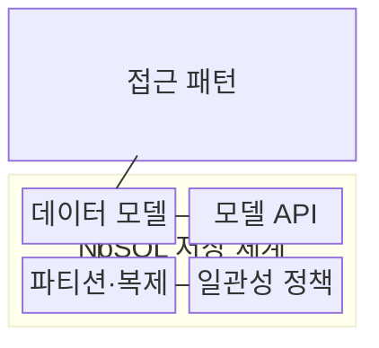
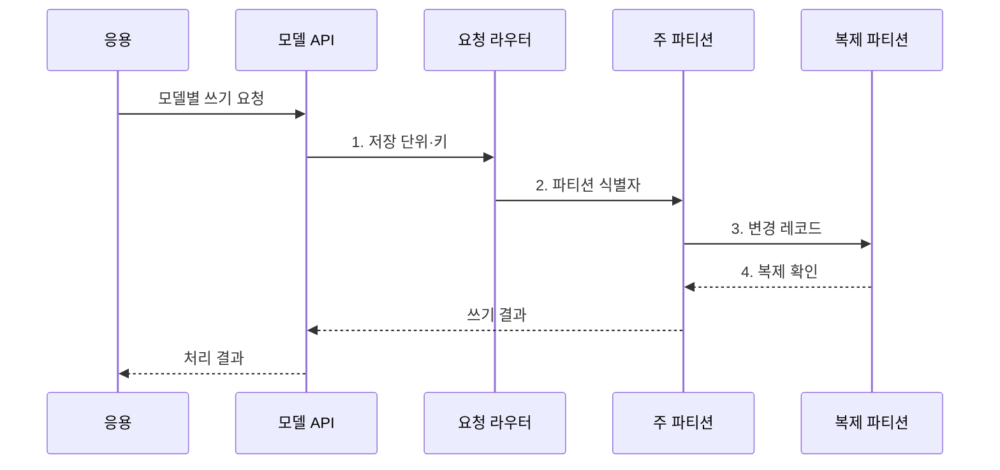

---
sidebar:
  order: 102
  label: "102. NoSQL 유형: 문서·키값·컬럼·그래프 (NoSQL Types)"
  badge:
    text: "기출 · 70%"
    variant: note
title: "NoSQL 유형: 문서·키값·컬럼·그래프 (NoSQL Types)"
date: "2026-08-02T12:00:00+09:00"
tags:
  - "notes-software"
weight: 102
extra:
  question_no: "102"
  source_status: "기출"
  source_history: "131회, 137회"
  priority: 70
  priority_note: "131·137회 반복, NoSQL 유형 선택 핵심"
---

## Ⅰ. 개요

핵심 용어

- **비관계형 데이터베이스 분류**: 접근 패턴에 따라 문서·키값·와이드 컬럼·그래프 저장 구조를 선택하는 분류이다.

- 정의/개념: **NoSQL 유형**은 키-값·문서·와이드 컬럼·그래프처럼 데이터 모델과 접근 패턴에 따라 저장 구조를 구분한 비관계형 데이터베이스 분류
- 배경/필요성: 고정 스키마·조인 중심 설계로 **가변 구조·분산 확장** 제약

#### 한줄 요약

- 모든 자료를 같은 표에 넣지 않고 문서, 사물함, 열 묶음, 관계망 중 사용 방식에 맞는 보관함을 고른다.

## Ⅱ. 특징

핵심 용어

- **비정규화·파티션 키**: 조회 패턴에 맞춰 데이터 배치와 분산 위치를 역설계할 때 함께 결정하는 요소이다.

- 데이터 형태별 **전용 저장 모델·연산** 제공
- 조회 패턴에 맞춰 **비정규화·파티션 키** 역설계
- 복제본 갱신 시 **일관성·가용성** 수준 선택

#### 한줄 요약

- 자주 묻는 질문에는 빠르게 답하지만 다른 형태의 질문은 어렵기 때문에 조회 방식부터 정하고 모델을 선택해야 한다.

## Ⅲ. 구조 및 구성요소

핵심 용어

- **데이터 모델**: 문서·키값·와이드 컬럼·그래프 가운데 저장 구조와 지원 연산을 결정하는 구성요소이다.

| 구성요소 | 책임 |
|:---|:---|
| 접근 패턴 | **조회·갱신·집계 단위** 정의 |
| 데이터 모델 | **문서·키값·와이드 컬럼·그래프** 구조 결정 |
| 모델 API | 데이터 모델별 **저장·조회 연산** 제공 |
| 파티션·복제 | **파티션 키·복제본** 위치 관리 |
| 일관성 정책 | 읽기·쓰기의 **확인 수준** 결정 |

#### 한줄 요약

- 질문 형태에 맞는 보관함과 조회 방법, 사본 규칙을 묶는다.

## Ⅳ. 흐름도

핵심 용어

- **1. 저장 단위·키**: 모델별 기록에서 파티션 키를 추출해 저장 위치를 정하기 위한 입력이다.

**동작 원리**

1. **저장 단위·키**: 모델별 기록 단위에서 파티션 키 추출
2. **파티션 식별자**: 키 해시·범위로 저장 노드 결정
3. **변경 레코드**: 주 파티션의 변경 사항을 복제본에 전파
4. **복제 확인**: 요구 확인 수를 충족하면 쓰기 성공 판정

#### 한줄 요약

- 자료 형태에 맞는 보관함과 지점을 찾아 저장하고 필요한 수의 사본을 확인한다.

## Ⅴ. 종류 및 비교

핵심 용어

- **문서형**: 중첩 필드와 가변 구조를 가진 객체를 문서 단위로 저장하고 조회하는 모델이다.

| NoSQL 데이터 모델 | 문서형 | 키값형 | 와이드 컬럼형 | 그래프형 |
|:---|:---|:---|:---|:---|
| 적용 기준 | **가변 구조 객체** 조회 | **단일 키** 중심 조회 | 대규모 **희소 행·범위** 조회 | **관계·경로** 탐색 |
| 핵심 특징 | **중첩 문서·필드 질의** | 키로 **불투명 값** 직접 접근 | 행 키 아래 **가변 열 묶음** 저장 | **정점·간선** 순회 |
| 한계 | 문서 간 **트랜잭션 경계** 확대 | 값 내부 **조건 검색** 제한 | 파티션 키 오류 시 **핫 파티션** | 분산 환경의 **관계 순회 비용** |

> 요약: 제품명이 아니라 **필요 연산·일관성 경계**로 모델 선택

#### 한줄 요약

- 상품 객체는 문서, 세션은 키값, 센서 기록은 와이드 컬럼, 친구 추천은 그래프 모델이 잘 맞는다.

## Ⅵ. 실무 고려사항 및 대책

핵심 용어

- **편향된 파티션 키는 특정 노드에 부하 집중**: 키 분포가 치우쳐 한 파티션의 처리량과 지연이 악화되는 문제이다.

| 문제 | 대책 | 효과 |
|:---|:---|:---|
| 설계와 다른 질의가 늘면 전체 데이터 탐색 증가 | 핵심 조회·갱신별 **모델 연산 검증** | **전체 탐색 범위** 감소 |
| 편향된 파티션 키는 특정 노드에 부하 집중 | 실데이터로 **키 분포·지역성** 시험 | **핫 파티션** 감소 |
| 비정규화 복사본 갱신 실패 시 값 불일치 | **원본·대사·재구축 절차** 정의 | **복사본 정합성** 복구 |
| 연산마다 최신성·원자성 요구가 다른 상황 | 연산별 **일관성 수준** 설정 | **업무 보장 범위** 명확화 |
| 제품 종속 API는 데이터 반출·전환 비용 증가 | **백업 형식·전환 절차** 검증 | **제품 전환 위험** 감소 |

#### 한줄 요약

- 담기 편한 모양보다 실제로 자주 찾고 함께 바꾸는 단위에 맞는 보관함을 고른다.

## Ⅶ. 결론

핵심 용어

- **접근 패턴**: 자주 수행하는 조회·갱신·집계 단위로 적절한 NoSQL 모델을 선택하는 기준이다.

- **접근 패턴**과 일관성 경계에 맞는 **NoSQL 모델** 선택

#### 한줄 요약

- 가장 자주 묻고 고치는 방식에 맞는 보관함을 고르고 사본과 복구 규칙까지 정한다.
