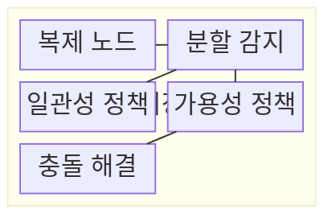
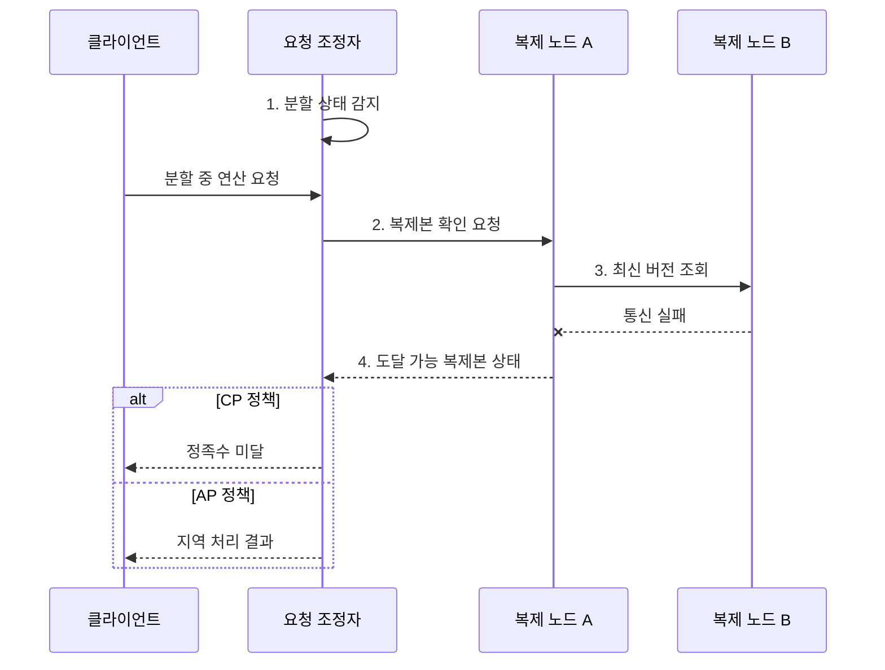

---
sidebar:
  order: 103
  label: "103. CAP 정리 (CAP Theorem)"
  badge:
    text: "기출 • 70%"
    variant: note
title: "CAP 정리 (CAP Theorem)"
date: "2026-08-03T08:48:47+09:00"
tags:
  - "notes-software"
weight: 103
extra:
  question_no: "103"
  source_status: "기출"
  source_history: "131회"
  priority: 70
  priority_note: "131회 기출, 일관성•가용성 절충의 정본"
---

## Ⅰ. 개요

핵심 용어

- **CAP 정리(Consistency, Availability, Partition Tolerance Theorem)**: 네트워크 분할 중 일관성과 가용성을 동시에 완전히 보장할 수 없다는 분산 시스템 정리이다.
- **일관성(Consistency, C)•가용성(Availability, A)•분할 내성(Partition Tolerance, P)**: 모든 노드의 최신값 보장, 모든 요청의 응답 보장, 노드 간 통신 단절에서도 시스템이 동작하는 성질이다.

- 정의/개념: 분산 시스템에 네트워크 분할이 발생하면 일관성과 가용성을 동시에 완전히 보장할 수 없음을 설명하는 **CAP 정리(Consistency, Availability, Partition Tolerance Theorem)**
- 배경/필요성: 원격 복제본 확인 불가로 **최신 응답•무중단 처리** 동시 보장 불가

#### 한줄 요약

- 지점 간 전화가 끊기면 최신 장부를 확인할 때까지 멈출지, 임시 장부로 계속 영업할지 정해야 한다.

## Ⅱ. 특징

핵심 용어

- **네트워크 분할**: 복제 노드 사이의 통신 단절로 일관성과 가용성 중 하나를 선택하게 만드는 조건이다.
- **분할 중 일관성•가용성 선택**: 통신 단절 상태에서 최신값을 확인하지 못한 요청을 거부할지 지역 상태로 응답할지 정하는 판단이다.
- **PACELC(Partition, Availability, Consistency, Else, Latency, Consistency)**: 분할 시 가용성•일관성뿐 아니라 정상 상태에서도 지연시간•일관성의 절충이 있음을 설명하는 확장 관점이다.

- 일관성•가용성 상충을 강제하는 **네트워크 분할** 조건
- 분할 중 **일관성•가용성** 가운데 하나만 보장
- 정상 상태의 지연시간•일관성 절충까지 확장하는 **PACELC(Partition, Availability, Consistency, Else, Latency, Consistency)** 관점

#### 한줄 요약

- 연결이 끊긴 동안 틀리지 않게 멈출지, 잠시 다를 수 있어도 답할지를 정한다.

## Ⅲ. 구조 및 구성요소

핵심 용어

- **분할 감지**: 노드 도달성과 정족수 상실 여부를 판정하는 구성요소이다.
- **일관성 정책**: 최신 복제본이나 정족수를 확인하지 못할 때 요청을 제한하는 규칙이다.
- **가용성 정책**: 통신 가능한 지역 복제본만으로 요청을 처리하도록 허용하는 규칙이다.
- **충돌 해결**: 연결 복구 뒤 서로 다른 복제본의 값을 업무 규칙에 따라 병합•수렴시키는 활동이다.

| 구성요소 | 책임 |
|:---|:---|
| 복제 노드 | 논리 데이터의 **복제본 상태** 저장 |
| 분할 감지 | 도달성•**정족수 상실** 판정 |
| 일관성 정책 | 최신 상태 미확인 시 **요청 제한** |
| 가용성 정책 | 도달 복제본의 **지역 처리** 허용 |
| 충돌 해결 | 연결 복구 후 **복제본 수렴** |

#### 한줄 요약

- 지점 연결 상태와 업무 규칙으로 멈출 요청과 계속할 요청을 나눈다.

## Ⅳ. 흐름도

핵심 용어

- **4. 도달 가능 복제본 상태**: 현재 응답 가능한 복제본과 정족수로 CP 또는 AP 처리 결과를 정하는 단계이다.
- **일관성•분할 내성(Consistency and Partition Tolerance, CP) 정책**: 최신 상태를 확인하지 못하면 요청을 거부•지연해 분할 중 일관성을 지키는 정책이다.
- **가용성•분할 내성(Availability and Partition Tolerance, AP) 정책**: 도달 가능한 지역 복제본으로 응답해 분할 중 가용성을 지키는 정책이다.

**동작 원리**

1. **분할 상태**: 복제본 사이 도달성 상실을 요청 조정자에 통지
2. **복제본 확인 요청**: 연산 키를 보유한 도달 가능 노드에 전달
3. **최신 버전 조회**: 원격 복제본 응답으로 최신 상태 확인 시도
4. **도달 가능 복제본 상태**: 정족수와 지역 상태로 일관성•분할 내성(Consistency and Partition Tolerance, CP) 또는 가용성•분할 내성(Availability and Partition Tolerance, AP) 결과 판정

#### 한줄 요약

- 다른 지점의 최신 장부를 확인하지 못할 때 CP는 멈추고 AP는 지역 장부로 처리한다.

## Ⅴ. 종류 및 비교

핵심 용어

- **일관성•분할 내성(Consistency and Partition Tolerance, CP)**: 분할 중 최신 상태를 확인할 수 없으면 요청을 거부하거나 지연해 일관성을 지키는 선택이다.
- **가용성•분할 내성(Availability and Partition Tolerance, AP)**: 분할 중에도 도달 가능한 복제본에서 지역 처리해 응답을 유지하는 선택이다.
- **일관성•가용성(Consistency and Availability, CA)**: 네트워크 분할이 없다는 전제에서 최신 상태와 모든 요청 응답을 함께 보장하는 선택이다.

| 분할 대응 방식 | 일관성•분할 내성(Consistency and Partition Tolerance, CP) | 가용성•분할 내성(Availability and Partition Tolerance, AP) |
|:---|:---|:---|
| 적용 기준 | **불일치 비용이 큰 연산** | **중단 비용이 큰 연산** |
| 핵심 특징 | 최신 상태 미확인 시 **요청 거부•지연** | 도달 복제본에서 **지역 처리** |
| 한계 | 분할 동안 **가용성 저하** | **오래된 읽기•쓰기 충돌** 허용 |

> 요약: 네트워크 분할이 없는 범위에서만 성립하는 **일관성•가용성(Consistency and Availability, CA)** 조합

#### 한줄 요약

- CP는 틀린 답보다 중단을, AP는 중단보다 임시 차이를 택한다.

## Ⅵ. 실무 고려사항 및 대책

핵심 용어

- **연산별 일관성(Consistency, C)•가용성(Availability, A) 정책**: 불일치 비용과 중단 비용에 따라 요청마다 분할 대응을 달리 정하는 기준이다.
- **타임아웃•정족수**: 응답 대기 한도와 최신 상태를 인정할 최소 노드 수를 함께 검증하는 분할 판정 기준이다.
- **지수 백오프(Exponential Backoff)**: 재시도 간격을 지수적으로 늘려 동시 요청 폭주를 줄이는 방식이다.
- **버전 벡터•업무 병합**: 복제본별 변경 계보를 판별하고 충돌 값을 업무 의미에 맞게 합치는 방식이다.
- **안티 엔트로피(Anti-Entropy)•불변식 재검증**: 복제본 차이를 주기적으로 교환•복구하고 수렴 결과가 업무 규칙을 지키는지 확인하는 활동이다.

| 문제 | 대책 | 효과 |
|:---|:---|:---|
| 재고 차감처럼 불변식 위반 비용이 큰 연산 | 연산별 **일관성(Consistency, C)•가용성(Availability, A) 정책** 분리 | **업무 불변식** 위반 방지 |
| 짧은 타임아웃은 일시 지연을 분할로 오판 | **타임아웃•정족수** 함께 검증 | **분할 오판** 감소 |
| CP 거부 직후 동시 재시도하면 요청 폭주 | 빠른 실패와 **지수 백오프** | **재시도 폭주** 억제 |
| AP의 동시 쓰기는 복제본 버전 충돌 발생 | **버전 벡터•업무 병합** 적용 | **동시 쓰기 유실** 방지 |
| 연결 복구 뒤에도 복제본 차이가 잔존 | **안티 엔트로피•불변식 재검증** | **복제본 수렴** 확인 |

#### 한줄 요약

- 같은 쇼핑몰도 재고 판매는 멈추고 상품 설명은 잠시 오래된 값으로 보여줄 수 있다.

## Ⅶ. 결론

핵심 용어

- **가용성•분할 내성(Availability and Partition Tolerance, AP)**: 분할 중에도 지역 복제본으로 응답해 중단 비용을 줄이는 선택이다.
- **일관성•분할 내성(Consistency and Partition Tolerance, CP)**: 분할 중 최신 상태를 확인할 수 없으면 요청을 제한해 불일치 비용을 줄이는 선택이다.

- 불일치 비용이 크면 **일관성•분할 내성(Consistency and Partition Tolerance, CP)**, 중단 비용이 크면 **가용성•분할 내성(Availability and Partition Tolerance, AP)** 선택

#### 한줄 요약

- 연결이 끊겼을 때 정확성을 지킬지 응답을 지킬지 정하고, 다시 연결된 뒤 값이 같아지는지 확인한다.
