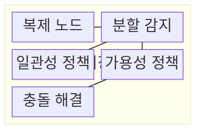
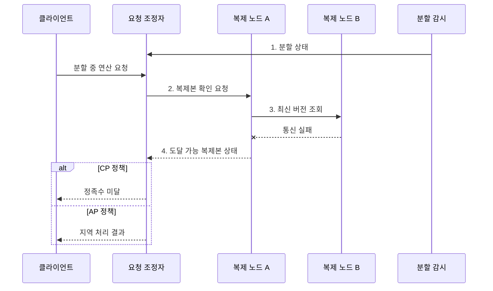

---
sidebar:
  order: 103
  label: "103. CAP 정리 (CAP Theorem)"
  badge:
    text: "기출 · 70%"
    variant: note
title: "CAP 정리 (CAP Theorem)"
date: "2026-08-02T12:00:00+09:00"
tags:
  - "notes-software"
weight: 103
extra:
  question_no: "103"
  source_status: "기출"
  source_history: "131회"
  priority: 70
  priority_note: "131회 기출, 일관성·가용성 절충의 정본"
---

## Ⅰ. 개요

핵심 용어

- **일관성과 가용성의 상충을 밝힌 정리**: 네트워크 분할 중 최신 상태 보장과 모든 요청 응답을 동시에 만족할 수 없다는 정리이다.

- 정의/개념: 네트워크 분할 시 **일관성과 가용성의 상충을 밝힌 정리**
- 배경/필요성: 원격 복제본 확인 불가로 **최신 응답·무중단 처리** 동시 보장 불가

### 쉽게 이해하기 (학습용)

- 지점 간 전화가 끊기면 최신 장부를 확인할 때까지 멈출지, 임시 장부로 계속 영업할지 정해야 한다.

## Ⅱ. 특징

핵심 용어

- **네트워크 분할**: 복제 노드 사이의 통신 단절로 일관성과 가용성 중 하나를 선택하게 만드는 조건이다.

- **네트워크 분할**이 일관성·가용성 상충을 강제하는 조건
- 분할 중 **일관성·가용성** 가운데 하나만 보장
- **PACELC**는 정상 상태의 지연시간·일관성 절충까지 확장

### 쉽게 이해하기 (학습용)

- 연결이 끊긴 동안 틀리지 않게 멈출지, 잠시 다를 수 있어도 답할지를 정한다.

## Ⅲ. 구조 및 구성요소

핵심 용어

- **분할 감지**: 노드 도달성과 정족수 상실 여부를 판정하는 구성요소이다.

| 구성요소 | 책임 |
|:---|:---|
| 복제 노드 | 논리 데이터의 **복제본 상태** 저장 |
| 분할 감지 | 도달성·**정족수 상실** 판정 |
| 일관성 정책 | 최신 상태 미확인 시 **요청 제한** |
| 가용성 정책 | 도달 복제본의 **지역 처리** 허용 |
| 충돌 해결 | 연결 복구 후 **복제본 수렴** |

### 쉽게 이해하기 (학습용)

- 지점 연결 상태와 업무 규칙으로 멈출 요청과 계속할 요청을 나눈다.

## Ⅳ. 흐름도

핵심 용어

- **4. 도달 가능 복제본 상태**: 현재 응답 가능한 복제본과 정족수로 CP 또는 AP 처리 결과를 정하는 단계이다.

**동작 원리**

1. **분할 상태**: 복제본 사이 도달성 상실을 요청 조정자에 통지
2. **복제본 확인 요청**: 연산 키를 보유한 도달 가능 노드에 전달
3. **최신 버전 조회**: 원격 복제본 응답으로 최신 상태 확인 시도
4. **도달 가능 복제본 상태**: 정족수와 지역 상태로 CP·AP 결과 판정

### 쉽게 이해하기 (학습용)

- 다른 지점의 최신 장부를 확인하지 못할 때 CP는 멈추고 AP는 지역 장부로 처리한다.

## Ⅴ. 종류 및 비교

핵심 용어

- **CP**: 분할 중 최신 상태를 확인할 수 없으면 요청을 거부하거나 지연해 일관성을 지키는 선택이다.

| 분할 대응 방식 | CP | AP |
|:---|:---|:---|
| 적용 기준 | **불일치 비용**이 큰 연산 | **중단 비용**이 큰 연산 |
| 핵심 특징 | 최신 상태 미확인 시 **요청 거부·지연** | 도달 복제본에서 **지역 처리** |
| 한계 | 분할 동안 **가용성 저하** | **오래된 읽기·쓰기 충돌** 허용 |

> 요약: **CA**는 네트워크 분할이 없는 범위에서만 성립

### 쉽게 이해하기 (학습용)

- CP는 틀린 답보다 중단을, AP는 중단보다 임시 차이를 택한다.

## Ⅵ. 실무 고려사항 및 대책

핵심 용어

- **재고 차감처럼 불변식 위반 비용이 큰 연산**: 가용성보다 일관성을 우선해 업무 규칙 위반을 막아야 하는 문제 상황이다.

| 문제 | 대책 | 효과 |
|:---|:---|:---|
| 재고 차감처럼 불변식 위반 비용이 큰 연산 | 연산별 **C·A 정책** 분리 | **업무 불변식** 위반 방지 |
| 짧은 타임아웃은 일시 지연을 분할로 오판 | **타임아웃·정족수** 함께 검증 | **분할 오판** 감소 |
| CP 거부 직후 동시 재시도하면 요청 폭주 | 빠른 실패와 **지수 백오프** | **재시도 폭주** 억제 |
| AP의 동시 쓰기는 복제본 버전 충돌 발생 | **버전 벡터·업무 병합** 적용 | **동시 쓰기 유실** 방지 |
| 연결 복구 뒤에도 복제본 차이가 잔존 | **안티 엔트로피·불변식 재검증** | **복제본 수렴** 확인 |

### 쉽게 이해하기 (학습용)

- 같은 쇼핑몰도 재고 판매는 멈추고 상품 설명은 잠시 오래된 값으로 보여줄 수 있다.

## Ⅶ. 결론

핵심 용어

- **AP**: 분할 중에도 지역 복제본으로 응답해 중단 비용을 줄이는 선택이다.

- 불일치 비용이 크면 **CP**, 중단 비용이 크면 **AP** 선택

### 쉽게 이해하기 (학습용)

- 연결이 끊겼을 때 정확성을 지킬지 응답을 지킬지 정하고, 다시 연결된 뒤 값이 같아지는지 확인한다.
