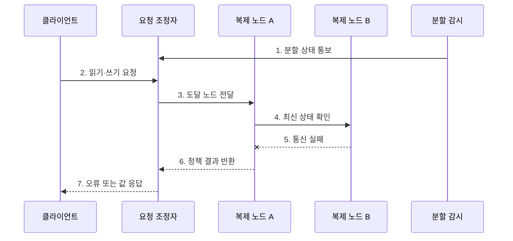

---
sidebar:
  order: 103
  label: "103. CAP 정리 (CAP Theorem)"
  badge:
    text: "기출 · 70%"
    variant: note
title: "CAP 정리 (CAP Theorem)"
date: "2026-07-27T23:59:59+09:00"
tags:
  - "notes-software"
weight: 103
extra:
  question_no: "103"
  source_status: "기출"
  source_history: "131회"
  priority: 70
  priority_note: "131회 기출, 일관성·가용성 절충의 정본"
---

## 미리 알고가기

- **일관성(Consistency, C)**: 모든 연산이 하나의 최신 복사본에서 수행된 것처럼 보이는 선형 일관성
- **가용성(Availability, A)**: 장애가 나지 않은 노드가 받은 모든 요청에 유한 시간 안에 응답하는 성질
- **분할 허용성(Partition Tolerance, P)**: 노드 간 메시지가 유실·지연되는 분할에도 시스템이 정의된 동작을 계속하는 성질
- **네트워크 분할(Network Partition)**: 일부 노드 집합이 서로 통신하지 못하는 장애
- **CP**: 분할 중 최신 상태를 확인할 수 없는 요청을 거부·지연해 일관성을 지키는 선택
- **AP**: 분할 중 각 노드가 응답을 계속하고 일시적 불일치를 허용하는 선택
- **정족수(Quorum)**: 읽기·쓰기를 확정하는 데 필요한 최소 노드 응답 수
- **PACELC**: 분할 시 A/C, 정상 시 지연시간 L/일관성 C의 절충을 함께 보는 관점

## Ⅰ. 개요

- 정의/개념: 네트워크 분할 시 **일관성과 가용성의 상충을 밝힌 정리**
- 배경/필요성: 분할 상황의 연산별 보장 선택

### 쉽게 이해하기 (학습용)

- 지점 간 전화가 끊기면 최신 장부를 확인할 때까지 멈출지, 임시 장부로 계속 영업할지 정해야 한다.

## Ⅱ. 특징

- **분할 조건**: 통신 단절 상태의 보장 한계
- **CP 선택**: 최신값 미확인 요청 제한
- **AP 선택**: 지역 처리 후 충돌 해결

### 쉽게 이해하기 (학습용)

- 연결이 끊긴 동안 틀리지 않게 멈출지, 잠시 다를 수 있어도 답할지를 정한다.

## Ⅲ. 구조 및 구성요소

| 구성요소 | 책임 |
|:---|:---|
| 복제 노드 | 논리 데이터 사본 저장 |
| 분할 감지 | 도달성·정족수 상실 판단 |
| 일관성 정책 | 요청 제한 조건 정의 |
| 가용성 정책 | 지역 처리 연산 정의 |
| 충돌 해결 | 복구 후 사본 수렴 |

### 쉽게 이해하기 (학습용)

- 지점 연결 상태와 업무 규칙으로 멈출 요청과 계속할 요청을 나눈다.

## Ⅳ. 흐름도

**동작 원리**

- **1. 분할 상태 통보**: 통신 단절을 통지
- **2. 읽기·쓰기 요청**: 연산을 전달
- **3. 도달 노드 전달**: 가능한 사본을 선택
- **4. 최신 상태 확인**: 다른 사본을 확인
- **5. 통신 실패**: 분할 상태를 확결정
- **6. 정책 결과 반환**: CP 또는 AP를 적용
- **7. 오류 또는 값 응답**: 선택 결과를 전달

### 쉽게 이해하기 (학습용)

- 다른 지점의 최신 장부를 확인하지 못할 때 CP는 멈추고 AP는 지역 장부로 처리한다.

## Ⅴ. 종류 및 비교

| 판단 기준 | CP | AP |
|:---|:---|:---|
| 적용 기준 | 불일치 불허 연산 | 중단 불허 연산 |
| 핵심 특징 | 미확인 요청 제한 | 도달 사본에서 처리 |
| 한계 | 오류·대기·기능 중단 | 오래된 값·쓰기 충돌 |

> CA는 분할이 발생하지 않는 범위에서는 가능하지만, 분할을 견뎌야 하는 분산 시스템의 분할 상황 해법은 비해당

### 쉽게 이해하기 (학습용)

- CP는 틀린 답보다 중단을, AP는 중단보다 임시 차이를 택한다.

## Ⅵ. 실무 고려사항 및 대책

| 고려사항 | 대책 | 효과 |
|:---|:---|:---|
| 업무 불변식 | 연산별 C/A 정책 선정 | 과도한 일괄 정책 방지 |
| 분할 판정 | 타임아웃·정족수 검증 | 오판 감소 |
| CP 운영 | 빠른 실패·백오프 적용 | 재시도 폭주 방지 |
| AP 충돌 | 버전·업무 병합 규칙 적용 | 동시 쓰기 유실 방지 |
| 복구 | 수렴·누락·불변식 재검증 | 연결 후 정합성 확보 |

> **적용 사례**: 마지막 재고 차감은 분할 중 정족수를 얻지 못하면 거부하고, 상품 설명 조회는 지역 사본의 과거 값을 허용할 수 존재

### 쉽게 이해하기 (학습용)

- 같은 쇼핑몰도 재고 판매는 멈추고 상품 설명은 잠시 오래된 값으로 보여줄 수 있다.

## Ⅶ. 결론

- **불일치 비용·중단 비용·복구 방식**으로 CP와 AP를 결정

### 쉽게 이해하기 (학습용)

- 연결이 끊겼을 때 정확성을 지킬지 응답을 지킬지 정하고, 다시 연결된 뒤 값이 같아지는지 확인한다.
