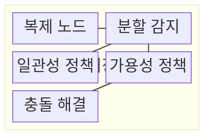
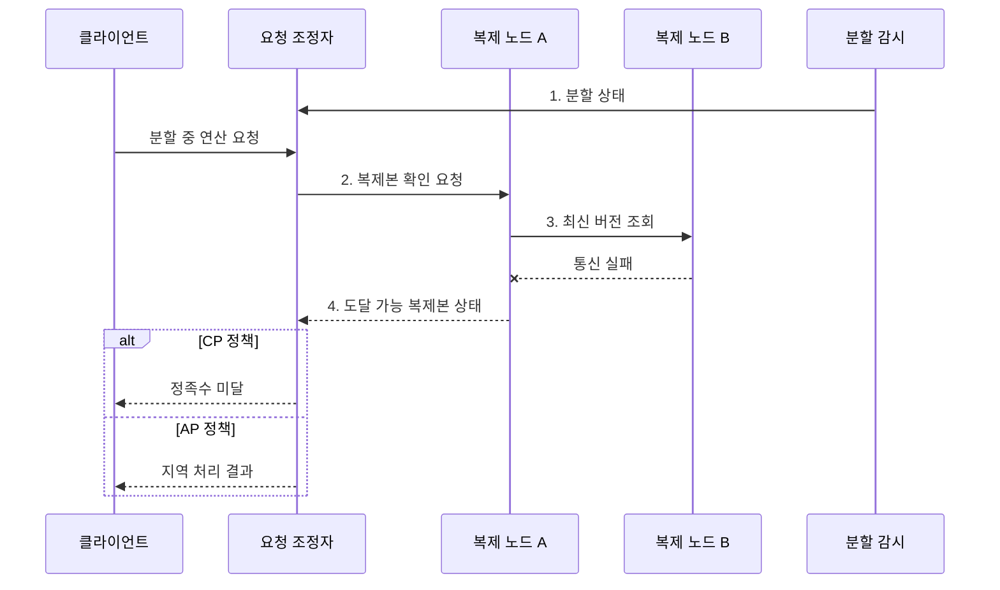

---
sidebar:
  order: 103
  label: "103. CAP 정리 (CAP Theorem)"
  badge:
    text: "기출 · 70%"
    variant: note
title: "CAP 정리 (CAP Theorem)"
date: "2026-07-30T23:42:29+09:00"
tags:
  - "notes-software"
weight: 103
extra:
  question_no: "103"
  source_status: "기출"
  source_history: "131회"
  priority: 70
  priority_note: "131회 기출, 일관성·가용성 절충의 정본"
---

## 미리 알고가기

- **CAP 정리(Consistency, Availability, Partition Tolerance Theorem)**: 네트워크 분할 중 일관성과 가용성을 동시에 보장할 수 없다는 분산 시스템 정리
- **일관성(Consistency, C)**: 모든 연산이 하나의 최신 복사본에서 수행된 것처럼 보이는 선형 일관성
- **가용성(Availability, A)**: 장애가 나지 않은 노드가 받은 모든 요청에 유한 시간 안에 응답하는 성질
- **분할 허용성(Partition Tolerance, P)**: 노드 간 메시지가 유실·지연되는 분할에도 시스템이 정의된 동작을 계속하는 성질
- **네트워크 분할(Network Partition)**: 일부 노드 집합이 서로 통신하지 못하는 장애
- **CP**: 분할 중 최신 상태를 확인할 수 없는 요청을 거부·지연해 일관성을 지키는 선택
- **AP**: 분할 중 각 노드가 응답을 계속하고 일시적 불일치를 허용하는 선택
- **CA**: 네트워크 분할을 전제하지 않을 때 일관성과 가용성을 함께 제공하는 선택
- **정족수(Quorum)**: 읽기·쓰기를 확정하는 데 필요한 최소 노드 응답 수
- **PACELC**: 분할 시 A/C, 정상 시 지연시간 L/일관성 C의 절충을 함께 보는 관점
- **업무 불변식(Business Invariant)**: 재고가 음수가 되면 안 되는 것처럼 모든 상태에서 반드시 지켜야 하는 업무 규칙
- **지수 백오프(Exponential Backoff)**: 재시도 간격을 지수적으로 늘려 장애 구간의 요청 폭주를 억제하는 방식
- **버전 벡터(Version Vector)**: 복제본별 갱신 횟수로 변경의 선후·동시성을 판정하는 메타데이터
- **안티 엔트로피(Anti-entropy)**: 복제본 상태를 비교·교환해 누락된 변경을 찾아 수렴시키는 동기화 절차

> **키워드:** CAP 정리 (CAP Theorem)

## Ⅰ. 개요

- 정의/개념: 네트워크 분할 시 **일관성과 가용성의 상충을 밝힌 정리**
- 배경/필요성: 원격 복제본 확인 불가로 **최신 응답·무중단 처리** 동시 보장 불가

### 쉽게 이해하기 (학습용)

- 지점 간 전화가 끊기면 최신 장부를 확인할 때까지 멈출지, 임시 장부로 계속 영업할지 정해야 한다.

## Ⅱ. 특징

- **네트워크 분할**이 일관성·가용성 상충을 강제하는 조건
- 분할 중 **일관성·가용성** 가운데 하나만 보장
- **PACELC**는 정상 상태의 지연시간·일관성 절충까지 확장

### 쉽게 이해하기 (학습용)

- 연결이 끊긴 동안 틀리지 않게 멈출지, 잠시 다를 수 있어도 답할지를 정한다.

## Ⅲ. 구조 및 구성요소

| 구성요소 | 책임 |
|:---|:---|
| 복제 노드 | 논리 데이터의 **복제본 상태** 저장 |
| 분할 감지 | 도달성·**정족수 상실** 판정 |
| 일관성 정책 | 최신 상태 미확인 시 **요청 제한** |
| 가용성 정책 | 도달 복제본의 **지역 처리** 허용 |
| 충돌 해결 | 연결 복구 후 **복제본 수렴** |

### 쉽게 이해하기 (학습용)

- 지점 연결 상태와 업무 규칙으로 멈출 요청과 계속할 요청을 나눈다.

## Ⅳ. 흐름도

**동작 원리**

1. **분할 상태**: 복제본 사이 도달성 상실을 요청 조정자에 통지
2. **복제본 확인 요청**: 연산 키를 보유한 도달 가능 노드에 전달
3. **최신 버전 조회**: 원격 복제본 응답으로 최신 상태 확인 시도
4. **도달 가능 복제본 상태**: 정족수와 지역 상태로 CP·AP 결과 판정

### 쉽게 이해하기 (학습용)

- 다른 지점의 최신 장부를 확인하지 못할 때 CP는 멈추고 AP는 지역 장부로 처리한다.

## Ⅴ. 종류 및 비교

| 분할 대응 방식 | CP | AP |
|:---|:---|:---|
| 적용 기준 | **불일치 비용**이 큰 연산 | **중단 비용**이 큰 연산 |
| 핵심 특징 | 최신 상태 미확인 시 **요청 거부·지연** | 도달 복제본에서 **지역 처리** |
| 한계 | 분할 동안 **가용성 저하** | **오래된 읽기·쓰기 충돌** 허용 |

> 요약: **CA**는 네트워크 분할이 없는 범위에서만 성립

### 쉽게 이해하기 (학습용)

- CP는 틀린 답보다 중단을, AP는 중단보다 임시 차이를 택한다.

## Ⅵ. 실무 고려사항 및 대책

| 고려사항 | 대책 | 효과 |
|:---|:---|:---|
| 재고 차감처럼 불변식 위반 비용이 큰 연산 | 연산별 **C·A 정책** 분리 | **업무 불변식** 위반 방지 |
| 짧은 타임아웃은 일시 지연을 분할로 오판 | **타임아웃·정족수** 함께 검증 | **분할 오판** 감소 |
| CP 거부 직후 동시 재시도하면 요청 폭주 | 빠른 실패와 **지수 백오프** | **재시도 폭주** 억제 |
| AP의 동시 쓰기는 복제본 버전 충돌 발생 | **버전 벡터·업무 병합** 적용 | **동시 쓰기 유실** 방지 |
| 연결 복구 뒤에도 복제본 차이가 잔존 | **안티 엔트로피·불변식 재검증** | **복제본 수렴** 확인 |

### 쉽게 이해하기 (학습용)

- 같은 쇼핑몰도 재고 판매는 멈추고 상품 설명은 잠시 오래된 값으로 보여줄 수 있다.

## Ⅶ. 결론

- 불일치 비용이 크면 **CP**, 중단 비용이 크면 **AP** 선택

### 쉽게 이해하기 (학습용)

- 연결이 끊겼을 때 정확성을 지킬지 응답을 지킬지 정하고, 다시 연결된 뒤 값이 같아지는지 확인한다.
