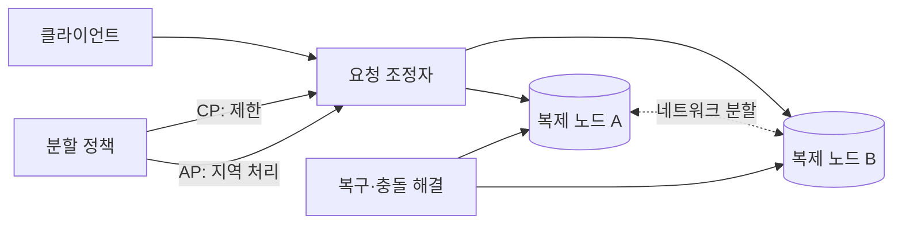
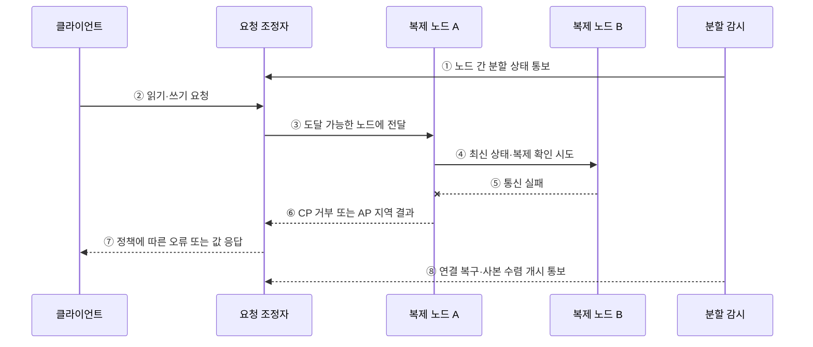

---
sidebar:
  order: 103
  label: "103. CAP 정리 (CAP Theorem)"
  badge:
    text: "기출 · 70%"
    variant: note
title: "CAP 정리 (CAP Theorem)"
date: "2026-07-27T23:59:59+09:00"
tags:
  - "notes-software"
weight: 103
extra:
  question_no: "103"
  source_status: "기출"
  source_history: "131회"
  priority: 70
  priority_note: "131회 기출, 일관성·가용성 절충의 정본"
---

## 미리 알고가기

- **일관성(Consistency, C)**: 모든 연산이 하나의 최신 복사본에서 수행된 것처럼 보이는 선형 일관성
- **가용성(Availability, A)**: 장애가 나지 않은 노드가 받은 모든 요청에 유한 시간 안에 응답하는 성질
- **분할 허용성(Partition Tolerance, P)**: 노드 간 메시지가 유실·지연되는 분할에도 시스템이 정의된 동작을 계속하는 성질
- **네트워크 분할(Network Partition)**: 일부 노드 집합이 서로 통신하지 못하는 장애
- **CP**: 분할 중 최신 상태를 확인할 수 없는 요청을 거부·지연해 일관성을 지키는 선택
- **AP**: 분할 중 각 노드가 응답을 계속하고 일시적 불일치를 허용하는 선택
- **정족수(Quorum)**: 읽기·쓰기를 확정하는 데 필요한 최소 노드 응답 수
- **PACELC**: 분할 시 A/C, 정상 시 지연시간 L/일관성 C의 절충을 함께 보는 관점

## Ⅰ. 개요

- CAP 정리는 네트워크 분할이 발생하면 분산 데이터 시스템이 **선형 일관성(C)**과 **모든 정상 노드의 가용성(A)**을 동시에 보장할 수 없다는 정리이다.
- “항상 세 속성 중 두 개를 고른다”는 뜻이 아니라, 실제 분할 동안 C와 A 중 어느 보장을 제한할지 정하는 문제이다.

### 쉽게 이해하기 (학습용)

- 지점 간 전화가 끊기면 최신 장부를 확인할 때까지 멈출지, 임시 장부로 계속 영업할지 정해야 한다.

## Ⅱ. 특징

- **장애 조건의 정리**: 정상 상태의 일반 성능 선택이 아니라 분할 상태의 보장 한계를 설명한다.
- **CP 선택**: 정족수나 최신값을 확인하지 못한 요청을 거절·지연한다.
- **AP 선택**: 도달 가능한 노드에서 응답하고 복구 후 충돌 해결·수렴한다.
- **연산별 선택**: 한 시스템도 재고 쓰기는 CP, 상품 설명 읽기는 AP처럼 연산별 정책이 다를 수 있다.

### 쉽게 이해하기 (학습용)

- 연결이 끊긴 동안 틀리지 않게 멈출지, 잠시 다를 수 있어도 답할지를 정한다.

## Ⅲ. 아키텍처 및 구성요소

**도표안 A — 구조도**

**도표안 B — sequenceDiagram**

| 구성요소 | 역할 |
|:---|:---|
| 복제 노드 | 같은 논리 데이터의 사본 저장 |
| 분할 감지 | 노드 도달성·정족수 상실 판단 |
| 일관성 정책 | 최신 상태 확인 범위와 요청 제한 조건 정의 |
| 가용성 정책 | 분할 중 지역 처리할 연산과 임시 상태 정의 |
| 충돌 해결 | 연결 복구 후 버전 비교·병합·수렴 수행 |

**동작 원리**

- ① 감시 계층이 노드 집합 사이의 네트워크 분할을 조정자에게 알린다.
- ② 클라이언트가 분할 중 읽기 또는 쓰기를 요청한다.
- ③ 조정자가 현재 도달 가능한 복제 노드에 요청을 전달한다.
- ④ 복제 노드 A가 노드 B에 최신 상태나 복제 확인을 시도한다.
- ⑤ 네트워크 분할로 노드 B의 응답을 받지 못한다.
- ⑥ CP는 확인할 수 없는 연산을 거부하고 AP는 지역 결과를 반환한다.
- ⑦ 조정자가 선택한 정책에 따라 오류 또는 값을 응답한다.
- ⑧ 연결이 복구되면 사본 비교·충돌 해결·수렴을 시작한다.

### 쉽게 이해하기 (학습용)

- 다른 지점의 최신 장부를 확인하지 못할 때 CP는 멈추고 AP는 지역 장부로 처리한다.

## Ⅳ. 종류 및 비교

| 비교 항목 | CP | AP |
|:---|:---|:---|
| 분할 중 우선 보장 | 선형 일관성 | 모든 정상 노드의 응답 |
| 처리 방식 | 정족수·최신 상태 미확인 요청 제한 | 도달 가능한 사본에서 지역 처리 |
| 사용자 영향 | 오류·대기·일부 기능 중단 | 오래된 읽기·동시 쓰기 충돌 가능 |
| 복구 과제 | 중단된 요청 재시도 | 충돌 해결·사본 수렴 |
| 적합 예 | 중복 결제를 막아야 하는 원장 쓰기 | 임시 차이를 허용하는 피드·카트 |

> CA는 분할이 발생하지 않는 범위에서는 가능하지만, 분할을 견뎌야 하는 분산 시스템의 분할 상황 해법은 아니다.

### 쉽게 이해하기 (학습용)

- CP는 틀린 답보다 중단을, AP는 중단보다 임시 차이를 택한다.

## Ⅴ. 실무 고려사항 및 대책

| 고려사항 | 위험 | 대책 |
|:---|:---|:---|
| 업무 불변식 | 모든 데이터를 하나의 정책으로 분류 | 연산별 불일치·중단 비용으로 C/A 선택 |
| 분할 판정 | 느린 노드를 분할로 오인 | 타임아웃·실패 감지·정족수 근거 검증 |
| CP 운영 | 무기한 대기와 재시도 폭주 | 빠른 실패·기한·백오프·대체 기능 제공 |
| AP 충돌 | 동시 쓰기 유실·의미 없는 자동 병합 | 버전·CRDT·업무 충돌 규칙과 감사 적용 |
| 복구 | 연결 복구만으로 완료했다고 판단 | 사본 수렴·누락·불변식 재검증 |
| 정상 상태 | CAP만으로 지연·최신성 설계 | PACELC로 정상 시 지연/일관성도 검토 |

> **적용 사례**: 마지막 재고 차감은 분할 중 정족수를 얻지 못하면 거부하고, 상품 설명 조회는 지역 사본의 과거 값을 허용할 수 있다.

### 쉽게 이해하기 (학습용)

- 같은 쇼핑몰도 재고 판매는 멈추고 상품 설명은 잠시 오래된 값으로 보여줄 수 있다.

## Ⅵ. 결론

- CAP는 분할 중 선형 일관성과 가용성을 동시에 완전히 보장할 수 없다는 한계를 설명한다.
- 연산별 불일치 비용과 중단 비용을 비교해 CP/AP 정책을 정하고 복구 후 수렴까지 검증해야 한다.

### 쉽게 이해하기 (학습용)

- 연결이 끊겼을 때 정확성을 지킬지 응답을 지킬지 정하고, 다시 연결된 뒤 값이 같아지는지 확인한다.
