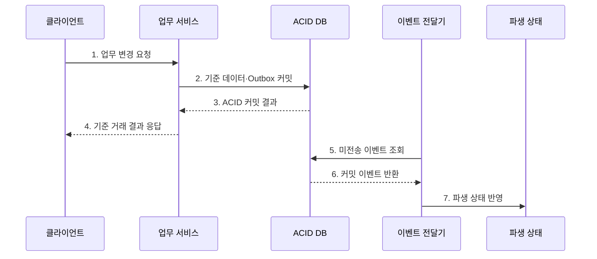

---
sidebar:
  order: 104
  label: "104. BASE vs ACID (BASE vs ACID)"
  badge:
    text: "기출 · 50%"
    variant: note
title: "BASE vs ACID (BASE vs ACID)"
date: "2026-07-27T23:59:59+09:00"
tags:
  - "notes-software"
weight: 104
extra:
  question_no: "104"
  source_status: "기출"
  source_history: "131회"
  priority: 50
  priority_note: "131회 기출, ACID·BASE 선택 기준 명확"
---

## 미리 알고가기

- **ACID(Atomicity, Consistency, Isolation, Durability)**: 트랜잭션의 원자성·일관성·격리성·지속성을 보장하는 성질
- **BASE(Basically Available, Soft State, Eventual Consistency)**: 가용성과 비동기 상태 수렴을 강조하는 분산 데이터 설계 관점
- **최종 일관성(Eventual Consistency)**: 새 갱신이 없으면 시간이 지나 모든 사본이 같은 상태로 수렴하는 성질
- **불변식(Invariant)**: 처리 전후 항상 참이어야 하는 잔액·합계 등의 업무 규칙
- **롤백(Rollback)**: 실패한 트랜잭션의 변경을 이전 상태로 되돌리는 연산
- **보상 트랜잭션(Compensating Transaction)**: 이미 완료된 업무 효과를 반대 업무로 상쇄하는 처리
- **수렴 지연(Convergence Delay)**: 변경 후 사본들이 같은 상태가 될 때까지 필요한 시간

## Ⅰ. 개요

- 정의/개념: **즉시 일관성과 비동기 수렴**을 대비한 보장 모델
- 배경/필요성: 업무 경계별 정확성·가용성 조정

### 쉽게 이해하기 (학습용)

- 핵심 장부는 한 번에 정확히 고치고, 여러 사본은 잠시 달라도 나중에 맞출 수 있다.

## Ⅱ. 특징

- **ACID**: 원자성·격리·내구성으로 즉시 확정
- **BASE**: 비동기 전파·재시도로 최종 수렴
- **복구 차이**: 롤백과 업무 보상을 구분

### 쉽게 이해하기 (학습용)

- 아직 끝나지 않은 거래는 되돌리고 이미 끝난 분산 업무는 반대 작업으로 보정한다.

## Ⅲ. 구조 및 구성요소

| 구성요소 | 책임 |
|:---|:---|
| 트랜잭션 경계 | 원자 확정 범위 정의 |
| ACID 저장소 | 기준 상태·Outbox 확정 |
| 비동기 전달 | 커밋 변경 전파 |
| BASE 파생 상태 | 조회·검색 사본 유지 |
| 재시도·보상·대사 | 실패·불일치 복구 |

### 쉽게 이해하기 (학습용)

- 원장을 먼저 확정하고 검색·알림 사본은 이벤트로 뒤따라 맞춘다.

## Ⅳ. 흐름도

**동작 원리**

- **1. 업무 변경 요청**: 기준 상태 변경을 요청
- **2. 기준 데이터·Outbox 커밋**: 함께 확결정
- **3. ACID 커밋 결과**: 불변식 결과를 반환
- **4. 기준 거래 결과 응답**: 거래 결과를 통지
- **5. 미전송 이벤트 조회**: 후속 변경을 검색
- **6. 커밋 이벤트 반환**: 확정된 변경만 전달
- **7. 파생 상태 반영**: 멱등 방식으로 수렴

### 쉽게 이해하기 (학습용)

- 원장은 먼저 정확히 확정하고 검색·알림 같은 사본은 확인 가능한 이벤트로 뒤따라 맞춘다.

## Ⅴ. 종류 및 비교

| 판단 기준 | ACID | BASE |
|:---|:---|:---|
| 적용 기준 | 즉시 지킬 불변식 | 지연 허용 파생 상태 |
| 핵심 특징 | 커밋 시 원자 확정 | 비동기 전파 후 수렴 |
| 한계 | 잠금·검증 비용 | 일시 불일치·보상 비용 |

> ACID DB도 복제 지연을 가질 수 있고 NoSQL도 ACID 트랜잭션을 지원할 수 있으므로 제품 이름으로 보장을 단정하면 안 된다.

### 쉽게 이해하기 (학습용)

- 결제 원장은 즉시 맞추고 알림·검색 사본은 재시도하며 뒤따라 맞춘다.

## Ⅵ. 실무 고려사항 및 대책

| 고려사항 | 대책 | 효과 |
|:---|:---|:---|
| 불변식 | ACID 경계에 즉시 규칙 배치 | 금액·재고 오류 방지 |
| 경계 크기 | 로컬 원자성·이벤트 분리 | 분산 합의 축소 |
| 이중 쓰기 | Outbox·CDC 적용 | 이벤트 누락 방지 |
| 중복·순서 | 멱등 키·버전 검사 | 재시도 역전 방지 |
| 수렴 지연 | 최대 지연·오류 예산 정의 | 최종 시점 명확화 |

> **적용 사례**: 결제 원장과 Outbox는 함께 커밋하고 영수증·검색 색인은 이벤트로 갱신해 핵심 거래와 파생 상태의 경계를 분리

### 쉽게 이해하기 (학습용)

- 돈과 재고는 먼저 정확히 확정하고, 늦어도 되는 사본만 비동기로 갱신한다.

## Ⅶ. 결론

- **불변식·허용 지연·보상 가능성**으로 ACID와 BASE를 조합

### 쉽게 이해하기 (학습용)

- 지금 반드시 맞아야 할 값과 나중에 맞아도 될 값을 나누는 것이 핵심이다.
