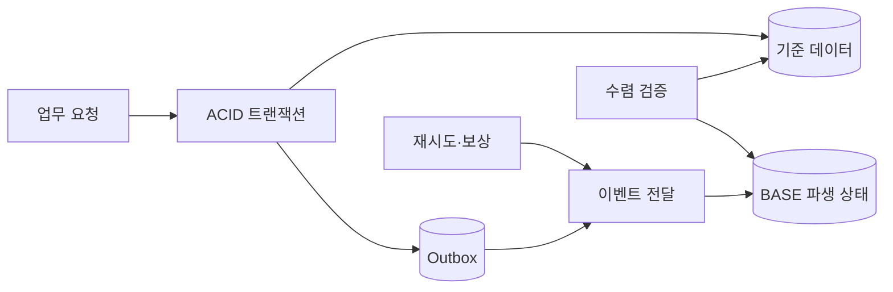
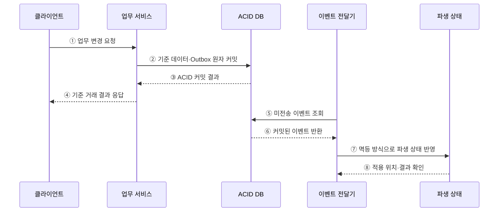

---
sidebar:
  order: 104
  label: "104. BASE vs ACID (BASE vs ACID)"
  badge:
    text: "기출 · 50%"
    variant: note
title: "BASE vs ACID (BASE vs ACID)"
date: "2026-07-27T23:59:59+09:00"
tags:
  - "notes-software"
weight: 104
extra:
  question_no: "104"
  source_status: "기출"
  source_history: "131회"
  priority: 50
  priority_note: "131회 기출, ACID·BASE 선택 기준 명확"
---

## 미리 알고가기

- **ACID(Atomicity, Consistency, Isolation, Durability)**: 트랜잭션의 원자성·일관성·격리성·지속성을 보장하는 성질
- **BASE(Basically Available, Soft State, Eventual Consistency)**: 가용성과 비동기 상태 수렴을 강조하는 분산 데이터 설계 관점
- **최종 일관성(Eventual Consistency)**: 새 갱신이 없으면 시간이 지나 모든 사본이 같은 상태로 수렴하는 성질
- **불변식(Invariant)**: 처리 전후 항상 참이어야 하는 잔액·합계 등의 업무 규칙
- **롤백(Rollback)**: 실패한 트랜잭션의 변경을 이전 상태로 되돌리는 연산
- **보상 트랜잭션(Compensating Transaction)**: 이미 완료된 업무 효과를 반대 업무로 상쇄하는 처리
- **수렴 지연(Convergence Delay)**: 변경 후 사본들이 같은 상태가 될 때까지 걸리는 시간

## Ⅰ. 개요

- ACID는 하나의 트랜잭션 경계에서 정확한 상태 전이를 보장하고, BASE는 분산 사본·서비스가 일시적으로 달라도 비동기 처리로 수렴하는 방식을 강조한다.
- 둘은 데이터베이스 제품을 양분하는 절대적 반대말이 아니며 한 시스템에서도 로컬 거래는 ACID, 파생 상태 전파는 BASE 방식으로 결합할 수 있다.

### 쉽게 이해하기 (학습용)

- 핵심 장부는 한 번에 정확히 고치고, 여러 사본은 잠시 달라도 나중에 맞출 수 있다.

## Ⅱ. 특징

- **ACID**는 트랜잭션의 전부 성공·실패, 동시 실행 격리, 커밋 내구성을 다룬다.
- ACID의 **일관성**은 트랜잭션이 정의된 불변식을 보존한다는 뜻이다.
- **BASE**는 비동기 전파·재시도·충돌 해결로 최종 상태를 맞춘다.
- 롤백은 미완료 트랜잭션을 되돌리고 보상은 이미 커밋된 업무 효과를 상쇄한다.

### 쉽게 이해하기 (학습용)

- 아직 끝나지 않은 거래는 되돌리고 이미 끝난 분산 업무는 반대 작업으로 보정한다.

## Ⅲ. 아키텍처 및 구성요소

**도표안 A — 구조도**

**도표안 B — sequenceDiagram**

| 구성요소 | 역할 |
|:---|:---|
| 트랜잭션 경계 | 한 번에 커밋·롤백할 데이터와 불변식 정의 |
| ACID 저장소 | 기준 상태와 Outbox를 원자적으로 확정 |
| 비동기 전달 | 커밋된 변경을 다른 서비스·사본으로 전파 |
| 파생 상태 | 조회 모델·캐시·검색 색인 등 최종 수렴 대상 |
| 재시도·보상·대사 | 실패 복구와 누락·불일치 정정 |

**동작 원리**

- ① 클라이언트가 업무 서비스에 상태 변경을 요청한다.
- ② 서비스가 기준 데이터와 전송할 이벤트를 한 ACID 트랜잭션으로 커밋한다.
- ③ DB가 불변식·격리·내구성을 충족한 커밋 결과를 반환한다.
- ④ 서비스가 기준 거래의 성공 또는 실패를 클라이언트에 응답한다.
- ⑤ 이벤트 전달기가 Outbox에서 아직 전송하지 않은 이벤트를 조회한다.
- ⑥ DB가 커밋이 완료된 이벤트만 반환한다.
- ⑦ 전달기가 중복 전송에도 안전한 방식으로 파생 상태를 갱신한다.
- ⑧ 파생 상태가 적용 위치와 처리 결과를 반환해 재시도·수렴을 관리한다.

### 쉽게 이해하기 (학습용)

- 원장은 먼저 정확히 확정하고 검색·알림 같은 사본은 확인 가능한 이벤트로 뒤따라 맞춘다.

## Ⅳ. 종류 및 비교

| 비교 항목 | ACID | BASE |
|:---|:---|:---|
| 중심 목표 | 트랜잭션 경계의 정확한 상태 전이 | 분산 상태의 가용성과 최종 수렴 |
| 처리 시점 | 커밋 시 원자적으로 확정 | 비동기 전파 후 수렴 |
| 실패 처리 | 커밋 전 롤백·복구 로그 | 재시도·중복 제거·충돌 해결·보상 |
| 적합 예 | 결제 원장·재고 차감 | 피드·검색 색인·알림·캐시 |
| 주요 비용 | 잠금·검증·분산 합의 | 일시 불일치·수렴 지연·보상 복잡성 |

> ACID DB도 복제 지연을 가질 수 있고 NoSQL도 ACID 트랜잭션을 지원할 수 있으므로 제품 이름으로 보장을 단정하면 안 된다.

### 쉽게 이해하기 (학습용)

- 결제 원장은 즉시 맞추고 알림·검색 사본은 재시도하며 뒤따라 맞춘다.

## Ⅴ. 실무 고려사항 및 대책

| 고려사항 | 위험 | 대책 |
|:---|:---|:---|
| 불변식 | 수렴하면 안 되는 금액·재고까지 비동기화 | 즉시 지켜야 할 규칙을 ACID 경계에 배치 |
| 경계 크기 | 모든 서비스를 분산 트랜잭션으로 묶음 | 로컬 원자성·이벤트·보상 경계 분리 |
| 이중 쓰기 | DB 커밋 후 이벤트 전송 누락 | Transactional Outbox·CDC 적용 |
| 중복·순서 | 재시도로 파생 상태 중복·역전 | 멱등 키·버전·순서 검사 |
| 수렴 지연 | “최종”의 허용 시간이 불명확 | 업무별 최대 지연·대기열·오류 예산 정의 |
| 보상 | 기술적 역연산이 업무 취소와 불일치 | 환불·재고 복원 등 업무 의미의 보상 설계 |

> **적용 사례**: 결제 원장과 Outbox는 함께 커밋하고 영수증·검색 색인은 이벤트로 갱신해 핵심 거래와 파생 상태의 경계를 분리한다.

### 쉽게 이해하기 (학습용)

- 돈과 재고는 먼저 정확히 확정하고, 늦어도 되는 사본만 비동기로 갱신한다.

## Ⅵ. 결론

- ACID와 BASE는 시스템 전체의 양자택일이 아니라 업무 경계별 즉시 확정과 비동기 수렴을 설계하는 관점이다.
- 불변식·허용 지연·재시도·멱등성·보상 가능성을 기준으로 두 방식을 조합해야 한다.

### 쉽게 이해하기 (학습용)

- 지금 반드시 맞아야 할 값과 나중에 맞아도 될 값을 나누는 것이 핵심이다.
