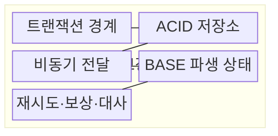
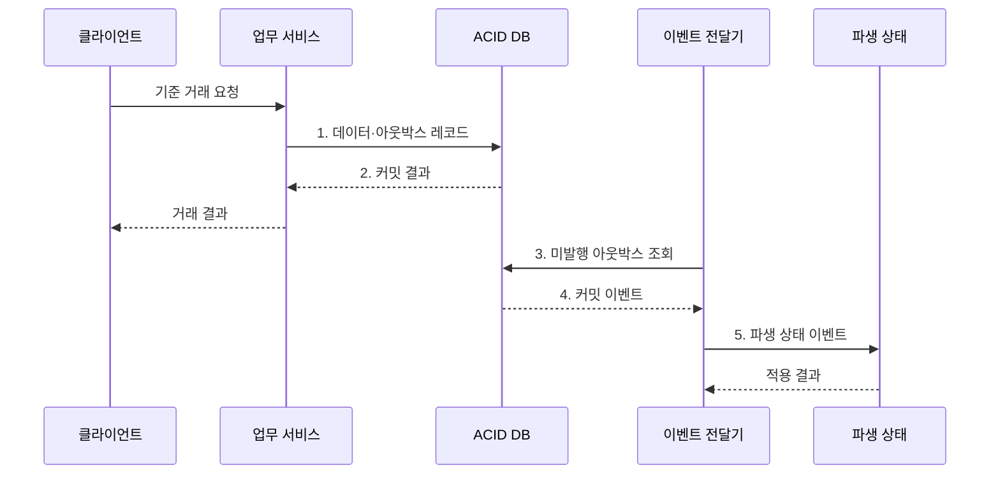

---
sidebar:
  order: 104
  label: "104. BASE vs ACID (BASE vs ACID)"
  badge:
    text: "기출 · 50%"
    variant: note
title: "BASE vs ACID (BASE vs ACID)"
date: "2026-08-02T12:00:00+09:00"
tags:
  - "notes-software"
weight: 104
extra:
  question_no: "104"
  source_status: "기출"
  source_history: "131회"
  priority: 50
  priority_note: "131회 기출, ACID·BASE 선택 기준 명확"
---

## Ⅰ. 개요

핵심 용어

- **ACID의 즉시 확정**: 트랜잭션 경계 안에서 불변식을 검증하고 변경을 원자적으로 확정하는 보장이다.

- 정의/개념: **ACID의 즉시 확정**과 **BASE의 최종 수렴**을 대비하는 보장 모델
- 배경/필요성: 단일 트랜잭션만으로는 **분산 파생 상태의 즉시 일치** 보장 불가

### 쉽게 이해하기 (학습용)

- 핵심 장부는 한 번에 정확히 고치고, 여러 사본은 잠시 달라도 나중에 맞출 수 있다.

## Ⅱ. 특징

핵심 용어

- **복구 차이**: 진행 중 거래의 롤백과 이미 완료된 분산 업무의 보상을 구분하는 특성이다.

- **ACID**: 원자성·격리·내구성으로 즉시 확정
- **BASE**: 비동기 전파·재시도로 최종 수렴
- **복구 차이**: 롤백과 업무 보상을 구분

### 쉽게 이해하기 (학습용)

- 아직 끝나지 않은 거래는 되돌리고 이미 끝난 분산 업무는 반대 작업으로 보정한다.

## Ⅲ. 구조 및 구성요소

핵심 용어

- **비동기 전달**: 커밋된 변경 이벤트를 파생 상태로 전파하는 구성요소이다.

| 구성요소 | 책임 |
|:---|:---|
| 트랜잭션 경계 | **원자 확정 범위** 정의 |
| ACID 저장소 | 기준 상태와 **아웃박스** 원자 확정 |
| 비동기 전달 | 커밋된 **변경 이벤트** 전파 |
| BASE 파생 상태 | 조회·검색용 **복제본** 유지 |
| 재시도·보상·대사 | **전달 실패·상태 불일치** 복구 |

### 쉽게 이해하기 (학습용)

- 원장을 먼저 확정하고 검색·알림 사본은 이벤트로 뒤따라 맞춘다.

## Ⅳ. 흐름도

핵심 용어

- **5. 파생 상태 이벤트**: 멱등 적용으로 BASE 복제본을 기준 상태에 수렴시키는 단계이다.

**동작 원리**

1. **데이터·아웃박스 레코드**: 기준 상태와 발행 대기 이벤트를 함께 저장
2. **커밋 결과**: 불변식 검증을 통과한 거래만 원자 확정
3. **미발행 아웃박스 조회**: 확정됐지만 전파되지 않은 이벤트 식별
4. **커밋 이벤트**: 커밋된 변경만 전달기로 반환
5. **파생 상태 이벤트**: 멱등 적용으로 BASE 복제본 수렴

### 쉽게 이해하기 (학습용)

- 원장은 먼저 정확히 확정하고 검색·알림 같은 사본은 확인 가능한 이벤트로 뒤따라 맞춘다.

## Ⅴ. 종류 및 비교

핵심 용어

- **BASE**: 가용성을 우선하고 비동기 전파 뒤 최종 일관성으로 상태를 맞추는 모델이다.

| 데이터 보장 모델 | ACID | BASE |
|:---|:---|:---|
| 적용 기준 | 즉시 지켜야 하는 **업무 불변식** | 지연을 허용하는 **파생 상태** |
| 핵심 특징 | 커밋 시 **원자성·격리성** 보장 | 비동기 전파 후 **최종 일관성** |
| 한계 | 넓은 경계에서 **잠금·합의 비용** 증가 | **일시 불일치·보상 비용** 발생 |

> 요약: 제품이 아니라 **트랜잭션 경계·허용 지연**으로 보장 선택

### 쉽게 이해하기 (학습용)

- 결제 원장은 즉시 맞추고 알림·검색 사본은 재시도하며 뒤따라 맞춘다.

## Ⅵ. 실무 고려사항 및 대책

핵심 용어

- **데이터와 이벤트를 따로 쓰면 한쪽만 성공 가능**: 업무 변경과 이벤트 발행이 분리돼 누락이나 불일치가 생기는 문제이다.

| 문제 | 대책 | 효과 |
|:---|:---|:---|
| 금액·재고는 커밋 즉시 불변식 준수 필요 | **ACID 트랜잭션 경계**에 규칙 배치 | **금액·재고 오류** 방지 |
| 넓은 분산 트랜잭션은 잠금·합의 비용 증가 | **로컬 원자성·이벤트** 분리 | **분산 합의 범위** 축소 |
| 데이터와 이벤트를 따로 쓰면 한쪽만 성공 가능 | **아웃박스·CDC** 적용 | **이벤트 누락** 방지 |
| 재시도·역순 이벤트는 최신 상태를 덮어쓸 위험 | **멱등 키·버전 검사** | **중복·역순 반영** 방지 |
| 수렴 완료 시점이 없으면 사용자 최신성 판단 불가 | **최대 수렴 지연·경보 임계치** 정의 | **최종 일관성 시점** 명확화 |

### 쉽게 이해하기 (학습용)

- 돈과 재고는 먼저 정확히 확정하고, 늦어도 되는 사본만 비동기로 갱신한다.

## Ⅶ. 결론

핵심 용어

- **ACID**: 커밋 즉시 지켜야 하는 업무 불변식에 적용하는 트랜잭션 보장 모델이다.

- 즉시 불변식은 **ACID**, 지연 허용 파생 상태는 **BASE** 적용

### 쉽게 이해하기 (학습용)

- 지금 반드시 맞아야 할 값과 나중에 맞아도 될 값을 나누는 것이 핵심이다.
