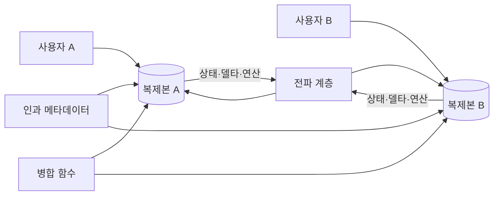
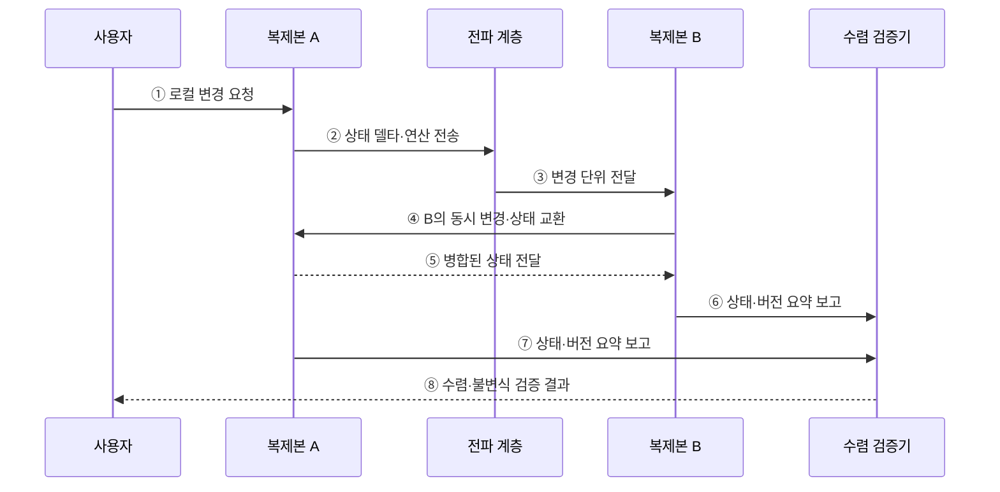

---
sidebar:
  order: 105
  label: "105. CRDT 충돌 없는 복제 데이터 (Conflict-free Replicated Data Type)"
  badge:
    text: "미출제 · 50%"
    variant: note
title: "CRDT 충돌 없는 복제 데이터 (Conflict-free Replicated Data Type)"
date: "2026-07-25T18:37:00+09:00"
tags:
  - "notes-software"
weight: 105
extra:
  question_no: "105"
  source_status: "미출제"
  source_history: ""
  priority: 50
  priority_note: "CRDT는 무조정 병합·수렴 설계의 현안"
---

## 미리 알고가기

- **충돌 없는 복제 데이터 유형(Conflict-free Replicated Data Type, CRDT)**: 여러 복제본의 동시 변경을 결정적 규칙으로 자동 수렴시키는 자료형임
- **상태 기반 CRDT(State-based CRDT)**: 전체 상태나 차이를 교환·결합·멱등 병합해 수렴하는 유형임
- **연산 기반 CRDT(Operation-based CRDT)**: 변경 연산을 신뢰성 있게 전달하고 교환 가능한 규칙으로 적용하는 유형임
- **교환 법칙(Commutativity)**: 연산이나 병합의 순서를 바꿔도 결과가 같은 성질임
- **결합 법칙(Associativity)**: 여러 값을 묶어 병합하는 순서를 바꿔도 결과가 같은 성질임
- **멱등성(Idempotence)**: 같은 상태나 연산을 여러 번 적용해도 한 번 적용한 결과와 같은 성질임
- **인과 메타데이터(Causal Metadata)**: 버전 벡터·논리 시계로 변경의 선후 관계와 중복 여부를 나타내는 정보임
- **상태 델타(State Delta)**: 전체 상태 중 다른 복제본에 전달할 변경 차이만 표현한 값임
- **안티엔트로피(Anti-entropy)**: 복제본끼리 상태 차이를 주기적으로 교환해 누락 변경을 보완하는 동기화 방식임
- **업무 불변식(Business Invariant)**: 재고가 음수가 아니어야 하는 것처럼 모든 처리 뒤에도 지켜야 하는 업무 규칙임

## Ⅰ. 개요

- CRDT는 여러 복제본이 독립적으로 갱신되어도 자료형에 정의된 병합 규칙으로 같은 상태에 수렴하는 데이터 구조이다.
- 네트워크 단절 중에도 로컬 쓰기를 허용할 수 있지만 모든 업무 규칙이나 충돌 의미를 자동으로 해결하지는 않는다.

### 쉽게 이해하기 (학습용)

- 각자 고친 사본을 어떤 순서로 합쳐도 같은 결과가 되게 만든 자료형이다.

## Ⅱ. 특징

- 중앙 잠금 없이 갱신해 단절 중 쓰기 가용성을 유지한다.
- 수렴 조건을 지키면 전파 순서와 무관하게 합쳐진다.
- 자료형별 동시 변경 의미를 병합 규칙에 명시한다.
- 메타데이터가 누적되고 업무 불변식은 별도 조정한다.

### 쉽게 이해하기 (학습용)

- 기술적으로 같은 값에는 도달하지만 그 값이 업무상 옳은지는 별도로 확인해야 한다.

## Ⅲ. 아키텍처 및 구성요소

**도표안 A — 구조도**

**도표안 B — sequenceDiagram**

| 구성요소 | 역할 |
|:---|:---|
| 복제본 상태 | 각 노드가 독립적으로 읽고 갱신하는 값 |
| 변경 단위 | 전체 상태·델타 또는 전달할 연산 |
| 인과 메타데이터 | 선후 관계·동시성·중복을 식별하는 버전 정보 |
| 병합·적용 함수 | 자료형별 결정적 수렴 규칙 실행 |
| 전파·안티엔트로피 | 누락된 변경을 반복 교환해 최종 전달 |

**동작 원리**

- ① 사용자가 도달 가능한 복제본 A에 로컬 변경을 요청한다.
- ② 복제본 A가 상태 델타 또는 식별된 연산을 전파 계층에 보낸다.
- ③ 전파 계층이 변경 단위를 복제본 B에 전달한다.
- ④ 복제본 B도 독립적으로 발생한 변경이나 현재 상태를 A와 교환한다.
- ⑤ 복제본 A가 자료형 규칙으로 병합한 상태를 B에 전달한다.
- ⑥ 복제본 B가 현재 상태와 버전 요약을 검증기에 보고한다.
- ⑦ 복제본 A도 현재 상태와 버전 요약을 보고한다.
- ⑧ 검증기가 기술적 수렴과 별도 업무 불변식 결과를 사용자에게 알린다.

### 쉽게 이해하기 (학습용)

- 두 사본이 변경표를 주고받아 같은 값이 되었는지와 그 값이 업무상 허용되는지를 확인한다.

## Ⅳ. 종류 및 비교

| 비교 항목 | 상태 기반 CRDT | 연산 기반 CRDT |
|:---|:---|:---|
| 전파 단위 | 전체 상태 또는 델타 | 갱신 연산 |
| 수렴 조건 | 병합의 교환·결합·멱등성 | 연산의 교환 가능성과 전달 조건 |
| 전달 특성 | 중복·순서 변경에 비교적 강함 | 중복 억제와 신뢰 전달 필요 |
| 장점 | 안티엔트로피 구현이 단순 | 변경량 중심으로 전송 효율 향상 |
| 한계 | 상태·메타데이터 전송량 | 메시지 유실·중복·순서 관리 |

| 대표 자료형 | 병합 의미 |
|:---|:---|
| G-Counter / PN-Counter | 노드별 증가값 또는 증가·감소값 합산 |
| G-Set / OR-Set | 추가 전용 또는 태그 기반 추가·삭제 |
| LWW-Register | 타임스탬프·순서 규칙으로 한 값을 선택 |
| Sequence CRDT | 동시 삽입·삭제 위치를 결정적으로 정렬 |

### 쉽게 이해하기 (학습용)

- 현재 상태를 합치거나 변경 명령을 전달하되 어느 쪽도 합치는 규칙이 핵심이다.

## Ⅴ. 실무 고려사항 및 대책

| 고려사항 | 위험 | 대책 |
|:---|:---|:---|
| 업무 의미 | 자동 수렴 결과가 사용자 의도와 다름 | 동시 변경 의미와 승자·보존 규칙 명시 |
| 불변식 | 재고 음수·한도 초과를 막지 못함 | 조정이 필요한 불변식은 별도 합의·예약 적용 |
| 메타데이터 | 삭제 표식·버전 벡터가 계속 증가 | 안전한 압축·가비지 컬렉션 기준 설계 |
| 전달 조건 | 연산 유실·중복으로 수렴 실패 | 내구 메시지·중복 제거·안티엔트로피 적용 |
| 시계 | 물리 시계 오차로 LWW 변경 유실 | 논리·하이브리드 시계와 동률 규칙 사용 |
| 검증 | 평균 연결 상태만 시험 | 장기 단절·재접속·재정렬·중복 전달 시험 |

> **적용 사례**: 공동 편집은 동시 삽입·삭제의 위치를 Sequence CRDT로 수렴시키되 삭제 메타데이터 크기와 장기 오프라인 재동기화를 검증한다.

### 쉽게 이해하기 (학습용)

- 동시에 편집한 글은 자동으로 합칠 수 있어도 문장의 의미가 자연스러운지는 사람이 확인해야 한다.

## Ⅵ. 결론

- CRDT는 동시 변경을 조정 없이 수용하고 결정적 규칙으로 복제본을 수렴시키는 자료형이다.
- 자료형의 병합 의미·전달 조건·메타데이터 비용·업무 불변식을 함께 검증해야 한다.

### 쉽게 이해하기 (학습용)

- 사본을 같은 값으로 맞추는 기술이지 모든 업무 충돌을 옳게 판단하는 기술은 아니다.
