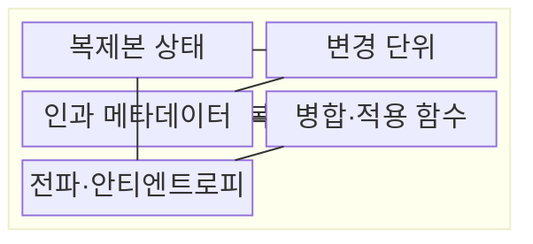
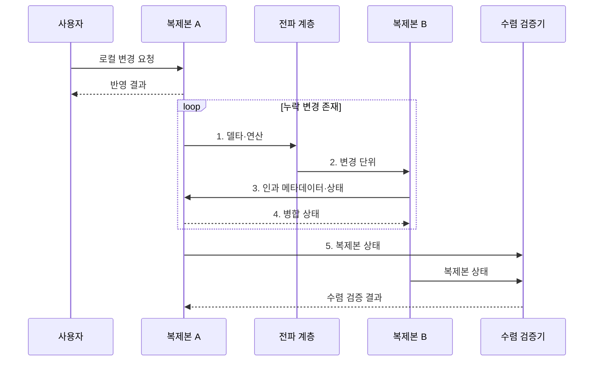

---
sidebar:
  order: 105
  label: "105. CRDT 충돌 없는 복제 데이터 (Conflict-free Replicated Data Type)"
  badge:
    text: "미출 · 50%"
    variant: note
title: "CRDT 충돌 없는 복제 데이터 (Conflict-free Replicated Data Type)"
date: "2026-08-02T12:00:00+09:00"
tags:
  - "notes-software"
weight: 105
extra:
  question_no: "105"
  source_status: "미출"
  source_history: ""
  priority: 50
  priority_note: "CRDT는 무조정 병합·수렴 설계의 현안"
---

## Ⅰ. 개요

핵심 용어

- **분산 자료형**: 여러 복제본의 동시 변경을 결정적 규칙으로 병합해 같은 값으로 수렴시키는 자료형이다.

- 정의/개념: **CRDT**는 복제본이 중앙 조정 없이 동시 변경을 수행하고 교환 순서와 무관한 결정적 병합으로 같은 상태에 수렴하는 분산 자료형
- 배경/필요성: 분할 중 중앙 조정에 의존하면 **로컬 쓰기 가용성** 저하

### 쉽게 이해하기 (학습용)

- 각자 고친 사본을 어떤 순서로 합쳐도 같은 결과가 되게 만든 자료형이다.

## Ⅱ. 특징

핵심 용어

- **결정적 수렴**: 변경 전달 순서와 중복에 관계없이 모든 복제본이 같은 결과에 도달하는 특성이다.

- 중앙 합의 없이 복제본별 **무조정 로컬 쓰기** 허용
- 교환·결합·멱등 규칙으로 전달 순서와 무관한 **결정적 수렴**
- 자료형 수렴은 보장하지만 **업무 불변식**은 별도 조정

### 쉽게 이해하기 (학습용)

- 기술적으로 같은 값에는 도달하지만 그 값이 업무상 옳은지는 별도로 확인해야 한다.

## Ⅲ. 구조 및 구성요소

핵심 용어

- **인과 메타데이터**: 변경의 선후 관계와 동시성 및 중복 여부를 식별하는 구성요소이다.

| 구성요소 | 책임 |
|:---|:---|
| 복제본 상태 | 노드별 **독립 읽기·갱신** |
| 변경 단위 | **상태·델타·연산** 표현 |
| 인과 메타데이터 | 변경의 **선후·동시성·중복** 식별 |
| 병합·적용 함수 | 자료형별 **결정적 수렴 규칙** 실행 |
| 전파·안티엔트로피 | 복제본 사이 **누락 변경** 반복 교환 |

### 쉽게 이해하기 (학습용)

- 사본과 변경표, 순서표, 합치는 규칙, 전달 담당자로 구성된다.

## Ⅳ. 흐름도

핵심 용어

- **4. 병합 상태**: 교환·결합·멱등 규칙으로 각 복제본에서 동일한 결과를 계산하는 단계이다.

**동작 원리**

1. **델타·연산**: 로컬 갱신에서 다른 복제본에 필요한 변경 추출
2. **변경 단위**: 전파 계층이 상태 차이 또는 연산을 대상 복제본에 전달
3. **인과 메타데이터·상태**: 독립 변경의 선후·동시성과 누락 범위 확인
4. **병합 상태**: 교환·결합·멱등 규칙으로 동일 결과 계산
5. **복제본 상태**: 충분한 전파 뒤 각 복제본의 값 일치 판정

### 쉽게 이해하기 (학습용)

- 두 사본이 변경표를 주고받아 같은 값이 되었는지와 그 값이 업무상 허용되는지를 확인한다.

## Ⅴ. 종류 및 비교

핵심 용어

- **상태 기반 CRDT**: 전체 상태나 델타를 교환하고 멱등 병합해 수렴하는 동기화 방식이다.

| CRDT 동기화 방식 | 상태 기반 CRDT | 연산 기반 CRDT |
|:---|:---|:---|
| 적용 기준 | 중복·순서 변경을 허용하는 **상태 교환** | 신뢰성 있는 **연산 전달** 가능 |
| 핵심 특징 | 상태·델타의 **멱등 병합** | **교환 가능한 연산** 적용 |
| 한계 | **상태·메타데이터 크기** 증가 | **유실·중복·순서** 전달 조건 |

### 쉽게 이해하기 (학습용)

- 현재 상태를 합치거나 변경 명령을 전달하되 어느 쪽도 합치는 규칙이 핵심이다.

## Ⅵ. 실무 고려사항 및 대책

핵심 용어

- **재고·한도 불변식은 자동 병합만으로 보장 불가**: 자료형의 수렴과 업무 규칙의 유효성이 서로 다른 문제임을 나타내는 한계이다.

| 문제 | 대책 | 효과 |
|:---|:---|:---|
| 동시 변경의 승자·보존 규칙이 없으면 사용자 의도 왜곡 | 자료형별 **승자·보존 규칙** 명시 | **동시 편집 의미** 보존 |
| 재고·한도 불변식은 자동 병합만으로 보장 불가 | **별도 합의·사전 예약** 적용 | **업무 불변식 위반** 방지 |
| 장기 오프라인 복제본은 인과 메타데이터 누적 | **메타데이터 압축·삭제 이력 정리** | **저장 공간 증가** 통제 |
| 연산 유실·중복·재정렬은 수렴 조건 훼손 | **내구 전달·멱등 적용** | **연산 기반 수렴** 보장 |
| 정상 환경 시험만 하면 분할 복구 오류 미검출 | **단절·재접속·재정렬 시험** | **장애 후 수렴 조건** 검증 |

### 쉽게 이해하기 (학습용)

- 동시에 편집한 글은 자동으로 합칠 수 있어도 문장의 의미가 자연스러운지는 사람이 확인해야 한다.

## Ⅶ. 결론

핵심 용어

- **합의**: 자동 병합만으로 업무 불변식을 보존할 수 없을 때 적용하는 조정 방식이다.

- 업무 불변식이 병합으로 보존되면 **CRDT**, 아니면 **합의** 적용

### 쉽게 이해하기 (학습용)

- 사본을 같은 값으로 맞추는 기술이지 모든 업무 충돌을 옳게 판단하는 기술은 아니다.
