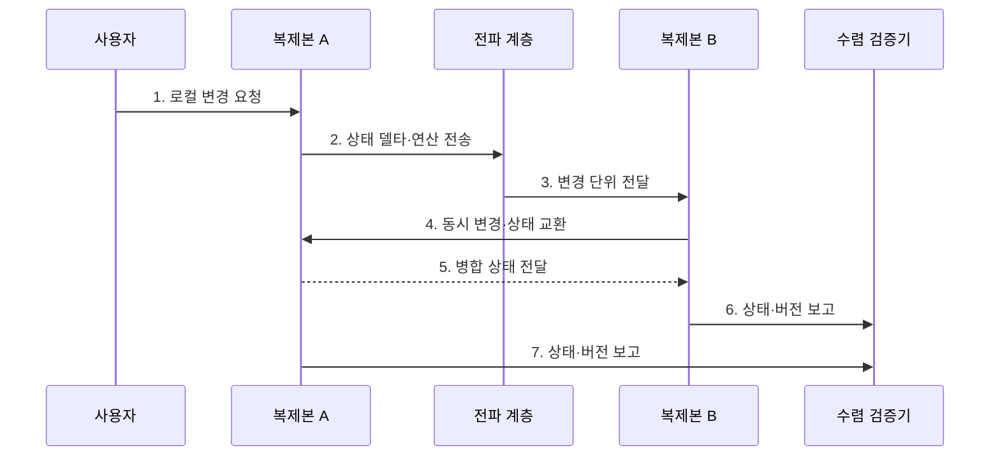

---
sidebar:
  order: 105
  label: "105. CRDT 충돌 없는 복제 데이터 (Conflict-free Replicated Data Type)"
  badge:
    text: "미출제 · 50%"
    variant: note
title: "CRDT 충돌 없는 복제 데이터 (Conflict-free Replicated Data Type)"
date: "2026-07-25T18:37:00+09:00"
tags:
  - "notes-software"
weight: 105
extra:
  question_no: "105"
  source_status: "미출제"
  source_history: ""
  priority: 50
  priority_note: "CRDT는 무조정 병합·수렴 설계의 현안"
---

## 미리 알고가기

- **충돌 없는 복제 데이터 유형(Conflict-free Replicated Data Type, CRDT)**: 여러 복제본의 동시 변경을 결정적 규칙으로 자동 수렴시키는 자료형이다.
- **상태 기반 CRDT(State-based CRDT)**: 전체 상태나 차이를 교환·결합·멱등 병합해 수렴하는 유형이다.
- **연산 기반 CRDT(Operation-based CRDT)**: 변경 연산을 신뢰성 있게 전달하고 교환 가능한 규칙으로 적용하는 유형이다.
- **교환 법칙(Commutativity)**: 연산이나 병합의 순서를 바꿔도 결과가 같은 성질이다.
- **결합 법칙(Associativity)**: 여러 값을 묶어 병합하는 순서를 바꿔도 결과가 같은 성질이다.
- **멱등성(Idempotence)**: 같은 상태나 연산을 여러 번 적용해도 한 번 적용한 결과와 같은 성질이다.
- **인과 메타데이터(Causal Metadata)**: 버전 벡터·논리 시계로 변경의 선후 관계와 중복 여부를 나타내는 정보이다.
- **상태 델타(State Delta)**: 전체 상태 중 다른 복제본에 전달할 변경 차이만 표현한 값이다.
- **안티엔트로피(Anti-entropy)**: 복제본끼리 상태 차이를 주기적으로 교환해 누락 변경을 보완하는 동기화 방식이다.
- **업무 불변식(Business Invariant)**: 재고가 음수가 아니어야 하는 것처럼 모든 처리 뒤에도 지켜야 하는 업무 규칙이다.

## Ⅰ. 개요

- 정의/개념: 동시 변경을 결정적 병합으로 수렴시키는 **자료구조**
- 배경/필요성: 통신 단절 중 로컬 쓰기 허용

### 쉽게 이해하기 (학습용)

- 각자 고친 사본을 어떤 순서로 합쳐도 같은 결과가 되게 만든 자료형이다.

## Ⅱ. 특징

- **무조정 쓰기**: 단절 중 로컬 갱신 허용
- **결정적 수렴**: 전파 순서와 무관하게 병합
- **의미 한정**: 업무 불변식은 별도 조정

### 쉽게 이해하기 (학습용)

- 기술적으로 같은 값에는 도달하지만 그 값이 업무상 옳은지는 별도로 확인해야 한다.

## Ⅲ. 구조 및 구성요소

| 구성요소 | 책임 |
|:---|:---|
| 복제본 상태 | 노드별 독립 읽기·갱신 |
| 변경 단위 | 상태·델타·연산 표현 |
| 인과 메타데이터 | 선후·동시성·중복 식별 |
| 병합·적용 함수 | 자료형별 수렴 규칙 실행 |
| 전파·안티엔트로피 | 누락 변경 반복 교환 |

### 쉽게 이해하기 (학습용)

- 사본과 변경표, 순서표, 합치는 규칙, 전달 담당자로 구성된다.

## Ⅳ. 흐름도

**동작 원리**

- **1. 로컬 변경 요청**: 도달 가능한 사본을 갱신
- **2. 상태 델타·연산 전송**: 변경을 전파
- **3. 변경 단위 전달**: 다른 사본으로 전달
- **4. 동시 변경·상태 교환**: 양쪽 변경을 수집
- **5. 병합 상태 전달**: 규칙 결과를 공유
- **6. 상태·버전 보고**: 한쪽 결과를 검증
- **7. 상태·버전 보고**: 양쪽 수렴을 비교

### 쉽게 이해하기 (학습용)

- 두 사본이 변경표를 주고받아 같은 값이 되었는지와 그 값이 업무상 허용되는지를 확인한다.

## Ⅴ. 종류 및 비교

| 판단 기준 | 상태 기반 CRDT | 연산 기반 CRDT |
|:---|:---|:---|
| 적용 기준 | 중복·순서 변경 허용 | 신뢰성 있는 연산 전달 |
| 핵심 특징 | 상태·델타를 멱등 병합 | 교환 가능한 연산 적용 |
| 한계 | 상태·메타데이터 크기 | 유실·중복·순서 관리 |

### 쉽게 이해하기 (학습용)

- 현재 상태를 합치거나 변경 명령을 전달하되 어느 쪽도 합치는 규칙이 핵심이다.

## Ⅵ. 실무 고려사항 및 대책

| 고려사항 | 대책 | 효과 |
|:---|:---|:---|
| 업무 의미 | 승자·보존 규칙 명시 | 사용자 의도 왜곡 감소 |
| 불변식 | 별도 합의·예약 적용 | 재고·한도 위반 방지 |
| 메타데이터 | 압축·정리 기준 설계 | 저장량 증가 통제 |
| 전달 조건 | 내구 메시지·중복 제거 적용 | 유실·중복에도 수렴 |
| 검증 | 단절·재접속·재정렬 시험 | 장애 조건 검증 |

> **적용 사례**: 공동 편집은 동시 삽입·삭제의 위치를 Sequence CRDT로 수렴시키되 삭제 메타데이터 크기와 장기 오프라인 재동기화를 검증

### 쉽게 이해하기 (학습용)

- 동시에 편집한 글은 자동으로 합칠 수 있어도 문장의 의미가 자연스러운지는 사람이 확인해야 한다.

## Ⅶ. 결론

- **병합 의미·전달 조건·불변식**으로 CRDT 적용 범위를 결정

### 쉽게 이해하기 (학습용)

- 사본을 같은 값으로 맞추는 기술이지 모든 업무 충돌을 옳게 판단하는 기술은 아니다.
