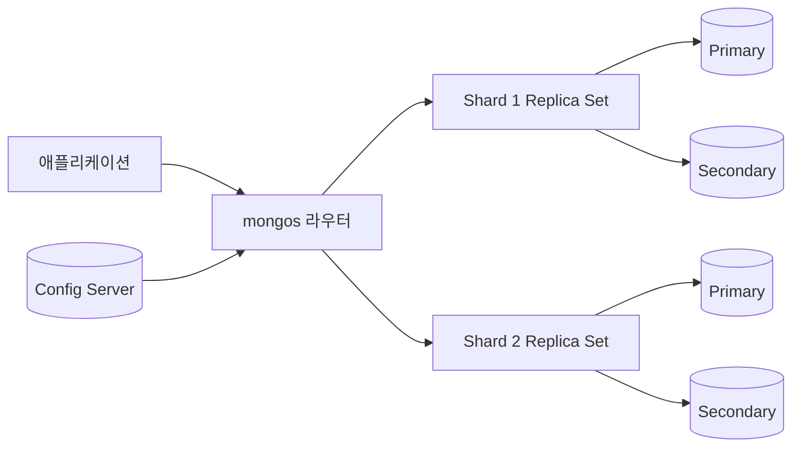
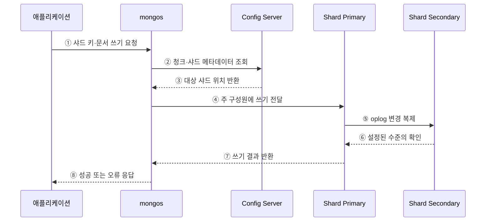

---
sidebar:
  order: 106
  label: "106. MongoDB 도큐먼트 DB (MongoDB Document Database)"
  badge:
    text: "기출 · 30%"
    variant: note
title: "MongoDB 도큐먼트 DB (MongoDB Document Database)"
date: "2026-07-27T23:59:59+09:00"
tags:
  - "notes-software"
weight: 106
extra:
  question_no: "106"
  source_status: "기출"
  source_history: "137회"
  priority: 30
  priority_note: "137회 기출, 문서 모델 제품 사례 성격"
---

## 미리 알고가기

- **MongoDB**: BSON 문서를 컬렉션 단위로 저장·조회하는 문서형 데이터베이스
- **BSON(Binary JSON)**: JSON과 유사한 구조에 여러 자료형을 담는 이진 문서 형식
- **컬렉션(Collection)**: 비슷한 용도의 BSON 문서를 모은 논리 단위
- **내장(Embedding)**: 함께 읽고 갱신하는 하위 데이터를 한 문서에 포함하는 모델링
- **참조(Reference)**: 다른 문서의 식별자를 저장해 관계를 연결하는 모델링
- **레플리카셋(Replica Set)**: 주 구성원 선출과 변경 복제로 고가용성을 제공하는 그룹
- **쓰기 확인(Write Concern)**: 쓰기 성공에 필요한 확인 수준
- **읽기 관심(Read Concern)**: 읽기가 보장해야 할 일관성·격리 수준

## Ⅰ. 개요

- MongoDB는 중첩 객체와 배열을 포함한 BSON 문서를 저장 단위로 사용하는 문서형 데이터베이스이다.
- 함께 읽고 갱신하는 데이터를 한 문서에 내장하면 조인과 왕복을 줄이고 단일 문서 원자성을 활용할 수 있다.

### 쉽게 이해하기 (학습용)

- 함께 쓰는 상품 정보와 속성을 한 묶음 문서로 저장하는 데이터베이스이다.

## Ⅱ. 특징

- **문서 모델**: 중첩 객체·배열과 문서별 가변 필드를 지원한다.
- **원자성**: 한 문서의 쓰기는 원자적이며 필요하면 다중 문서 트랜잭션도 지원한다.
- **확장 구조**: 레플리카셋으로 가용성을, 샤딩으로 데이터 분산을 제공한다.
- **모델 절충**: 내장은 읽기와 원자성에 유리하고 참조는 중복과 문서 성장을 줄인다.

### 쉽게 이해하기 (학습용)

- 함께 쓰는 정보는 묶되 끝없이 커지거나 자주 중복되는 정보는 분리해야 한다.

## Ⅲ. 아키텍처 및 구성요소

**도표안 A — 구조도**

**도표안 B — sequenceDiagram**

| 구성요소 | 역할 |
|:---|:---|
| BSON 문서·컬렉션 | 중첩 데이터의 저장·원자 갱신 단위 |
| 인덱스·집계 파이프라인 | 필드 탐색과 단계별 변환·집계 수행 |
| 레플리카셋 | oplog 복제·주 구성원 선출·장애 전환 |
| mongos | 샤드 메타데이터로 요청 라우팅·결과 병합 |
| Config Server | 샤드·청크 배치 메타데이터 유지 |

**동작 원리**

- ① 애플리케이션이 샤드 키와 BSON 문서 쓰기를 mongos에 요청한다.
- ② mongos가 Config Server의 청크·샤드 배치 정보를 확인한다.
- ③ Config Server가 현재 대상 샤드 위치를 반환한다.
- ④ mongos가 대상 레플리카셋의 주 구성원에 쓰기를 전달한다.
- ⑤ 주 구성원이 변경을 기록하고 oplog를 보조 구성원에 복제한다.
- ⑥ 보조 구성원이 쓰기 확인 정책에 필요한 단계를 확인한다.
- ⑦ 주 구성원이 쓰기 결과를 mongos에 반환한다.
- ⑧ mongos가 애플리케이션에 성공 또는 오류를 응답한다.

### 쉽게 이해하기 (학습용)

- 안내자가 문서의 담당 샤드와 원본을 찾아 저장하고 요구한 사본 확인 뒤 응답한다.

## Ⅳ. 종류 및 비교

| 모델링 방식 | 내장 | 참조 |
|:---|:---|:---|
| 저장 방식 | 관련 데이터를 한 문서에 포함 | 다른 문서 식별자로 연결 |
| 장점 | 한 번의 읽기·단일 문서 원자 갱신 | 중복·문서 성장 감소 |
| 적합 관계 | 포함 관계·함께 조회하는 1:N | 독립 수명주기·복잡한 N:M |
| 주요 위험 | 16 MiB 한도·무한 배열·중복 갱신 | 추가 조회·집계·다중 문서 정합성 |

> MongoDB도 `$lookup`과 다중 문서 트랜잭션을 지원하지만 문서 경계를 잘 설계해 불필요한 분산 조정을 줄이는 것이 우선이다.

### 쉽게 이해하기 (학습용)

- 항상 함께 쓰면 한 문서에 넣고 따로 커지거나 자주 공유하면 참조로 나눈다.

## Ⅴ. 실무 고려사항 및 대책

| 고려사항 | 위험 | 대책 |
|:---|:---|:---|
| 문서 경계 | 무한 배열·16 MiB 한도 초과 | 함께 읽고 바꾸는 유한 데이터만 내장 |
| 스키마 | 가변 필드의 타입·이름 불일치 | JSON Schema 검증과 버전 마이그레이션 |
| 인덱스 | 배열·포함 필드 색인 비대 | 실제 질의 기반 인덱스와 크기 감시 |
| 샤드 키 | 핫스팟·scatter/gather | 분포·지역성·쿼리 포함률 검증 |
| 읽기·쓰기 보장 | 기본 설정을 업무 보장으로 오해 | read/write concern과 read preference 명시 |
| 트랜잭션 | 다중 문서·샤드 거래 남용 | 문서 모델 우선, 범위·지연·재시도 검증 |

> **적용 사례**: 상품의 유한한 속성은 한 문서에 내장하고 계속 늘어나는 리뷰는 별도 컬렉션에 참조해 문서 성장을 제한한다.

### 쉽게 이해하기 (학습용)

- 한 번에 읽을 정보는 묶되 끝없이 늘어나는 목록과 여러 곳에서 공유하는 정보는 분리한다.

## Ⅵ. 결론

- MongoDB의 핵심은 BSON 형식 자체보다 접근 패턴에 맞춘 문서 경계와 분산 키 설계이다.
- 내장·참조·인덱스·일관성 수준·샤드 키를 함께 검증해 읽기 이점과 갱신·운영 비용의 균형을 맞춰야 한다.

### 쉽게 이해하기 (학습용)

- 함께 쓰는 자료는 한 문서에, 분산 위치는 자주 찾는 키에 맞추는 것이 핵심이다.
