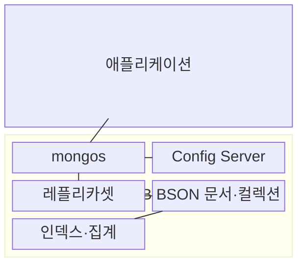
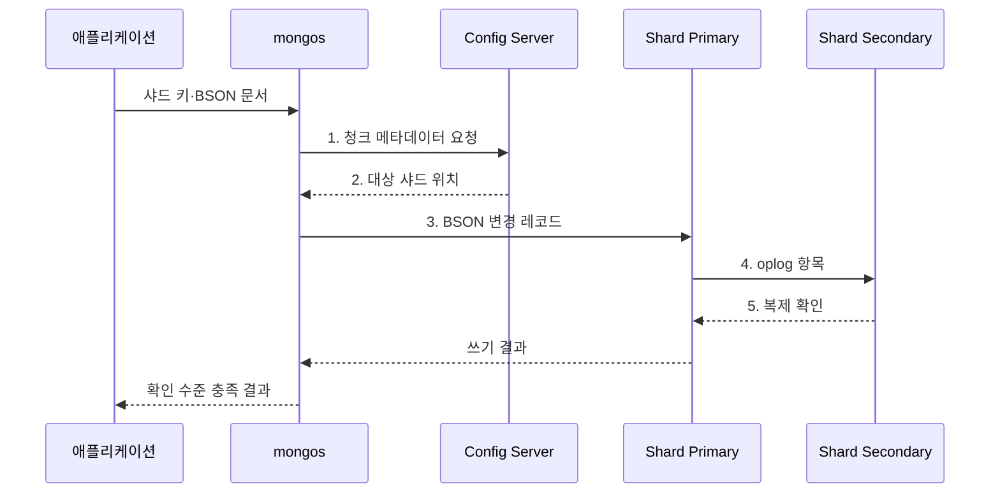

---
sidebar:
  order: 106
  label: "106. MongoDB 도큐먼트 DB (MongoDB Document Database)"
  badge:
    text: "기출 · 30%"
    variant: note
title: "MongoDB 도큐먼트 DB (MongoDB Document Database)"
date: "2026-08-02T12:00:00+09:00"
tags:
  - "notes-software"
weight: 106
extra:
  question_no: "106"
  source_status: "기출"
  source_history: "137회"
  priority: 30
  priority_note: "137회 기출, 문서 모델 제품 사례 성격"
---

## Ⅰ. 개요

핵심 용어

- **문서 DB**: 중첩 필드와 배열을 가진 BSON 문서를 저장 및 원자 갱신 단위로 사용하는 데이터베이스이다.

- 정의/개념: BSON 문서를 저장·원자 갱신 단위로 쓰는 **문서 DB**
- 배경/필요성: 관계형 조인·다중 테이블 갱신은 **중첩 객체 처리 왕복** 증가

### 쉽게 이해하기 (학습용)

- 함께 쓰는 상품 정보와 속성을 한 묶음 문서로 저장하는 데이터베이스이다.

## Ⅱ. 특징

핵심 용어

- **문서 모델**: 중첩 객체·배열과 가변 필드를 한 문서 안에 표현하는 저장 특성이다.

- **문서 모델**: 중첩 객체·배열·가변 필드 지원
- **단일 원자성**: 한 문서 쓰기를 원자 확정
- **분산 확장**: 레플리카셋·샤딩 제공

### 쉽게 이해하기 (학습용)

- 함께 쓰는 정보는 묶되 끝없이 커지거나 자주 중복되는 정보는 분리해야 한다.

## Ⅲ. 구조 및 구성요소

핵심 용어

- **레플리카셋**: oplog 복제와 주 구성원 선출로 고가용성을 제공하는 구성요소이다.

| 구성요소 | 책임 |
|:---|:---|
| BSON 문서·컬렉션 | **중첩 필드·배열** 저장·갱신 |
| 인덱스·집계 | **필드 탐색·변환·집계** 수행 |
| 레플리카셋 | **oplog 복제·주 구성원 선출** |
| mongos | **샤드 라우팅·결과 병합** |
| Config Server | **청크·샤드 위치** 관리 |

### 쉽게 이해하기 (학습용)

- 문서 보관함과 색인, 사본 묶음, 안내자, 위치표로 구성된다.

## Ⅳ. 흐름도

핵심 용어

- **3. BSON 변경 레코드**: 주 구성원이 문서 단위 변경을 원자적으로 적용하는 단계이다.

**동작 원리**

1. **청크 메타데이터 요청**: 샤드 키가 속한 청크의 배치 위치 조회
2. **대상 샤드 위치**: 구성 서버가 담당 레플리카셋 주소 반환
3. **BSON 변경 레코드**: 주 구성원이 문서 단위 변경을 원자 적용
4. **oplog 항목**: 확정된 변경 순서를 보조 구성원에 전달
5. **복제 확인**: 요구된 쓰기 확인 수를 충족하면 성공 판정

### 쉽게 이해하기 (학습용)

- 안내자가 문서의 담당 샤드와 원본을 찾아 저장하고 요구한 사본 확인 뒤 응답한다.

## Ⅴ. 종류 및 비교

핵심 용어

- **내장**: 함께 읽고 갱신하는 유한한 하위 데이터를 한 문서에 포함하는 모델링 방식이다.

| 문서 관계 모델링 | 내장 | 참조 |
|:---|:---|:---|
| 적용 기준 | 함께 읽고 갱신하는 **유한 데이터** | **독립 수명주기·공유 데이터** |
| 핵심 특징 | 관련 데이터를 **한 문서에 포함** | 식별자로 **다른 문서 연결** |
| 한계 | **문서 크기 한도·무한 배열** | **추가 조회·다중 문서 정합성** |

> 요약: **문서 경계**를 먼저 설계해 불필요한 분산 조정 최소화

### 쉽게 이해하기 (학습용)

- 항상 함께 쓰면 한 문서에 넣고 따로 커지거나 자주 공유하면 참조로 나눈다.

## Ⅵ. 실무 고려사항 및 대책

핵심 용어

- **무한 배열을 내장하면 문서 크기 한도 초과**: 계속 증가하는 하위 데이터를 한 문서에 넣어 저장 한계를 넘는 문제이다.

| 문제 | 대책 | 효과 |
|:---|:---|:---|
| 무한 배열을 내장하면 문서 크기 한도 초과 | 유한한 동시 조회 데이터만 **내장** | **문서 크기 초과** 방지 |
| 가변 필드를 무검증 저장하면 자료형·필수값 불일치 | **스키마 검증·버전 이관** 적용 | **필드 불일치** 감소 |
| 저선택도 인덱스 누적은 쓰기·메모리 비용 증가 | 실제 질의·크기로 **인덱스 선별** | **색인 비대** 방지 |
| 편향·저포함률 샤드 키는 부하 집중·전수 질의 유발 | **분포·지역성·포함률** 검증 | **핫 샤드·팬아웃** 완화 |
| 읽기·쓰기 보장 미설정은 최신성·내구성 오해 유발 | **Concern·Read Preference** 명시 | **업무 보장 범위** 명확화 |

### 쉽게 이해하기 (학습용)

- 한 번에 읽을 정보는 묶되 끝없이 늘어나는 목록과 여러 곳에서 공유하는 정보는 분리한다.

## Ⅶ. 결론

핵심 용어

- **참조**: 독립적인 수명주기를 갖거나 끝없이 증가하는 데이터를 별도 문서로 연결하는 방식이다.

- 함께 읽고 유한하면 **내장**, 독립 수명주기·무한 성장은 **참조** 선택

### 쉽게 이해하기 (학습용)

- 함께 쓰는 자료는 한 문서에, 분산 위치는 자주 찾는 키에 맞추는 것이 핵심이다.
