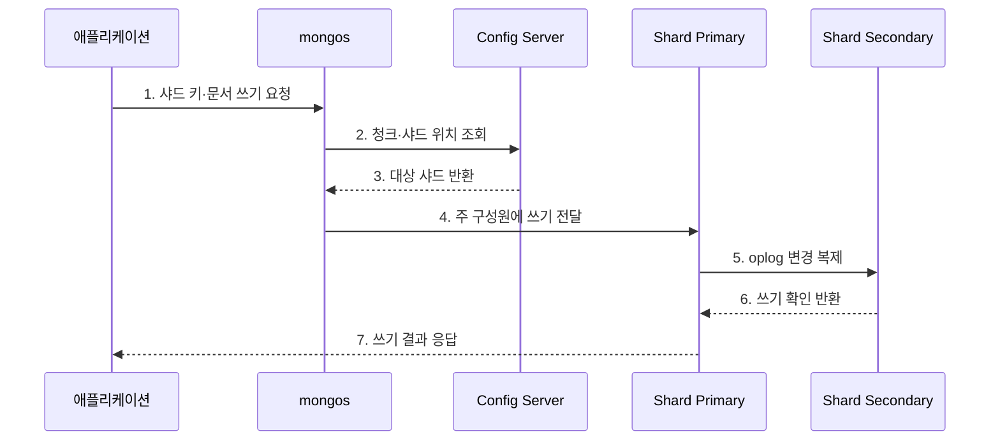

---
sidebar:
  order: 106
  label: "106. MongoDB 도큐먼트 DB (MongoDB Document Database)"
  badge:
    text: "기출 · 30%"
    variant: note
title: "MongoDB 도큐먼트 DB (MongoDB Document Database)"
date: "2026-07-27T23:59:59+09:00"
tags:
  - "notes-software"
weight: 106
extra:
  question_no: "106"
  source_status: "기출"
  source_history: "137회"
  priority: 30
  priority_note: "137회 기출, 문서 모델 제품 사례 성격"
---

## 미리 알고가기

- **MongoDB**: BSON 문서를 컬렉션 단위로 저장·조회하는 문서형 데이터베이스
- **BSON(Binary JSON)**: JSON과 유사한 구조에 여러 자료형을 담는 이진 문서 형식
- **컬렉션(Collection)**: 비슷한 용도의 BSON 문서를 모은 논리 단위
- **내장(Embedding)**: 함께 읽고 갱신하는 하위 데이터를 한 문서에 포함하는 모델링
- **참조(Reference)**: 다른 문서의 식별자를 저장해 관계를 연결하는 모델링
- **레플리카셋(Replica Set)**: 주 구성원 선출과 변경 복제로 고가용성을 제공하는 그룹
- **쓰기 확인(Write Concern)**: 쓰기 성공에 필요한 확인 수준
- **읽기 관심(Read Concern)**: 읽기가 보장해야 할 일관성·격리 수준

## Ⅰ. 개요

- 정의/개념: BSON 문서를 저장·원자 갱신 단위로 쓰는 **문서 DB**
- 배경/필요성: 중첩 데이터의 조회·갱신 왕복 축소

### 쉽게 이해하기 (학습용)

- 함께 쓰는 상품 정보와 속성을 한 묶음 문서로 저장하는 데이터베이스이다.

## Ⅱ. 특징

- **문서 모델**: 중첩 객체·배열·가변 필드 지원
- **단일 원자성**: 한 문서 쓰기를 원자 확정
- **분산 확장**: 레플리카셋·샤딩 제공

### 쉽게 이해하기 (학습용)

- 함께 쓰는 정보는 묶되 끝없이 커지거나 자주 중복되는 정보는 분리해야 한다.

## Ⅲ. 구조 및 구성요소

| 구성요소 | 책임 |
|:---|:---|
| BSON 문서·컬렉션 | 중첩 데이터 저장·갱신 |
| 인덱스·집계 | 필드 탐색·변환·집계 |
| 레플리카셋 | 복제·선출·장애 전환 |
| mongos | 요청 라우팅·결과 병합 |
| Config Server | 청크·샤드 위치 관리 |

### 쉽게 이해하기 (학습용)

- 문서 보관함과 색인, 사본 묶음, 안내자, 위치표로 구성된다.

## Ⅳ. 흐름도

**동작 원리**

- **1. 샤드 키·문서 쓰기 요청**: 문서를 전달
- **2. 청크·샤드 위치 조회**: 배치표를 확인
- **3. 대상 샤드 반환**: 저장 위치를 선택
- **4. 주 구성원에 쓰기 전달**: 원본에 요청
- **5. oplog 변경 복제**: 보조 사본에 전파
- **6. 쓰기 확인 반환**: 요구 수준을 확인
- **7. 쓰기 결과 응답**: 응용에 결과를 전달

### 쉽게 이해하기 (학습용)

- 안내자가 문서의 담당 샤드와 원본을 찾아 저장하고 요구한 사본 확인 뒤 응답한다.

## Ⅴ. 종류 및 비교

| 판단 기준 | 내장 | 참조 |
|:---|:---|:---|
| 적용 기준 | 함께 읽고 바꾸는 데이터 | 독립 수명주기·공유 데이터 |
| 핵심 특징 | 관련 데이터를 한 문서에 포함 | 식별자로 다른 문서 연결 |
| 한계 | 크기 한도·무한 배열 | 추가 조회·다중 문서 정합성 |

> MongoDB도 `$lookup`과 다중 문서 트랜잭션을 지원하지만 문서 경계를 잘 설계해 불필요한 분산 조정을 줄이는 것이 우선상태

### 쉽게 이해하기 (학습용)

- 항상 함께 쓰면 한 문서에 넣고 따로 커지거나 자주 공유하면 참조로 나눈다.

## Ⅵ. 실무 고려사항 및 대책

| 고려사항 | 대책 | 효과 |
|:---|:---|:---|
| 문서 경계 | 유한한 동시 조회 데이터만 내장 | 크기 한도 초과 방지 |
| 스키마 | 검증·버전 이관 적용 | 필드 불일치 감소 |
| 인덱스 | 실제 질의·크기 기준 관리 | 색인 비대 방지 |
| 샤드 키 | 분포·지역성·포함률 검증 | 핫스팟·팬아웃 완화 |
| 읽기·쓰기 | concern·preference 명시 | 업무 보장 명확화 |

> **적용 사례**: 상품의 유한한 속성은 한 문서에 내장하고 계속 늘어나는 리뷰는 별도 컬렉션에 참조해 문서 성장을 제한

### 쉽게 이해하기 (학습용)

- 한 번에 읽을 정보는 묶되 끝없이 늘어나는 목록과 여러 곳에서 공유하는 정보는 분리한다.

## Ⅶ. 결론

- **접근 패턴·문서 성장·분산 키**로 내장과 참조를 결정

### 쉽게 이해하기 (학습용)

- 함께 쓰는 자료는 한 문서에, 분산 위치는 자주 찾는 키에 맞추는 것이 핵심이다.
