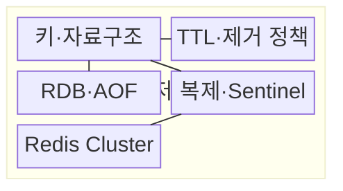
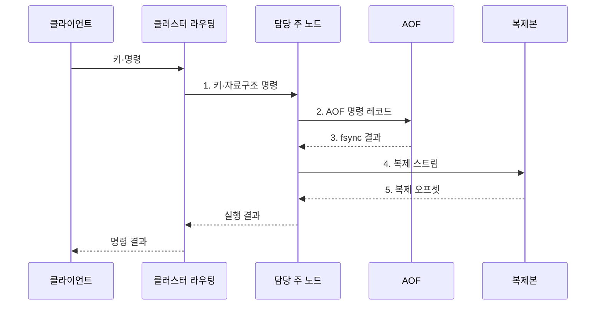

---
sidebar:
  order: 107
  label: "107. Redis 인메모리 DB (Redis In-Memory Database)"
  badge:
    text: "기출 · 50%"
    variant: note
title: "Redis 인메모리 DB (Redis In-Memory Database)"
date: "2026-07-30T23:45:31+09:00"
tags:
  - "notes-software"
weight: 107
extra:
  question_no: "107"
  source_status: "기출"
  source_history: "137회"
  priority: 50
  priority_note: "137회 기출, 인메모리 자료구조 활용성"
---

## 미리 알고가기

- **Redis**: 키별 문자열·목록·집합·해시 등 자료구조를 메모리에서 원자 명령으로 처리하는 데이터 저장소
- **인메모리 데이터베이스(In-Memory Database)**: 주 데이터를 메모리에 저장해 낮은 접근 지연을 제공하는 데이터베이스
- **생존 시간(Time To Live, TTL)**: 키가 자동 삭제될 때까지의 시간을 지정하는 만료 설정
- **Redis 데이터베이스 스냅샷(Redis Database, RDB)**: Redis 상태를 시점별 스냅샷 파일로 저장하는 영속성 방식
- **추가 전용 파일(Append Only File, AOF)**: 변경 명령을 순서대로 기록해 재시작 때 재실행하는 영속성 방식
- **센티널(Sentinel)**: 장애를 감지해 보조 복제본을 주 복제본으로 승격하는 고가용성 구성
- **Redis 클러스터(Redis Cluster)**: 해시 슬롯으로 키를 여러 노드에 분산하는 클러스터 구성
- **제거 정책(Eviction Policy)**: 메모리 부족 시 삭제할 키를 정하는 정책
- **원자 명령(Atomic Command)**: 다른 명령이 중간에 끼어들지 않은 것처럼 한 단위로 실행되는 명령이다.
- **영속성(Persistence)**: 메모리 값을 디스크 기록으로 남겨 재시작 뒤 복구할 수 있게 하는 성질이다.
- **해시 슬롯(Hash Slot)**: 키의 해시값을 기준으로 Redis 클러스터 노드에 분배하는 논리 구간이다.
- **핫키(Hot Key)**: 요청이 한 키에 과도하게 집중되어 담당 노드의 병목을 만드는 키이다.
- **캐시 스탬피드(Cache Stampede)**: 인기 키가 만료될 때 많은 요청이 동시에 원본 저장소로 몰리는 현상이다.
- **멤캐시드(Memcached)**: 단순 키값 객체를 메모리에 임시 저장하는 분산 캐시이다.
- **복구 시점 목표(Recovery Point Objective, RPO)**: 장애 때 허용할 수 있는 데이터 손실 시점을 나타내는 복구 지표
- **파일 동기화(file synchronization, fsync)**: 운영체제 버퍼의 파일 변경을 디스크에 기록하도록 요청하는 시스템 호출
- **메모리 부족(Out of Memory, OOM)**: 가용 메모리가 고갈돼 추가 할당이나 명령 처리가 실패하는 상태
- **빅키(Big Key)**: 값이나 원소 수가 커서 단일 명령의 지연·메모리 점유를 높이는 키

## Ⅰ. 개요

- 정의/개념: 자료구조를 키 명령으로 처리하는 **인메모리 데이터 저장소**
- 배경/필요성: 디스크 중심 저장은 반복 조회·카운터 갱신의 **응답 지연** 증가

### 쉽게 이해하기 (학습용)
- 디스크 창고 대신 메모리 책상에서 다양한 자료형을 바로 계산하는 키값 저장소이다.

## Ⅱ. 특징

- **원자 명령**: 서버에서 자료구조를 직접 갱신
- **수명 관리**: TTL·제거 정책으로 메모리 통제
- **복구·분산**: RDB·AOF·복제·클러스터 제공

### 쉽게 이해하기 (학습용)
- 빠르지만 메모리 한도와 재시작 복구 및 주 노드 장애를 함께 설계해야 한다.

## Ⅲ. 구조 및 구성요소

| 구성요소 | 책임 |
|:---|:---|
| 키·자료구조 | 저장 단위와 **원자 명령** 정의 |
| TTL·제거 정책 | **키 만료·메모리 제거** 결정 |
| RDB·AOF | **스냅샷·명령 로그** 기반 복구 |
| 복제·Sentinel | **복제본·장애 전환** 관리 |
| Redis Cluster | **해시 슬롯·노드 라우팅** 관리 |

### 쉽게 이해하기 (학습용)

- 메모리 서랍과 만료표, 복구 기록, 사본, 슬롯 안내자로 구성된다.

## Ⅳ. 흐름도

**동작 원리**

1. **키·자료구조 명령**: 해시 슬롯으로 주 노드를 찾아 원자 연산 전달
2. **AOF 명령 레코드**: 재실행 가능한 변경 명령을 로그에 추가
3. **fsync 결과**: 설정된 동기화 정책에 따른 디스크 기록 상태 확인
4. **복제 스트림**: 주 노드의 변경 순서를 복제본에 전달
5. **복제 오프셋**: 복제본이 반영한 변경 위치로 복제 상태 판정

### 쉽게 이해하기 (학습용)

- 키 담당 노드가 메모리 값을 바로 고치고 복구 로그와 사본에 변경을 남긴다.

## Ⅴ. 종류 및 비교

| 인메모리 캐시 | Redis | Memcached |
|:---|:---|:---|
| 적용 기준 | **자료구조 연산·복구** 필요 | 재생성 가능한 **단순 객체 캐시** |
| 핵심 특징 | **원자 명령·영속성·복제** | 단순 **키값·TTL** |
| 한계 | **복구·복제·슬롯** 운영 복잡성 | 노드 변경 시 **키 재분배** |

### 쉽게 이해하기 (학습용)

- 복구와 계산이 필요하면 Redis, 다시 만들 수 있는 단순 임시 값이면 Memcached를 검토한다.

## Ⅵ. 실무 고려사항 및 대책

| 고려사항 | 대책 | 효과 |
|:---|:---|:---|
| 원본 데이터를 Redis에만 두면 장애 시 RPO 초과 | 재생성 여부·**RPO별 저장 역할** 분리 | **원본 데이터 손실** 방지 |
| 메모리 한도 도달 시 OOM이나 중요 키 제거 발생 | **메모리 한도·제거 정책** 설정 | **OOM·중요 키 제거** 방지 |
| 인기 키의 동일 TTL은 원본 요청을 동시에 유발 | **TTL 편차·요청 병합** 적용 | **캐시 스탬피드** 완화 |
| 핫키·빅키는 담당 노드의 단일 스레드 지연 유발 | **키 분할·명령 시간** 감시 | **단일 노드 지연** 감소 |
| RDB·AOF만 의존하면 파일 손상 시 복구 불가 | **독립 백업·복구 훈련** | **영속성 파일 손실** 대응 |

### 쉽게 이해하기 (학습용)

- 키가 한꺼번에 사라지거나 하나의 큰 키에 요청이 몰리지 않도록 수명과 크기를 관리한다.

## Ⅶ. 결론

- 재생성 가능 값만 **캐시**, 낮은 RPO면 **AOF·복제·백업** 적용

### 쉽게 이해하기 (학습용)

- 없어져도 다시 만들 수 있는 값인지부터 정해야 저장·복구 정책을 맞게 고를 수 있다.
