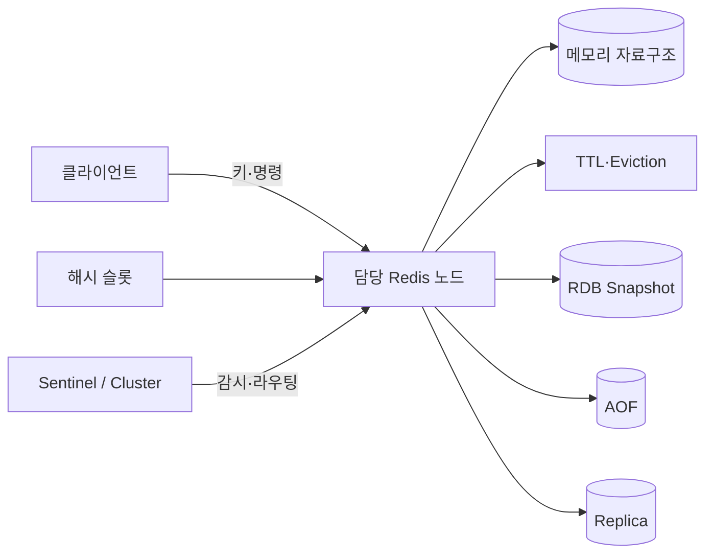
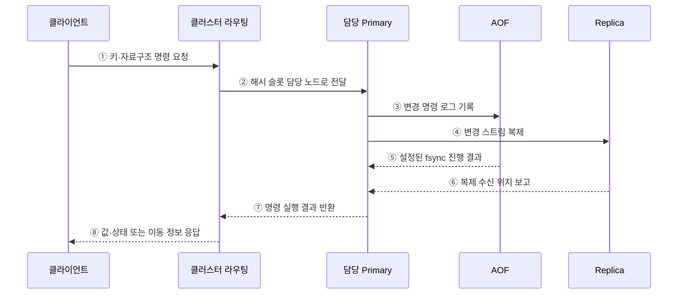

---
sidebar:
  order: 107
  label: "107. Redis 인메모리 DB (Redis In-Memory Database)"
  badge:
    text: "기출 · 50%"
    variant: note
title: "Redis 인메모리 DB (Redis In-Memory Database)"
date: "2026-07-27T23:59:59+09:00"
tags:
  - "notes-software"
weight: 107
extra:
  question_no: "107"
  source_status: "기출"
  source_history: "137회"
  priority: 50
  priority_note: "137회 기출, 인메모리 자료구조 활용성"
---

## 미리 알고가기

- **인메모리 DB(In-Memory Database)**: ‘인메모리 디비’로 읽으며, 주 데이터를 메모리에 저장해 낮은 지연을 제공함
- **TTL(Time To Live)**: ‘티티엘’로 읽고 영문 머리글자를 딴 약어이며, 키가 자동 삭제될 때까지의 시간을 지정함
- **RDB(Redis Database)**: ‘알디비’로 읽고 영문 머리글자를 딴 약어이며, Redis 상태를 시점별 스냅샷 파일로 저장함
- **AOF(Append Only File)**: ‘에이오에프’로 읽고 영문 머리글자를 딴 약어이며, 변경 명령을 순서대로 기록해 복구함
- **센티널 (Sentinel)**: 장애를 감지해 주 복제본을 승격함
- **Redis 클러스터 (Redis Cluster)**: 해시 슬롯으로 키를 분산함
- **제거 정책 (Eviction Policy)**: 메모리 부족 시 삭제할 키를 정함
- **원자 명령(Atomic Command)**: 다른 명령이 중간에 끼어들지 않은 것처럼 한 단위로 실행되는 명령임
- **영속성(Persistence)**: 메모리 값을 디스크 기록으로 남겨 재시작 뒤 복구할 수 있게 하는 성질임
- **해시 슬롯(Hash Slot)**: 키의 해시값을 기준으로 Redis 클러스터 노드에 분배하는 논리 구간임
- **핫키(Hot Key)**: 요청이 한 키에 과도하게 집중되어 담당 노드의 병목을 만드는 키임
- **캐시 스탬피드(Cache Stampede)**: 인기 키가 만료될 때 많은 요청이 동시에 원본 저장소로 몰리는 현상임
- **멤캐시드(Memcached)**: 단순 키값 객체를 메모리에 임시 저장하는 분산 캐시임

## Ⅰ. 개요

- Redis는 문자열·해시·리스트·집합·정렬 집합·스트림 등의 자료구조를 메모리에서 키 기반 명령으로 처리하는 데이터 저장소이다.
- 낮은 지연을 제공하지만 메모리 용량·데이터 수명·영속성·복제 확인 수준에 따라 손실 범위와 운영 비용이 달라진다.

### 쉽게 이해하기 (학습용)
- 디스크 창고 대신 메모리 책상에서 다양한 자료형을 바로 계산하는 키값 저장소임

## Ⅱ. 특징

- **자료구조 명령**: 서버의 개별 명령은 원자적으로 실행되어 복합 자료구조를 직접 갱신한다.
- **수명 관리**: TTL과 제거 정책으로 제한된 메모리를 통제한다.
- **영속성 선택**: RDB 스냅샷과 AOF 로그를 단독 또는 함께 사용한다.
- **고가용성·분산**: 복제·Sentinel·Redis Cluster로 장애 전환과 슬롯 분산을 구성한다.

### 쉽게 이해하기 (학습용)
- 빠르지만 메모리 한도와 재시작 복구 및 주 노드 장애를 함께 설계해야 함

## Ⅲ. 아키텍처 및 구성요소

**도표안 A — 구조도**

**도표안 B — sequenceDiagram**

| 구성요소 | 역할 |
|:---|:---|
| 키·자료구조 | 값의 저장 단위와 원자 명령 정의 |
| TTL·제거 정책 | 키 만료와 메모리 부족 시 제거 대상 결정 |
| RDB | 특정 시점의 전체 상태를 스냅샷으로 저장 |
| AOF | 변경 명령을 추가 기록해 상태 재생 |
| 복제·Sentinel | 사본 유지·장애 감지·주 노드 승격 |
| Redis Cluster | 해시 슬롯별 키 분산과 노드 라우팅 |

**동작 원리**

- ① 클라이언트가 키와 자료구조 명령을 보낸다.
- ② 클러스터 라우팅이 해시 슬롯의 담당 Primary로 요청을 전달한다.
- ③ 담당 노드가 메모리 값을 갱신하고 AOF 정책에 따라 명령을 기록한다.
- ④ 변경 스트림을 Replica에 비동기로 전달한다.
- ⑤ AOF가 설정된 fsync 주기에 따른 진행 결과를 반환한다.
- ⑥ Replica가 현재 복제 수신 위치를 Primary에 보고한다.
- ⑦ Primary가 명령 실행 결과를 라우팅 계층에 반환한다.
- ⑧ 클라이언트가 결과 또는 올바른 슬롯으로의 이동 정보를 받는다.

### 쉽게 이해하기 (학습용)

- 키 담당 노드가 메모리 값을 바로 고치고 복구 로그와 사본에 변경을 남긴다.

## Ⅳ. 종류 및 비교

| 비교 항목 | Redis | Memcached |
|:---|:---|:---|
| 데이터 모델 | 다양한 서버 측 자료구조 | 단순 키·값 객체 |
| 주요 기능 | 원자 명령·TTL·영속성·복제·클러스터 | 단순 캐시·TTL·클라이언트 분산 |
| 적합한 용도 | 캐시·세션·카운터·순위·스트림 | 재생성 가능한 단순 객체 캐시 |
| 운영 고려 | 자료형·복구·복제·슬롯 정책 | 캐시 미스·노드 변경 시 재분배 |

| Redis 영속 방식 | 장점 | 손실·비용 특성 |
|:---|:---|:---|
| RDB | 작은 파일·빠른 전체 복구 | 스냅샷 사이 변경 손실 가능 |
| AOF | 명령 재생으로 손실 범위 축소 | 파일·쓰기·재생 비용 |
| 병행 사용 | 복구 선택지 확대 | 저장·운영 복잡성 증가 |

### 쉽게 이해하기 (학습용)

- 복구와 계산이 필요하면 Redis, 다시 만들 수 있는 단순 임시 값이면 Memcached를 검토한다.

## Ⅴ. 실무 고려사항 및 대책

| 고려사항 | 위험 | 대책 |
|:---|:---|:---|
| 데이터 성격 | 중요한 원본을 캐시 정책으로 운영 | 재생성 가능 여부와 RPO에 따라 역할 분리 |
| 메모리 한도 | OOM 또는 중요 키 제거 | maxmemory·eviction 정책·키 크기 감시 |
| 만료 | 동시 만료로 캐시 스탬피드 | TTL 지터·요청 병합·사전 갱신 |
| 핫키·빅키 | 한 노드 지연·이벤트 루프 점유 | 키 분할·지역 캐시·크기·명령 시간 감시 |
| 영속성 | RDB/AOF를 백업과 동일시 | RPO 시험·독립 백업·복구 훈련 |
| 장애 전환 | 비동기 복제의 최근 쓰기 손실 | 허용 손실·WAIT/확인 정책·멱등 재시도 검토 |

> **적용 사례**: 인기 응답 캐시는 TTL에 무작위 편차를 주고 한 프로세스만 원본을 갱신하게 해 동시 만료 폭주를 줄인다.

### 쉽게 이해하기 (학습용)

- 키가 한꺼번에 사라지거나 하나의 큰 키에 요청이 몰리지 않도록 수명과 크기를 관리한다.

## Ⅵ. 결론

- Redis는 메모리 자료구조와 원자 명령으로 낮은 지연을 제공하지만 메모리·만료·영속·복제 정책이 데이터 보장을 결정한다.
- 재생성 가능한 캐시와 중요한 상태를 구분하고 각 역할의 RPO·RTO와 장애 동작을 검증해야 한다.

### 쉽게 이해하기 (학습용)

- 없어져도 다시 만들 수 있는 값인지부터 정해야 저장·복구 정책을 맞게 고를 수 있다.
