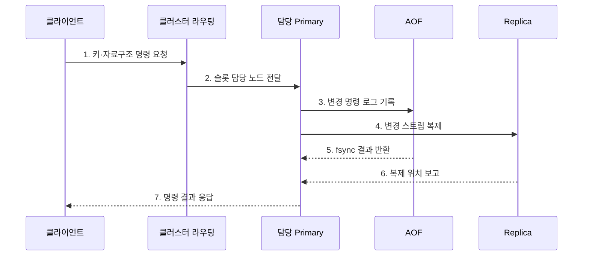

---
sidebar:
  order: 107
  label: "107. Redis 인메모리 DB (Redis In-Memory Database)"
  badge:
    text: "기출 · 50%"
    variant: note
title: "Redis 인메모리 DB (Redis In-Memory Database)"
date: "2026-07-27T23:59:59+09:00"
tags:
  - "notes-software"
weight: 107
extra:
  question_no: "107"
  source_status: "기출"
  source_history: "137회"
  priority: 50
  priority_note: "137회 기출, 인메모리 자료구조 활용성"
---

## 미리 알고가기

- **인메모리 DB(In-Memory Database)**: ‘인메모리 디비’로 읽으며, 주 데이터를 메모리에 저장해 낮은 지연을 제공함
- **TTL(Time To Live)**: ‘티티엘’로 읽고 영문 머리글자를 딴 약어이며, 키가 자동 삭제될 때까지의 시간을 지정함
- **RDB(Redis Database)**: ‘알디비’로 읽고 영문 머리글자를 딴 약어이며, Redis 상태를 시점별 스냅샷 파일로 저장함
- **AOF(Append Only File)**: ‘에이오에프’로 읽고 영문 머리글자를 딴 약어이며, 변경 명령을 순서대로 기록해 복구함
- **센티널 (Sentinel)**: 장애를 감지해 주 복제본을 승격함
- **Redis 클러스터 (Redis Cluster)**: 해시 슬롯으로 키를 분산함
- **제거 정책 (Eviction Policy)**: 메모리 부족 시 삭제할 키를 정함
- **원자 명령(Atomic Command)**: 다른 명령이 중간에 끼어들지 않은 것처럼 한 단위로 실행되는 명령임
- **영속성(Persistence)**: 메모리 값을 디스크 기록으로 남겨 재시작 뒤 복구할 수 있게 하는 성질임
- **해시 슬롯(Hash Slot)**: 키의 해시값을 기준으로 Redis 클러스터 노드에 분배하는 논리 구간임
- **핫키(Hot Key)**: 요청이 한 키에 과도하게 집중되어 담당 노드의 병목을 만드는 키임
- **캐시 스탬피드(Cache Stampede)**: 인기 키가 만료될 때 많은 요청이 동시에 원본 저장소로 몰리는 현상임
- **멤캐시드(Memcached)**: 단순 키값 객체를 메모리에 임시 저장하는 분산 캐시임

## Ⅰ. 개요

- 정의/개념: 자료구조를 **메모리에서 키 명령으로 처리**
- **배경/필요성**: 캐시·세션·카운터의 지연 단축

### 쉽게 이해하기 (학습용)
- 디스크 창고 대신 메모리 책상에서 다양한 자료형을 바로 계산하는 키값 저장소임

## Ⅱ. 특징

- **원자 명령**: 서버에서 자료구조를 직접 갱신
- **수명 관리**: TTL·제거 정책으로 메모리 통제
- **복구·분산**: RDB·AOF·복제·클러스터 제공

### 쉽게 이해하기 (학습용)
- 빠르지만 메모리 한도와 재시작 복구 및 주 노드 장애를 함께 설계해야 함

## Ⅲ. 구조 및 구성요소

| 구성요소 | 책임 |
|:---|:---|
| 키·자료구조 | 저장 단위·원자 명령 정의 |
| TTL·제거 정책 | 만료·메모리 제거 결정 |
| RDB·AOF | 스냅샷·명령 로그 복구 |
| 복제·Sentinel | 사본·감지·주 노드 승격 |
| Redis Cluster | 슬롯 분산·노드 라우팅 |

### 쉽게 이해하기 (학습용)

- 메모리 서랍과 만료표, 복구 기록, 사본, 슬롯 안내자로 구성된다.

## Ⅳ. 흐름도

**동작 원리**

- **1. 키·자료구조 명령 요청**: 연산을 보낸다.
- **2. 슬롯 담당 노드 전달**: 키 위치를 찾는다.
- **3. 변경 명령 로그 기록**: 복구 기록을 남긴다.
- **4. 변경 스트림 복제**: 사본에 전파한다.
- **5. fsync 결과 반환**: 디스크 진행을 확인한다.
- **6. 복제 위치 보고**: 사본 지연을 측정한다.
- **7. 명령 결과 응답**: 클라이언트에 반환한다.

### 쉽게 이해하기 (학습용)

- 키 담당 노드가 메모리 값을 바로 고치고 복구 로그와 사본에 변경을 남긴다.

## Ⅴ. 종류 및 비교

| 판단 기준 | Redis | Memcached |
|:---|:---|:---|
| 적용 기준 | 자료구조·복구 필요 | 재생성 가능한 단순 캐시 |
| 핵심 특징 | 원자 명령·영속성·복제 | 단순 키값·TTL |
| 한계 | 복구·복제·슬롯 운영 | 노드 변경 시 재분배 |

### 쉽게 이해하기 (학습용)

- 복구와 계산이 필요하면 Redis, 다시 만들 수 있는 단순 임시 값이면 Memcached를 검토한다.

## Ⅵ. 실무 고려사항 및 대책

| 고려사항 | 대책 | 효과 |
|:---|:---|:---|
| 데이터 성격 | 재생성 여부·RPO로 역할 분리 | 원본 손실 방지 |
| 메모리 | 한도·제거 정책·키 크기 감시 | OOM·중요 키 제거 방지 |
| 만료 | TTL 편차·요청 병합 적용 | 캐시 스탬피드 완화 |
| 핫키·빅키 | 키 분할·명령 시간 감시 | 단일 노드 지연 감소 |
| 영속성 | 독립 백업·복구 훈련 | RDB·AOF 손실 대응 |

> **적용 사례**: 인기 응답 캐시는 TTL에 무작위 편차를 주고 한 프로세스만 원본을 갱신하게 해 동시 만료 폭주를 줄인다.

### 쉽게 이해하기 (학습용)

- 키가 한꺼번에 사라지거나 하나의 큰 키에 요청이 몰리지 않도록 수명과 크기를 관리한다.

## Ⅶ. 결론

- **재생성 여부·RPO·메모리 한도**로 Redis 저장 정책을 정한다.

### 쉽게 이해하기 (학습용)

- 없어져도 다시 만들 수 있는 값인지부터 정해야 저장·복구 정책을 맞게 고를 수 있다.
