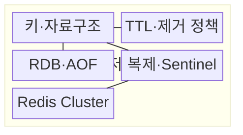
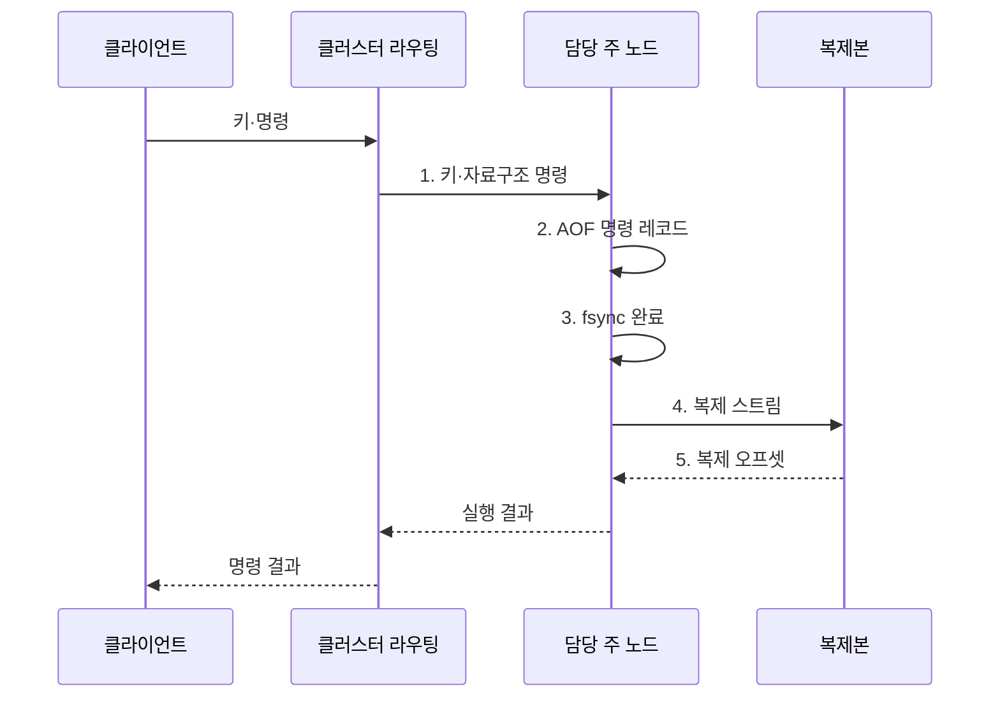

---
sidebar:
  order: 107
  label: "107. Redis 인메모리 DB (Redis In-Memory Database)"
  badge:
    text: "기출 · 50%"
    variant: note
title: "Redis 인메모리 DB (Redis In-Memory Database)"
date: "2026-08-02T12:00:00+09:00"
tags:
  - "notes-software"
weight: 107
extra:
  question_no: "107"
  source_status: "기출"
  source_history: "137회"
  priority: 50
  priority_note: "137회 기출, 인메모리 자료구조 활용성"
---

## Ⅰ. 개요

핵심 용어

- **Redis 인메모리 데이터 저장소(Redis In-Memory Data Store)**: 문자열·해시·목록·집합 같은 자료구조를 메모리에 저장하고 키 기반 명령으로 낮은 지연에 처리하는 저장소이다.

- 정의/개념: 문자열·해시·목록·집합 같은 자료구조를 키 기반 명령으로 메모리에서 처리하는 **Redis 인메모리 데이터 저장소(Redis In-Memory Data Store)**
- 배경/필요성: 디스크 중심 저장은 반복 조회·카운터 갱신의 **응답 지연** 증가

#### 한줄 요약
- 디스크 창고 대신 메모리 책상에서 다양한 자료형을 바로 계산하는 키값 저장소이다.

## Ⅱ. 특징

핵심 용어

- **원자 명령**: 다른 명령이 중간에 개입하지 않은 것처럼 자료구조 변경을 한 단위로 실행하는 특성이다.
- **키 유효 시간(Time To Live, TTL)·제거 정책**: 키의 만료 시점과 메모리 한도에서 제거할 대상을 정하는 수명 관리 기준이다.
- **Redis 데이터베이스 스냅샷(Redis Database Snapshot, RDB)·추가 전용 파일(Append Only File, AOF)**: 메모리 상태를 주기적 스냅샷이나 변경 명령 로그로 영속화하는 복구 방식이다.

- **원자 명령**: 서버에서 자료구조를 직접 갱신
- **수명 관리**: 키 유효 시간(Time To Live, TTL)·제거 정책으로 메모리 통제
- **복구·분산**: Redis 데이터베이스 스냅샷(Redis Database Snapshot, RDB)·추가 전용 파일(Append Only File, AOF)·복제·클러스터 제공

#### 한줄 요약
- 빠르지만 메모리 한도와 재시작 복구 및 주 노드 장애를 함께 설계해야 한다.

## Ⅲ. 구조 및 구성요소

핵심 용어

- **Redis 데이터베이스 스냅샷(Redis Database Snapshot, RDB)·추가 전용 파일(Append Only File, AOF)**: 스냅샷과 명령 로그로 메모리 상태를 재시작 뒤 복구하는 구성요소이다.
- **키 유효 시간(Time To Live, TTL)·제거 정책**: 키 만료와 메모리 부족 시 삭제 대상을 결정하는 구성요소이다.
- **Sentinel**: Redis 주 노드와 복제본을 감시하고 장애 시 새 주 노드 선출을 조정하는 구성요소이다.
- **Redis Cluster**: 키를 해시 슬롯에 배정하고 여러 노드로 분산 라우팅하는 클러스터 방식이다.

| 구성요소 | 책임 |
|:---|:---|
| 키·자료구조 | 저장 단위와 **원자 명령** 정의 |
| 키 유효 시간(Time To Live, TTL)·제거 정책 | **키 만료·메모리 제거** 결정 |
| Redis 데이터베이스 스냅샷(Redis Database Snapshot, RDB)·추가 전용 파일(Append Only File, AOF) | **스냅샷·명령 로그** 기반 복구 |
| 복제·Sentinel | **복제본·장애 전환** 관리 |
| Redis Cluster | **해시 슬롯·노드 라우팅** 관리 |

#### 한줄 요약

- 메모리 서랍과 만료표, 복구 기록, 사본, 슬롯 안내자로 구성된다.

## Ⅳ. 흐름도

핵심 용어

- **2. 추가 전용 파일(Append Only File, AOF) 명령 레코드**: 변경 명령을 재실행 가능한 형태로 순서대로 로그에 추가하는 단계이다.
- **1. 키·자료구조 명령**: 키의 해시 슬롯으로 담당 주 노드를 찾고 원자 연산을 전달하는 단계이다.
- **3. 파일 동기화(File Synchronization, fsync) 결과**: 설정한 동기화 정책에 따라 로그가 디스크에 기록됐는지 확인한 상태이다.
- **4. 복제 스트림**: 주 노드의 변경 명령과 순서를 복제본에 전달하는 흐름이다.
- **5. 복제 오프셋**: 복제본이 반영한 마지막 변경 위치를 나타내는 값이다.

**동작 원리**

1. **키·자료구조 명령**: 해시 슬롯으로 주 노드를 찾아 원자 연산 전달
2. **추가 전용 파일(Append Only File, AOF) 명령 레코드**: 재실행 가능한 변경 명령을 로그에 추가
3. **파일 동기화(File Synchronization, fsync) 결과**: 설정된 동기화 정책에 따른 디스크 기록 상태 확인
4. **복제 스트림**: 주 노드의 변경 순서를 복제본에 전달
5. **복제 오프셋**: 복제본이 반영한 변경 위치로 복제 상태 판정

#### 한줄 요약

- 키 담당 노드가 메모리 값을 바로 고치고 복구 로그와 사본에 변경을 남긴다.

## Ⅴ. 종류 및 비교

핵심 용어

- **Redis**: 자료구조 연산과 영속성 및 복제가 필요한 인메모리 캐시에 적합한 저장소이다.
- **Memcached**: 재생성 가능한 단순 키값 객체를 여러 노드의 메모리에 분산 저장하는 캐시이다.
- **키 유효 시간(Time To Live, TTL)**: 캐시 항목이 자동 만료되기까지 남은 생존 시간이다.

| 인메모리 캐시 | Redis | Memcached |
|:---|:---|:---|
| 적용 기준 | **자료구조 연산·복구** 필요 | 재생성 가능한 **단순 객체 캐시** |
| 핵심 특징 | **원자 명령·영속성·복제** | 단순 **키값·키 유효 시간(Time To Live, TTL)** |
| 한계 | **복구·복제·슬롯** 운영 복잡성 | 노드 변경 시 **키 재분배** |

#### 한줄 요약

- 복구와 계산이 필요하면 Redis, 다시 만들 수 있는 단순 임시 값이면 Memcached를 검토한다.

## Ⅵ. 실무 고려사항 및 대책

핵심 용어

- **복구 시점 목표(Recovery Point Objective, RPO)별 저장 역할**: 허용 데이터 손실량과 재생성 가능성에 따라 캐시·원본 역할을 나누는 기준이다.
- **메모리 한도·제거 정책**: 메모리 부족(Out Of Memory, OOM)을 막고 중요 키를 보호하도록 최대 사용량과 퇴출 방식을 정하는 통제이다.
- **키 유효 시간(Time To Live, TTL) 편차·요청 병합**: 인기 키의 만료 시점을 분산하고 동시에 들어온 원본 조회를 하나로 합쳐 캐시 스탬피드를 줄이는 방식이다.
- **키 분할·명령 시간 감시**: 핫키·빅키를 여러 키로 나누고 장시간 명령을 관찰해 단일 노드 지연을 줄이는 활동이다.
- **Redis 데이터베이스 스냅샷(Redis Database Snapshot, RDB)·추가 전용 파일(Append Only File, AOF) 독립 백업·복구 훈련**: 영속성 파일 손상에 대비해 별도 사본을 만들고 실제 복원을 검증하는 활동이다.

| 문제 | 대책 | 효과 |
|:---|:---|:---|
| 원본 데이터를 Redis에만 두면 장애 시 복구 시점 목표 초과 | 재생성 여부·**복구 시점 목표(Recovery Point Objective, RPO)별 저장 역할** 분리 | **원본 데이터 손실** 방지 |
| 메모리 한도 도달 시 메모리 부족(Out Of Memory, OOM)이나 중요 키 제거 발생 | **메모리 한도·제거 정책** 설정 | **메모리 부족·중요 키 제거** 방지 |
| 인기 키의 동일 키 유효 시간은 원본 요청을 동시에 유발 | **키 유효 시간(Time To Live, TTL) 편차·요청 병합** 적용 | **캐시 스탬피드** 완화 |
| 핫키·빅키는 담당 노드의 단일 스레드 지연 유발 | **키 분할·명령 시간** 감시 | **단일 노드 지연** 감소 |
| Redis 데이터베이스 스냅샷·추가 전용 파일만 의존하면 파일 손상 시 복구 불가 | **독립 백업·복구 훈련** | **영속성 파일 손실** 대응 |

#### 한줄 요약

- 키가 한꺼번에 사라지거나 하나의 큰 키에 요청이 몰리지 않도록 수명과 크기를 관리한다.

## Ⅶ. 결론

핵심 용어

- **추가 전용 파일(Append Only File, AOF)·복제·백업**: 낮은 복구 시점 목표(Recovery Point Objective, RPO)가 필요한 데이터에 적용해 장애 시 손실과 복구 위험을 낮추는 수단이다.

- 재생성 가능 값만 **캐시** 사용, 낮은 복구 시점 목표(Recovery Point Objective, RPO)에는 **추가 전용 파일(Append Only File, AOF)·복제·백업** 적용

#### 한줄 요약

- 없어져도 다시 만들 수 있는 값인지부터 정해야 저장·복구 정책을 맞게 고를 수 있다.
