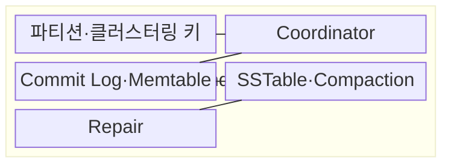
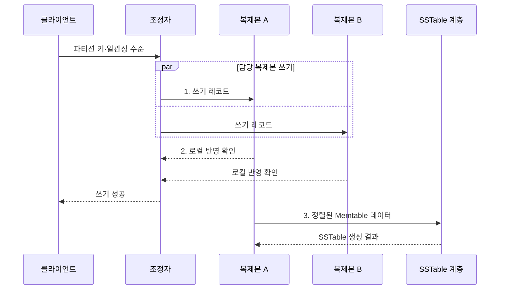

---
sidebar:
  order: 108
  label: "108. Cassandra 컬럼 패밀리 DB (Cassandra Column Family)"
  badge:
    text: "기출 · 30%"
    variant: note
title: "Cassandra 컬럼 패밀리 DB (Cassandra Column Family)"
date: "2026-07-30T23:46:37+09:00"
tags:
  - "notes-software"
weight: 108
extra:
  question_no: "108"
  source_status: "기출"
  source_history: "137회"
  priority: 30
  priority_note: "137회 기출, 컬럼 패밀리 제품 사례 성격"
---

## 미리 알고가기

- **아파치 카산드라(Apache Cassandra)**: 고정 주 노드 없이 파티션 키로 행을 분산하는 와이드 컬럼 데이터베이스
- **와이드 컬럼 데이터베이스(Wide-column Database)**: 행 키 아래 필요한 열만 가변적으로 저장하는 분산 데이터 모델
- **피어 투 피어(Peer-to-Peer)**: 고정 주 노드 없이 동등한 노드가 요청 조정과 데이터 보관을 나눠 맡는 구조
- **로그 구조 병합 트리(Log-Structured Merge-Tree, LSM Tree)**: 메모리 쓰기를 불변 파일로 내리고 파일을 주기적으로 병합하는 저장 구조
- **파티션 키(Partition Key)**: 데이터의 토큰 범위와 담당 복제본을 결정하는 키
- **클러스터링 키(Clustering Key)**: 한 파티션 안의 행 정렬 순서를 결정하는 키
- **복제 계수(Replication Factor, RF)**: 각 파티션을 보관하는 전체 복제본 수
- **읽기·쓰기 확인 수($R$, $W$)**: Read·Write의 첫 글자로 읽기·쓰기 성공에 필요한 복제본 응답 수를 나타내는 기호
- **쓰기 전 로그(Commit Log)**: 변경 내용을 디스크에 먼저 기록해 장애 뒤 복구하는 로그
- **메모리 테이블(Memtable)**: 쓰기를 메모리에 키순으로 누적하는 자료구조
- **정렬 문자열 테이블 (Sorted String Table, SSTable)**: 키순 정렬된 불변 파일이다.
- **컴팩션(Compaction)**: 여러 SSTable을 병합해 중복 버전과 삭제 표식을 정리하는 작업
- **삭제 표식(Tombstone)**: 삭제·만료 사실을 복제본과 SSTable에 전파하는 표식
- **조정자(Coordinator)**: 클라이언트 요청을 받아 담당 복제본에 전달하고 응답을 모으는 노드이다.
- **토큰(Token)**: 파티션 키의 해시 범위를 노드와 연결하는 논리 위치값이다.
- **일관성 수준(Consistency Level)**: 읽기나 쓰기 성공에 필요한 복제본 응답 범위를 정하는 설정이다.
- **수선(Repair)**: 복제본의 데이터를 비교해 누락되거나 다른 값을 다시 맞추는 작업이다.
- **비정규화(Denormalization)**: 핵심 조회를 직접 처리하려고 같은 데이터를 여러 조회 구조에 중복 저장하는 설계이다.
- **일관성 수준 ONE·QUORUM·ALL**: 각각 하나·과반·전체 복제본 응답을 요구하는 Cassandra 설정

> **키워드:** Cassandra 컬럼 패밀리 DB (Cassandra Column Family)

## Ⅰ. 개요

- 정의/개념: 파티션 키로 행을 피어 노드에 분산하는 **와이드 컬럼 DB**
- 배경/필요성: 단일 주 노드 구조는 쓰기 집중·장애 전환 중 **처리 중단** 발생

### 쉽게 이해하기 (학습용)
- 조회할 묶음을 정해 균등 분산하고 시간순으로 쌓는 저장소이다.

## Ⅱ. 특징

- 모든 피어 노드가 요청을 조정하는 **무주 노드 구조**
- 조회별 파티션·정렬 키를 먼저 정하는 **질의 중심 모델링**
- 연산마다 복제본 응답 수를 고르는 **조정 가능 일관성**

### 쉽게 이해하기 (학습용)
- 쓰기와 장애 내성은 높지만 파티션 키를 벗어난 조회에는 부적합하다.

## Ⅲ. 구조 및 구성요소

| 구성요소 | 책임 |
|:---|:---|
| 파티션·클러스터링 키 | **복제본 위치·파티션 내부 정렬** 결정 |
| Coordinator | **요청 전달·응답 수** 집계 |
| Commit Log·Memtable | **내구 로그·메모리 쓰기** 누적 |
| SSTable·Compaction | **불변 파일 저장·병합** |
| Repair | 복제본의 **누락·불일치 데이터** 복구 |

### 쉽게 이해하기 (학습용)

- 배치 키, 접수자, 쓰기 기록, 정렬 파일, 사본 수선으로 구성된다.

## Ⅳ. 흐름도

**동작 원리**

1. **쓰기 레코드**: 토큰 범위의 담당 복제본에 변경 병렬 전달
2. **로컬 반영 확인**: Commit Log·Memtable 기록 완료를 조정자에 통지
3. **정렬된 Memtable 데이터**: 메모리 한도 도달 시 불변 SSTable 생성

### 쉽게 이해하기 (학습용)

- 모든 담당 사본에 쓰기를 보내되 몇 곳의 확인을 기다릴지는 요청마다 정한다.

## Ⅴ. 종류 및 비교

| Cassandra 일관성 수준 | ONE | QUORUM | ALL |
|:---|:---|:---|
| 적용 기준 | **낮은 지연·높은 가용성** 우선 | **최신성·가용성 절충** | 모든 사본의 **강한 확인** 필요 |
| 핵심 특징 | **한 복제본 응답** | **과반 복제본 응답** | **전체 복제본 응답** |
| 한계 | **오래된 읽기** 가능 | **지연 증가·장애 허용 감소** | 한 노드 장애에도 **연산 실패** |

> 요약: $R+W>RF$와 함께 **타임스탬프·복제본 상태** 검증

### 쉽게 이해하기 (학습용)

- 적게 기다리면 빠르고 잘 버티며, 많이 기다리면 최신 확인 범위가 넓어진다.

## Ⅵ. 실무 고려사항 및 대책

| 고려사항 | 대책 | 효과 |
|:---|:---|:---|
| 파티션 키 없는 질의는 전체 노드 탐색 유발 | 질의별 **테이블·키 선설계** | **전체 노드 탐색** 방지 |
| 무한 시계열 파티션은 읽기·컴팩션 비용 증가 | **시간 버킷·행 수 상한** 적용 | **대형 파티션** 방지 |
| 낮은 분산도의 파티션 키는 특정 노드에 부하 집중 | 실제 분포로 **파티션 키 검증** | **핫 파티션** 완화 |
| 삭제 표식 누적은 읽기 때 검사할 파일·행 증가 | **보존·컴팩션·수선 주기** 조정 | **삭제 표식 읽기 지연** 감소 |
| 컴팩션 백로그는 임시 디스크 공간을 고갈시킬 위험 | **여유 공간·백로그** 감시 | **디스크 고갈** 방지 |

### 쉽게 이해하기 (학습용)

- 장치와 날짜로 서랍을 나누면 한 서랍이 끝없이 커지지 않고 시간순으로 읽을 수 있다.

## Ⅶ. 결론

- 조회 범위로 **파티션·클러스터링 키**, 장애 허용치로 **일관성 수준** 결정

### 쉽게 이해하기 (학습용)

- 데이터를 잘 나누는 키와 파일·사본 정리 없이는 빠른 쓰기도 오래 유지되지 않는다.
