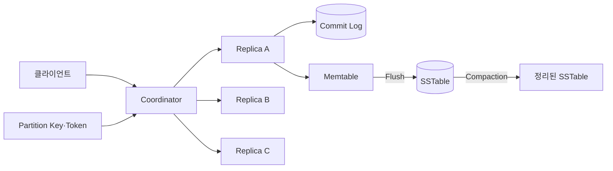
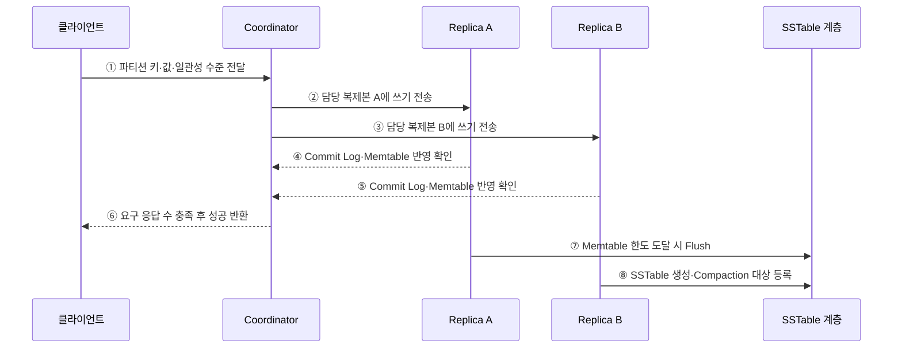

---
sidebar:
  order: 108
  label: "108. Cassandra 컬럼 패밀리 DB (Cassandra Column Family)"
  badge:
    text: "기출 · 30%"
    variant: note
title: "Cassandra 컬럼 패밀리 DB (Cassandra Column Family)"
date: "2026-07-27T23:59:59+09:00"
tags:
  - "notes-software"
weight: 108
extra:
  question_no: "108"
  source_status: "기출"
  source_history: "137회"
  priority: 30
  priority_note: "137회 기출, 컬럼 패밀리 제품 사례 성격"
---

## 미리 알고가기

- **DB(Database)**: ‘디비’로 읽고 영문 머리글자를 딴 약어이며, 데이터를 구조화해 저장·관리하는 시스템임
- **NoSQL(Not Only SQL)**: ‘노에스큐엘’로 읽고 영문 핵심 글자를 조합한 표기이며, 관계형 표 이외의 데이터 모델을 지원함
- **SQL(Structured Query Language)**: ‘에스큐엘’로 읽고 영문 머리글자를 딴 약어이며, 관계형 데이터 질의를 표현함
- **ACID(Atomicity, Consistency, Isolation, Durability)**: ‘애시드’로 읽고 네 속성의 영문 머리글자를 딴 약어이며, 트랜잭션 정확성을 보장함
- **LSM 트리(Log-Structured Merge-Tree)**: ‘엘에스엠 트리’로 읽고 영문 핵심 글자를 딴 약어이며, 메모리 쓰기를 불변 파일로 내려 병합함
- **파티션 키 (Partition Key)**: 데이터의 담당 복제본을 결정함
- **클러스터링 키 (Clustering Key)**: 파티션 내부 정렬 순서를 정함
- **복제 계수·읽기·쓰기 확인 수 N·R·W(엔·알·더블유, Number of Replicas·Read acknowledgements·Write acknowledgements)**: 각 영어 표현의 첫 글자를 써서 전체 사본 수와 읽기·쓰기 완료에 필요한 응답 수를 나타내며 일관성 수준을 정함
- **쓰기 전 로그 (Commit Log)**: 변경 내용을 디스크에 먼저 기록함
- **메모리 테이블 (Memtable)**: 쓰기를 메모리에 정렬 저장함
- **정렬 문자열 테이블 (Sorted String Table, SSTable)**: 키순 정렬된 불변 파일임
- **컴팩션 (Compaction)**: 여러 SSTable을 병합·정리함
- **삭제 표식 (Tombstone)**: 삭제·만료 사실을 복제본에 전파함
- **단일 장애점 (Single Point of Failure, SPOF)**: 한 지점 장애가 전체를 중단시킴
- **99백분위 지연 (99th Percentile Latency, p99)**: 요청 99%가 완료되는 지연 기준임
- **사물 인터넷 (Internet of Things, IoT)**: 사물이 망으로 데이터를 교환함
- **아파치 카산드라(Apache Cassandra)**: 고정 주 노드 없이 여러 노드에 데이터를 분산하는 와이드 컬럼 데이터베이스임
- **조정자(Coordinator)**: 클라이언트 요청을 받아 담당 복제본에 전달하고 응답을 모으는 노드임
- **토큰(Token)**: 파티션 키의 해시 범위를 노드와 연결하는 논리 위치값임
- **일관성 수준(Consistency Level)**: 읽기나 쓰기 성공에 필요한 복제본 응답 범위를 정하는 설정임
- **수선(Repair)**: 복제본의 데이터를 비교해 누락되거나 다른 값을 다시 맞추는 작업임
- **비정규화(Denormalization)**: 핵심 조회를 직접 처리하려고 같은 데이터를 여러 조회 구조에 중복 저장하는 설계임

## Ⅰ. 개요

- Apache Cassandra는 파티션 키로 데이터를 여러 노드에 분산·복제하는 주 노드 없는 와이드 컬럼 데이터베이스이다.
- 조회별 비정규화 테이블과 LSM 쓰기 경로로 대규모 분산 쓰기를 처리하지만 파티션 경계를 벗어난 질의와 운영 정리는 비용이 크다.

### 쉽게 이해하기 (학습용)
- 조회할 묶음을 정해 균등 분산하고 시간순으로 쌓는 저장소임

## Ⅱ. 특징

- **주 노드 없음**: 어느 노드도 요청 조정자가 되어 담당 복제본에 전달할 수 있다.
- **질의 중심 모델링**: 질의마다 파티션 키와 클러스터링 순서에 맞춘 테이블을 설계한다.
- **LSM 쓰기 경로**: Commit Log·Memtable 후 SSTable로 Flush하고 Compaction한다.
- **조정 가능한 일관성**: 연산별 Consistency Level로 기다릴 복제본 응답 범위를 정한다.

### 쉽게 이해하기 (학습용)
- 쓰기와 장애 내성은 좋으나 파티션 키를 벗어난 조회에는 부적합함

## Ⅲ. 아키텍처 및 구성요소

**도표안 A — 구조도**

**도표안 B — sequenceDiagram**

| 구성요소 | 역할 |
|:---|:---|
| 파티션 키·Token | 행의 담당 복제본과 데이터 분포 결정 |
| 클러스터링 키 | 파티션 내부 행의 정렬·범위 조회 순서 결정 |
| Coordinator | 요청 라우팅과 일관성 수준의 응답 수 집계 |
| Commit Log·Memtable | 쓰기 내구성과 메모리 정렬 누적 |
| SSTable·Compaction | 불변 파일 저장과 버전·삭제 표식 정리 |
| Repair | 복제본 차이를 비교해 누락·불일치 복구 |

**동작 원리**

- ① 클라이언트가 파티션 키·값·쓰기 일관성 수준을 Coordinator에 전달한다.
- ② Coordinator가 토큰과 복제 전략으로 찾은 Replica A에 쓰기를 보낸다.
- ③ 일관성 수준과 관계없이 다른 담당 복제본에도 쓰기를 보낸다.
- ④ Replica A가 Commit Log와 Memtable 반영을 확인한다.
- ⑤ Replica B도 로컬 쓰기 반영 결과를 Coordinator에 반환한다.
- ⑥ Coordinator는 설정된 일관성 수준의 응답 수가 모이면 성공을 반환한다.
- ⑦ Memtable이 한도에 도달하면 내용을 SSTable로 비동기 Flush한다.
- ⑧ 생성된 SSTable은 이후 Compaction 대상이 되어 버전과 삭제 표식을 정리한다.

### 쉽게 이해하기 (학습용)

- 모든 담당 사본에 쓰기를 보내되 몇 곳의 확인을 기다릴지는 요청마다 정한다.

## Ⅳ. 종류 및 비교

| 일관성 수준 | 성공 조건 | 장점 | 위험 |
|:---|:---|:---|
| ONE / LOCAL_ONE | 한 복제본 응답 | 낮은 지연·높은 가용성 | 오래된 읽기 가능성 |
| QUORUM | 전체 복제본 과반 응답 | 읽기·쓰기 정족수 교차 | 지연·장애 허용 범위 감소 |
| LOCAL_QUORUM | 지역 데이터센터 과반 응답 | 다지역 왕복 없이 지역 정족수 | 지역 간 최신성 차이 |
| ALL | 모든 복제본 응답 | 가장 넓은 확인 범위 | 한 복제본 장애에도 실패 |

> 일반적으로 읽기 응답 수 R과 쓰기 응답 수 W가 복제 계수 RF보다 크면 두 집합이 겹치지만, 타임스탬프·충돌·운영 상태까지 포함한 보장을 별도로 검증해야 한다.

### 쉽게 이해하기 (학습용)

- 적게 기다리면 빠르고 잘 버티며, 많이 기다리면 최신 확인 범위가 넓어진다.

## Ⅴ. 실무 고려사항 및 대책

| 고려사항 | 위험 | 대책 |
|:---|:---|:---|
| 질의 모델 | 파티션 키 없는 조회·ALLOW FILTERING 남용 | 질의별 테이블과 키를 먼저 설계 |
| 파티션 크기 | 무한 시계열 파티션·긴 GC | 시간 버킷을 포함해 크기·행 수 제한 |
| 데이터 편중 | 특정 장치·임차인 핫 파티션 | 실제 분포로 키 조합·버킷 수 검증 |
| Tombstone | TTL·삭제 누적으로 읽기 지연 | 보존 기간·gc_grace·Compaction·Repair 조정 |
| Compaction | 쓰기 증폭·디스크 고갈 | 워크로드별 전략과 여유 공간·백로그 감시 |
| Repair | 장기 미수선으로 사본 불일치 | 복구 허용 기간 안의 정기 Repair 운영 |

> **적용 사례**: 센서 시계열은 `(device_id, day)`를 파티션 키로 두고 측정시각을 클러스터링 키로 정렬해 장치·일자 범위 조회를 한 파티션에서 처리한다.

### 쉽게 이해하기 (학습용)

- 장치와 날짜로 서랍을 나누면 한 서랍이 끝없이 커지지 않고 시간순으로 읽을 수 있다.

## Ⅵ. 결론

- Cassandra의 성능은 조회 패턴에 맞는 파티션·클러스터링 키와 LSM 운영에 달려 있다.
- 일관성 수준·파티션 크기·Tombstone·Compaction·Repair를 함께 설계해 분산 쓰기 이점을 유지해야 한다.

### 쉽게 이해하기 (학습용)

- 데이터를 잘 나누는 키와 파일·사본 정리 없이는 빠른 쓰기도 오래 유지되지 않는다.
