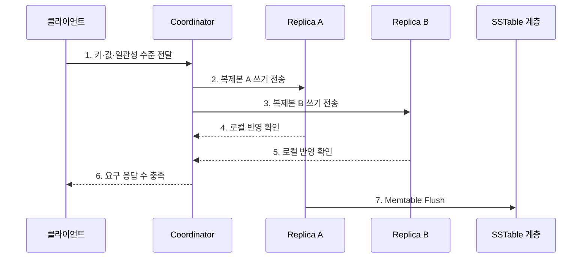

---
sidebar:
  order: 108
  label: "108. Cassandra 컬럼 패밀리 DB (Cassandra Column Family)"
  badge:
    text: "기출 · 30%"
    variant: note
title: "Cassandra 컬럼 패밀리 DB (Cassandra Column Family)"
date: "2026-07-27T23:59:59+09:00"
tags:
  - "notes-software"
weight: 108
extra:
  question_no: "108"
  source_status: "기출"
  source_history: "137회"
  priority: 30
  priority_note: "137회 기출, 컬럼 패밀리 제품 사례 성격"
---

## 미리 알고가기

- **DB(Database)**: ‘디비’로 읽고 영문 머리글자를 딴 약어이며, 데이터를 구조화해 저장·관리하는 시스템이다.
- **NoSQL(Not Only SQL)**: ‘노에스큐엘’로 읽고 영문 핵심 글자를 조합한 표기이며, 관계형 표 이외의 데이터 모델을 지원한다.
- **SQL(Structured Query Language)**: ‘에스큐엘’로 읽고 영문 머리글자를 딴 약어이며, 관계형 데이터 질의를 표현한다.
- **ACID(Atomicity, Consistency, Isolation, Durability)**: ‘애시드’로 읽고 네 속성의 영문 머리글자를 딴 약어이며, 트랜잭션 정확성을 보장한다.
- **LSM 트리(Log-Structured Merge-Tree)**: ‘엘에스엠 트리’로 읽고 영문 핵심 글자를 딴 약어이며, 메모리 쓰기를 불변 파일로 내려 병합한다.
- **파티션 키 (Partition Key)**: 데이터의 담당 복제본을 결정한다.
- **클러스터링 키 (Clustering Key)**: 파티션 내부 정렬 순서를 정한다.
- **복제 계수·읽기·쓰기 확인 수 N·R·W(엔·알·더블유, Number of Replicas·Read acknowledgements·Write acknowledgements)**: 각 영어 표현의 첫 글자를 써서 전체 사본 수와 읽기·쓰기 완료에 필요한 응답 수를 나타내며 일관성 수준을 정한다.
- **쓰기 전 로그 (Commit Log)**: 변경 내용을 디스크에 먼저 기록한다.
- **메모리 테이블 (Memtable)**: 쓰기를 메모리에 정렬 저장한다.
- **정렬 문자열 테이블 (Sorted String Table, SSTable)**: 키순 정렬된 불변 파일이다.
- **컴팩션 (Compaction)**: 여러 SSTable을 병합·정리한다.
- **삭제 표식 (Tombstone)**: 삭제·만료 사실을 복제본에 전파한다.
- **단일 장애점 (Single Point of Failure, SPOF)**: 한 지점 장애가 전체를 중단시킴
- **99백분위 지연 (99th Percentile Latency, p99)**: 요청 99%가 완료되는 지연 기준이다.
- **사물 인터넷 (Internet of Things, IoT)**: 사물이 망으로 데이터를 교환한다.
- **아파치 카산드라(Apache Cassandra)**: 고정 주 노드 없이 여러 노드에 데이터를 분산하는 와이드 컬럼 데이터베이스이다.
- **조정자(Coordinator)**: 클라이언트 요청을 받아 담당 복제본에 전달하고 응답을 모으는 노드이다.
- **토큰(Token)**: 파티션 키의 해시 범위를 노드와 연결하는 논리 위치값이다.
- **일관성 수준(Consistency Level)**: 읽기나 쓰기 성공에 필요한 복제본 응답 범위를 정하는 설정이다.
- **수선(Repair)**: 복제본의 데이터를 비교해 누락되거나 다른 값을 다시 맞추는 작업이다.
- **비정규화(Denormalization)**: 핵심 조회를 직접 처리하려고 같은 데이터를 여러 조회 구조에 중복 저장하는 설계이다.

## Ⅰ. 개요

- 정의/개념: 파티션 키로 데이터를 무주 노드에 분산하는 **열 계열 DB**
- 배경/필요성: 대규모 쓰기와 장애 중 가용성 확보

### 쉽게 이해하기 (학습용)
- 조회할 묶음을 정해 균등 분산하고 시간순으로 쌓는 저장소임

## Ⅱ. 특징

- **무주 노드**: 모든 노드가 요청 조정 가능
- **질의 중심**: 조회별 파티션·정렬 키 설계
- **조정 일관성**: 연산별 응답 복제본 수 선택

### 쉽게 이해하기 (학습용)
- 쓰기와 장애 내성은 좋으나 파티션 키를 벗어난 조회에는 부적합함

## Ⅲ. 구조 및 구성요소

| 구성요소 | 책임 |
|:---|:---|
| 파티션·클러스터링 키 | 복제본·내부 정렬 결정 |
| Coordinator | 요청 전달·응답 수 집계 |
| Commit Log·Memtable | 내구 기록·메모리 누적 |
| SSTable·Compaction | 불변 파일 저장·정리 |
| Repair | 복제본 차이 복구 |

### 쉽게 이해하기 (학습용)

- 배치 키, 접수자, 쓰기 기록, 정렬 파일, 사본 수선으로 구성된다.

## Ⅳ. 흐름도

**동작 원리**

- **1. 키·값·일관성 수준 전달**: 쓰기 조건을 전달
- **2. 복제본 A 쓰기 전송**: 첫 담당 노드에 요청
- **3. 복제본 B 쓰기 전송**: 다른 사본에도 요청
- **4. 로컬 반영 확인**: 로그·메모리에 기록
- **5. 로컬 반영 확인**: 두 번째 결과를 전달
- **6. 요구 응답 수 충족**: 성공을 반환
- **7. Memtable Flush**: 불변 파일로 결정

### 쉽게 이해하기 (학습용)

- 모든 담당 사본에 쓰기를 보내되 몇 곳의 확인을 기다릴지는 요청마다 정한다.

## Ⅴ. 종류 및 비교

| 판단 기준 | ONE | QUORUM | ALL |
|:---|:---|:---|
| 적용 기준 | 낮은 지연·가용성 | 최신성·가용성 절충 | 모든 사본 확인 |
| 핵심 특징 | 한 복제본 응답 | 과반 복제본 응답 | 전체 복제본 응답 |
| 한계 | 오래된 읽기 가능 | 지연·장애 허용 감소 | 한 노드 장애에도 실패 |

> 일반적으로 읽기 응답 수 R과 쓰기 응답 수 W가 복제 계수 RF보다 크면 두 집합이 겹치지만, 타임스탬프·충돌·운영 상태까지 포함한 보장을 별도로 검증해야 한다.

### 쉽게 이해하기 (학습용)

- 적게 기다리면 빠르고 잘 버티며, 많이 기다리면 최신 확인 범위가 넓어진다.

## Ⅵ. 실무 고려사항 및 대책

| 고려사항 | 대책 | 효과 |
|:---|:---|:---|
| 질의 모델 | 질의별 테이블·키 선설계 | 전체 노드 탐색 방지 |
| 파티션 크기 | 시간 버킷·행 수 제한 | 대형 파티션 방지 |
| 데이터 편중 | 실제 분포로 키 검증 | 핫 파티션 완화 |
| Tombstone | 보존·정리·수선 주기 조정 | 읽기 지연 감소 |
| Compaction | 여유 공간·백로그 감시 | 디스크 고갈 방지 |

> **적용 사례**: 센서 시계열은 `(device_id, day)`를 파티션 키로 두고 측정시각을 클러스터링 키로 정렬해 장치·일자 범위 조회를 한 파티션에서 처리

### 쉽게 이해하기 (학습용)

- 장치와 날짜로 서랍을 나누면 한 서랍이 끝없이 커지지 않고 시간순으로 읽을 수 있다.

## Ⅶ. 결론

- **조회 패턴·파티션 크기·응답 수**로 Cassandra 키와 일관성을 결정

### 쉽게 이해하기 (학습용)

- 데이터를 잘 나누는 키와 파일·사본 정리 없이는 빠른 쓰기도 오래 유지되지 않는다.
