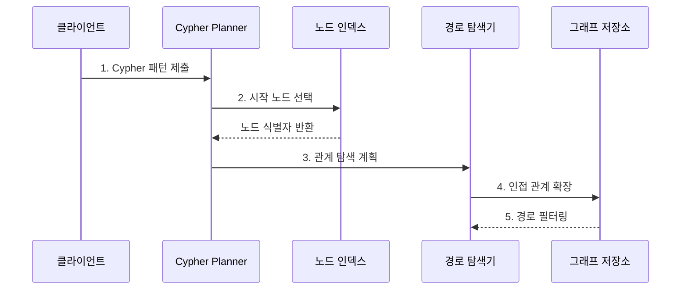

---
sidebar:
  order: 109
  label: "109. Neo4j 그래프 DB (Neo4j Graph Database)"
  badge:
    text: "기출 · 70%"
    variant: note
title: "Neo4j 그래프 DB (Neo4j Graph Database)"
date: "2026-07-27T23:59:59+09:00"
tags:
  - "notes-software"
weight: 109
extra:
  question_no: "109"
  source_status: "기출"
  source_history: "137회, 138회"
  priority: 70
  priority_note: "137·138회 연속, 그래프 탐색 적용성 높음"
---

## 미리 알고가기

- **그래프 DB(Graph Database)**: ‘그래프 디비’로 읽으며, 개체와 연결 관계를 노드·관계로 직접 저장한다.
- **노드 (Node)**: 그래프의 개체를 표현한다.
- **관계 (Relationship)**: 노드 사이의 방향 연결을 표현한다.
- **속성 (Property)**: 노드·관계의 값을 저장한다.
- **속성 그래프 (Property Graph)**: 노드·관계에 레이블·속성을 부여한다.
- **사이퍼 (Cypher)**: 그래프 패턴과 경로를 선언한다.
- **p95(95th Percentile Latency)**: ‘피 구십오’로 읽으며, p는 백분위 표기이고 95는 요청 95%가 완료되는 지연 경계를 뜻한다.
- **네오포제이(Neo4j)**: 속성 그래프 모델과 Cypher 질의를 제공하는 그래프 데이터베이스이다.
- **레이블(Label)**: 노드를 같은 역할이나 유형의 집합으로 분류하는 이름이다.
- **인접 관계(Adjacency)**: 한 노드에 직접 연결된 관계와 이웃 노드의 집합이다.
- **가변 길이 경로(Variable-length Path)**: 관계를 몇 단계 거칠지 범위로 지정해 탐색하는 경로이다.
- **분기 계수(Branching Factor)**: 한 노드에서 다음 단계로 확장되는 평균 관계 수이다.
- **경로 폭발(Path Explosion)**: 분기 계수와 깊이가 커져 후보 경로 수가 급격히 증가하는 현상이다.

## Ⅰ. 개요

- 정의/개념: 노드·관계를 속성 그래프로 저장하는 **그래프 DB**
- 배경/필요성: 다단계 관계의 반복 조인 축소

### 쉽게 이해하기 (학습용)
- 연결선을 저장해 친구의 친구를 선 따라 찾는 데이터베이스임

## Ⅱ. 특징

- **속성 그래프**: 노드·관계에 업무 의미 부여
- **패턴 질의**: 방향·유형·경로 길이 선언
- **경로 통제**: 시작점·분기·깊이 제한 필요

### 쉽게 이해하기 (학습용)
- 탐색은 자연스럽지만 시작점과 깊이를 제한해야 범위가 폭발하지 않음

## Ⅲ. 구조 및 구성요소

| 구성요소 | 책임 |
|:---|:---|
| 노드·레이블 | 개체·유형 표현 |
| 관계·방향·유형 | 연결 의미·탐색 방향 표현 |
| 속성 | 상태·시간·가중치 저장 |
| 인덱스·제약 | 시작 노드 탐색·유일성 보장 |
| Cypher 실행기 | 패턴 계획·확장·필터 실행 |

### 쉽게 이해하기 (학습용)

- 개체, 연결선, 부가값, 출발점 색인, 탐색 담당자로 구성된다.

## Ⅳ. 흐름도

**동작 원리**

- **1. Cypher 패턴 제출**: 노드·관계·조건·깊이 표현
- **2. 시작 노드 선택**: 인덱스로 탐색 출발 집합 축소
- **3. 관계 탐색 계획**: 유형·방향·깊이의 확장 순서 결정
- **4. 인접 관계 확장**: 포인터 인접성으로 이웃 순회
- **5. 경로 필터링**: 조건에 맞는 경로·속성만 반환

### 쉽게 이해하기 (학습용)

- 먼저 출발점을 좁힌 뒤 정해진 종류와 방향의 연결선만 따라간다.

## Ⅴ. 종류 및 비교

| 판단 기준 | 속성 그래프 | 관계형 모델 |
|:---|:---|:---|
| 적용 기준 | 관계 경로가 핵심 | 정형 거래·집계 |
| 핵심 특징 | 인접 관계 직접 확장 | 외래키·조인 결합 |
| 한계 | 경로 폭발·분산 비용 | 깊은 반복 조인 비용 |

### 쉽게 이해하기 (학습용)

- 표는 조건으로 다시 결합하고 그래프는 저장된 연결선을 따라간다.

## Ⅵ. 실무 고려사항 및 대책

| 고려사항 | 대책 | 효과 |
|:---|:---|:---|
| 시작점 | 선택도 높은 인덱스 사용 | 전체 노드 탐색 방지 |
| 방향·유형 | 업무 관계만 명시 | 불필요한 확장 감소 |
| 깊이 | 경로 수·시간 상한 설정 | 후보 폭발 방지 |
| 중복 경로 | 방문·유일성 규칙 정의 | 순환 반복 방지 |
| 운영 | 실제 규모로 p95·복구 시험 | 운영 한계 확인 |

> **적용 사례**: 권한 분석은 사용자 노드를 인덱스로 찾은 뒤 `HAS_ROLE`과 `CAN_ACCESS` 방향만 제한된 깊이로 탐색해 접근 경로를 반환

### 쉽게 이해하기 (학습용)

- 출발 사용자와 권한 관계 종류, 최대 단계를 정해야 빠르고 설명 가능한 결과를 얻는다.

## Ⅶ. 결론

- **관계 가치·시작점·깊이·분기 수**로 Neo4j 적용을 결정

### 쉽게 이해하기 (학습용)

- 연결선이 답일 때 사용하되 어디서 몇 단계까지 찾을지 반드시 제한한다.
