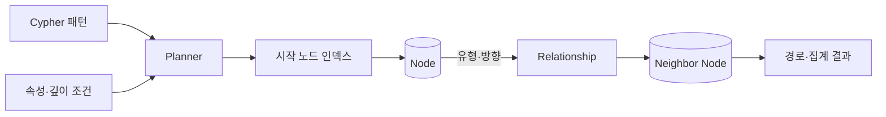
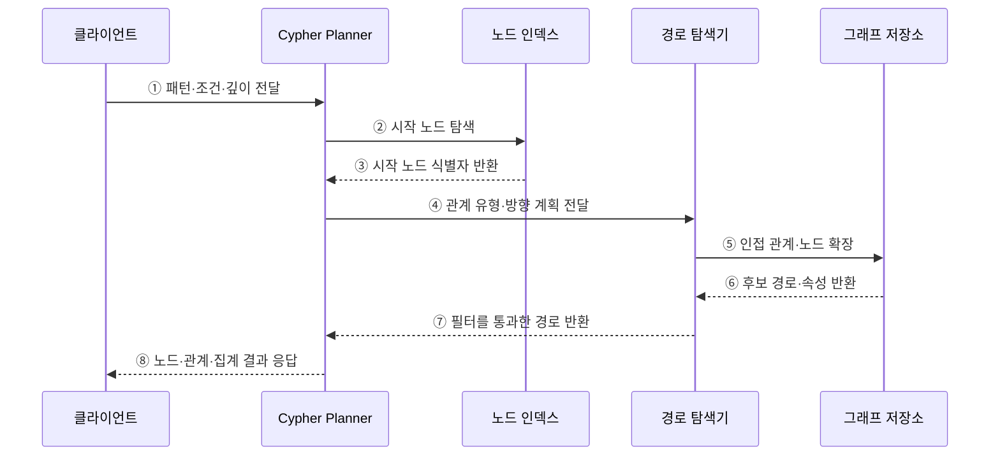

---
sidebar:
  order: 109
  label: "109. Neo4j 그래프 DB (Neo4j Graph Database)"
  badge:
    text: "기출 · 70%"
    variant: note
title: "Neo4j 그래프 DB (Neo4j Graph Database)"
date: "2026-07-27T23:59:59+09:00"
tags:
  - "notes-software"
weight: 109
extra:
  question_no: "109"
  source_status: "기출"
  source_history: "137회, 138회"
  priority: 70
  priority_note: "137·138회 연속, 그래프 탐색 적용성 높음"
---

## 미리 알고가기

- **그래프 DB(Graph Database)**: ‘그래프 디비’로 읽으며, 개체와 연결 관계를 노드·관계로 직접 저장함
- **노드 (Node)**: 그래프의 개체를 표현함
- **관계 (Relationship)**: 노드 사이의 방향 연결을 표현함
- **속성 (Property)**: 노드·관계의 값을 저장함
- **속성 그래프 (Property Graph)**: 노드·관계에 레이블·속성을 부여함
- **사이퍼 (Cypher)**: 그래프 패턴과 경로를 선언함
- **p95(95th Percentile Latency)**: ‘피 구십오’로 읽으며, p는 백분위 표기이고 95는 요청 95%가 완료되는 지연 경계를 뜻함
- **네오포제이(Neo4j)**: 속성 그래프 모델과 Cypher 질의를 제공하는 그래프 데이터베이스임
- **레이블(Label)**: 노드를 같은 역할이나 유형의 집합으로 분류하는 이름임
- **인접 관계(Adjacency)**: 한 노드에 직접 연결된 관계와 이웃 노드의 집합임
- **가변 길이 경로(Variable-length Path)**: 관계를 몇 단계 거칠지 범위로 지정해 탐색하는 경로임
- **분기 계수(Branching Factor)**: 한 노드에서 다음 단계로 확장되는 평균 관계 수임
- **경로 폭발(Path Explosion)**: 분기 계수와 깊이가 커져 후보 경로 수가 급격히 증가하는 현상임

## Ⅰ. 개요

- Neo4j는 개체를 노드, 연결을 방향 있는 관계, 부가값을 속성으로 저장하고 Cypher로 그래프 패턴을 탐색하는 데이터베이스이다.
- 여러 단계의 관계 자체가 질의의 핵심일 때 반복 조인 대신 인접 관계를 따라 경로를 확장한다.

### 쉽게 이해하기 (학습용)
- 연결선을 저장해 친구의 친구를 선 따라 찾는 데이터베이스임

## Ⅱ. 특징

- **속성 그래프**: 노드·관계에 레이블·유형·속성을 부여해 업무 의미를 표현한다.
- **패턴 질의**: Cypher로 시작점·관계 방향·유형·경로 길이를 선언한다.
- **인접 탐색**: 찾은 시작 노드에서 연결을 따라 여러 단계 관계를 탐색한다.
- **경로 폭발**: 시작점이 넓거나 분기·깊이가 크면 후보 수가 기하급수적으로 증가한다.

### 쉽게 이해하기 (학습용)
- 탐색은 자연스럽지만 시작점과 깊이를 제한해야 범위가 폭발하지 않음

## Ⅲ. 아키텍처 및 구성요소

**도표안 A — 구조도**

**도표안 B — sequenceDiagram**

| 구성요소 | 역할 |
|:---|:---|
| 노드·레이블 | 개체와 개체 유형 표현 |
| 관계·방향·유형 | 노드 사이 연결 의미와 탐색 방향 표현 |
| 속성 | 노드·관계의 상태·시간·가중치 저장 |
| 인덱스·제약 | 선택도 높은 시작 노드 탐색과 유일성 보장 |
| Cypher Planner·Runtime | 패턴을 시작 탐색·확장·필터 연산으로 실행 |

**동작 원리**

- ① 클라이언트가 노드·관계 패턴과 필터·깊이를 Cypher로 전달한다.
- ② Planner가 선택도 높은 조건으로 시작 노드를 인덱스에서 찾는다.
- ③ 인덱스가 일치하는 시작 노드 식별자를 반환한다.
- ④ Planner가 관계 유형·방향·확장 순서를 탐색기에 전달한다.
- ⑤ 탐색기가 그래프 저장소의 인접 관계와 이웃 노드를 확장한다.
- ⑥ 저장소가 후보 경로와 필요한 속성을 반환한다.
- ⑦ 탐색기가 깊이·중복·속성 필터를 통과한 경로를 반환한다.
- ⑧ Planner가 노드·관계·경로 또는 집계 결과를 응답한다.

### 쉽게 이해하기 (학습용)

- 먼저 출발점을 좁힌 뒤 정해진 종류와 방향의 연결선만 따라간다.

## Ⅳ. 종류 및 비교

| 비교 항목 | 속성 그래프(Neo4j) | 관계형 모델 |
|:---|:---|:---|
| 관계 표현 | 유형·방향·속성을 가진 관계 | 외래키와 연결 테이블 |
| 탐색 방식 | 시작 노드에서 인접 관계 확장 | 조인 조건으로 행 집합 결합 |
| 강점 | 가변 깊이 경로·연결 패턴·설명 가능한 경로 | 정형 거래·집계·폭넓은 질의 |
| 주요 위험 | 경로 폭발·전역 탐색·그래프 분산 비용 | 깊은 반복 조인의 중간 결과·질의 복잡성 |
| 적합 예 | 추천·권한·사기망·지식 그래프 | 주문·원장·정형 보고서 |

| 탐색 유형 | 핵심 목적 | 통제 조건 |
|:---|:---|:---|
| 고정 길이 패턴 | 정해진 단계의 관계 확인 | 유형·방향·시작점 |
| 가변 길이 경로 | N단계 도달 가능성 탐색 | 최소·최대 깊이·중복 |
| 최단·가중 경로 | 최소 단계·비용 경로 탐색 | 가중치 의미·음수 여부 |

### 쉽게 이해하기 (학습용)

- 표는 조건으로 다시 결합하고 그래프는 저장된 연결선을 따라간다.

## Ⅴ. 실무 고려사항 및 대책

| 고려사항 | 위험 | 대책 |
|:---|:---|:---|
| 시작점 | 전체 노드 스캔 후 확장 | 유일·선택도 높은 속성 인덱스 사용 |
| 방향·유형 | 불필요한 양방향·모든 관계 탐색 | 업무 의미에 맞는 유형·방향 명시 |
| 깊이 | 무제한 가변 경로로 후보 폭발 | 최대 깊이·경로 수·시간 제한 |
| 중복 경로 | 순환 그래프에서 반복 방문 | 경로 유일성·방문 규칙 정의 |
| 모델 과밀 | 모든 사실을 노드·관계로 표현 | 관계 탐색 가치가 있는 개념만 그래프화 |
| 운영 | 대형 그래프의 메모리·백업·분산 부담 | 실제 데이터 규모로 p95·복구 시험 |

> **적용 사례**: 권한 분석은 사용자 노드를 인덱스로 찾은 뒤 `HAS_ROLE`과 `CAN_ACCESS` 방향만 제한된 깊이로 탐색해 접근 경로를 반환한다.

### 쉽게 이해하기 (학습용)

- 출발 사용자와 권한 관계 종류, 최대 단계를 정해야 빠르고 설명 가능한 결과를 얻는다.

## Ⅵ. 결론

- Neo4j는 연결 경로 자체가 핵심 결과인 업무에서 관계를 직접 표현하고 탐색하는 데 적합하다.
- 시작점·유형·방향·깊이·분기 계수를 제한하고 경로 폭발과 운영 비용을 실측해야 한다.

### 쉽게 이해하기 (학습용)

- 연결선이 답일 때 사용하되 어디서 몇 단계까지 찾을지 반드시 제한한다.
