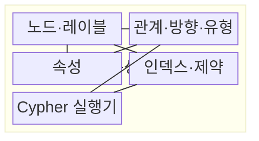
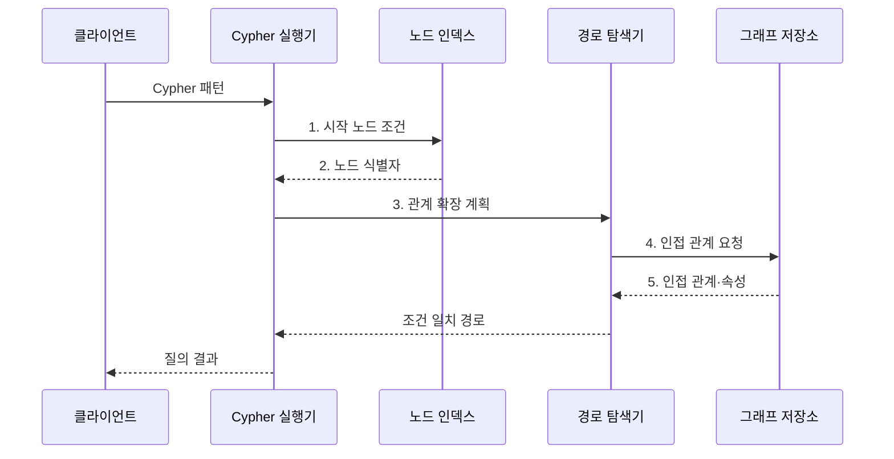

---
sidebar:
  order: 109
  label: "109. Neo4j 그래프 DB (Neo4j Graph Database)"
  badge:
    text: "기출 · 70%"
    variant: note
title: "Neo4j 그래프 DB (Neo4j Graph Database)"
date: "2026-07-30T23:48:33+09:00"
tags:
  - "notes-software"
weight: 109
extra:
  question_no: "109"
  source_status: "기출"
  source_history: "137회, 138회"
  priority: 70
  priority_note: "137·138회 연속, 그래프 탐색 적용성 높음"
---

## 미리 알고가기

- **네오포제이(Neo4j)**: 속성 그래프 모델과 Cypher 질의를 제공하는 그래프 데이터베이스
- **데이터베이스(Database, DB)**: 데이터를 구조화해 저장·조회·관리하는 시스템
- **그래프 데이터베이스(Graph Database)**: 개체와 연결 관계를 노드·관계로 직접 저장하는 데이터베이스
- **노드(Node)**: 그래프의 개체를 표현하는 요소
- **관계(Relationship)**: 노드 사이의 방향·유형을 표현하는 연결
- **속성(Property)**: 노드·관계의 상태·시간·가중치 등을 저장하는 값
- **속성 그래프(Property Graph)**: 노드·관계에 레이블과 속성을 부여하는 그래프 모델
- **사이퍼(Cypher)**: 노드·관계 패턴과 경로 조건을 선언하는 Neo4j 질의 언어
- **95백분위 지연(95th Percentile Latency, p95)**: 요청의 95%가 완료되는 지연시간 경계
- **레이블(Label)**: 노드를 같은 역할이나 유형의 집합으로 분류하는 이름이다.
- **인접 관계(Adjacency)**: 한 노드에 직접 연결된 관계와 이웃 노드의 집합이다.
- **가변 길이 경로(Variable-length Path)**: 관계를 몇 단계 거칠지 범위로 지정해 탐색하는 경로이다.
- **분기 계수(Branching Factor)**: 한 노드에서 다음 단계로 확장되는 평균 관계 수이다.
- **경로 폭발(Path Explosion)**: 분기 계수와 깊이가 커져 후보 경로 수가 급격히 증가하는 현상이다.
- **선택도(Selectivity)**: 조건이 전체 후보 중 얼마나 적은 대상을 남기는지를 나타내는 비율
- **외래키(Foreign Key)**: 관계형 테이블에서 다른 행의 기본키를 참조해 관계를 표현하는 열

## Ⅰ. 개요

- 정의/개념: 노드·관계를 속성 그래프로 저장하는 **그래프 DB**
- 배경/필요성: 다단계 외래키 조인은 경로 깊이에 따라 **조인 비용** 증가

### 쉽게 이해하기 (학습용)
- 연결선을 저장해 친구의 친구를 선 따라 찾는 데이터베이스이다.

## Ⅱ. 특징

- **속성 그래프**: 노드·관계에 업무 의미 부여
- **패턴 질의**: 방향·유형·경로 길이 선언
- 분기 계수·깊이에 따라 **후보 경로 수** 지수 증가

### 쉽게 이해하기 (학습용)
- 탐색은 자연스럽지만 시작점과 깊이를 제한해야 후보 경로가 폭발하지 않는다.

## Ⅲ. 구조 및 구성요소

| 구성요소 | 책임 |
|:---|:---|
| 노드·레이블 | **개체·유형** 표현 |
| 관계·방향·유형 | **연결 의미·탐색 방향** 표현 |
| 속성 | **상태·시간·가중치** 저장 |
| 인덱스·제약 | **시작 노드 탐색·유일성** 보장 |
| Cypher 실행기 | **패턴 계획·관계 확장·필터** 실행 |

### 쉽게 이해하기 (학습용)

- 개체, 연결선, 부가값, 출발점 색인, 탐색 담당자로 구성된다.

## Ⅳ. 흐름도

**동작 원리**

1. **시작 노드 조건**: 선택도 높은 레이블·속성을 인덱스에 전달
2. **노드 식별자**: 인덱스가 탐색 출발 집합을 축소해 반환
3. **관계 확장 계획**: 유형·방향·깊이별 확장 순서 결정
4. **인접 관계 요청**: 현재 노드에 연결된 관계와 이웃 조회
5. **인접 관계·속성**: 경로 조건과 속성 필터에 필요한 값 반환

### 쉽게 이해하기 (학습용)

- 먼저 출발점을 좁힌 뒤 정해진 종류와 방향의 연결선만 따라간다.

## Ⅴ. 종류 및 비교

| 데이터 모델 | 속성 그래프 | 관계형 모델 |
|:---|:---|:---|
| 적용 기준 | **관계 경로·패턴**이 핵심 | **정형 거래·집계**가 핵심 |
| 핵심 특징 | 저장된 **인접 관계** 직접 확장 | **외래키·조인**으로 관계 결합 |
| 한계 | **경로 폭발·분산 순회 비용** | 깊은 경로의 **반복 조인 비용** |

### 쉽게 이해하기 (학습용)

- 표는 조건으로 다시 결합하고 그래프는 저장된 연결선을 따라간다.

## Ⅵ. 실무 고려사항 및 대책

| 고려사항 | 대책 | 효과 |
|:---|:---|:---|
| 낮은 선택도의 시작 조건은 전체 노드 탐색 유발 | 선택도 높은 **인덱스 시작점** 사용 | **전체 노드 탐색** 방지 |
| 방향·유형 없는 관계 패턴은 불필요한 이웃 확장 | 업무 **관계 방향·유형** 명시 | **관계 확장 범위** 감소 |
| 높은 분기 계수의 무제한 경로는 후보 수 폭발 | **경로 깊이·후보 수 상한** 설정 | **경로 폭발** 방지 |
| 순환 그래프에서 경로 중복을 허용하면 같은 노드 재방문 | **방문·경로 유일성 규칙** 정의 | **순환 반복** 방지 |
| 소규모 시험은 실제 분기 계수의 지연을 반영하지 못함 | 운영 규모로 **p95·메모리** 시험 | **경로 탐색 한계** 확인 |

### 쉽게 이해하기 (학습용)

- 출발 사용자와 권한 관계 종류, 최대 단계를 정해야 빠르고 설명 가능한 결과를 얻는다.

## Ⅶ. 결론

- 관계 경로가 핵심이면 **Neo4j**, 단순 거래·집계면 **관계형 DB** 선택

### 쉽게 이해하기 (학습용)

- 연결선이 답일 때 사용하되 어디서 몇 단계까지 찾을지 반드시 제한한다.
