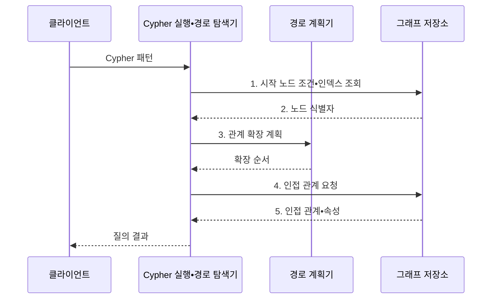

---
sidebar:
  order: 109
  label: "109. Neo4j 그래프 DB (Neo4j Graph Database)"
  badge:
    text: "기출 • 70%"
    variant: note
title: "Neo4j 그래프 DB (Neo4j Graph Database)"
date: "2026-08-05T05:00:00+09:00"
tags:
  - "notes-software"
weight: 109
extra:
  question_no: "109"
  source_status: "기출"
  source_history: "137회, 138회"
  priority: 70
  priority_note: "137•138회 연속, 그래프 탐색 적용성 높음"
---

## Ⅰ. 개요

<details>
<summary>핵심 용어</summary>

- **Neo4j 그래프 데이터베이스(Neo4j Graph Database)**: 개체를 노드로, 연결을 방향과 속성을 가진 관계로 저장해 경로를 직접 탐색하는 데이터베이스이다.

</details>

- 정의/개념: 개체와 연결을 저장해 경로를 탐색하는 **Neo4j 그래프 데이터베이스**
- 배경/필요성: 다단계 외래키 조인은 경로 깊이에 따라 **조인 비용** 증가

#### 한줄 요약
- 연결선을 저장해 친구의 친구를 선 따라 찾는 데이터베이스이다.

## Ⅱ. 특징

<details>
<summary>핵심 용어</summary>

- **패턴 질의**: 관계의 방향•유형과 경로 길이를 선언해 필요한 연결 구조를 찾는 방식이다.
- **속성 그래프(Property Graph)**: 노드와 관계에 레이블•속성을 부여해 개체와 연결 의미를 함께 표현하는 모델이다.
- **후보 경로 수**: 분기 계수와 탐색 깊이가 늘수록 지수적으로 증가해 성능을 좌우하는 경로 조합 수이다.

</details>

- **속성 그래프**: 노드•관계에 업무 의미 부여
- **패턴 질의**: 방향•유형•경로 길이 선언
- 분기 계수•깊이에 따라 **후보 경로 수** 지수 증가

#### 한줄 요약
- 탐색은 자연스럽지만 시작점과 깊이를 제한해야 후보 경로가 폭발하지 않는다.

## Ⅲ. 구조 및 구성요소

<details>
<summary>핵심 용어</summary>

- **인덱스**: 시작 노드 탐색을 빠르게 하는 구성요소이다.
- **제약**: 노드 식별자의 유일성을 보장하는 규칙이다.
- **노드**: 업무 개체를 나타내는 그래프 구성요소이다.
- **레이블**: 노드의 업무 유형을 분류하는 표식이다.
- **관계**: 노드 사이의 연결을 나타내는 구성요소이다.
- **방향**: 관계를 탐색할 수 있는 진행 기준이다.
- **유형**: 관계가 가진 업무 의미를 구분하는 이름이다.
- **속성**: 노드와 관계의 상태•시간•가중치 같은 부가값이다.
- **Cypher 실행기**: Cypher 패턴을 계획하고 관계 확장과 속성 필터를 수행하는 질의 실행기이다.

</details>

```text
              [인덱스•제약]
                    |
             [노드•레이블] -- [관계•방향•유형]
                    \          /         |
                      [속성]       [Cypher 실행기]
```

선의 의미: 인덱스•제약은 노드•레이블의 탐색과 유일성을 지원하고, 노드와 관계는 속성을 가지며, Cypher 실행기는 관계•방향•유형을 기준으로 그래프 패턴을 탐색한다.

| 구성요소 | 책임 |
|:---|:---|
| 노드•레이블 | **개체•유형** 표현 |
| 관계•방향•유형 | **연결 의미•탐색 방향** 표현 |
| 속성 | **상태•시간•가중치** 저장 |
| 인덱스•제약 | **시작 노드 탐색•유일성** 보장 |
| Cypher 실행기 | **패턴 계획•관계 확장•필터** 실행 |

#### 한줄 요약

- 개체, 연결선, 부가값, 출발점 색인, 탐색 담당자로 구성된다.

## Ⅳ. 흐름도

<details>
<summary>핵심 용어</summary>

- **3. 관계 확장 계획**: 관계 유형과 방향 및 깊이에 따라 그래프 탐색 순서를 정하는 단계이다.
- **Cypher 패턴**: 노드와 관계의 레이블•방향•유형 및 속성 조건으로 원하는 그래프 모양을 선언한 질의이다.
- **1. 시작 노드 조건•인덱스 조회**: 선택도 높은 레이블•속성으로 탐색 출발 집합을 좁히는 단계이다.
- **2. 노드 식별자**: 인덱스가 반환한 관계 확장의 출발 노드 목록이다.
- **4. 인접 관계 요청**: 현재 노드에서 지정한 방향•유형에 맞는 관계와 이웃을 조회하는 단계이다.
- **5. 인접 관계•속성**: 경로 조건과 필터 판단에 사용하는 연결 및 부가값이다.

</details>



**동작 원리**

1. **시작 노드 조건•인덱스 조회**: 선택도 높은 레이블•속성을 인덱스에 전달
2. **노드 식별자**: 인덱스가 탐색 출발 집합을 축소해 반환
3. **관계 확장 계획**: 유형•방향•깊이별 확장 순서 결정
4. **인접 관계 요청**: 현재 노드에 연결된 관계와 이웃 조회
5. **인접 관계•속성**: 경로 조건과 속성 필터에 필요한 값 반환

#### 한줄 요약

- 먼저 출발점을 좁힌 뒤 정해진 종류와 방향의 연결선만 따라간다.

## Ⅴ. 종류 및 비교

<details>
<summary>핵심 용어</summary>

- **속성 그래프**: 노드와 관계에 레이블 및 속성을 부여해 연결 의미를 직접 표현하는 모델이다.
- **관계형 모델(Relational Model)**: 데이터를 테이블과 외래키로 표현하고 조인으로 관계를 결합하는 모델이다.

</details>

| 데이터 모델 | 속성 그래프 | 관계형 모델 |
|:---|:---|:---|
| 적용 기준 | 핵심이 **관계 경로•패턴** | 핵심이 **정형 거래•집계** |
| 핵심 특징 | 저장된 **인접 관계** 직접 확장 | **외래키•조인** 으로 관계 결합 |
| 한계 | **경로 폭발•분산 순회 비용** | 깊은 경로의 **반복 조인 비용** |

#### 한줄 요약

- 표는 조건으로 다시 결합하고 그래프는 저장된 연결선을 따라간다.

## Ⅵ. 실무 고려사항 및 대책

<details>
<summary>핵심 용어</summary>

- **인덱스 시작점**: 선택도 높은 레이블•속성 조건으로 전체 그래프 탐색을 피하는 출발 노드이다.
- **관계 방향•유형**: 업무 의미에 맞는 연결선만 확장하도록 지정하는 탐색 조건이다.
- **경로 깊이 상한**: 탐색 단계를 제한해 경로 폭발을 막는 기준이다.
- **후보 수 상한**: 중간 경로 개수를 제한하는 기준이다.
- **방문 유일성 규칙**: 순환 그래프에서 같은 노드의 재방문 범위를 정하는 규칙이다.
- **경로 유일성 규칙**: 같은 관계를 경로에 재사용할 수 있는 범위를 정하는 규칙이다.
- **95백분위 응답시간(95th Percentile Latency, p95)**: 요청의 95%가 완료되는 지연시간 기준이다.
- **메모리 시험**: 경로 확장에 필요한 메모리 한계를 확인하는 시험이다.

</details>

| 문제 | 대책 | 효과 |
|:---|:---|:---|
| 낮은 선택도의 시작 조건은 전체 노드 탐색 유발 | 선택도 높은 **인덱스 시작점** 사용 | **전체 노드 탐색** 방지 |
| 방향•유형 없는 관계 패턴은 불필요한 이웃 확장 | 업무 **관계 방향•유형** 명시 | **관계 확장 범위** 감소 |
| 높은 분기 계수의 무제한 경로는 후보 수 폭발 | **경로 깊이•후보 수 상한** 설정 | **경로 폭발** 방지 |
| 순환 그래프에서 경로 중복을 허용하면 같은 노드 재방문 | **방문•경로 유일성 규칙** 정의 | **순환 반복** 방지 |
| 소규모 시험은 실제 분기 계수의 지연을 반영하지 못함 | 운영 규모로 **p95•메모리** 시험 | **경로 탐색 한계** 확인 |

#### 한줄 요약

- 출발 사용자와 권한 관계 종류, 최대 단계를 정해야 빠르고 설명 가능한 결과를 얻는다.

## Ⅶ. 결론

<details>
<summary>핵심 용어</summary>

- **Neo4j**: 관계 경로와 연결 패턴이 핵심인 업무에 적합한 그래프 데이터베이스이다.
- **관계형 데이터베이스(Relational Database)**: 정형 거래와 집계 및 테이블 기반 관계가 핵심인 업무에 적합한 데이터베이스이다.

</details>

- 관계 경로는 **Neo4j**, 단순 거래•집계는 **관계형 DB** 선택

#### 한줄 요약

- 연결선이 답일 때 사용하되 어디서 몇 단계까지 찾을지 반드시 제한한다.
