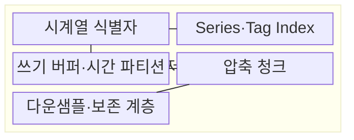
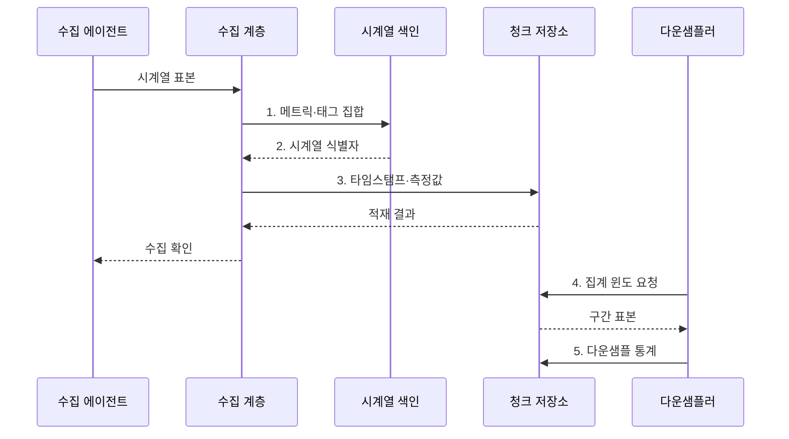

---
sidebar:
  order: 110
  label: "110. 시계열 데이터베이스 (Time Series Database)"
  badge:
    text: "미출 · 30%"
    variant: note
title: "시계열 데이터베이스 (Time Series Database)"
date: "2026-07-30T23:49:31+09:00"
tags:
  - "notes-software"
weight: 110
extra:
  question_no: "110"
  source_status: "미출"
  source_history: ""
  priority: 30
  priority_note: "시계열 수집·보존·다운샘플링 설계 가치"
---

## 미리 알고가기

- **시계열 데이터(Time-series Data)**: 타임스탬프와 측정값을 시간 순서로 기록한 데이터이다.
- **시계열 데이터베이스(Time-series Database, TSDB)**: 연속 표본의 시간 구간 저장·조회·집계에 최적화한 데이터베이스이다.
- **타임스탬프(Timestamp)**: 측정이나 사건이 발생한 시각을 나타내는 값이다.
- **메트릭(Metric)**: 중앙 처리 장치 사용률·요청 수처럼 반복 측정하는 항목이다.
- **태그(Tag)**: 서비스·인스턴스·지역처럼 시계열을 구분하고 필터링하는 차원이다.
- **활성 시계열 수(Active Series Count)**: 현재 수집 중인 메트릭과 태그 값 조합의 개수이다.
- **다운샘플링(Downsampling)**: 고해상도 원본을 분·시간 단위의 낮은 해상도 통계값으로 축약하는 처리이다.
- **보존 정책(Retention Policy)**: 원본과 축약본을 각각 얼마 동안 유지한 뒤 삭제할지 정하는 규칙이다.
- **늦게 도착한 데이터(Late-arriving Data)**: 현재 쓰기 구간보다 과거 타임스탬프를 가진 표본이다.
- **청크(Chunk)**: 일정 시간 범위의 표본을 함께 압축·저장하는 묶음이다.
- **윈도 집계(Window Aggregation)**: 지정한 시간 구간별로 합계·평균·최댓값 등을 계산하는 처리이다.
- **카디널리티(Cardinality)**: 메트릭과 태그 조합으로 생성될 수 있는 서로 다른 시계열 수이다.
- **데이터베이스(Database, DB)**: 데이터를 구조화해 저장·조회·관리하는 시스템
- **시계열 식별자(Series Identifier, Series ID)**: 메트릭과 정렬된 태그 집합을 하나의 시계열에 연결하는 식별자
- **시계열·태그 색인(Series·Tag Index)**: 조건과 일치하는 시계열 식별자를 찾는 색인
- **분위수(Quantile)**: 관측값을 정렬했을 때 지정한 누적 비율에 해당하는 값

## Ⅰ. 개요

- 정의/개념: 시간 표본의 적재·구간 조회·집계에 특화된 **DB**
- 배경/필요성: 일반 행 저장은 고빈도 표본·장기 보존 시 **저장·색인 비용** 급증

### 쉽게 이해하기 (학습용)
- 시간 도장이 찍힌 측정값을 빠르게 쌓고 요약 및 보관하는 데이터베이스이다.

## Ⅱ. 특징

- **시간 저장**: 파티션·청크 단위 압축
- **구간 분석**: 윈도 조회·집계 수행
- **수명 관리**: 해상도별 보존 기간 분리

### 쉽게 이해하기 (학습용)
- 연속 쓰기에 강하지만 태그가 폭증하면 색인과 메모리 비용이 커진다.

## Ⅲ. 구조 및 구성요소

| 구성요소 | 책임 |
|:---|:---|
| 시계열 식별자 | **메트릭·태그 조합** 구분 |
| Series·Tag Index | 태그 조건별 **시계열 탐색** |
| 쓰기 버퍼·시간 파티션 | **시간 구간별 표본** 누적 |
| 압축 청크 | 반복 시각·값의 **저장량 축소** |
| 다운샘플·보존 계층 | **구간 집계 생성·만료 삭제** |

### 쉽게 이해하기 (학습용)

- 측정 이름표, 색인, 시간 상자, 압축 묶음, 보존 담당자로 구성된다.

## Ⅳ. 흐름도

**동작 원리**

1. **메트릭·태그 집합**: 정렬된 태그 조합으로 시계열 조회
2. **시계열 식별자**: 조건과 일치하는 계열의 내부 식별자 반환
3. **타임스탬프·측정값**: 시각으로 파티션·청크를 정해 표본 압축
4. **집계 윈도 요청**: 보존 정책에 맞는 원본 시간 구간 지정
5. **다운샘플 통계**: 구간 합계·극값·분위수를 낮은 해상도로 저장

### 쉽게 이해하기 (학습용)

- 측정값을 시간 상자에 모아 압축하고 오래된 구간은 요약값만 남긴다.

## Ⅴ. 종류 및 비교

| 데이터베이스 모델 | 시계열 DB | 관계형 DB |
|:---|:---|:---|
| 적용 기준 | **연속 표본·시간 구간 집계** | **거래·관계·조인** |
| 핵심 특징 | **시간 파티션·압축 청크** | **행·페이지·범용 인덱스** |
| 한계 | **고카디널리티·늦은 표본** 처리 | 대량 적재·보존 작업의 **운영 부하** |

### 쉽게 이해하기 (학습용)

- 관계형 DB는 업무 기록의 관계를, 시계열 DB는 시간에 따른 변화와 구간 통계를 잘 다룬다.

## Ⅵ. 실무 고려사항 및 대책

| 고려사항 | 대책 | 효과 |
|:---|:---|:---|
| 무제한 태그 값은 활성 시계열 수를 폭증시킴 | **태그 허용 목록·카디널리티 예산** | **색인·메모리 증가** 통제 |
| 시계 오차·중복·지연 표본은 시간 구간 결과 왜곡 | **시각 동기화·중복 키·지연 창** 정의 | **시간 품질 오류** 통제 |
| 너무 크거나 작은 시간 파티션은 조회·관리 비용 증가 | 적재량·조회 범위로 **파티션 크기** 조정 | **청크 크기 균형** 유지 |
| 평균만 다운샘플링하면 극값·분위수 이상 소실 | **합계·극값·분위수** 보존 | **이상 징후 소실** 방지 |
| 모든 해상도를 같은 기간 보존하면 저장 비용 급증 | 가치·규제별 **보존 기간 계층화** | **장기 저장 비용** 통제 |

### 쉽게 이해하기 (학습용)

- 이름표 종류를 제한하고 오래된 원본은 필요한 통계만 남겨 비용을 관리한다.

## Ⅶ. 결론

- 조회 해상도·보존 가치로 **다운샘플링**, 카디널리티 예산으로 **태그** 제한

### 쉽게 이해하기 (학습용)

- 얼마나 자주 재고 얼마나 오래 어떤 해상도로 남길지를 함께 정해야 한다.
