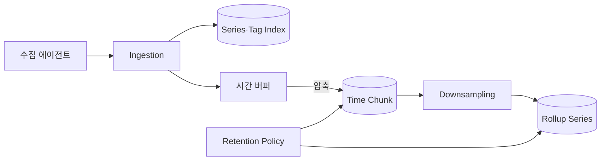
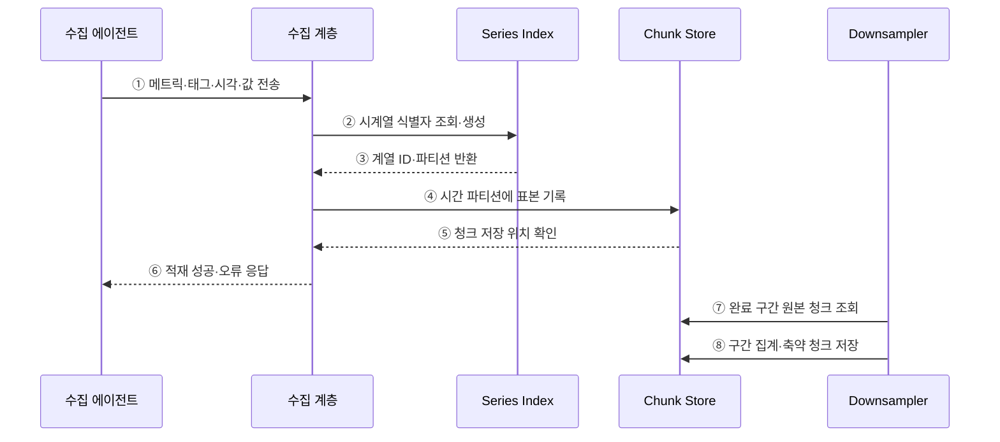

---
sidebar:
  order: 110
  label: "110. 시계열 데이터베이스 (Time Series Database)"
  badge:
    text: "미출제 · 30%"
    variant: note
title: "시계열 데이터베이스 (Time Series Database)"
date: "2026-07-25T18:42:00+09:00"
tags:
  - "notes-software"
weight: 110
extra:
  question_no: "110"
  source_status: "미출제"
  source_history: ""
  priority: 30
  priority_note: "시계열 수집·보존·다운샘플링 설계 가치"
---

## 미리 알고가기

- **시계열 데이터(Time-series Data)**: 타임스탬프와 측정값을 시간 순서로 기록한 데이터임
- **시계열 데이터베이스(Time-series Database, TSDB)**: 연속 표본의 시간 구간 저장·조회·집계에 최적화한 데이터베이스임
- **타임스탬프(Timestamp)**: 측정이나 사건이 발생한 시각을 나타내는 값임
- **메트릭(Metric)**: 중앙 처리 장치 사용률·요청 수처럼 반복 측정하는 항목임
- **태그(Tag)**: 서비스·인스턴스·지역처럼 시계열을 구분하고 필터링하는 차원임
- **활성 시계열 수(Active Series Count)**: 현재 수집 중인 메트릭과 태그 값 조합의 개수임
- **다운샘플링(Downsampling)**: 고해상도 원본을 분·시간 단위의 낮은 해상도 통계값으로 축약하는 처리임
- **보존 정책(Retention Policy)**: 원본과 축약본을 각각 얼마 동안 유지한 뒤 삭제할지 정하는 규칙임
- **늦게 도착한 데이터(Late-arriving Data)**: 현재 쓰기 구간보다 과거 타임스탬프를 가진 표본임
- **청크(Chunk)**: 일정 시간 범위의 표본을 함께 압축·저장하는 묶음임
- **윈도 집계(Window Aggregation)**: 지정한 시간 구간별로 합계·평균·최댓값 등을 계산하는 처리임
- **카디널리티(Cardinality)**: 메트릭과 태그 조합으로 생성될 수 있는 서로 다른 시계열 수임

## Ⅰ. 개요

- 시계열 데이터베이스는 타임스탬프가 있는 연속 표본의 고속 적재·시간 구간 조회·집계·보존에 최적화한 저장소이다.
- 시간 파티션·청크 압축·다운샘플링으로 대량 표본의 저장 비용과 장기 조회 해상도를 관리한다.

### 쉽게 이해하기 (학습용)
- 시간 도장이 찍힌 측정값을 빠르게 쌓고 요약 및 보관하는 데이터베이스임

## Ⅱ. 특징

- 표본을 시간 파티션에 모아 청크로 압축한다.
- 시간 조건으로 최근 구간 조회와 윈도 집계를 수행한다.
- 다운샘플링·보존 정책으로 해상도와 기간을 분리한다.
- 태그 증가는 인덱스를, 늦은 표본은 재처리를 늘린다.

### 쉽게 이해하기 (학습용)
- 연속 쓰기에 강하지만 태그가 폭증하면 색인과 메모리 비용이 커짐

## Ⅲ. 아키텍처 및 구성요소

**도표안 A — 구조도**

**도표안 B — sequenceDiagram**

| 구성요소 | 역할 |
|:---|:---|
| 시계열 식별자 | 메트릭 이름과 태그 집합으로 계열 구분 |
| Series·Tag Index | 태그 조건에 맞는 시계열 후보 탐색 |
| 쓰기 버퍼·시간 파티션 | 표본을 시간 구간별로 모아 기록 |
| 압축 청크 | 타임스탬프·값의 반복성을 이용해 저장량 축소 |
| 다운샘플·보존 계층 | 낮은 해상도 집계 생성과 만료 데이터 삭제 |

**동작 원리**

- ① 수집 에이전트가 메트릭·태그·타임스탬프·값을 전송한다.
- ② 수집 계층이 메트릭과 태그 조합의 시계열 ID를 조회하거나 생성한다.
- ③ 인덱스가 계열 ID와 담당 시간 파티션을 반환한다.
- ④ 수집 계층이 타임스탬프에 맞는 청크에 표본을 기록한다.
- ⑤ 청크 저장소가 저장 위치와 처리 결과를 반환한다.
- ⑥ 수집 계층이 에이전트에 적재 성공 또는 오류를 응답한다.
- ⑦ 다운샘플러가 완료된 시간 구간의 원본 청크를 읽는다.
- ⑧ 구간별 합계·평균·최댓값 등을 계산해 축약 청크로 저장한다.

### 쉽게 이해하기 (학습용)

- 측정값을 시간 상자에 모아 압축하고 오래된 구간은 요약값만 남긴다.

## Ⅳ. 종류 및 비교

| 비교 항목 | 시계열 데이터베이스 | 범용 관계형 데이터베이스 |
|:---|:---|:---|
| 저장 구조 | 시간 파티션·압축 청크 | 일반 행·페이지·인덱스 |
| 주요 조회 | 시간 구간과 윈도 집계 | 행 조건·조인·거래 조회 |
| 수명주기 | 보존·다운샘플 기능에 특화 | 파티션·집계·삭제를 별도 구성 |
| 강점 | 연속 적재·시간 압축·구간 집계 | 관계·제약·범용 트랜잭션 |
| 주요 위험 | 고카디널리티·늦은 표본·재집계 | 대량 적재·보존 작업 부하 |

| 다운샘플 방식 | 보존 정보 | 손실 정보 |
|:---|:---|:---|
| 평균 | 구간의 대표 수준 | 순간 급증·분포 |
| 최소·최대 | 구간 극값 | 발생 순서·지속시간 |
| 합계·건수 | 누적량·빈도 | 개별 표본 |
| 분위수 스케치 | 지연 분포 근사 | 정확한 원본 값 |

### 쉽게 이해하기 (학습용)

- 관계형 DB는 업무 기록의 관계를, 시계열 DB는 시간에 따른 변화와 구간 통계를 잘 다룬다.

## Ⅴ. 실무 고려사항 및 대책

| 고려사항 | 위험 | 대책 |
|:---|:---|:---|
| 태그 설계 | 사용자 ID 같은 값으로 시계열 폭증 | 허용 태그·값 수 예산·활성 계열 경보 |
| 시간 품질 | 시계 오류·중복·늦은 표본 | 시간 동기화·중복 키·허용 지연 창 정의 |
| 파티션 | 너무 작거나 큰 시간 구간 | 적재량·조회 범위·보존 작업으로 조정 |
| 다운샘플 | 평균만 남겨 이상 징후 소실 | 합계·건수·최소·최대·분위수 함께 설계 |
| 보존 | 원본·축약본 기간의 비용 폭증 | 가치·규제·조회 빈도별 계층화 |
| 조회 | 긴 범위·고카디널리티 팬아웃 | 시간·계열 제한, 사전 집계·쿼리 한도 |

> **적용 사례**: 인프라 메트릭은 서비스·지역 태그만 허용하고 원본 7일, 5분 집계 90일처럼 해상도별 보존 기간을 분리한다.

### 쉽게 이해하기 (학습용)

- 이름표 종류를 제한하고 오래된 원본은 필요한 통계만 남겨 비용을 관리한다.

## Ⅵ. 결론

- 시계열 DB의 핵심은 빠른 쓰기뿐 아니라 계열 카디널리티·시간 품질·압축·다운샘플·보존 수명주기이다.
- 조회 가치와 비용에 맞춰 태그·해상도·보존 기간을 설계하고 늦은 데이터의 재집계까지 검증해야 한다.

### 쉽게 이해하기 (학습용)

- 얼마나 자주 재고 얼마나 오래 어떤 해상도로 남길지를 함께 정해야 한다.
