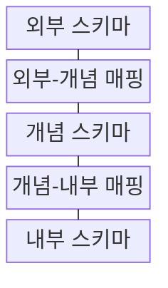
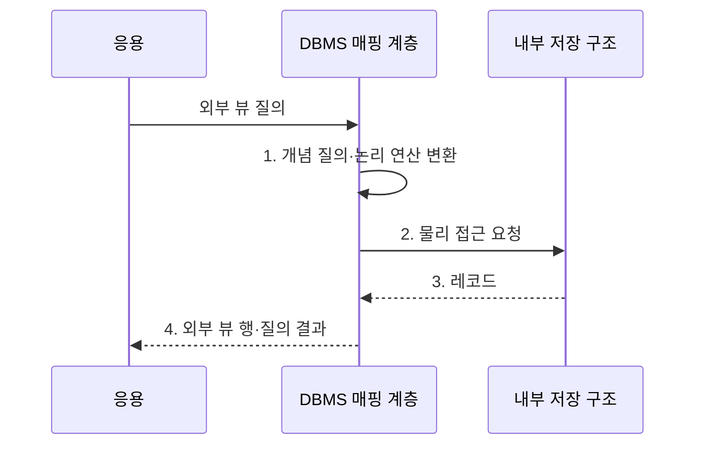

---
sidebar:
  order: 111
  label: "111. 데이터 독립성 - 논리·물리 (Data Independence)"
  badge:
    text: "기출 · 50%"
    variant: note
title: "데이터 독립성 - 논리·물리 (Data Independence)"
date: "2026-08-02T12:00:00+09:00"
tags:
  - "notes-software"
weight: 111
extra:
  question_no: "111"
  source_status: "기출"
  source_history: "128회"
  priority: 50
  priority_note: "128회 기출, 논리·물리 독립성 구조 핵심"
---

## Ⅰ. 개요

핵심 용어

- **데이터 독립성(Data Independence)**: 하위 스키마나 저장 구조의 변경을 계층 간 매핑에서 흡수해 상위 스키마와 응용의 변경을 줄이는 설계 원칙이다.

- 정의/개념: 하위 스키마나 저장 구조의 변경을 계층 간 매핑에서 흡수하여 상위 스키마와 응용의 변경을 줄이는 **데이터 독립성(Data Independence)** 설계 원칙
- 배경/필요성: 스키마·저장 변경이 응용까지 전파되면 **유지보수 비용** 급증

#### 한줄 요약
- 창고 선반을 바꿔도 화면을 고치지 않게 층 사이 번역표를 두는 원리이다.

## Ⅱ. 특징

핵심 용어

- **물리 독립성**: 파일·페이지·인덱스 같은 저장 구조 변경을 개념-내부 매핑에서 흡수하는 성질이다.
- **논리 독립성**: 개념 스키마의 개체·관계·제약 변경을 외부-개념 매핑에서 흡수하는 성질이다.
- **영향 전파 범위**: 한 계층의 변경으로 수정해야 하는 상위 스키마와 응용의 범위이다.

- **물리 독립성**: 저장 구조 변경을 내부 매핑에서 흡수
- **논리 독립성**: 개념 구조 변경을 외부 매핑에서 흡수
- 변경 자체가 아니라 **영향 전파 범위** 통제

#### 한줄 요약
- 저장 방식 변경은 물리적 독립성으로, 업무 구조 변경은 논리적 독립성으로 사용자를 보호한다.

## Ⅲ. 구조 및 구성요소

핵심 용어

- **외부-개념 매핑**: 사용자별 데이터 표현을 전체 개념 구조에 연결하는 변환 규칙이다.
- **외부 스키마**: 응용이나 사용자별 데이터 표현과 뷰를 정의한 계층이다.
- **개념 스키마**: 조직 전체 데이터의 개체·관계·제약을 정의한 논리 계층이다.
- **개념-내부 매핑**: 개념 스키마의 구조를 파일·페이지·인덱스 같은 물리 접근 경로에 연결하는 규칙이다.
- **내부 스키마**: 데이터의 실제 파일 조직과 페이지 및 인덱스를 정의한 물리 계층이다.

| 구성요소 | 책임 |
|:---|:---|
| 외부 스키마 | 응용별 **데이터 표현·뷰** 정의 |
| 외부-개념 매핑 | 외부 표현과 **개념 구조** 변환 |
| 개념 스키마 | 전체 **개체·관계·제약** 정의 |
| 개념-내부 매핑 | 논리 구조와 **물리 접근 경로** 연결 |
| 내부 스키마 | **파일·페이지·인덱스** 정의 |

#### 한줄 요약

- 화면, 논리 구조, 창고 사이에 두 개의 번역표를 둔다.

## Ⅳ. 흐름도

핵심 용어

- **데이터베이스 관리 시스템(Database Management System, DBMS) 매핑 계층**: 외부 뷰와 개념 구조 및 내부 저장 구조 사이의 변환을 수행하는 계층이다.
- **1. 개념 질의·논리 연산 변환**: 사용자별 외부 뷰 질의를 전체 개념 구조의 연산으로 바꾸는 단계이다.
- **2. 물리 접근 요청**: 개념 질의를 현재 파일·페이지·인덱스 접근 경로에 대응시킨 요청이다.
- **3. 레코드**: 내부 저장 구조에서 읽어 매핑 계층으로 반환한 물리 데이터이다.
- **4. 외부 뷰 행·질의 결과**: 내부 레코드를 사용자별 표현으로 복원한 결과이다.

**동작 원리**

1. **개념 질의·논리 연산 변환**: 사용자별 뷰를 전체 논리 구조와 현재 물리 접근 경로에 대응
2. **물리 접근 요청**: 파일·페이지·인덱스에서 레코드 조회
3. **레코드**: 내부 저장 구조에서 물리 레코드 반환
4. **외부 뷰 행·질의 결과**: 저장 구조 변경과 무관한 사용자별 결과로 복원

#### 한줄 요약

- 화면과 창고 사이의 번역표가 바뀐 내부 구조를 감춰 같은 결과를 돌려준다.

## Ⅴ. 종류 및 비교

핵심 용어

- **논리적 독립성**: 개념 스키마 변경을 외부 스키마와 응용 변경 없이 수용하는 성질이다.
- **물리적 독립성**: 파일·페이지·인덱스 변경을 개념 스키마와 응용 변경 없이 수용하는 성질이다.

| 데이터 독립성 유형 | 물리적 독립성 | 논리적 독립성 |
|:---|:---|:---|
| 적용 기준 | **파일·페이지·인덱스** 변경 | **테이블·관계·제약** 변경 |
| 핵심 특징 | **개념-내부 매핑**에서 흡수 | **외부-개념 매핑·호환 뷰**에서 흡수 |
| 한계 | **실행 계획·성능 회귀** 가능 | **의미·쓰기 호환** 복잡성 |

> 요약: 이름·단위·업무 의미 변경은 **단순 호환 뷰로 은닉 불가**

#### 한줄 요약

- 물리 독립성은 창고 배치를, 논리 독립성은 상품 분류표 변경을 감춘다.

## Ⅵ. 실무 고려사항 및 대책

핵심 용어

- **영향 계층·보호 계약**: 변경이 발생한 계층과 기존 소비자에게 유지해야 할 스키마·동작 범위를 명시한 기준이다.
- **읽기·쓰기 경로 분리 검증**: 호환 뷰의 조회뿐 아니라 구버전 쓰기가 새 구조에 같은 의미로 반영되는지 따로 확인하는 활동이다.
- **확장 후 축소·버전 병행**: 호환 구조를 먼저 추가하고 소비자 전환 기간 동안 신구 버전을 함께 운영한 뒤 옛 구조를 제거하는 방식이다.
- **실행 계획·95백분위 응답시간(95th Percentile Latency, p95)·자원량**: 물리 구조 변경 전후의 경로와 꼬리 지연 및 자원 사용을 비교하는 성능 지표이다.
- **전환 지표·폐기 시점**: 구버전 사용량을 측정해 호환 계층을 안전하게 제거할 날짜를 정하는 기준이다.

| 문제 | 대책 | 효과 |
|:---|:---|:---|
| 변경 계층을 오분류하면 잘못된 매핑 밖으로 영향 전파 | **영향 계층·보호 계약** 명시 | **변경 책임 혼동** 방지 |
| 호환 뷰의 읽기만 검증하면 쓰기 의미가 달라질 위험 | **읽기·쓰기 경로** 분리 검증 | **쓰기 의미** 보존 |
| 즉시 스키마 교체는 구버전 소비자 요청 실패 유발 | **확장 후 축소·버전 병행** | **소비자 순차 전환** |
| 물리 구조 변경은 결과가 같아도 실행 계획 악화 가능 | **실행 계획·95백분위 응답시간(95th Percentile Latency, p95)·자원량** 비교 | **성능 회귀** 탐지 |
| 호환 계층을 계속 유지하면 매핑 복잡도 누적 | **전환 지표·폐기 시점** 설정 | **호환 계층 누적** 방지 |

#### 한줄 요약

- 번역표가 결과뿐 아니라 쓰기와 속도까지 유지하는지 확인해야 한다.

## Ⅶ. 결론

핵심 용어

- **외부-개념 매핑**: 논리 구조 변경이 사용자별 표현으로 전파되지 않도록 격리하는 매핑이다.

- 저장 변경은 **개념-내부 매핑**, 논리 변경은 **외부-개념 매핑**에서 격리

#### 한줄 요약

- 어느 층의 변화를 어떤 번역표가 맡을지 정해 위층 사용자를 보호하는 원리이다.
