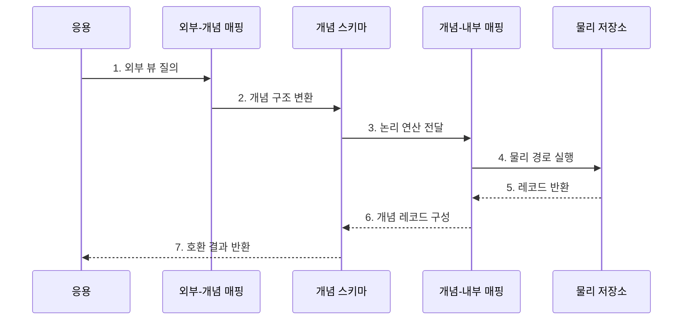

---
sidebar:
  order: 111
  label: "111. 데이터 독립성 - 논리·물리 (Data Independence)"
  badge:
    text: "기출 · 50%"
    variant: note
title: "데이터 독립성 - 논리·물리 (Data Independence)"
date: "2026-07-27T23:59:59+09:00"
tags:
  - "notes-software"
weight: 111
extra:
  question_no: "111"
  source_status: "기출"
  source_history: "128회"
  priority: 50
  priority_note: "128회 기출, 논리·물리 독립성 구조 핵심"
---

## 미리 알고가기

- **데이터 독립성(Data Independence)**: 하위 스키마 변경을 매핑에서 흡수해 상위 스키마와 응용 프로그램의 변경을 줄이는 성질임
- **외부 스키마(External Schema)**: 사용자나 응용 프로그램별로 필요한 데이터 표현을 정의한 뷰임
- **개념 스키마(Conceptual Schema)**: 데이터베이스 전체의 개체·관계·제약을 정의한 논리 구조임
- **내부 스키마(Internal Schema)**: 파일·페이지·인덱스 등 데이터의 물리 저장 구조를 정의한 명세임
- **물리적 독립성(Physical Data Independence)**: 내부 스키마 변경을 개념·외부 스키마 변경 없이 수용하는 성질임
- **논리적 독립성(Logical Data Independence)**: 개념 스키마 변경을 외부 스키마·응용 프로그램 변경 없이 수용하는 성질임
- **외부-개념 매핑(External-Conceptual Mapping)**: 사용자별 외부 표현을 전체 개념 구조에 연결하는 변환 규칙임
- **개념-내부 매핑(Conceptual-Internal Mapping)**: 개념 구조를 물리 저장 경로에 연결하는 변환 규칙임
- **호환 뷰(Compatibility View)**: 변경 전 구조와 같은 열과 의미를 제공해 기존 질의를 계속 지원하는 뷰임
- **성능 회귀(Performance Regression)**: 변경 뒤 기존 처리보다 응답 시간이나 자원 사용량이 나빠지는 현상임

## Ⅰ. 개요

- 정의/개념: 하위 변경을 **매핑으로 흡수해 상위 계약 보호**
- **배경/필요성**: 스키마·저장 변경의 응용 전파 축소

### 쉽게 이해하기 (학습용)
- 창고 선반을 바꿔도 화면을 고치지 않게 층 사이 번역표를 두는 원리임

## Ⅱ. 특징

- **물리 독립성**: 저장 구조 변경을 내부 매핑에서 흡수
- **논리 독립성**: 개념 구조 변경을 외부 매핑에서 흡수
- **영향 경계**: 변경 제거가 아닌 전파 범위 통제

### 쉽게 이해하기 (학습용)
- 저장 방식 변경은 물리적으로 업무 구조 변경은 논리적으로 사용자를 보호함

## Ⅲ. 구조 및 구성요소

| 구성요소 | 책임 |
|:---|:---|
| 외부 스키마 | 응용별 데이터 표현 |
| 외부-개념 매핑 | 외부·논리 구조 변환 |
| 개념 스키마 | 전체 개체·관계·제약 정의 |
| 개념-내부 매핑 | 논리·물리 경로 연결 |
| 내부 스키마 | 파일·페이지·인덱스 정의 |

### 쉽게 이해하기 (학습용)

- 화면, 논리 구조, 창고 사이에 두 개의 번역표를 둔다.

## Ⅳ. 흐름도

**동작 원리**

- **1. 외부 뷰 질의**: 공개 계약으로 요청한다.
- **2. 개념 구조 변환**: 전체 논리 구조에 대응한다.
- **3. 논리 연산 전달**: 내부 매핑으로 보낸다.
- **4. 물리 경로 실행**: 현재 저장 구조를 읽는다.
- **5. 레코드 반환**: 물리 결과를 돌려준다.
- **6. 개념 레코드 구성**: 논리 결과로 바꾼다.
- **7. 호환 결과 반환**: 응용 표현으로 응답한다.

### 쉽게 이해하기 (학습용)

- 화면과 창고 사이의 번역표가 바뀐 내부 구조를 감춰 같은 결과를 돌려준다.

## Ⅴ. 종류 및 비교

| 판단 기준 | 물리적 독립성 | 논리적 독립성 |
|:---|:---|:---|
| 적용 기준 | 파일·인덱스 변경 | 테이블·관계 변경 |
| 핵심 특징 | 내부 매핑에서 흡수 | 외부 매핑·뷰에서 흡수 |
| 한계 | 실행 계획·성능 회귀 | 의미·쓰기 호환 복잡도 |

> 이름·단위·업무 의미가 바뀌는 변경은 단순 뷰만으로 완전히 숨기기 어렵다.

### 쉽게 이해하기 (학습용)

- 물리 독립성은 창고 배치를, 논리 독립성은 상품 분류표 변경을 감춘다.

## Ⅵ. 실무 고려사항 및 대책

| 고려사항 | 대책 | 효과 |
|:---|:---|:---|
| 변경 분류 | 영향 계층·보호 계약 명시 | 책임 혼동 방지 |
| 호환 뷰 | 읽기·쓰기 경로 분리 검증 | 쓰기 의미 보존 |
| 버전 | 확장 후 축소·버전 병행 | 소비자 순차 전환 |
| 성능 | 계획·p95·사용량 비교 | 성능 회귀 탐지 |
| 제거 | 전환 지표·폐기 시점 설정 | 호환 계층 누적 방지 |

> **적용 사례**: 인덱스와 파티션을 변경한 뒤 응용 SQL·결과·지연이 유지되면 물리적 독립성을 확보한 것이다.

### 쉽게 이해하기 (학습용)

- 번역표가 결과뿐 아니라 쓰기와 속도까지 유지하는지 확인해야 한다.

## Ⅶ. 결론

- **변경 계층·보호 계약·호환 비용**으로 독립성 적용 범위를 정한다.

### 쉽게 이해하기 (학습용)

- 어느 층의 변화를 어떤 번역표가 맡을지 정해 위층 사용자를 보호하는 원리이다.
