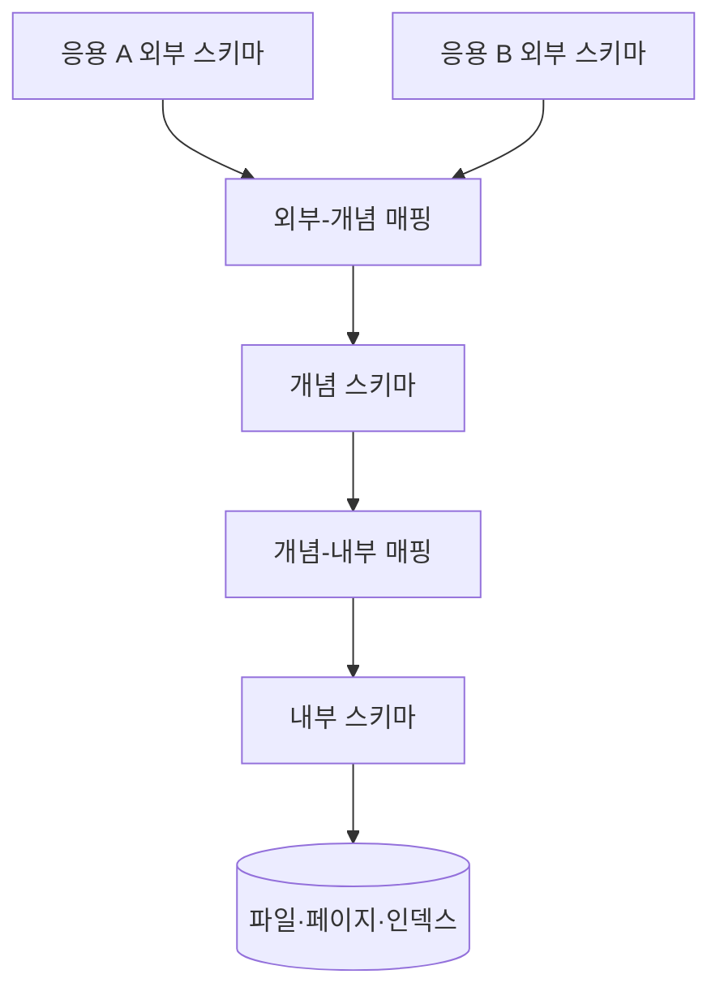
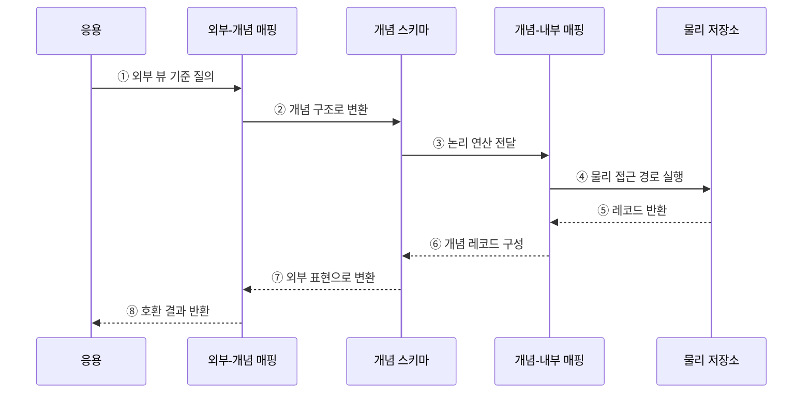

---
sidebar:
  order: 111
  label: "111. 데이터 독립성 - 논리·물리 (Data Independence)"
  badge:
    text: "기출 · 50%"
    variant: note
title: "데이터 독립성 - 논리·물리 (Data Independence)"
date: "2026-07-27T23:59:59+09:00"
tags:
  - "notes-software"
weight: 111
extra:
  question_no: "111"
  source_status: "기출"
  source_history: "128회"
  priority: 50
  priority_note: "128회 기출, 논리·물리 독립성 구조 핵심"
---

## 미리 알고가기

- **데이터 독립성(Data Independence)**: 하위 스키마 변경을 매핑에서 흡수해 상위 스키마와 응용 프로그램의 변경을 줄이는 성질임
- **외부 스키마(External Schema)**: 사용자나 응용 프로그램별로 필요한 데이터 표현을 정의한 뷰임
- **개념 스키마(Conceptual Schema)**: 데이터베이스 전체의 개체·관계·제약을 정의한 논리 구조임
- **내부 스키마(Internal Schema)**: 파일·페이지·인덱스 등 데이터의 물리 저장 구조를 정의한 명세임
- **물리적 독립성(Physical Data Independence)**: 내부 스키마 변경을 개념·외부 스키마 변경 없이 수용하는 성질임
- **논리적 독립성(Logical Data Independence)**: 개념 스키마 변경을 외부 스키마·응용 프로그램 변경 없이 수용하는 성질임
- **외부-개념 매핑(External-Conceptual Mapping)**: 사용자별 외부 표현을 전체 개념 구조에 연결하는 변환 규칙임
- **개념-내부 매핑(Conceptual-Internal Mapping)**: 개념 구조를 물리 저장 경로에 연결하는 변환 규칙임
- **호환 뷰(Compatibility View)**: 변경 전 구조와 같은 열과 의미를 제공해 기존 질의를 계속 지원하는 뷰임
- **성능 회귀(Performance Regression)**: 변경 뒤 기존 처리보다 응답 시간이나 자원 사용량이 나빠지는 현상임

## Ⅰ. 개요

- 데이터 독립성은 하위 스키마의 변경을 계층 간 매핑에서 흡수해 상위 스키마와 응용 프로그램의 수정을 줄이는 성질이다.
- ANSI/SPARC 3단계 스키마에서 외부·개념·내부 계층을 분리해 논리 구조와 물리 저장의 변화 전파를 제한한다.

### 쉽게 이해하기 (학습용)
- 창고 선반을 바꿔도 화면을 고치지 않게 층 사이 번역표를 두는 원리임

## Ⅱ. 특징

- **물리적 독립성**은 인덱스·파일·페이지·파티션 변경을 개념-내부 매핑에서 흡수한다.
- **논리적 독립성**은 테이블·속성·관계 변경을 외부-개념 매핑과 호환 뷰에서 흡수한다.
- 일반적으로 응용의 의미 계약과 가까운 논리적 독립성이 물리적 독립성보다 달성하기 어렵다.
- 독립성은 변경을 없애는 것이 아니라 변경 영향의 경계와 책임을 명확히 한다.

### 쉽게 이해하기 (학습용)
- 저장 방식 변경은 물리적으로 업무 구조 변경은 논리적으로 사용자를 보호함

## Ⅲ. 아키텍처 및 구성요소

**도표안 A — 구조도**

**도표안 B — sequenceDiagram**

| 구성요소 | 역할 |
|:---|:---|
| 외부 스키마 | 사용자·응용별 데이터 표현과 뷰 |
| 외부-개념 매핑 | 외부 표현과 전체 논리 구조 사이 변환 |
| 개념 스키마 | 전체 DB의 개체·관계·제약 정의 |
| 개념-내부 매핑 | 논리 구조와 파일·인덱스 접근 경로 연결 |
| 내부 스키마 | 레코드 배치·페이지·인덱스 등 물리 저장 정의 |

**동작 원리**

- ① 응용이 자신에게 공개된 외부 뷰를 기준으로 질의한다.
- ② 외부-개념 매핑이 질의를 전체 개념 구조로 변환한다.
- ③ 개념 스키마가 논리 연산을 개념-내부 매핑에 전달한다.
- ④ 개념-내부 매핑이 현재 인덱스·파일 구조의 접근 경로를 실행한다.
- ⑤ 물리 저장소가 해당 레코드를 반환한다.
- ⑥ 내부 매핑이 물리 레코드를 개념 레코드로 구성한다.
- ⑦ 개념 결과를 응용별 외부 표현으로 다시 변환한다.
- ⑧ 응용은 하위 구조와 무관한 호환 결과를 받는다.

### 쉽게 이해하기 (학습용)

- 화면과 창고 사이의 번역표가 바뀐 내부 구조를 감춰 같은 결과를 돌려준다.

## Ⅳ. 종류 및 비교

| 비교 항목 | 물리적 독립성 | 논리적 독립성 |
|:---|:---|:---|
| 변경 대상 | 파일·페이지·인덱스·파티션 | 테이블·속성·관계·제약 |
| 보호 대상 | 개념·외부 스키마와 응용 | 외부 스키마와 응용 |
| 흡수 계층 | 개념-내부 매핑·옵티마이저 | 외부-개념 매핑·호환 뷰 |
| 예 | B+Tree 추가, 파일 배치 변경 | 열 분할·통합, 관계 구조 변경 |
| 주요 한계 | 실행 계획·성능 회귀 | 의미 변화·뷰 복잡도·쓰기 호환 |

> 이름·단위·업무 의미가 바뀌는 변경은 단순 뷰만으로 완전히 숨기기 어렵다.

### 쉽게 이해하기 (학습용)

- 물리 독립성은 창고 배치를, 논리 독립성은 상품 분류표 변경을 감춘다.

## Ⅴ. 실무 고려사항 및 대책

| 고려사항 | 위험 | 대책 |
|:---|:---|:---|
| 변경 분류 | 논리·물리 변경의 책임 혼동 | 영향 계층과 보호할 상위 계약 명시 |
| 호환 뷰 | 읽기만 호환되고 쓰기 의미 불일치 | 읽기·쓰기 경로를 따로 검증 |
| 버전 | 모든 소비자를 동시에 변경 | 확장 후 축소, 뷰·API 버전 병행 |
| 성능 | 결과는 같지만 실행 계획 회귀 | 대표 질의의 계획·p95·자원 비교 |
| 의미 | 이름만 유지하고 단위·정의 변경 | 데이터 계약·변환·품질 규칙 문서화 |
| 제거 | 호환 계층이 영구 누적 | 소비자 전환 지표와 폐기 시점 설정 |

> **적용 사례**: 인덱스와 파티션을 변경한 뒤 응용 SQL·결과·지연이 유지되면 물리적 독립성을 확보한 것이다.

### 쉽게 이해하기 (학습용)

- 번역표가 결과뿐 아니라 쓰기와 속도까지 유지하는지 확인해야 한다.

## Ⅵ. 결론

- 데이터 독립성은 외부·개념·내부 스키마와 매핑을 분리해 하위 변경의 상위 전파를 줄이는 성질이다.
- 변경 계층을 정확히 분류하고 결과·쓰기·성능·의미 계약의 호환성을 함께 검증해야 한다.

### 쉽게 이해하기 (학습용)

- 어느 층의 변화를 어떤 번역표가 맡을지 정해 위층 사용자를 보호하는 원리이다.
