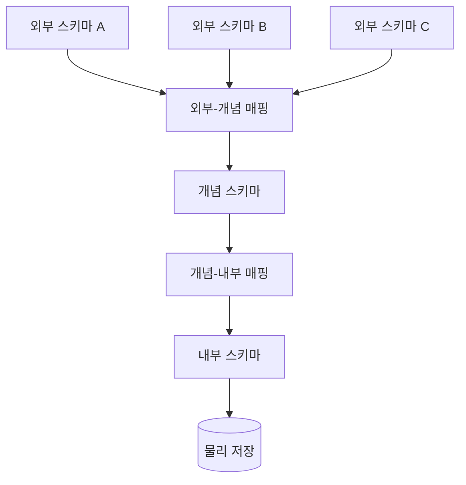
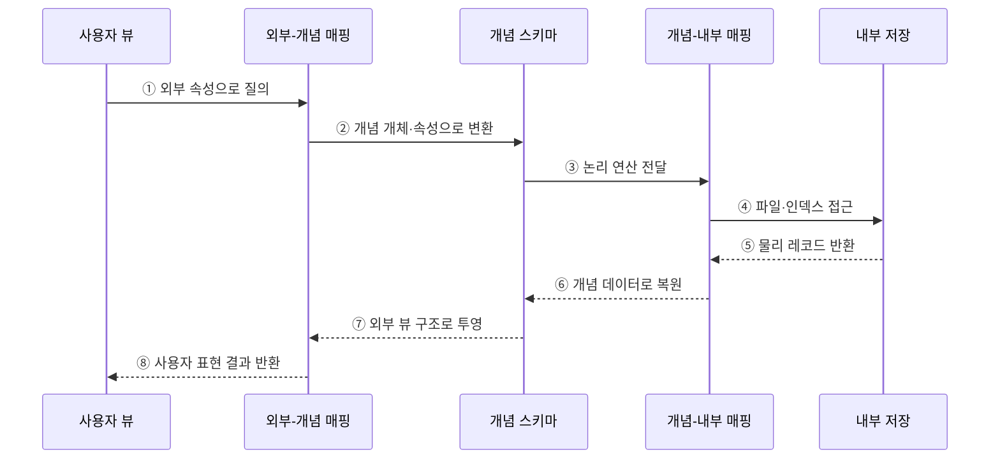

---
sidebar:
  order: 112
  label: "112. 3단계 스키마 - 외부·개념·내부 (Three-Level Schema)"
  badge:
    text: "기출 · 50%"
    variant: note
title: "3단계 스키마 - 외부·개념·내부 (Three-Level Schema)"
date: "2026-07-27T23:59:59+09:00"
tags:
  - "notes-software"
weight: 112
extra:
  question_no: "112"
  source_status: "기출"
  source_history: "128회"
  priority: 50
  priority_note: "128회 기출, 외부·개념·내부 스키마 구조"
---

## 미리 알고가기

- **3단계 스키마(Three-level Schema Architecture)**: 데이터베이스 구조를 외부·개념·내부 계층으로 분리한 추상화 모델임
- **외부 스키마(External Schema)**: 사용자나 응용 프로그램별 데이터 표현과 접근 범위를 정의하는 계층임
- **개념 스키마(Conceptual Schema)**: 전체 데이터의 개체·관계·제약을 정의하는 단일 논리 계층임
- **내부 스키마(Internal Schema)**: 레코드·파일·인덱스·파티션의 물리 저장 구조를 정의하는 계층임
- **외부-개념 매핑(External-Conceptual Mapping)**: 사용자별 외부 표현을 개념 구조에 연결하는 변환 규칙임
- **개념-내부 매핑(Conceptual-Internal Mapping)**: 개념 구조를 물리 레코드와 접근 경로에 연결하는 변환 규칙임
- **데이터 독립성(Data Independence)**: 하위 계층의 변경을 매핑에서 흡수해 상위 계층의 변경을 줄이는 성질임
- **뷰(View)**: 기본 데이터에서 필요한 열과 행을 선택·변환해 제공하는 논리적 테이블임

## Ⅰ. 개요

- 3단계 스키마는 데이터베이스를 사용자 관점의 외부, 전체 논리 관점의 개념, 물리 저장 관점의 내부 스키마로 분리한 추상화 구조이다.
- 두 계층 간 매핑이 표현·논리·저장 형식의 차이를 변환해 데이터 독립성을 지원한다.

### 쉽게 이해하기 (학습용)
- 화면과 장부 및 창고 배치를 세 층으로 나누고 번역표로 연결하는 구조임

## Ⅱ. 특징

- **다중 외부 스키마**는 사용자·응용마다 필요한 표현과 접근 범위를 제공한다.
- **단일 개념 스키마**는 전체 데이터의 개체·관계·제약과 의미를 통합한다.
- **단일 내부 스키마**는 레코드·페이지·파일·인덱스·파티션 배치를 정의한다.
- 외부-개념·개념-내부 매핑이 질의와 결과를 계층 사이에서 변환한다.

### 쉽게 이해하기 (학습용)
- 각 층이 관심사를 분리해 변경이 다른 층으로 바로 번지는 것을 줄임

## Ⅲ. 아키텍처 및 구성요소

**도표안 A — 구조도**

**도표안 B — sequenceDiagram**

| 구성요소 | 역할 |
|:---|:---|
| 외부 스키마 | 사용자별 뷰·표현·접근 범위 정의 |
| 외부-개념 매핑 | 여러 외부 속성을 공통 개념 구조에 연결 |
| 개념 스키마 | 전체 개체·관계·제약의 단일 논리 모델 |
| 개념-내부 매핑 | 논리 개체를 물리 레코드·접근 경로에 연결 |
| 내부 스키마 | 파일·페이지·인덱스·파티션 배치 정의 |

**동작 원리**

- ① 사용자나 응용이 외부 스키마의 속성으로 질의한다.
- ② 외부-개념 매핑이 외부 표현을 개념 개체·속성으로 변환한다.
- ③ 개념 스키마가 논리 연산을 개념-내부 매핑에 전달한다.
- ④ 개념-내부 매핑이 현재 파일·인덱스의 물리 접근을 수행한다.
- ⑤ 내부 저장소가 물리 레코드를 반환한다.
- ⑥ 개념-내부 매핑이 레코드를 개념 데이터로 복원한다.
- ⑦ 외부-개념 매핑이 필요한 행·열·표현으로 투영한다.
- ⑧ 사용자에게 외부 스키마와 일치하는 결과를 반환한다.

### 쉽게 이해하기 (학습용)

- 화면의 이름을 공통 장부와 창고 위치로 번역해 찾은 뒤 다시 화면 모양으로 돌려준다.

## Ⅳ. 종류 및 비교

| 비교 항목 | 외부 스키마 | 개념 스키마 | 내부 스키마 |
|:---|:---|:---|:---|
| 관점 | 사용자·응용 | 조직 전체 논리 | 저장 시스템 |
| 개수 | 여러 개 | 하나 | 하나 |
| 주요 내용 | 뷰·별칭·접근 범위 | 개체·속성·관계·제약 | 레코드·파일·인덱스·파티션 |
| 변경 예 | 화면별 열·표현 변경 | 테이블 분해·관계 추가 | 인덱스·페이지 배치 변경 |
| 주요 위험 | 뷰 난립·권한 누락 | 의미 충돌·광범위한 영향 | 성능 회귀·제품 종속 |

> 외부 스키마가 여러 개여도 개념 스키마는 공통 의미와 무결성 규칙의 중심이어야 한다.

### 쉽게 이해하기 (학습용)

- 외부는 화면, 개념은 공통 업무 장부, 내부는 저장 창고의 배치이다.

## Ⅴ. 실무 고려사항 및 대책

| 고려사항 | 위험 | 대책 |
|:---|:---|:---|
| 의미 중심 | 응용별 표현이 공통 의미를 왜곡 | 개념 스키마에 용어·규칙·소유권 정의 |
| 외부 뷰 | 중복 뷰·권한 누락 | 소비자·용도·민감도별 카탈로그 운영 |
| 매핑 | 복잡한 변환으로 오류·지연 | 변환 책임·테스트·계보와 성능 지표 관리 |
| 변경 | 계층 구분 없이 직접 스키마 수정 | 변경 계층·호환 범위·버전 전략 사전 결정 |
| 보안 | 내부 열이 외부 뷰로 노출 | 최소 권한·행/열 마스킹·접근 감사 |
| 폐기 | 사용하지 않는 외부 스키마 누적 | 사용량 기반 소비자 확인·단계적 제거 |

> **적용 사례**: 같은 고객 개념 스키마에서 상담원용 연락처 뷰와 분석가용 익명 통계 뷰를 분리한다.

### 쉽게 이해하기 (학습용)

- 공통 장부는 하나로 유지하되 사용자마다 필요한 항목과 권한만 다른 화면으로 제공한다.

## Ⅵ. 결론

- 3단계 스키마는 사용자 표현·공통 논리·물리 저장을 분리하고 두 매핑으로 연결하는 구조이다.
- 개념 스키마를 의미의 중심으로 두고 매핑의 정확성·권한·성능·변경 호환성을 관리해야 한다.

### 쉽게 이해하기 (학습용)

- 화면·장부·창고를 나누고 번역표로 연결해 각 층의 변화를 격리한다.
