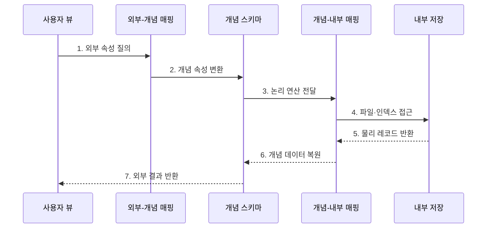

---
sidebar:
  order: 112
  label: "112. 3단계 스키마 - 외부·개념·내부 (Three-Level Schema)"
  badge:
    text: "기출 · 50%"
    variant: note
title: "3단계 스키마 - 외부·개념·내부 (Three-Level Schema)"
date: "2026-07-27T23:59:59+09:00"
tags:
  - "notes-software"
weight: 112
extra:
  question_no: "112"
  source_status: "기출"
  source_history: "128회"
  priority: 50
  priority_note: "128회 기출, 외부·개념·내부 스키마 구조"
---

## 미리 알고가기

- **3단계 스키마(Three-level Schema Architecture)**: 데이터베이스 구조를 외부·개념·내부 계층으로 분리한 추상화 모델이다.
- **외부 스키마(External Schema)**: 사용자나 응용 프로그램별 데이터 표현과 접근 범위를 정의하는 계층이다.
- **개념 스키마(Conceptual Schema)**: 전체 데이터의 개체·관계·제약을 정의하는 단일 논리 계층이다.
- **내부 스키마(Internal Schema)**: 레코드·파일·인덱스·파티션의 물리 저장 구조를 정의하는 계층이다.
- **외부-개념 매핑(External-Conceptual Mapping)**: 사용자별 외부 표현을 개념 구조에 연결하는 변환 규칙이다.
- **개념-내부 매핑(Conceptual-Internal Mapping)**: 개념 구조를 물리 레코드와 접근 경로에 연결하는 변환 규칙이다.
- **데이터 독립성(Data Independence)**: 하위 계층의 변경을 매핑에서 흡수해 상위 계층의 변경을 줄이는 성질이다.
- **뷰(View)**: 기본 데이터에서 필요한 열과 행을 선택·변환해 제공하는 논리적 테이블이다.

## Ⅰ. 개요

- 정의/개념: DB 스키마를 **외부·개념·내부로 나눈 3계층 구조**
- 배경/필요성: 표현·논리·저장 변경의 영향 격리

### 쉽게 이해하기 (학습용)
- 화면과 장부 및 창고 배치를 세 층으로 나누고 번역표로 연결하는 구조임

## Ⅱ. 특징

- **다중 외부**: 사용자별 표현·접근 범위 제공
- **단일 개념**: 전체 개체·관계·제약 통합
- **단일 내부**: 파일·인덱스·파티션 배치 정의

### 쉽게 이해하기 (학습용)
- 각 층이 관심사를 분리해 변경이 다른 층으로 바로 번지는 것을 줄임

## Ⅲ. 구조 및 구성요소

| 구성요소 | 책임 |
|:---|:---|
| 외부 스키마 | 사용자별 뷰·접근 범위 |
| 외부-개념 매핑 | 외부 속성을 개념에 연결 |
| 개념 스키마 | 전체 개체·관계·제약 |
| 개념-내부 매핑 | 논리를 물리 경로에 연결 |
| 내부 스키마 | 파일·인덱스·파티션 배치 |

### 쉽게 이해하기 (학습용)

- 사용자 화면, 공통 장부, 저장 창고를 두 번역표로 연결한다.

## Ⅳ. 흐름도

**동작 원리**

- **1. 외부 속성 질의**: 사용자 표현으로 요청
- **2. 개념 속성 변환**: 공통 의미로 변경
- **3. 논리 연산 전달**: 내부 매핑으로 전달
- **4. 파일·인덱스 접근**: 물리 경로를 실행
- **5. 물리 레코드 반환**: 저장 결과를 반환
- **6. 개념 데이터 복원**: 논리 구조로 변경
- **7. 외부 결과 반환**: 사용자 표현으로 응답

### 쉽게 이해하기 (학습용)

- 화면의 이름을 공통 장부와 창고 위치로 번역해 찾은 뒤 다시 화면 모양으로 돌려준다.

## Ⅴ. 종류 및 비교

| 판단 기준 | 외부 스키마 | 개념 스키마 | 내부 스키마 |
|:---|:---|:---|:---|
| 적용 기준 | 사용자별 표현 | 조직 전체 의미 | 저장 구조 |
| 핵심 특징 | 다중 뷰·접근 범위 | 단일 개체·관계·제약 | 파일·인덱스·파티션 |
| 한계 | 뷰 난립·권한 누락 | 의미 충돌·변경 영향 | 성능 회귀·제품 종속 |

> 설계 원칙: 다중 외부 스키마의 **공통 의미·무결성 중심은 개념 스키마**

### 쉽게 이해하기 (학습용)

- 외부는 화면, 개념은 공통 업무 장부, 내부는 저장 창고의 배치이다.

## Ⅵ. 실무 고려사항 및 대책

| 고려사항 | 대책 | 효과 |
|:---|:---|:---|
| 개념 의미 | 용어·규칙·소유권 정의 | 응용별 의미 왜곡 방지 |
| 외부 뷰 | 소비자·민감도별 카탈로그 | 중복·권한 누락 감소 |
| 매핑 | 책임·테스트·계보 관리 | 변환 오류·지연 통제 |
| 변경 | 계층·호환·버전 전략 결정 | 영향 범위 축소 |
| 보안 | 최소 권한·행열 마스킹 | 내부 데이터 노출 방지 |

> **적용 사례**: 같은 고객 개념 스키마에서 상담원용 연락처 뷰와 분석가용 익명 통계 뷰를 분리

### 쉽게 이해하기 (학습용)

- 공통 장부는 하나로 유지하되 사용자마다 필요한 항목과 권한만 다른 화면으로 제공한다.

## Ⅶ. 결론

- **사용자 표현·공통 의미·저장 변화**로 3단계 책임을 분리

### 쉽게 이해하기 (학습용)

- 화면·장부·창고를 나누고 번역표로 연결해 각 층의 변화를 격리한다.
