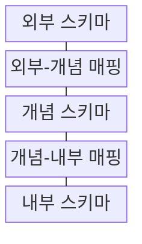
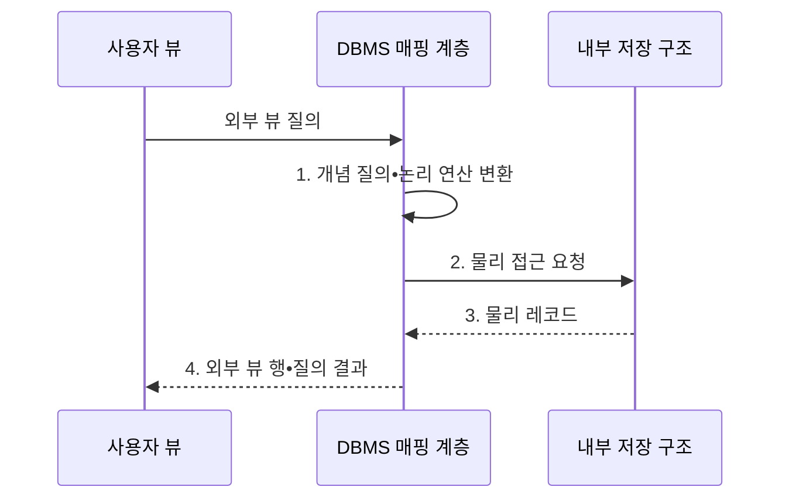

---
sidebar:
  order: 112
  label: "112. 3단계 스키마 - 외부•개념•내부 (Three-Level Schema)"
  badge:
    text: "기출 • 50%"
    variant: note
title: "3단계 스키마 - 외부•개념•내부 (Three-Level Schema)"
date: "2026-08-04T13:12:00+09:00"
tags:
  - "notes-software"
weight: 112
extra:
  question_no: "112"
  source_status: "기출"
  source_history: "128회"
  priority: 50
  priority_note: "128회 기출, 외부•개념•내부 스키마 구조"
---

## Ⅰ. 개요

핵심 용어

- **3단계 스키마(Three-Level Schema)**: 사용자별 외부 스키마와 통합 논리 개념 스키마 및 물리 저장 내부 스키마로 데이터베이스 구조를 분리한 추상화 모델이다.

- 정의/개념: 표현•논리•저장을 분리한 **3단계 스키마** 추상화 모델
- 배경/필요성: 표현•논리•저장을 결합하면 **구조 변경 영향** 이 전체 응용으로 전파

#### 한줄 요약
- 화면과 장부 및 창고 배치를 세 층으로 나누고 번역표로 연결하는 구조이다.

## Ⅱ. 특징

핵심 용어

- **단일 개념**: 조직 전체의 개체•관계•제약을 하나의 공통 논리 구조로 통합하는 특성이다.
- **다중 외부**: 사용자와 응용마다 필요한 데이터 표현과 접근 범위를 별도 뷰로 제공하는 특성이다.
- **단일 내부**: 파일•인덱스•파티션의 실제 저장 배치를 하나의 물리 구조로 정의하는 특성이다.

- **다중 외부**: 사용자별 표현•접근 범위 제공
- **단일 개념**: 전체 개체•관계•제약 통합
- **단일 내부**: 파일•인덱스•파티션 배치 정의

#### 한줄 요약
- 각 층이 관심사를 분리해 변경이 다른 층으로 바로 번지는 것을 줄인다.

## Ⅲ. 구조 및 구성요소

핵심 용어

- **개념-내부 매핑**: 논리 구조를 파일•인덱스•파티션 같은 물리 접근 경로에 연결하는 규칙이다.
- **외부 스키마**: 사용자와 응용별 뷰 및 접근 범위를 정의하는 표현 계층이다.
- **외부-개념 매핑**: 외부 속성과 뷰를 조직 전체의 공통 개념에 연결하는 규칙이다.
- **개념 스키마**: 전체 데이터의 개체•관계•제약 및 업무 의미를 정의하는 논리 계층이다.
- **내부 스키마**: 파일•페이지•인덱스•파티션의 물리 배치를 정의하는 저장 계층이다.

| 구성요소 | 책임 |
|:---|:---|
| 외부 스키마 | 사용자별 **뷰•접근 범위** 정의 |
| 외부-개념 매핑 | 외부 속성을 **공통 개념** 에 연결 |
| 개념 스키마 | 전체 **개체•관계•제약** 정의 |
| 개념-내부 매핑 | 논리 구조를 **물리 접근 경로** 에 연결 |
| 내부 스키마 | **파일•인덱스•파티션** 배치 |

#### 한줄 요약

- 사용자 화면, 공통 장부, 저장 창고를 두 번역표로 연결한다.

## Ⅳ. 흐름도

핵심 용어

- **데이터베이스 관리 시스템(Database Management System, DBMS) 매핑 계층**: 외부•개념•내부 스키마 사이의 질의와 결과 변환을 수행하는 계층이다.
- **1. 개념 질의•논리 연산 변환**: 외부 뷰 질의를 공통 개념 스키마의 연산으로 바꾸는 단계이다.
- **2. 물리 접근 요청**: 논리 연산을 현재 파일•인덱스•파티션 접근 경로에 대응시킨 요청이다.
- **3. 물리 레코드**: 내부 저장 구조가 매핑 계층으로 반환한 조회 결과이다.
- **4. 외부 뷰 행•질의 결과**: 물리 레코드를 공통 논리 행과 사용자별 표현으로 복원한 결과이다.

**동작 원리**

1. **개념 질의•논리 연산 변환**: 외부 뷰를 공통 논리 의미와 현재 물리 접근 경로에 대응
2. **물리 접근 요청**: 내부 파일•인덱스•파티션에서 레코드 조회
3. **물리 레코드**: 내부 저장 구조에서 조회 결과 반환
4. **외부 뷰 행•질의 결과**: 매핑을 거쳐 공통 논리 행과 사용자 뷰로 복원

#### 한줄 요약

- 화면의 이름을 공통 장부와 창고 위치로 번역해 찾은 뒤 다시 화면 모양으로 돌려준다.

## Ⅴ. 종류 및 비교

핵심 용어

- **논리적 데이터 독립성(Logical Data Independence)**: 개념 스키마가 바뀌어도 외부 스키마와 응용 프로그램의 표현을 가능한 한 유지하는 성질이다.

| 스키마 계층 | 표현 대상 | 인접 계층과의 매핑 역할 |
|:---|:---|:---|
| **외부 스키마** | 사용자별 **뷰•접근 범위** | 외부 표현을 개념 스키마의 공통 의미로 변환 |
| **개념 스키마** | 조직 전체의 **개체•관계•제약** | 외부 의미와 내부 저장 구조를 분리하는 기준점 |
| **내부 스키마** | **파일•인덱스•파티션** | 개념 레코드를 물리 위치와 접근 경로로 변환 |

> 요약: 개념 스키마가 바뀌어도 외부 표현을 유지하는 **논리적 데이터 독립성**

#### 한줄 요약

- 외부는 화면, 개념은 공통 업무 장부, 내부는 저장 창고의 배치이다.

## Ⅵ. 실무 고려사항 및 대책

핵심 용어

- **용어 사전**: 개념 스키마에서 사용하는 업무 용어의 공통 의미를 정의한 목록이다.
- **불변식**: 데이터가 항상 지켜야 하는 업무 규칙이다.
- **소유권**: 스키마 변경을 승인하고 관리할 책임 주체이다.
- **뷰 카탈로그**: 외부 뷰의 소비자와 민감도, 소유자, 버전을 관리하는 목록이다.
- **계약 테스트**: 매핑 변경 전후의 열과 값 의미를 검증하는 시험이다.
- **데이터 계보**: 원천부터 소비자까지 데이터 변환 경로를 추적하는 정보이다.
- **변경 계층**: 수정 대상을 제한할 하나의 스키마 계층이다.
- **호환 버전**: 구버전 소비자를 일정 기간 지원하는 스키마이다.
- **최소 권한**: 업무에 필요한 데이터 접근만 허용하는 통제이다.
- **행 마스킹**: 조건에 맞는 민감한 행을 숨기는 통제이다.
- **열 마스킹**: 민감한 열의 값을 가리거나 변환하는 통제이다.

| 문제 | 대책 | 효과 |
|:---|:---|:---|
| 응용마다 같은 용어의 의미가 다르면 개념 스키마 충돌 | **용어•불변식•소유권** 정의 | **응용별 의미 왜곡** 방지 |
| 소유자 없는 외부 뷰가 늘면 중복•권한 누락 발생 | 소비자•민감도별 **뷰 카탈로그** | **중복•권한 누락** 감소 |
| 매핑 변경을 무검증 배포하면 열•값 변환 오류 발생 | **계약 테스트•데이터 계보** 관리 | **변환 오류•지연** 통제 |
| 여러 계층을 동시에 바꾸면 영향 범위 추적 곤란 | **변경 계층•호환 버전** 분리 | **변경 영향 범위** 축소 |
| 외부 스키마가 민감 열을 그대로 노출할 위험 | **최소 권한•행•열 마스킹** | **내부 데이터 노출** 방지 |

#### 한줄 요약

- 공통 장부는 하나로 유지하되 사용자마다 필요한 항목과 권한만 다른 화면으로 제공한다.

## Ⅶ. 결론

핵심 용어

- **외부•개념•내부 스키마**: 표현•의미•저장 변경을 각각 배치해 계층 사이의 영향을 줄이는 구조이다.

- 표현•의미•저장 변경을 배치할 **외부•개념•내부 스키마** 계층 구분

#### 한줄 요약

- 화면•장부•창고를 나누고 번역표로 연결해 각 층의 변화를 격리한다.
