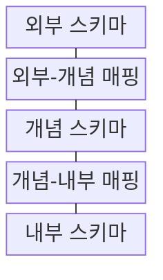
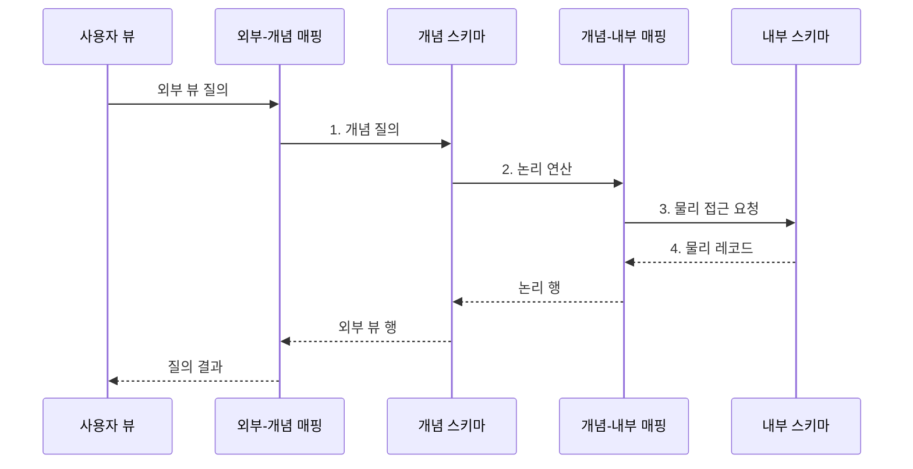

---
sidebar:
  order: 112
  label: "112. 3단계 스키마 - 외부·개념·내부 (Three-Level Schema)"
  badge:
    text: "기출 · 50%"
    variant: note
title: "3단계 스키마 - 외부·개념·내부 (Three-Level Schema)"
date: "2026-07-30T23:50:57+09:00"
tags:
  - "notes-software"
weight: 112
extra:
  question_no: "112"
  source_status: "기출"
  source_history: "128회"
  priority: 50
  priority_note: "128회 기출, 외부·개념·내부 스키마 구조"
---

## 미리 알고가기

- **3단계 스키마(Three-level Schema Architecture)**: 데이터베이스 구조를 외부·개념·내부 계층으로 분리한 추상화 모델이다.
- **외부 스키마(External Schema)**: 사용자나 응용 프로그램별 데이터 표현과 접근 범위를 정의하는 계층이다.
- **개념 스키마(Conceptual Schema)**: 전체 데이터의 개체·관계·제약을 정의하는 단일 논리 계층이다.
- **내부 스키마(Internal Schema)**: 레코드·파일·인덱스·파티션의 물리 저장 구조를 정의하는 계층이다.
- **외부-개념 매핑(External-Conceptual Mapping)**: 사용자별 외부 표현을 개념 구조에 연결하는 변환 규칙이다.
- **개념-내부 매핑(Conceptual-Internal Mapping)**: 개념 구조를 물리 레코드와 접근 경로에 연결하는 변환 규칙이다.
- **데이터 독립성(Data Independence)**: 하위 계층의 변경을 매핑에서 흡수해 상위 계층의 변경을 줄이는 성질이다.
- **뷰(View)**: 기본 데이터에서 필요한 열과 행을 선택·변환해 제공하는 논리적 테이블이다.
- **데이터베이스(Database, DB)**: 데이터를 구조화해 저장·조회·관리하는 시스템
- **데이터 계보(Data Lineage)**: 데이터가 어느 원천에서 어떤 변환을 거쳐 결과에 도달했는지 추적하는 정보
- **행·열 마스킹(Row·Column Masking)**: 사용자 권한에 따라 민감한 행이나 열의 값·노출 범위를 제한하는 통제

> **키워드:** 3단계 스키마 - 외부·개념·내부 (Three-Level Schema)

## Ⅰ. 개요

- 정의/개념: DB 구조를 **외부·개념·내부 계층**으로 분리한 **추상화 모델**
- 배경/필요성: 표현·논리·저장을 결합하면 **구조 변경 영향**이 전체 응용으로 전파

### 쉽게 이해하기 (학습용)
- 화면과 장부 및 창고 배치를 세 층으로 나누고 번역표로 연결하는 구조이다.

## Ⅱ. 특징

- **다중 외부**: 사용자별 표현·접근 범위 제공
- **단일 개념**: 전체 개체·관계·제약 통합
- **단일 내부**: 파일·인덱스·파티션 배치 정의

### 쉽게 이해하기 (학습용)
- 각 층이 관심사를 분리해 변경이 다른 층으로 바로 번지는 것을 줄인다.

## Ⅲ. 구조 및 구성요소

| 구성요소 | 책임 |
|:---|:---|
| 외부 스키마 | 사용자별 **뷰·접근 범위** 정의 |
| 외부-개념 매핑 | 외부 속성을 **공통 개념**에 연결 |
| 개념 스키마 | 전체 **개체·관계·제약** 정의 |
| 개념-내부 매핑 | 논리 구조를 **물리 접근 경로**에 연결 |
| 내부 스키마 | **파일·인덱스·파티션** 배치 |

### 쉽게 이해하기 (학습용)

- 사용자 화면, 공통 장부, 저장 창고를 두 번역표로 연결한다.

## Ⅳ. 흐름도

**동작 원리**

1. **개념 질의**: 외부 뷰의 열·조건을 공통 논리 의미로 변환
2. **논리 연산**: 개념 질의를 현재 물리 접근 경로에 대응
3. **물리 접근 요청**: 내부 파일·인덱스·파티션에서 레코드 조회
4. **물리 레코드**: 매핑을 거쳐 공통 논리 행과 외부 뷰로 복원

### 쉽게 이해하기 (학습용)

- 화면의 이름을 공통 장부와 창고 위치로 번역해 찾은 뒤 다시 화면 모양으로 돌려준다.

## Ⅴ. 종류 및 비교

| 스키마 계층 | 외부 스키마 | 개념 스키마 | 내부 스키마 |
|:---|:---|:---|:---|
| 적용 기준 | **사용자별 표현·접근 범위** | 조직 전체의 **공통 의미** | **물리 저장 구조** |
| 핵심 특징 | 다중 **뷰·접근 계약** | 단일 **개체·관계·제약** | **파일·인덱스·파티션** |
| 한계 | **뷰 난립·권한 누락** | **의미 충돌·변경 영향** | **성능 회귀·제품 종속** |

> 요약: 다중 외부 표현의 **공통 의미·무결성**은 개념 스키마가 소유

### 쉽게 이해하기 (학습용)

- 외부는 화면, 개념은 공통 업무 장부, 내부는 저장 창고의 배치이다.

## Ⅵ. 실무 고려사항 및 대책

| 고려사항 | 대책 | 효과 |
|:---|:---|:---|
| 응용마다 같은 용어의 의미가 다르면 개념 스키마 충돌 | **용어·불변식·소유권** 정의 | **응용별 의미 왜곡** 방지 |
| 소유자 없는 외부 뷰가 늘면 중복·권한 누락 발생 | 소비자·민감도별 **뷰 카탈로그** | **중복·권한 누락** 감소 |
| 매핑 변경을 무검증 배포하면 열·값 변환 오류 발생 | **계약 테스트·데이터 계보** 관리 | **변환 오류·지연** 통제 |
| 여러 계층을 동시에 바꾸면 영향 범위 추적 곤란 | **변경 계층·호환 버전** 분리 | **변경 영향 범위** 축소 |
| 외부 스키마가 민감 열을 그대로 노출할 위험 | **최소 권한·행·열 마스킹** | **내부 데이터 노출** 방지 |

### 쉽게 이해하기 (학습용)

- 공통 장부는 하나로 유지하되 사용자마다 필요한 항목과 권한만 다른 화면으로 제공한다.

## Ⅶ. 결론

- 표현·의미·저장 변경을 각각 **외부·개념·내부 스키마**에 배치

### 쉽게 이해하기 (학습용)

- 화면·장부·창고를 나누고 번역표로 연결해 각 층의 변화를 격리한다.
