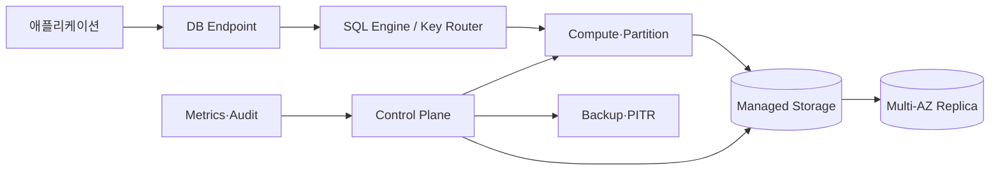
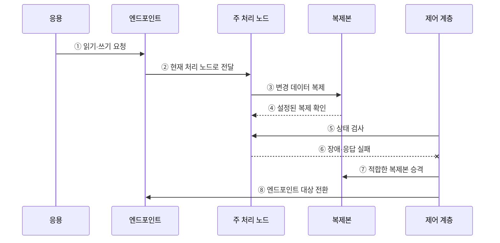

---
sidebar:
  order: 113
  label: "113. 클라우드 DB - RDS·Aurora·DynamoDB 비교 (Cloud Database)"
  badge:
    text: "기출 · 50%"
    variant: note
title: "클라우드 DB - RDS·Aurora·DynamoDB 비교 (Cloud Database)"
date: "2026-07-27T23:59:59+09:00"
tags:
  - "notes-software"
weight: 113
extra:
  question_no: "113"
  source_status: "기출"
  source_history: "138회"
  priority: 50
  priority_note: "138회 기출, 관리형 데이터베이스 선택 현안"
---

## 미리 알고가기

- **관리형 데이터베이스(Managed Database)**: 프로비저닝·패치·백업·장애 조치 등의 운영 기능을 공급자가 수행하는 서비스임
- **데이터베이스(Database, DB)**: ‘디비’로 읽고 영문 합성어의 첫 글자를 딴 약어이며, 구조화된 데이터를 저장·조회·갱신하는 시스템
- **아마존 웹 서비스(Amazon Web Services, AWS)**: ‘에이더블유에스’로 읽고 영문 첫 글자를 딴 약어이며, RDS·Aurora·DynamoDB를 제공하는 클라우드 공급자
- **아마존 관계형 데이터베이스 서비스(Amazon Relational Database Service, RDS)**: ‘알디에스’로 읽고 영문 핵심어의 첫 글자를 딴 약어이며, 관계형 엔진의 배포·백업·장애 조치를 관리하는 서비스
- **아마존 오로라(Amazon Aurora)**: MySQL·PostgreSQL 호환 엔진과 여러 가용 영역에 걸친 클러스터 볼륨을 사용하는 관계형 데이터베이스임
- **아마존 다이나모DB(Amazon DynamoDB)**: ‘다이나모디비’로 읽고 DB는 Database의 첫 글자를 딴 약어이며, 파티션 키로 항목을 분산하는 관리형 키값·문서 데이터베이스
- **가용 영역(Availability Zone, AZ)**: ‘에이제트’로 읽고 영문 첫 글자를 딴 약어이며, 한 리전 안에서 장애가 격리된 인프라 위치
- **다중 가용 영역(Multi-AZ)**: ‘멀티 에이제트’로 읽고 여러 AZ를 뜻하는 표기이며, 영역 간 복제·장애 조치를 지원하는 배포 구성
- **읽기 복제본(Read Replica)**: 원본의 변경을 복제해 읽기 요청을 분산하는 사본임
- **프로비저닝(Provisioning)**: 필요한 인스턴스·저장소·네트워크 자원을 준비하고 설정하는 작업임
- **접속 엔드포인트(Connection Endpoint)**: 응용 프로그램이 데이터베이스에 연결할 때 사용하는 네트워크 주소임
- **복구 시점 목표(Recovery Point Objective, RPO)**: ‘알피오’로 읽고 영문 첫 글자를 딴 약어이며, 장애 시 허용 가능한 최대 데이터 손실 시점
- **복구 시간 목표(Recovery Time Objective, RTO)**: ‘알티오’로 읽고 영문 첫 글자를 딴 약어이며, 장애 후 서비스를 복구해야 하는 목표 시간

## Ⅰ. 개요

- 관리형 클라우드 DB는 공급자가 인프라 프로비저닝·패치·백업·모니터링·장애 조치의 일부를 자동화해 제공하는 데이터베이스 서비스이다.
- 운영 작업은 줄지만 데이터 모델·스키마·키·일관성·보안·용량·비용·복구 검증은 사용자의 책임으로 남는다.

### 쉽게 이해하기 (학습용)
- 설치와 백업 및 장애 조치를 클라우드가 맡고 사용자는 용량을 선택함

## Ⅱ. 특징

- **운영 자동화**: 생성·패치·백업·모니터링·장애 전환 기능을 API로 제공한다.
- **서비스별 추상화**: RDS는 관리형 DB 인스턴스, Aurora는 분리된 클러스터 저장, DynamoDB는 키 기반 파티션을 중심으로 확장한다.
- **고가용성 구성**: Multi-AZ·복제·엔드포인트 전환으로 장애 복구를 지원한다.
- **공유 책임**: 공급자가 서비스 기반을 운영해도 논리 설계·접근 제어·복구 목표·비용은 사용자가 결정한다.

### 쉽게 이해하기 (학습용)
- 운영 작업은 줄지만 서비스별 확장 단위·비용·종속성이 다름

## Ⅲ. 아키텍처 및 구성요소

**도표안 A — 구조도**

**도표안 B — sequenceDiagram**

| 구성요소 | 역할 |
|:---|:---|
| 관리 제어 계층 | 배포·패치·백업·감시·장애 조치 자동화 |
| 접속 엔드포인트 | 애플리케이션을 현재 읽기·쓰기 대상으로 연결 |
| 질의·키 처리 계층 | SQL 계획 또는 파티션 키로 처리 위치 결정 |
| 컴퓨팅·파티션 | 관계형 질의 또는 키 기반 요청 실행 |
| 저장·복제 계층 | 데이터 내구성·Multi-AZ 사본·복구 제공 |

**동작 원리**

- ① 애플리케이션이 서비스 엔드포인트에 읽기·쓰기를 요청한다.
- ② 엔드포인트가 현재 정상인 처리 노드로 요청을 전달한다.
- ③ 주 처리 노드가 구성에 따라 변경을 다른 AZ의 복제 계층에 전파한다.
- ④ 복제 계층이 요구된 저장·복제 확인을 반환한다.
- ⑤ 제어 계층이 처리 노드의 상태와 응답을 지속해서 검사한다.
- ⑥ 주 처리 노드가 장애로 검사에 응답하지 못한다.
- ⑦ 제어 계층이 적합한 복제본을 새 처리 노드로 승격한다.
- ⑧ 엔드포인트의 대상을 바꿔 애플리케이션 연결을 복구한다.

### 쉽게 이해하기 (학습용)

- 클라우드가 고장을 감지해 사본을 원본으로 바꾸고 같은 접속 주소를 새 원본에 연결한다.

## Ⅳ. 종류 및 비교

| 비교 항목 | RDS 표준 엔진 | Aurora | DynamoDB |
|:---|:---|:---|:---|
| 데이터 모델 | MySQL·PostgreSQL 등 관계형 엔진 | MySQL·PostgreSQL 호환 관계형 | 키값·문서 |
| 확장 단위 | DB 인스턴스·스토리지·읽기 복제본 | 컴퓨팅 인스턴스와 분산 클러스터 볼륨 | 내부 파티션·용량 모드 |
| 강점 | 기존 엔진 호환과 관리 자동화 | 컴퓨팅·저장 분리와 다중 AZ 저장 | 키 기반 저지연·자동 파티션 관리 |
| 적합한 접근 | SQL·조인·트랜잭션 | 관계형 클러스터·읽기 확장 | 예측 가능한 키·항목 접근 |
| 주요 위험 | 인스턴스 병목·엔진별 제약 | 호환 차이·I/O·용량 비용 | 핫 파티션·스캔·보조 인덱스 비용 |

> Aurora도 Amazon RDS 제품군에서 관리되지만 일반 RDS 엔진과 저장 구조·확장 단위가 달라 선택 관점에서 구분한다.

### 쉽게 이해하기 (학습용)

- 기존 관계형 엔진은 RDS, 분산 저장형 관계형은 Aurora, 키 중심 자동 분산은 DynamoDB를 검토한다.

## Ⅴ. 실무 고려사항 및 대책

| 고려사항 | 위험 | 대책 |
|:---|:---|:---|
| 서비스 선택 | “관리형”만 보고 데이터 모델 부적합 | 질의·거래·키·확장 패턴으로 비교 |
| 가용성 | Multi-AZ를 무중단으로 오해 | 실제 장애 전환 시간·연결 재시도 시험 |
| 복구 | 자동 백업 존재만 확인 | PITR·교차 리전·복구 데이터 검증 |
| 성능 | 기본 설정·자동 확장에 의존 | 부하 시험·한도·워밍·쿼터 확인 |
| 비용 | 인스턴스 외 I/O·백업·전송 누락 | 단위 비용과 피크·복구 시나리오 모델링 |
| 종속성 | 전용 API·기능으로 이전 곤란 | 데이터 반출·호환성·전환 절차 검증 |
| 보안 | 공급자가 모든 보안을 담당한다고 오해 | IAM·네트워크·암호화·감사 책임 명시 |

> **적용 사례**: 주문 DB는 관계형 트랜잭션을 유지하면서 Multi-AZ 장애 전환 중 커밋 결과·연결 재시도·실제 RTO를 검증한다.

### 쉽게 이해하기 (학습용)

- 자동 전환 기능이 있어도 실제로 얼마나 멈추고 어떤 요청을 다시 보내야 하는지 시험해야 한다.

## Ⅵ. 결론

- 클라우드 DB는 반복 운영을 자동화하지만 데이터 모델·보장·한도·비용·복구 책임을 없애지는 않는다.
- RDS·Aurora·DynamoDB의 질의와 확장 단위를 비교하고 장애 훈련과 비용 실측으로 선택을 검증해야 한다.

### 쉽게 이해하기 (학습용)

- 클라우드가 운영을 도와도 무엇을 어떻게 저장하고 복구할지는 사용자가 정해야 한다.
