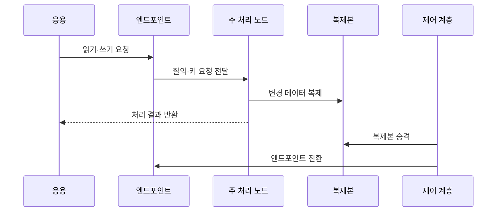

---
sidebar:
  order: 113
  label: "113. 클라우드 DB - RDS·Aurora·DynamoDB 비교 (Cloud Database)"
  badge:
    text: "기출 · 50%"
    variant: note
title: "클라우드 DB - RDS·Aurora·DynamoDB 비교 (Cloud Database)"
date: "2026-07-27T23:59:59+09:00"
tags:
  - "notes-software"
weight: 113
extra:
  question_no: "113"
  source_status: "기출"
  source_history: "138회"
  priority: 50
  priority_note: "138회 기출, 관리형 데이터베이스 선택 현안"
---

## 미리 알고가기

- **관리형 데이터베이스(Managed Database)**: 프로비저닝·패치·백업·장애 조치 등의 운영 기능을 공급자가 수행하는 서비스임
- **데이터베이스(Database, DB)**: ‘디비’로 읽고 영문 합성어의 첫 글자를 딴 약어이며, 구조화된 데이터를 저장·조회·갱신하는 시스템
- **아마존 웹 서비스(Amazon Web Services, AWS)**: ‘에이더블유에스’로 읽고 영문 첫 글자를 딴 약어이며, RDS·Aurora·DynamoDB를 제공하는 클라우드 공급자
- **아마존 관계형 데이터베이스 서비스(Amazon Relational Database Service, RDS)**: ‘알디에스’로 읽고 영문 핵심어의 첫 글자를 딴 약어이며, 관계형 엔진의 배포·백업·장애 조치를 관리하는 서비스
- **아마존 오로라(Amazon Aurora)**: MySQL·PostgreSQL 호환 엔진과 여러 가용 영역에 걸친 클러스터 볼륨을 사용하는 관계형 데이터베이스임
- **아마존 다이나모DB(Amazon DynamoDB)**: ‘다이나모디비’로 읽고 DB는 Database의 첫 글자를 딴 약어이며, 파티션 키로 항목을 분산하는 관리형 키값·문서 데이터베이스
- **가용 영역(Availability Zone, AZ)**: ‘에이제트’로 읽고 영문 첫 글자를 딴 약어이며, 한 리전 안에서 장애가 격리된 인프라 위치
- **다중 가용 영역(Multi-AZ)**: ‘멀티 에이제트’로 읽고 여러 AZ를 뜻하는 표기이며, 영역 간 복제·장애 조치를 지원하는 배포 구성
- **읽기 복제본(Read Replica)**: 원본의 변경을 복제해 읽기 요청을 분산하는 사본임
- **프로비저닝(Provisioning)**: 필요한 인스턴스·저장소·네트워크 자원을 준비하고 설정하는 작업임
- **접속 엔드포인트(Connection Endpoint)**: 응용 프로그램이 데이터베이스에 연결할 때 사용하는 네트워크 주소임
- **복구 시점 목표(Recovery Point Objective, RPO)**: ‘알피오’로 읽고 영문 첫 글자를 딴 약어이며, 장애 시 허용 가능한 최대 데이터 손실 시점
- **복구 시간 목표(Recovery Time Objective, RTO)**: ‘알티오’로 읽고 영문 첫 글자를 딴 약어이며, 장애 후 서비스를 복구해야 하는 목표 시간

## Ⅰ. 개요

- 정의/개념: 공급자가 **배포·백업·패치·장애조치** 관리
- 기존 한계: 자체 운영은 **전문 인력·복구 자동화 부담** 증가

### 쉽게 이해하기 (학습용)
- 설치와 백업 및 장애 조치를 클라우드가 맡고 사용자는 용량을 선택함

## Ⅱ. 특징

- 공급자는 **공통 운영**, 사용자는 정책·스키마 책임
- 서비스별 **데이터 모델·확장 단위** 차등
- **복제·자동 장애조치**로 가용성·복구 목표 지원

### 쉽게 이해하기 (학습용)
- 운영 작업은 줄지만 서비스별 확장 단위·비용·종속성이 다름

## Ⅲ. 아키텍처 및 구성요소

| 구성요소 | 설명 |
|:---|:---|
| 관리 제어 계층 | **배포·패치·백업·장애조치** 수행 |
| 접속 엔드포인트 | 응용 요청을 **현재 처리 노드**로 연결 |
| 질의·키 처리 계층 | SQL 계획·**파티션 키**로 대상 결정 |
| 컴퓨팅·파티션 계층 | 질의·키 연산을 **병렬 실행** |
| 저장·복제 계층 | 데이터 보존과 **다중 AZ 복제** 수행 |

```text
  제어접속
      ↓
  질의해석
      ↓
  계산처리
      ↓
  저장복제
```

> 요약: 제어 계층·서비스 구조로 운영 결정

### 쉽게 이해하기 (학습용)
- 관리형이라는 공통점은 같아도 관계형 질의는 인스턴스·클러스터로, 키 기반 요청은 파티션으로 처리됨

## Ⅳ. 원리 및 절차 흐름도



| 절차 | 설명 |
|:---|:---|
| 읽기·쓰기 요청 | **엔드포인트**로 데이터 요청 |
| 요청 전달 | SQL·키에 따라 **처리 노드** 선택 |
| 변경 데이터 복제 | 주 노드 변경을 **복제본**에 전파 |
| 처리 결과 반환 | 일관성 조건 충족 후 **결과 응답** |
| 복제본 승격 | 장애 시 **대기 복제본을 주 노드화** |
| 엔드포인트 전환 | 접속 주소를 **새 주 노드로 연결** |

> 요약: 요청 처리와 복제 후 장애 시 복제본과 접속 주소를 전환함

### 쉽게 이해하기 (학습용)
- 데이터 모델·질의·거래·확장 단위와 RPO·RTO·비용을 비교해 적합한 서비스를 결정함

## Ⅴ. 종류 및 비교

| 관리형 데이터베이스 | RDS | Aurora | DynamoDB |
|:---|:---|:---|:---|
| 적용 기준 | 기존 엔진 **호환·관리 자동화** | 고가용 관계형 **클러스터** | 대규모 **키 기반 수평 확장** |
| 핵심 특징 | 엔진별 **인스턴스·복제본** | 공유 클러스터 **분산 저장** | 자동 **파티션·처리량 확장** |
| 한계 | 엔진 제약·**운영 종속** | 비용 변동·**호환 차이** | 핫 파티션·**질의 제약** |

> 요약: 관계형과 키 기반 분산 모델 비교

### 쉽게 이해하기 (학습용)
- RDS는 일반 관계형 엔진 관리에, Aurora는 호환 관계형 클러스터에, DynamoDB는 키 중심 수평 확장에 맞음

## Ⅵ. 실무 사례

1. 주문 DB는 **다중 AZ 장애조치**로 RTO 검증

### 쉽게 이해하기 (학습용)
- 주문 데이터베이스는 관계형 거래를 유지하면서 커밋 지연과 실제 장애 조치 시간이 RTO를 만족하는지 검증함

## Ⅶ. 결론

- 데이터베이스 운영 부담을 줄이면서 가용성과 확장성을 확보하기 위해 **데이터 모델·일관성·RTO/RPO·확장 패턴·비용**을 검토하고, 요구에 맞는 관리형 관계형 또는 NoSQL 서비스를 선택한다

### 쉽게 이해하기 (학습용)
- 관리형 서비스도 스키마·키·용량·복구 목표·비용은 사용자가 설계하고 장애 훈련과 지표로 검증해야 함
