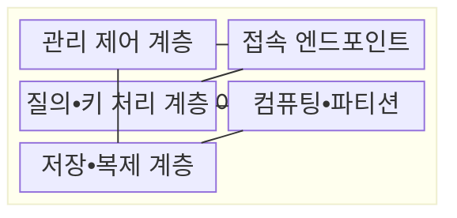
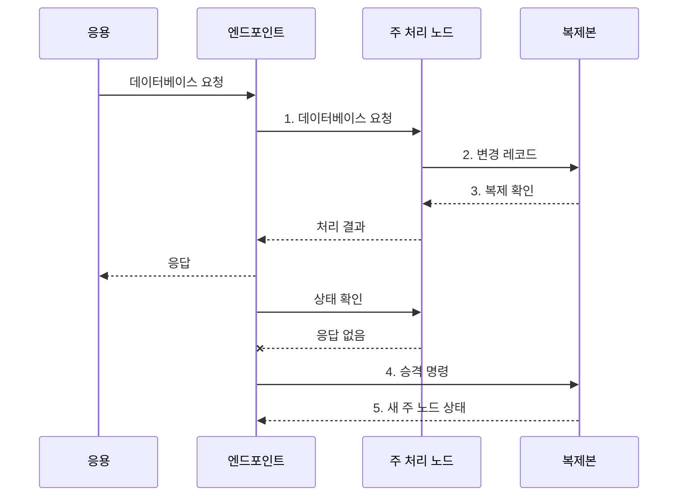

---
sidebar:
  order: 113
  label: "113. 클라우드 DB - RDS•Aurora•DynamoDB 비교 (Cloud Database)"
  badge:
    text: "기출 • 50%"
    variant: note
title: "클라우드 DB - RDS•Aurora•DynamoDB 비교 (Cloud Database)"
date: "2026-08-03T08:48:47+09:00"
tags:
  - "notes-software"
weight: 113
extra:
  question_no: "113"
  source_status: "기출"
  source_history: "138회"
  priority: 50
  priority_note: "138회 기출, 관리형 데이터베이스 선택 현안"
---

## Ⅰ. 개요

핵심 용어

- **클라우드 데이터베이스(Cloud Database)**: 공급자가 배포•확장•패치•백업•장애 복구를 관리형 서비스로 제공하는 데이터베이스이다.

- 정의/개념: 클라우드 공급자가 배포•확장•패치•백업•장애 복구를 관리형 서비스로 제공하는 **클라우드 데이터베이스(Cloud Database)**
- 배경/필요성: 자체 운영은 패치•백업•장애 전환의 **인력•복구 시간** 증가

#### 한줄 요약
- 설치와 백업 및 장애 조치를 클라우드가 맡고 사용자는 용량을 선택한다.

## Ⅱ. 특징

핵심 용어

- **공유 책임**: 운영 자동화와 별개로 데이터 설계•보안•복구•비용은 사용자가 책임지는 원칙이다.
- **운영 자동화**: 공급자가 인스턴스 생성과 패치•백업•장애 전환을 대신 수행하는 특성이다.
- **추상화 차이**: 서비스마다 사용자가 관리하는 단위가 인스턴스•클러스터•키 파티션으로 다른 특성이다.

- **운영 자동화**: 생성•패치•백업•전환 제공
- **추상화 차이**: 인스턴스•클러스터•키 파티션
- **공유 책임**: 설계•보안•복구•비용은 사용자 책임

#### 한줄 요약
- 운영 작업은 줄지만 서비스별 확장 단위•비용•종속성이 다르다.

## Ⅲ. 구조 및 구성요소

핵심 용어

- **접속 엔드포인트**: 응용 요청을 현재 주 처리 대상으로 연결하는 네트워크 접점이다.
- **관리 제어 계층**: 데이터베이스 배포와 패치•백업•장애 전환을 자동화하는 공급자 관리 계층이다.
- **질의•키 처리 계층**: 구조화 질의 언어(Structured Query Language, SQL)나 파티션 키로 요청의 실행 위치를 결정하는 계층이다.
- **컴퓨팅•파티션**: 관계형 질의나 키 기반 요청을 실제 처리하는 자원 단위이다.
- **저장•복제 계층**: 데이터 내구성과 복제본 유지 및 시점 복구를 제공하는 계층이다.

| 구성요소 | 책임 |
|:---|:---|
| 관리 제어 계층 | **배포•패치•백업•장애 전환** |
| 접속 엔드포인트 | 현재 **주 처리 대상** 으로 연결 |
| 질의•키 처리 계층 | **구조화 질의 언어(Structured Query Language, SQL)•파티션 키** 로 위치 결정 |
| 컴퓨팅•파티션 | **질의•키 요청** 실행 |
| 저장•복제 계층 | **내구성•복제본•복구** 제공 |

#### 한줄 요약

- 운영 관리자, 접속 주소, 요청 안내자, 처리부, 사본 저장부로 구성된다.

## Ⅳ. 흐름도

핵심 용어

- **4. 승격 명령**: 주 노드 장애 판정 뒤 복제본을 새 주 노드로 전환하도록 지시하는 단계이다.
- **1. 데이터베이스 요청**: 엔드포인트가 현재 주 처리 노드에 전달하는 질의•변경 요청이다.
- **2. 변경 레코드**: 주 노드의 변경 내용과 순서를 다른 가용 영역 복제본에 전달하는 기록이다.
- **3. 복제 확인**: 설정한 내구성 범위의 복제본이 변경을 수신•반영했음을 확인한 상태이다.
- **5. 새 주 노드 상태**: 복제본 승격이 완료돼 엔드포인트 연결 대상을 바꿀 수 있음을 나타내는 정보이다.

**동작 원리**

1. **데이터베이스 요청**: 엔드포인트가 현재 주 처리 노드에 전달
2. **변경 레코드**: 변경 내용을 다른 가용 영역 복제본에 전파
3. **복제 확인**: 설정된 내구성 범위를 충족한 쓰기 상태 반환
4. **승격 명령**: 주 노드 장애 판정 뒤 복제본에 역할 전환 지시
5. **새 주 노드 상태**: 승격 완료 상태로 엔드포인트 대상 갱신

#### 한줄 요약

- 클라우드가 고장을 감지해 사본을 원본으로 바꾸고 같은 접속 주소를 새 원본에 연결한다.

## Ⅴ. 종류 및 비교

핵심 용어

- **Aurora**: 컴퓨팅과 분산 저장을 분리해 관계형 클러스터 확장을 제공하는 서비스이다.
- **관계형 데이터베이스 서비스(Relational Database Service, RDS)**: 기존 관계형 엔진의 인스턴스 운영을 자동화하는 관리형 서비스이다.
- **DynamoDB**: 키값•문서 접근과 자동 키 파티션 확장을 제공하는 관리형 비관계형 데이터베이스이다.

| 클라우드 데이터베이스 서비스 | 관계형 데이터베이스 서비스(Relational Database Service, RDS) | Aurora | DynamoDB |
|:---|:---|:---|:---|
| 적용 기준 | 기존 **관계형 엔진 호환** | 관계형 **클러스터 확장** | **키값•문서 접근** |
| 핵심 특징 | **인스턴스 운영 자동화** | **컴퓨팅•저장 분리** | **자동 키 파티션** |
| 한계 | **인스턴스 자원 병목** | **엔진 호환•I/O 비용** | **핫 파티션•스캔 비용** |

> 요약: Aurora는 RDS 제품군이지만 **저장 구조•확장 단위** 가 다름

#### 한줄 요약

- 기존 관계형 엔진은 RDS, 분산 저장형 관계형은 Aurora, 키 중심 자동 분산은 DynamoDB를 검토한다.

## Ⅵ. 실무 고려사항 및 대책

핵심 용어

- **접근 패턴•거래 경계**: 서비스 선택 전에 주 조회•갱신 방식과 함께 원자 확정할 데이터 범위를 비교하는 기준이다.
- **다중 가용 영역(Multiple Availability Zones, Multi-AZ) 장애 주입•연결 재시도**: 실제 영역 장애를 재현하고 클라이언트가 새 주 노드에 다시 연결되는지 검증하는 시험이다.
- **시점 복구(Point-in-Time Recovery, PITR)•교차 리전 복원**: 지정 시점과 다른 지역으로 백업을 실제 복구해 복구 목표를 검증하는 활동이다.
- **입출력(Input/Output, I/O)•백업•전송 비용**: 저장 용량 외에 요청 처리와 사본•네트워크 이동에 드는 비용 항목이다.
- **신원 및 접근 관리(Identity and Access Management, IAM) 최소 권한•사설망•암호화**: 관리 권한과 네트워크 노출 및 데이터 보호를 제한하는 보안 통제이다.

| 문제 | 대책 | 효과 |
|:---|:---|:---|
| 질의•거래•키 패턴과 다른 서비스는 재설계 비용 유발 | **접근 패턴•거래 경계** 비교 | **데이터 모델 오선택** 방지 |
| 다중 가용 영역 선언만으로 실제 전환 시간은 확인 불가 | **다중 가용 영역(Multiple Availability Zones, Multi-AZ) 장애 주입•연결 재시도** 시험 | 실제 **복구 시간 목표(Recovery Time Objective, RTO)** 확인 |
| 자동 백업도 복원하지 않으면 복구 목표 달성 미확인 | **시점 복구(Point-in-Time Recovery, PITR)•교차 리전 복원** 검증 | **백업 복구 실효성** 확인 |
| 입출력•백업•전송량 누락은 예상 비용 초과 유발 | **입출력(Input/Output, I/O)•백업•전송 비용** 모델링 | **총비용 누락** 방지 |
| 과도한 신원 및 접근 관리 권한•공개 접속은 공유 책임 공백 유발 | **신원 및 접근 관리(Identity and Access Management, IAM) 최소 권한•사설망•암호화** | **접근 통제 공백** 방지 |

#### 한줄 요약

- 자동 전환 기능이 있어도 실제로 얼마나 멈추고 어떤 요청을 다시 보내야 하는지 시험해야 한다.

## Ⅶ. 결론

핵심 용어

- **관계형 데이터베이스 서비스(Relational Database Service, RDS)**: 기존 관계형 엔진 호환성과 관리형 인스턴스 운영이 필요할 때 선택하는 서비스이다.
- **Aurora**: 컴퓨팅•분리형 저장 기반의 관계형 클러스터 확장이 필요할 때 선택하는 서비스이다.
- **DynamoDB**: 키값•문서 접근과 자동 파티션 확장이 필요할 때 선택하는 서비스이다.

- 엔진 호환은 **관계형 데이터베이스 서비스(Relational Database Service, RDS)** 선택, 분리형 관계형 확장은 **Aurora** 선택, 키 접근은 **DynamoDB** 선택

#### 한줄 요약

- 클라우드가 운영을 도와도 무엇을 어떻게 저장하고 복구할지는 사용자가 정해야 한다.
