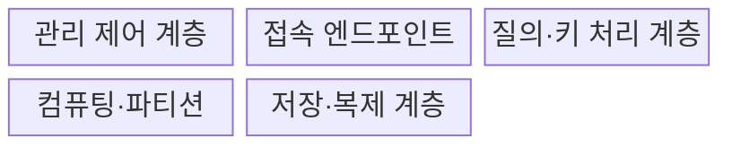
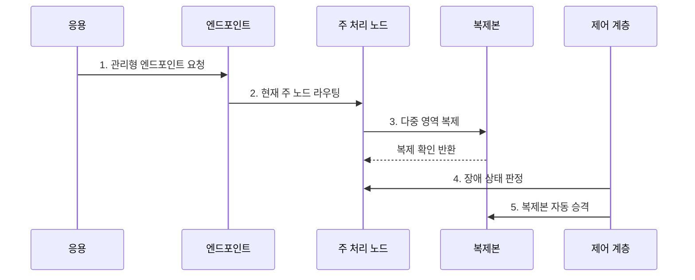

---
sidebar:
  order: 113
  label: "113. 클라우드 DB - RDS·Aurora·DynamoDB 비교 (Cloud Database)"
  badge:
    text: "기출 · 50%"
    variant: note
title: "클라우드 DB - RDS·Aurora·DynamoDB 비교 (Cloud Database)"
date: "2026-07-27T23:59:59+09:00"
tags:
  - "notes-software"
weight: 113
extra:
  question_no: "113"
  source_status: "기출"
  source_history: "138회"
  priority: 50
  priority_note: "138회 기출, 관리형 데이터베이스 선택 현안"
---

## 미리 알고가기

- **관리형 데이터베이스(Managed Database)**: 프로비저닝·패치·백업·장애 조치 등의 운영 기능을 공급자가 수행하는 서비스이다.
- **데이터베이스(Database, DB)**: ‘디비’로 읽고 영문 합성어의 첫 글자를 딴 약어이며, 구조화된 데이터를 저장·조회·갱신하는 시스템
- **아마존 웹 서비스(Amazon Web Services, AWS)**: ‘에이더블유에스’로 읽고 영문 첫 글자를 딴 약어이며, RDS·Aurora·DynamoDB를 제공하는 클라우드 공급자
- **아마존 관계형 데이터베이스 서비스(Amazon Relational Database Service, RDS)**: ‘알디에스’로 읽고 영문 핵심어의 첫 글자를 딴 약어이며, 관계형 엔진의 배포·백업·장애 조치를 관리하는 서비스
- **아마존 오로라(Amazon Aurora)**: MySQL·PostgreSQL 호환 엔진과 여러 가용 영역에 걸친 클러스터 볼륨을 사용하는 관계형 데이터베이스이다.
- **아마존 다이나모DB(Amazon DynamoDB)**: ‘다이나모디비’로 읽고 DB는 Database의 첫 글자를 딴 약어이며, 파티션 키로 항목을 분산하는 관리형 키값·문서 데이터베이스
- **가용 영역(Availability Zone, AZ)**: ‘에이제트’로 읽고 영문 첫 글자를 딴 약어이며, 한 리전 안에서 장애가 격리된 인프라 위치
- **다중 가용 영역(Multi-AZ)**: ‘멀티 에이제트’로 읽고 여러 AZ를 뜻하는 표기이며, 영역 간 복제·장애 조치를 지원하는 배포 구성
- **읽기 복제본(Read Replica)**: 원본의 변경을 복제해 읽기 요청을 분산하는 사본이다.
- **프로비저닝(Provisioning)**: 필요한 인스턴스·저장소·네트워크 자원을 준비하고 설정하는 작업이다.
- **접속 엔드포인트(Connection Endpoint)**: 응용 프로그램이 데이터베이스에 연결할 때 사용하는 네트워크 주소이다.
- **복구 시점 목표(Recovery Point Objective, RPO)**: ‘알피오’로 읽고 영문 첫 글자를 딴 약어이며, 장애 시 허용 가능한 최대 데이터 손실 시점
- **복구 시간 목표(Recovery Time Objective, RTO)**: ‘알티오’로 읽고 영문 첫 글자를 딴 약어이며, 장애 후 서비스를 복구해야 하는 목표 시간

## Ⅰ. 개요

- 정의/개념: 공급자가 배포·패치·백업을 관리하는 **클라우드 DB**
- 배경/필요성: 반복 DB 운영 부담과 복구 시간 축소

### 쉽게 이해하기 (학습용)
- 설치와 백업 및 장애 조치를 클라우드가 맡고 사용자는 용량을 선택함

## Ⅱ. 특징

- **운영 자동화**: 생성·패치·백업·전환 제공
- **추상화 차이**: 인스턴스·클러스터·키 파티션
- **공유 책임**: 설계·보안·복구·비용은 사용자 책임

### 쉽게 이해하기 (학습용)
- 운영 작업은 줄지만 서비스별 확장 단위·비용·종속성이 다름

## Ⅲ. 구조 및 구성요소

| 구성요소 | 책임 |
|:---|:---|
| 관리 제어 계층 | 배포·패치·백업·전환 |
| 접속 엔드포인트 | 현재 처리 대상으로 연결 |
| 질의·키 처리 계층 | SQL·키로 위치 결정 |
| 컴퓨팅·파티션 | 질의·키 요청 실행 |
| 저장·복제 계층 | 내구성·사본·복구 제공 |

### 쉽게 이해하기 (학습용)

- 운영 관리자, 접속 주소, 요청 안내자, 처리부, 사본 저장부로 구성된다.

## Ⅳ. 흐름도

**동작 원리**

- **1. 관리형 엔드포인트 요청**: 위치와 무관한 접속 계약 사용
- **2. 현재 주 노드 라우팅**: 제어 계층의 정상 노드로 연결
- **3. 다중 영역 복제**: 변경을 장애 도메인 밖에 보존
- **4. 장애 상태 판정**: 건강 신호와 쿼럼으로 전환 조건 확인
- **5. 복제본 자동 승격**: 새 주 노드와 엔드포인트 경로 갱신

### 쉽게 이해하기 (학습용)

- 클라우드가 고장을 감지해 사본을 원본으로 바꾸고 같은 접속 주소를 새 원본에 연결한다.

## Ⅴ. 종류 및 비교

| 판단 기준 | RDS | Aurora | DynamoDB |
|:---|:---|:---|:---|
| 적용 기준 | 기존 관계형 엔진 | 관계형 클러스터 | 키값·문서 접근 |
| 핵심 특징 | 인스턴스 관리 자동화 | 컴퓨팅·저장 분리 | 자동 키 파티션 |
| 한계 | 인스턴스 병목 | 호환·I/O 비용 | 핫 파티션·스캔 비용 |

> Aurora도 Amazon RDS 제품군에서 관리되지만 일반 RDS 엔진과 저장 구조·확장 단위가 달라 선택 관점에서 구분

### 쉽게 이해하기 (학습용)

- 기존 관계형 엔진은 RDS, 분산 저장형 관계형은 Aurora, 키 중심 자동 분산은 DynamoDB를 검토한다.

## Ⅵ. 실무 고려사항 및 대책

| 고려사항 | 대책 | 효과 |
|:---|:---|:---|
| 서비스 선택 | 질의·거래·키 패턴 비교 | 모델 오선택 방지 |
| 가용성 | 전환 시간·재시도 시험 | 실제 RTO 확인 |
| 복구 | PITR·교차 리전 복원 검증 | 백업 실효성 확보 |
| 비용 | I/O·백업·전송 포함 모델링 | 비용 누락 방지 |
| 보안 | IAM·망·암호화 책임 명시 | 공유 책임 공백 방지 |

> **적용 사례**: 주문 DB는 관계형 트랜잭션을 유지하면서 Multi-AZ 장애 전환 중 커밋 결과·연결 재시도·실제 RTO를 검증

### 쉽게 이해하기 (학습용)

- 자동 전환 기능이 있어도 실제로 얼마나 멈추고 어떤 요청을 다시 보내야 하는지 시험해야 한다.

## Ⅶ. 결론

- **데이터 모델·확장 단위·RTO·비용**으로 클라우드 DB를 결정

### 쉽게 이해하기 (학습용)

- 클라우드가 운영을 도와도 무엇을 어떻게 저장하고 복구할지는 사용자가 정해야 한다.
