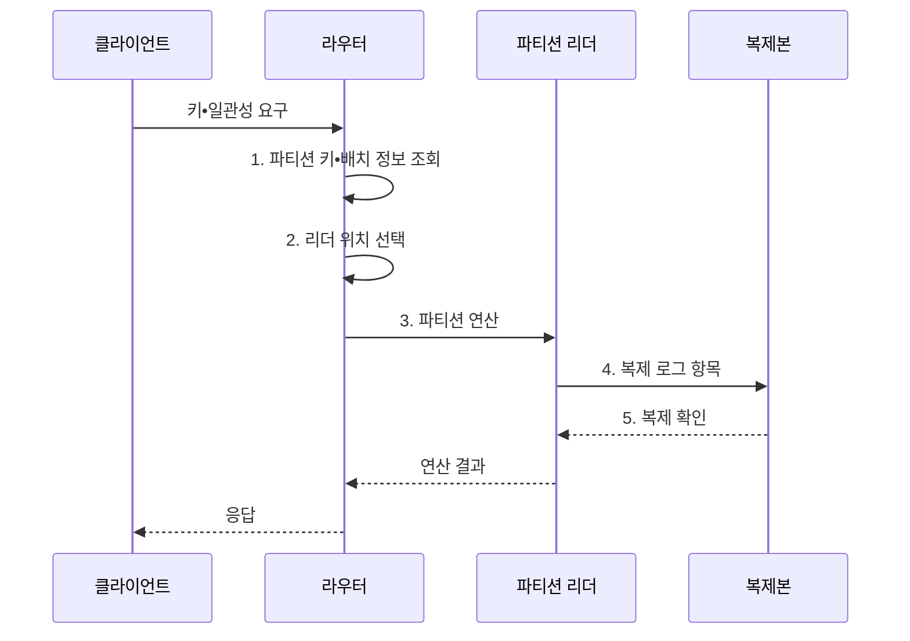

---
sidebar:
  order: 114
  label: "114. 분산 데이터베이스 (Distributed Database)"
  badge:
    text: "미출 • 50%"
    variant: note
title: "분산 데이터베이스 (Distributed Database)"
date: "2026-08-04T13:14:00+09:00"
tags:
  - "notes-software"
weight: 114
extra:
  question_no: "114"
  source_status: "미출"
  source_history: ""
  priority: 50
  priority_note: "분산 저장•복제•질의 설계의 상위 주제"
---

## Ⅰ. 개요

핵심 용어

- **분산 데이터베이스(Distributed Database)**: 데이터를 여러 노드에 분할•복제하면서 사용자에게 하나의 논리 데이터베이스처럼 제공하는 구조이다.

- 정의/개념: 분할•복제 데이터를 하나처럼 제공하는 **분산 데이터베이스**
- 배경/필요성: 단일 노드는 저장•처리 용량과 장애 복구가 **한 장비 한계** 에 종속

#### 한줄 요약
- 장부를 지점에 나누고 사본과 합의 규칙으로 하나처럼 쓰는 데이터베이스이다.

## Ⅱ. 특징

핵심 용어

- **네트워크 조정 비용**: 교차 파티션 질의•거래•재균형에서 노드 사이 통신과 합의로 발생하는 비용이다.
- **파티셔닝**: 파티션 키나 범위로 데이터를 여러 노드에 나눠 저장•처리 부하를 수평 분산하는 기법이다.
- **복제**: 장애 영역별 데이터 사본을 유지하는 방식이다.
- **합의**: 변경 순서와 확정점을 노드 사이에서 일치시키는 방식이다.

- **파티셔닝**: 키•범위별 저장•처리 부하 수평 분산
- **복제•합의**: 장애 영역별 사본으로 내구성•가용성 확보
- **네트워크 조정 비용**: 교차 파티션 질의•거래•재균형 시 발생

#### 한줄 요약
- 수평 확장과 장애 대응은 좋아지지만 네트워크와 사본 비용이 추가된다.

## Ⅲ. 구조 및 구성요소

핵심 용어

- **분산 실행기**: 여러 파티션에 연산을 보내고 중간 결과를 병합하는 구성요소이다.
- **파티션 맵**: 파티션 키와 현재 소유 노드 위치를 연결하는 정보이다.
- **라우터**: 파티션 맵을 조회해 요청을 담당 노드로 전달하는 구성요소이다.
- **복제 로그**: 변경 내용과 순서를 복제본에 전달하는 기록이다.
- **합의 모듈**: 리더와 커밋 지점을 복제본 사이에서 일치시키는 구성요소이다.
- **트랜잭션 조정자**: 여러 파티션에 걸친 변경의 원자 확정이나 취소를 조정하는 구성요소이다.
- **장애 감지**: 응답과 상태 정보로 실패 노드를 판정하는 기능이다.
- **재균형**: 파티션과 복제본을 정상 노드로 이동하는 기능이다.

| 구성요소 | 책임 |
|:---|:---|
| 파티션 맵•라우터 | **파티션 키** 와 노드 위치 연결 |
| 분산 실행기 | 파티션 **연산 계획•결과 병합** |
| 복제 로그•합의 | **순서•리더•확정점** 일치 |
| 트랜잭션 조정자 | 교차 파티션 **원자성** 조정 |
| 장애 감지•재균형 | 실패 복구와 **파티션 이동** |
| 분산 저장소 | 파티션별 **데이터•복제본** 저장 |

#### 한줄 요약

- 위치표, 안내자, 사본 규칙, 거래 조정자, 이동 담당자로 구성된다.

## Ⅳ. 흐름도

핵심 용어

- **4. 복제 로그 항목**: 리더가 변경 순서를 보존해 복제본에 전달하는 로그 레코드이다.
- **1. 파티션 키•배치 정보 조회**: 요청 키를 담당하는 파티션과 현재 노드 위치를 확인하는 단계이다.
- **2. 리더 위치 선택**: 배치 정보에서 읽기•쓰기를 처리할 현재 리더 주소를 정하는 단계이다.
- **3. 파티션 연산**: 선택한 리더가 대상 데이터의 읽기•쓰기를 수행하는 단계이다.
- **5. 복제 확인**: 정책이 요구한 복제본 수가 로그를 반영했음을 리더에 반환하는 단계이다.

**동작 원리**

1. **파티션 키•배치 정보 조회**: 라우터가 대상 키의 배치 정보를 확인
2. **리더 위치 선택**: 배치 정보에서 현재 처리 리더 주소 결정
3. **파티션 연산**: 리더가 대상 데이터 읽기•쓰기 수행
4. **복제 로그 항목**: 리더가 변경 로그를 복제본에 전달
5. **복제 확인**: 복제본이 로그 반영 결과를 리더에 반환

#### 한줄 요약

- 안내소가 담당 지점을 찾고 사본 확인까지 마친 결과를 하나의 장부처럼 돌려준다.

## Ⅴ. 종류 및 비교

핵심 용어

- **교차 파티션 연산**: 여러 파티션의 데이터에 동시에 접근하는 연산이다.
- **단일 장애 경계**: 한 노드 장애가 전체 서비스 중단으로 이어지는 범위이다.

| 데이터베이스 배치 구조 | 분산 데이터베이스 | 단일 노드 데이터베이스 |
|:---|:---|:---|
| 적용 기준 | **수평 용량•장애 분산** | 단순 운영과 **낮은 조정 비용** |
| 핵심 특징 | **파티션•복제•합의** | 로컬 **로그•동시성 제어** |
| 한계 | **네트워크•재균형 비용** | 확장 상한과 **단일 장애 경계** |

#### 한줄 요약

- 한 지점은 단순하고 여러 지점은 넓게 확장되지만 연락과 합의가 필요하다.

## Ⅵ. 실무 고려사항 및 대책

핵심 용어

- **접근 검증**: 함께 처리할 데이터 경계를 실제 요청으로 확인하는 활동이다.
- **소유권 검증**: 데이터의 담당 서비스와 노드를 확인하는 활동이다.
- **분포 검증**: 키별 데이터와 요청량의 편향을 확인하는 활동이다.
- **연산별 일관성 수준**: 업무마다 필요한 복제본 확인 수이다.
- **실패 동작**: 일관성 수준 미달 시 거부 또는 지역 처리를 정한 정책이다.
- **속도 제한**: 재균형의 데이터 전송량을 제한하는 통제이다.
- **정합성 검증**: 이동 전후 데이터가 같은지 비교하는 활동이다.
- **롤백**: 문제 발생 시 이전 파티션 배치로 되돌리는 조치이다.
- **논리 시계**: 분산 변경의 선후 관계를 표현하는 값이다.
- **멱등성 키**: 재시도에도 같은 효과만 남도록 요청을 식별하는 값이다.
- **파티션별 지표**: 개별 노드의 지연과 부하를 나타내는 관측값이다.
- **교차 요청 지표**: 여러 파티션에 걸친 팬아웃 비용을 나타내는 관측값이다.

| 문제 | 대책 | 효과 |
|:---|:---|:---|
| 편향 키로 일부 노드에 부하 집중 | **접근•소유권•분포 검증** | **팬아웃•핫 파티션** 감소 |
| 전역 일관성 강제로 지연•가용성 저하 | **연산별 수준•실패 동작** 정의 | **지연•가용성** 균형 |
| 무제한 재균형으로 전경 입출력 경합 | **속도 제한•정합성 검증•롤백** | **서비스 지연** 억제 |
| 시계 오차•재시도로 순서•중복 오판 | **논리 시계•멱등성 키** 적용 | **순서•중복 오류** 방지 |
| 집계 지표가 특정 파티션 병목 은폐 | **파티션별•교차 요청 지표** 수집 | **국소 병목** 조기 탐지 |

#### 한줄 요약

- 자료가 고르게 나뉘는지뿐 아니라 지점 이동 시간과 추가 공간도 재야 한다.

## Ⅶ. 결론

핵심 용어

- **선택 기준**: 용량 한계와 교차 연산 비율을 함께 비교하는 판단 축이다.

- 단일 노드 한계 초과•교차 연산 최소면 **분산 데이터베이스** 선택

#### 한줄 요약

- 여러 장부를 하나처럼 보이게 하는 대신 지점 간 연락•합의•이동 비용을 관리해야 한다.
