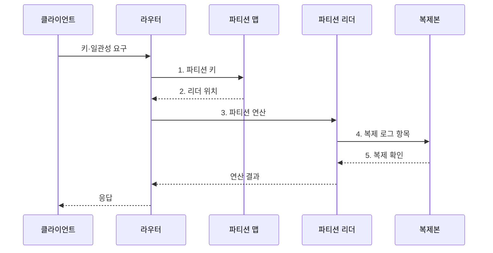

---
sidebar:
  order: 114
  label: "114. 분산 데이터베이스 (Distributed Database)"
  badge:
    text: "미출 · 50%"
    variant: note
title: "분산 데이터베이스 (Distributed Database)"
date: "2026-08-02T12:00:00+09:00"
tags:
  - "notes-software"
weight: 114
extra:
  question_no: "114"
  source_status: "미출"
  source_history: ""
  priority: 50
  priority_note: "분산 저장·복제·질의 설계의 상위 주제"
---

## Ⅰ. 개요

핵심 용어

- **데이터베이스 구조**: 데이터를 여러 노드에 분할·복제하면서 하나의 논리 데이터베이스처럼 제공하는 구조이다.

- 정의/개념: 데이터를 분할·복제해 여러 노드를 하나처럼 제공하는 **데이터베이스 구조**
- 배경/필요성: 단일 노드는 저장·처리 용량과 장애 복구가 **한 장비 한계**에 종속

### 쉽게 이해하기 (학습용)
- 장부를 지점에 나누고 사본과 합의 규칙으로 하나처럼 쓰는 데이터베이스이다.

## Ⅱ. 특징

핵심 용어

- **네트워크 조정 비용**: 교차 파티션 질의·거래·재균형에서 노드 사이 통신과 합의로 발생하는 비용이다.

- **파티셔닝**: 키·범위별 저장·처리 부하 수평 분산
- **복제·합의**: 장애 영역별 사본으로 내구성·가용성 확보
- **네트워크 조정 비용**: 교차 파티션 질의·거래·재균형 시 발생

### 쉽게 이해하기 (학습용)
- 수평 확장과 장애 대응은 좋아지지만 네트워크와 사본 비용이 추가된다.

## Ⅲ. 구조 및 구성요소

핵심 용어

- **분산 실행기**: 여러 파티션에 연산을 보내고 중간 결과를 병합하는 구성요소이다.

| 구성요소 | 책임 |
|:---|:---|
| 파티션 맵·라우터 | **파티션 키**와 노드 위치 연결 |
| 분산 실행기 | 파티션 **연산 계획·결과 병합** |
| 복제 로그·합의 | **순서·리더·확정점** 일치 |
| 트랜잭션 조정자 | 교차 파티션 **원자성** 조정 |
| 장애 감지·재균형 | 실패 복구와 **파티션 이동** |
| 분산 저장소 | 파티션별 **데이터·복제본** 저장 |

### 쉽게 이해하기 (학습용)

- 위치표, 안내자, 사본 규칙, 거래 조정자, 이동 담당자로 구성된다.

## Ⅳ. 흐름도

핵심 용어

- **4. 복제 로그 항목**: 리더가 변경 순서를 보존해 복제본에 전달하는 로그 레코드이다.

**동작 원리**

1. **파티션 키**: 라우터가 배치 맵에 대상 키 전달
2. **리더 위치**: 배치 맵이 처리 리더 주소 반환
3. **파티션 연산**: 리더가 대상 데이터 읽기·쓰기 수행
4. **복제 로그 항목**: 리더가 변경 로그를 복제본에 전달
5. **복제 확인**: 복제본이 로그 반영 결과를 리더에 반환

### 쉽게 이해하기 (학습용)

- 안내소가 담당 지점을 찾고 사본 확인까지 마친 결과를 하나의 장부처럼 돌려준다.

## Ⅴ. 종류 및 비교

핵심 용어

- **분산 데이터베이스**: 수평 용량과 장애 분산을 위해 파티션·복제·합의를 사용하는 구조이다.

| 데이터베이스 배치 구조 | 분산 데이터베이스 | 단일 노드 데이터베이스 |
|:---|:---|:---|
| 적용 기준 | **수평 용량·장애 분산** | 단순 운영과 **낮은 조정 비용** |
| 핵심 특징 | **파티션·복제·합의** | 로컬 **로그·동시성 제어** |
| 한계 | **네트워크·재균형 비용** | 확장 상한과 **단일 장애 경계** |

### 쉽게 이해하기 (학습용)

- 한 지점은 단순하고 여러 지점은 넓게 확장되지만 연락과 합의가 필요하다.

## Ⅵ. 실무 고려사항 및 대책

핵심 용어

- **편향 키로 일부 노드에 부하 집중**: 파티션 키 분포가 치우쳐 특정 노드가 병목이 되는 문제이다.

| 문제 | 대책 | 효과 |
|:---|:---|:---|
| 편향 키로 일부 노드에 부하 집중 | 접근·소유권·분포 검증 | **팬아웃·핫 파티션** 감소 |
| 전역 일관성 강제로 지연·가용성 저하 | 연산별 수준·실패 동작 정의 | **지연·가용성** 균형 |
| 무제한 재균형으로 전경 입출력 경합 | 속도 제한·정합성 검증·롤백 | **서비스 지연** 억제 |
| 시계 오차·재시도로 순서·중복 오판 | 논리 시계·멱등성 키 적용 | **순서·중복 오류** 방지 |
| 집계 지표가 특정 파티션 병목 은폐 | 파티션별·교차 요청 지표 수집 | **국소 병목** 조기 탐지 |

### 쉽게 이해하기 (학습용)

- 자료가 고르게 나뉘는지뿐 아니라 지점 이동 시간과 추가 공간도 재야 한다.

## Ⅶ. 결론

핵심 용어

- **분산 DB**: 단일 노드의 용량 한계를 넘고 교차 연산이 적은 업무에 적합한 구조이다.

- 단일 노드 한계를 넘고 교차 연산이 적으면 **분산 DB**, 아니면 **단일 노드** 선택

### 쉽게 이해하기 (학습용)

- 여러 장부를 하나처럼 보이게 하는 대신 지점 간 연락·합의·이동 비용을 관리해야 한다.
