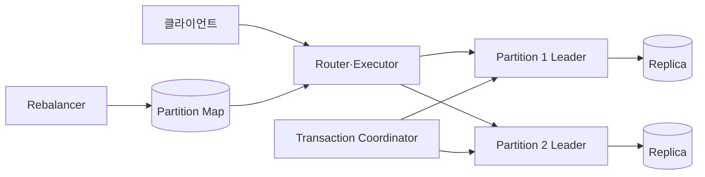
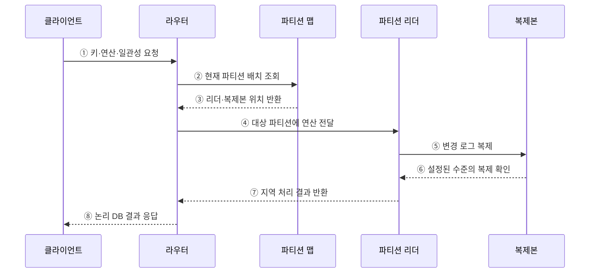

---
sidebar:
  order: 114
  label: "114. 분산 데이터베이스 (Distributed Database)"
  badge:
    text: "미출제 · 50%"
    variant: note
title: "분산 데이터베이스 (Distributed Database)"
date: "2026-07-25T18:46:00+09:00"
tags:
  - "notes-software"
weight: 114
extra:
  question_no: "114"
  source_status: "미출제"
  source_history: ""
  priority: 50
  priority_note: "분산 저장·복제·질의 설계의 상위 주제"
---

## 미리 알고가기

- **분산 데이터베이스(Distributed Database)**: 여러 노드의 분할·복제 데이터를 하나의 논리 데이터베이스로 제공하는 구조임
- **파티셔닝(Partitioning)**: 서로 다른 데이터를 키나 범위에 따라 여러 노드에 나누는 방식임
- **복제(Replication)**: 같은 데이터의 사본을 여러 노드나 장애 영역에 유지하는 기술임
- **분산 투명성(Distribution Transparency)**: 데이터 위치·분할·복제 세부를 응용 질의에서 숨기는 성질임
- **2단계 커밋(Two-phase Commit, 2PC)**: 준비와 결정 두 단계로 참여 노드의 커밋·중단을 하나의 결과로 조정하는 프로토콜임
- **합의 프로토콜(Consensus Protocol)**: 분산 노드가 로그 순서·리더·확정 지점에 같은 결정을 내리게 하는 규칙임
- **정족수(Quorum)**: 읽기·쓰기 완료에 필요한 복제본 응답 수를 뜻함
- **파티션 맵(Partition Map)**: 키 범위와 이를 담당하는 노드·복제본의 위치를 연결한 정보임
- **분산 실행기(Distributed Executor)**: 여러 파티션에 연산을 보내고 중간 결과를 병합하는 구성요소임
- **재분산(Rebalancing)**: 노드 추가·제거 또는 편중에 맞춰 파티션을 다시 배치하는 작업임
- **테넌트(Tenant)**: 하나의 공유 시스템을 독립적으로 사용하는 고객이나 조직 단위임
- **교차 파티션 트랜잭션(Cross-partition Transaction)**: 둘 이상의 파티션 데이터를 한 논리 거래로 변경하는 작업임

## Ⅰ. 개요

- 분산 데이터베이스는 여러 노드에 분할·복제한 데이터를 하나의 논리 데이터베이스처럼 제공하는 시스템이다.
- 수평 확장과 장애 영역 분산을 얻는 대신 네트워크·합의·분산 질의·교차 파티션 거래·재균형 비용을 부담한다.

### 쉽게 이해하기 (학습용)
- 장부를 지점에 나누고 사본과 합의 규칙으로 하나처럼 쓰는 데이터베이스임

## Ⅱ. 특징

- **분할**: 키·범위·해시로 데이터를 나눠 저장과 처리 부하를 분산한다.
- **복제**: 각 파티션의 사본을 다른 노드·장애 영역에 두어 가용성과 내구성을 높인다.
- **분산 투명성**: 위치·분할·복제 세부를 라우터와 실행 계층이 응용에서 숨긴다.
- **조정 비용**: 교차 파티션 질의·트랜잭션과 네트워크 분할은 지연과 실패 경우를 늘린다.

### 쉽게 이해하기 (학습용)
- 수평 확장과 장애 대응은 좋아지지만 네트워크와 사본 비용이 추가됨

## Ⅲ. 아키텍처 및 구성요소

**도표안 A — 구조도**

**도표안 B — sequenceDiagram**

| 구성요소 | 역할 |
|:---|:---|
| 파티션 맵·라우터 | 키 범위와 노드 위치를 연결해 요청 전달 |
| 분산 실행기 | 여러 파티션에 연산을 보내고 결과 병합 |
| 복제 로그·합의 | 파티션 사본의 순서·리더·확정 지점 일치 |
| 트랜잭션 조정자 | 교차 파티션 준비·커밋·중단 조정 |
| 장애 감지·재균형 | 실패 복구와 파티션 이동·복제본 보충 |

**동작 원리**

- ① 클라이언트가 키·연산·필요 일관성을 라우터에 요청한다.
- ② 라우터가 현재 세대의 파티션 배치를 조회한다.
- ③ 파티션 맵이 대상 리더와 복제본 위치를 반환한다.
- ④ 라우터가 담당 파티션 리더에 연산을 전달한다.
- ⑤ 리더가 변경 로그를 파티션 복제본에 전파한다.
- ⑥ 복제본이 설정된 내구성·정족수 수준의 확인을 반환한다.
- ⑦ 리더가 지역 파티션의 처리 결과를 라우터에 반환한다.
- ⑧ 라우터가 위치·복제 세부를 숨긴 논리 결과를 응답한다.

### 쉽게 이해하기 (학습용)

- 안내소가 담당 지점을 찾고 사본 확인까지 마친 결과를 하나의 장부처럼 돌려준다.

## Ⅳ. 종류 및 비교

| 비교 항목 | 분산 데이터베이스 | 단일 노드 데이터베이스 |
|:---|:---|:---|
| 데이터 배치 | 여러 노드의 파티션·복제본 | 한 노드 중심의 저장 구조 |
| 확장 방식 | 노드 추가와 파티션 재분산 | 인스턴스와 저장소 증설 |
| 트랜잭션 | 파티션 내 합의, 교차 파티션 조정 | 로컬 로그·동시성 제어 |
| 장애 모델 | 부분 장애·분할·복제 지연 | 노드·저장장치 전체 장애 |
| 강점 | 수평 용량·처리량·장애 영역 분산 | 낮은 조정 비용·단순한 운영 |
| 주요 위험 | 네트워크·합의 지연·재균형 | 확장 상한·단일 장애 경계 |

| 분할 방식 | 기준 | 장점 | 위험 |
|:---|:---|:---|:---|
| 수평 분할 | 행·키 범위 | 처리량·용량 분산 | 교차 파티션 조인·거래 |
| 수직 분할 | 열·기능 | 접근·소유권 분리 | 재결합·공통 키 정합성 |
| 혼합 분할 | 행과 열 조합 | 워크로드 맞춤 배치 | 매핑·운영 복잡성 |

### 쉽게 이해하기 (학습용)

- 한 지점은 단순하고 여러 지점은 넓게 확장되지만 연락과 합의가 필요하다.

## Ⅴ. 실무 고려사항 및 대책

| 고려사항 | 위험 | 대책 |
|:---|:---|:---|
| 분할 키 | 팬아웃·핫스팟·교차 거래 증가 | 접근·소유권·분포로 키 검증 |
| 일관성 | 기능별 필요한 보장 불명확 | 읽기·쓰기·거래별 수준과 실패 동작 정의 |
| 재균형 | 이동 중 지연·용량 중복 | 속도 제한·세대 전환·대사·롤백 적용 |
| 시간·순서 | 노드 시계와 메시지 순서 오해 | 논리 시계·합의 로그·멱등 키 활용 |
| 부분 장애 | 전체 성공/실패로만 처리 | 타임아웃·재시도·격리·보상 설계 |
| 관측성 | 전체 평균이 특정 파티션 문제 은폐 | 파티션·복제본·교차 요청별 지표 |

> **적용 사례**: 테넌트 ID로 분할할 때 대형 테넌트의 점유율과 교차 테넌트 질의 비율, 노드 추가 시 재균형 시간을 함께 측정한다.

### 쉽게 이해하기 (학습용)

- 자료가 고르게 나뉘는지뿐 아니라 지점을 옮길 때 걸리는 시간과 추가 공간도 재야 한다.

## Ⅵ. 결론

- 분산 데이터베이스는 파티션·복제·라우팅·합의·결과 병합으로 여러 노드를 하나의 논리 DB처럼 제공한다.
- 수평 확장의 이득과 교차 파티션·부분 장애·재균형 비용을 함께 측정해 도입해야 한다.

### 쉽게 이해하기 (학습용)

- 여러 장부를 하나처럼 보이게 하는 대신 지점 간 연락·합의·이동 비용을 관리해야 한다.
