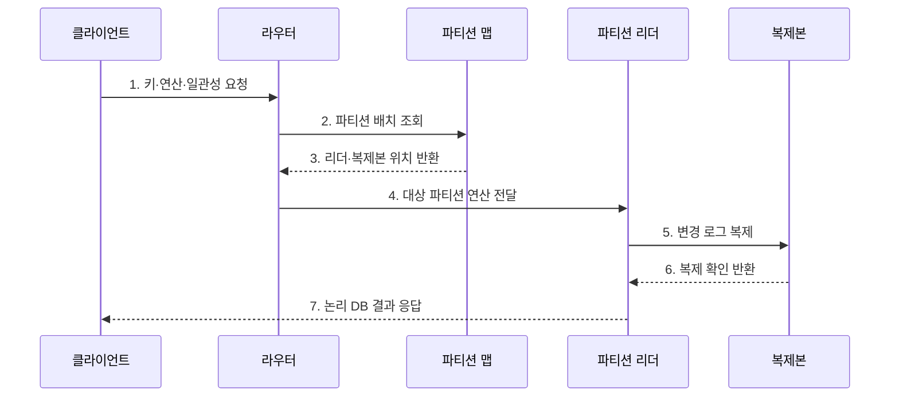

---
sidebar:
  order: 114
  label: "114. 분산 데이터베이스 (Distributed Database)"
  badge:
    text: "미출제 · 50%"
    variant: note
title: "분산 데이터베이스 (Distributed Database)"
date: "2026-07-25T18:46:00+09:00"
tags:
  - "notes-software"
weight: 114
extra:
  question_no: "114"
  source_status: "미출제"
  source_history: ""
  priority: 50
  priority_note: "분산 저장·복제·질의 설계의 상위 주제"
---

## 미리 알고가기

- **분산 데이터베이스(Distributed Database)**: 여러 노드의 분할·복제 데이터를 하나의 논리 데이터베이스로 제공하는 구조이다.
- **파티셔닝(Partitioning)**: 서로 다른 데이터를 키나 범위에 따라 여러 노드에 나누는 방식이다.
- **복제(Replication)**: 같은 데이터의 사본을 여러 노드나 장애 영역에 유지하는 기술이다.
- **분산 투명성(Distribution Transparency)**: 데이터 위치·분할·복제 세부를 응용 질의에서 숨기는 성질이다.
- **2단계 커밋(Two-phase Commit, 2PC)**: 준비와 결정 두 단계로 참여 노드의 커밋·중단을 하나의 결과로 조정하는 프로토콜이다.
- **합의 프로토콜(Consensus Protocol)**: 분산 노드가 로그 순서·리더·확정 지점에 같은 결정을 내리게 하는 규칙이다.
- **정족수(Quorum)**: 읽기·쓰기 완료에 필요한 복제본 응답 수를 뜻한다.
- **파티션 맵(Partition Map)**: 키 범위와 이를 담당하는 노드·복제본의 위치를 연결한 정보이다.
- **분산 실행기(Distributed Executor)**: 여러 파티션에 연산을 보내고 중간 결과를 병합하는 구성요소이다.
- **재분산(Rebalancing)**: 노드 추가·제거 또는 편중에 맞춰 파티션을 다시 배치하는 작업이다.
- **테넌트(Tenant)**: 하나의 공유 시스템을 독립적으로 사용하는 고객이나 조직 단위이다.
- **교차 파티션 트랜잭션(Cross-partition Transaction)**: 둘 이상의 파티션 데이터를 한 논리 거래로 변경하는 작업이다.

## Ⅰ. 개요

- 정의/개념: 분할·복제된 데이터를 하나로 제공하는 **분산 DB**
- 배경/필요성: 수평 확장과 장애 영역 분산

### 쉽게 이해하기 (학습용)
- 장부를 지점에 나누고 사본과 합의 규칙으로 하나처럼 쓰는 데이터베이스임

## Ⅱ. 특징

- **분할**: 키·범위로 저장·처리 부하 분산
- **복제**: 장애 영역별 사본으로 내구성 확보
- **조정 비용**: 교차 질의·거래·재균형 증가

### 쉽게 이해하기 (학습용)
- 수평 확장과 장애 대응은 좋아지지만 네트워크와 사본 비용이 추가됨

## Ⅲ. 구조 및 구성요소

| 구성요소 | 책임 |
|:---|:---|
| 파티션 맵·라우터 | 키와 노드 위치 연결 |
| 분산 실행기 | 파티션 연산·결과 병합 |
| 복제 로그·합의 | 순서·리더·확정점 일치 |
| 트랜잭션 조정자 | 교차 파티션 결과 조정 |
| 장애 감지·재균형 | 실패 복구·파티션 이동 |

### 쉽게 이해하기 (학습용)

- 위치표, 안내자, 사본 규칙, 거래 조정자, 이동 담당자로 구성된다.

## Ⅳ. 흐름도

**동작 원리**

- **1. 키·연산·일관성 요청**: 처리 조건을 전달
- **2. 파티션 배치 조회**: 현재 위치표를 확인
- **3. 리더·복제본 위치 반환**: 담당 노드를 검색
- **4. 대상 파티션 연산 전달**: 리더에 요청
- **5. 변경 로그 복제**: 사본에 전파
- **6. 복제 확인 반환**: 요구 응답 수를 확인
- **7. 논리 DB 결과 응답**: 위치를 숨겨 반환

### 쉽게 이해하기 (학습용)

- 안내소가 담당 지점을 찾고 사본 확인까지 마친 결과를 하나의 장부처럼 돌려준다.

## Ⅴ. 종류 및 비교

| 판단 기준 | 분산 데이터베이스 | 단일 노드 데이터베이스 |
|:---|:---|:---|
| 적용 기준 | 수평 용량·장애 분산 | 단순 운영·낮은 조정 |
| 핵심 특징 | 파티션·복제·합의 | 로컬 로그·동시성 제어 |
| 한계 | 네트워크·재균형 비용 | 확장 상한·단일 장애 경계 |

### 쉽게 이해하기 (학습용)

- 한 지점은 단순하고 여러 지점은 넓게 확장되지만 연락과 합의가 필요하다.

## Ⅵ. 실무 고려사항 및 대책

| 고려사항 | 대책 | 효과 |
|:---|:---|:---|
| 분할 키 | 접근·소유권·분포로 검증 | 팬아웃·핫스팟 감소 |
| 일관성 | 연산별 수준·실패 동작 정의 | 보장 범위 명확화 |
| 재균형 | 속도 제한·대사·롤백 적용 | 이동 중 지연 통제 |
| 시간·순서 | 논리 시계·멱등 키 활용 | 순서 오판 방지 |
| 관측성 | 파티션·교차 요청별 지표 | 국소 병목 탐지 |

> **적용 사례**: 테넌트 ID로 분할할 때 대형 테넌트의 점유율과 교차 테넌트 질의 비율, 노드 추가 시 재균형 시간을 함께 측결정

### 쉽게 이해하기 (학습용)

- 자료가 고르게 나뉘는지뿐 아니라 지점 이동 시간과 추가 공간도 재야 한다.

## Ⅶ. 결론

- **확장 이득·교차 연산·부분 장애·재균형 비용**으로 분산 DB를 결정

### 쉽게 이해하기 (학습용)

- 여러 장부를 하나처럼 보이게 하는 대신 지점 간 연락·합의·이동 비용을 관리해야 한다.
