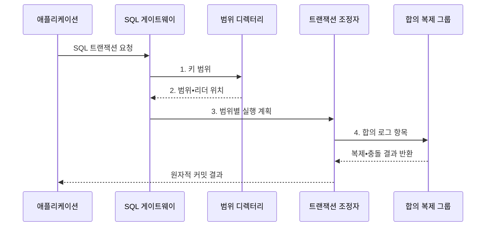

---
sidebar:
  order: 115
  label: "115. NewSQL: CockroachDB•Spanner (NewSQL)"
  badge:
    text: "미출 • 50%"
    variant: note
title: "NewSQL: CockroachDB•Spanner (NewSQL)"
date: "2026-08-05T00:00:00+09:00"
tags:
  - "notes-software"
weight: 115
extra:
  question_no: "115"
  source_status: "미출"
  source_history: ""
  priority: 50
  priority_note: "일관성•확장성을 결합한 분산 SQL 현안"
---

## Ⅰ. 개요

<details>
<summary>핵심 용어</summary>

- **뉴SQL(NewSQL) 데이터베이스**: 구조화 질의 언어(Structured Query Language, SQL)와 원자성•일관성•격리성•지속성(Atomicity, Consistency, Isolation, Durability, ACID)을 유지하면서 합의 복제와 키 범위 분할로 수평 확장하는 데이터베이스이다.

</details>

- 정의/개념: **SQL•ACID** 를 유지하며 수평 확장하는 **NewSQL** 계열
- 배경/필요성: 단일 노드 관계형 DB는 저장•처리 용량이 **한 장비 한계** 에 종속

#### 한줄 요약
- SQL 장부를 지점에 나누고 합의로 하나의 거래처럼 처리한다.

## Ⅱ. 특징

<details>
<summary>핵심 용어</summary>

- **합의 복제**: 범위별 복제본이 변경 로그 순서와 확정 지점에 동의하는 특성이다.
- **분산 실행**: SQL 연산을 키 범위별로 나누고 여러 노드의 중간 결과를 병합하는 방식이다.
- **분산 거래**: 여러 키 범위의 읽기•쓰기를 하나의 ACID 트랜잭션으로 확정하는 방식이다.

</details>

- **분산 실행**: SQL을 범위 연산으로 분할•병합
- **합의 복제**: 범위별 변경 순서•확정점 합의
- **분산 거래**: 여러 범위 쓰기를 원자 확정

#### 한줄 요약
- 확장과 ACID를 함께 제공하지만 합의 왕복과 재시도 비용이 생긴다.

## Ⅲ. 구조 및 구성요소

<details>
<summary>핵심 용어</summary>

- **트랜잭션 조정자**: 충돌과 여러 키 범위에 걸친 원자적 커밋을 조정하는 구성요소이다.
- **SQL 게이트웨이**: 질의를 분석하고 키 범위별 분산 계획과 결과 병합을 수행하는 접점이다.
- **범위 디렉터리**: 키 범위와 합의 복제 그룹 및 현재 리더 위치를 제공하는 구성요소이다.
- **합의 복제 그룹**: 범위별 변경 로그 순서와 내구성 확정점에 동의하는 복제본 묶음이다.
- **다중 버전 동시성 제어(Multi-Version Concurrency Control, MVCC)**: 데이터 버전의 가시성을 관리하는 동시성 제어 방식이다.
- **분산 시계**: 여러 노드의 사건에 전역 직렬 순서를 부여하는 구성요소이다.

</details>

```text
[범위 디렉터리] ----- [SQL 게이트웨이] ----- [트랜잭션 조정자]
                                                 /       \
                                  [합의 복제 그룹] [MVCC•분산 시계]
```

선의 의미: SQL 게이트웨이는 범위 디렉터리와 트랜잭션 조정자를 결합하며, 조정자 아래에는 분산 거래의 내구성과 가시성•직렬 순서를 담당하는 합의 복제 그룹과 MVCC•분산 시계가 놓이는 정적 구조를 뜻한다.

| 구성요소 | 책임 |
|:---|:---|
| SQL 게이트웨이 | **질의 분석•분산 계획•병합** |
| 범위 디렉터리 | **범위•리더 위치** 제공 |
| 트랜잭션 조정자 | 충돌과 **교차 범위 커밋** 조정 |
| 합의 복제 그룹 | **로그 순서•내구성** 합의 |
| MVCC•분산 시계 | **가시성•직렬 순서** 관리 |

#### 한줄 요약

- SQL 접수자, 위치표, 거래 조정자, 합의 사본, 순서 시계로 구성된다.

## Ⅳ. 흐름도

<details>
<summary>핵심 용어</summary>

- **3. 범위별 실행 계획**: SQL 연산을 담당 키 구간별 분산 트랜잭션으로 나누는 단계이다.
- **SQL 트랜잭션 요청**: 응용이 원자적으로 처리할 관계형 읽기•쓰기 요청이다.
- **1. 키 범위**: 게이트웨이가 질의 조건에서 추출해 범위 디렉터리에 전달한 대상 키 구간이다.
- **2. 범위•리더 위치**: 디렉터리가 반환한 합의 복제 그룹과 현재 처리 리더 주소이다.
- **4. 합의 로그 항목**: 조정자가 원자 커밋을 위해 각 복제 그룹에 전달한 변경 기록이다.

</details>



**동작 원리**

1. **키 범위**: 게이트웨이가 디렉터리에 대상 키 구간 전달
2. **범위•리더 위치**: 디렉터리가 복제 그룹과 현재 리더 반환
3. **범위별 실행 계획**: SQL 연산을 분산 트랜잭션으로 분해
4. **합의 로그 항목**: 조정자가 변경 로그를 복제 그룹에 전달

#### 한줄 요약

- SQL을 담당 구간에 나누어 보내고 모든 구간의 사본 확인 뒤 하나의 거래로 확정한다.

## Ⅴ. 종류 및 비교

<details>
<summary>핵심 용어</summary>

- **CockroachDB**: Range•Raft•HLC로 분산 SQL 트랜잭션을 제공하는 NewSQL 제품이다.
- **하이브리드 논리 시계(Hybrid Logical Clock, HLC)**: 물리 시각과 논리 카운터를 결합한 분산 시계이다.
- **Spanner**: Split•Paxos•TrueTime으로 글로벌 분산 SQL 트랜잭션을 제공하는 관리형 NewSQL 제품이다.

</details>

| 뉴SQL(NewSQL) 제품 | CockroachDB | Spanner |
|:---|:---|:---|
| 적용 기준 | **배포 선택•지역성 제어** | **글로벌 관리형 운영** |
| 핵심 특징 | **Range•Raft•HLC** | **Split•Paxos•TrueTime** |
| 한계 | **배치•재시도•운영 책임** | **리전 지연•서비스 종속** |

#### 한줄 요약

- 둘 다 분산 SQL 거래를 제공하지만 배포 방식과 범위 배치•시간 순서 구현이 다르다.

## Ⅵ. 실무 고려사항 및 대책

<details>
<summary>핵심 용어</summary>

- **분포 부하 시험**: 실제 키 편중을 재현해 핫스팟을 확인하는 시험이다.
- **분할 부하 시험**: 범위 분할 시점과 이동 부하를 확인하는 시험이다.
- **지역성 부하 시험**: 사용자와 리더의 거리에 따른 지연을 확인하는 시험이다.
- **동시 갱신 행의 지역 배치**: 한 거래에서 함께 바꾸는 데이터를 같은 지역에 둬 교차 리전 합의를 줄이는 방식이다.
- **짧은 거래**: 잠금과 충돌이 유지되는 구간을 줄이는 통제이다.
- **멱등 재시도**: 직렬화 실패를 중복 효과 없이 다시 처리하는 통제이다.
- **생존 지역**: 장애 시 복제본을 유지할 지역이다.
- **읽기 지역**: 조회 요청을 처리할 지역이다.
- **쓰기 지역**: 커밋과 합의를 처리할 지역이다.
- **노드 장애 훈련**: 노드 실패 시 정족수 유지를 검증하는 활동이다.
- **리전 장애 훈련**: 지역 상실 시 서비스 복구를 검증하는 활동이다.
- **복구 시간 목표(Recovery Time Objective, RTO)**: 장애 뒤 서비스를 복구해야 하는 목표 시간이다.

</details>

| 문제 | 대책 | 효과 |
|:---|:---|:---|
| 순차•편향 키로 특정 범위에 쓰기 집중 | 분포•분할•지역성 부하 시험 | **핫스팟** 방지 |
| 함께 갱신할 행이 여러 리전에 분산 | 동시 갱신 행을 같은 지역 배치 | **합의 왕복** 감소 |
| 긴 거래가 같은 키를 반복 점유 | 짧은 거래•멱등 재시도 | **충돌•중단** 감소 |
| 쓰기 리더와 사용자의 거리가 증가 | 생존•읽기•쓰기 지역 분리 | **커밋 지연** 통제 |
| 리전 상실로 정족수와 복구시간 불명확 | **노드•리전 훈련과 RTO 측정** | **정족수 상실** 대응 |

#### 한줄 요약

- 함께 바꾸는 데이터를 가까이 두어 여러 지역을 오가는 합의 횟수를 줄인다.

## Ⅶ. 결론

<details>
<summary>핵심 용어</summary>

- **분산 조정 비용**: 합의와 교차 범위 거래로 추가되는 네트워크 비용이다.

</details>

- 수평 확장과 **ACID** 가 함께 필요하면 **NewSQL** 선택

#### 한줄 요약

- 장부를 나눠도 한 거래로 맞출 수 있지만 멀리 있는 지점과의 합의 시간은 반드시 치러야 한다.
