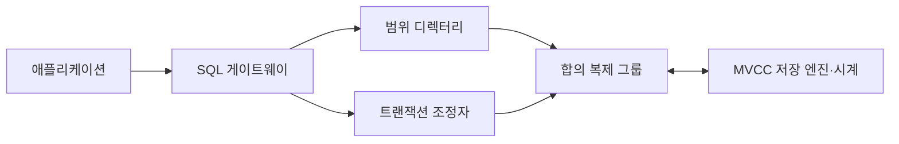
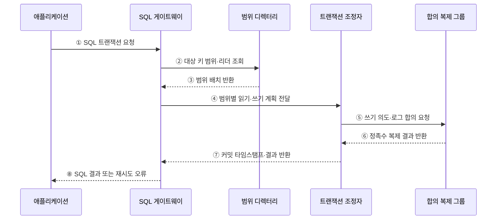

---
sidebar:
  order: 115
  label: "115. NewSQL — CockroachDB·Spanner (NewSQL)"
  badge:
    text: "미출제 · 50%"
    variant: note
title: "NewSQL — CockroachDB·Spanner (NewSQL)"
date: "2026-07-25T11:00:00+09:00"
tags:
  - "notes-software"
weight: 115
extra:
  question_no: "115"
  source_status: "미출제"
  source_history: ""
  priority: 50
  priority_note: "일관성·확장성을 결합한 분산 SQL 현안"
---

## 미리 알고가기

- **뉴SQL(NewSQL)**: SQL과 ACID 트랜잭션을 유지하면서 합의 복제와 분할로 수평 확장하는 관계형 데이터베이스 계열
- **구조화 질의 언어(Structured Query Language, SQL)**: 관계형 데이터의 정의·조회·변경을 선언적으로 표현하는 언어
- **원자성·일관성·격리성·지속성(Atomicity, Consistency, Isolation, Durability, ACID)**: 트랜잭션이 전부 반영되거나 취소되고 유효한 상태와 동시 실행 격리를 지키며 완료 결과를 보존하게 하는 네 성질
- **코크로치DB(CockroachDB)**: SQL을 키 범위 연산으로 변환하고 범위별 Raft 합의와 MVCC를 사용하는 분산 SQL 데이터베이스
- **스패너(Spanner)**: 키 범위를 분할·복제하고 TrueTime 타임스탬프로 외부 일관성을 제공하는 분산 관계형 데이터베이스
- **범위(Range)·분할(Split)**: 범위는 정렬된 연속 키 구간을 저장·복제하는 단위이고 분할은 큰 범위를 둘로 나눠 부하와 용량을 분산하는 동작
- **Raft 합의(Raft Consensus)**: 리더와 다수 복제본이 로그 순서와 확정 결과에 합의하는 프로토콜
- **Paxos 합의(Paxos Consensus)**: 분산 참여자들이 장애 중에도 하나의 값이나 로그 순서에 합의하게 하는 프로토콜 계열
- **다중 버전 동시성 제어(Multi-Version Concurrency Control, MVCC)**: 여러 데이터 버전과 가시성 규칙으로 동시 읽기·쓰기를 제어하는 기법
- **하이브리드 논리 시계(Hybrid Logical Clock, HLC)**: 물리 시각에 논리 순서를 결합해 분산 사건의 타임스탬프를 만드는 시계
- **트루타임(TrueTime)**: 현재 시각을 불확실성 구간으로 제공해 Spanner의 트랜잭션 순서를 지원하는 분산 시계
- **외부 일관성(External Consistency)**: 트랜잭션의 직렬 순서가 실제 관측된 완료 선후와도 일치하는 성질
- **트랜잭션 경합(Transaction Contention)**: 동시 거래가 같은 키나 범위를 변경하려 해 대기·중단·재시도가 생기는 상태
- **SQL 게이트웨이(SQL Gateway)**: SQL을 분석해 대상 키 범위와 분산 실행 계획을 만들고 결과를 병합하는 요청 진입점
- **트랜잭션 조정자(Transaction Coordinator)**: 여러 범위에 걸친 거래의 타임스탬프·커밋·중단을 하나의 결과로 조정하는 구성요소
- **합의 복제 그룹(Consensus Replication Group)**: 같은 범위의 복제본들이 리더를 중심으로 변경 순서와 커밋 여부를 합의하는 단위
- **분산 커밋(Distributed Commit)**: 여러 범위가 모두 성공해야 하나의 트랜잭션을 확정하는 절차로 교차 범위 쓰기의 원자성을 유지
- **리전(Region)·핫스팟(Hotspot)**: 리전은 가까운 데이터센터 묶음이고 핫스팟은 특정 키 범위에 요청이 집중된 상태로 배치와 분할 판단의 대상

## Ⅰ. 개요

- NewSQL 또는 분산 SQL은 관계형 SQL·ACID 트랜잭션을 유지하면서 키 범위 분할과 합의 복제로 수평 확장하는 데이터베이스 계열이다.
- 단일 노드의 용량·처리 한계를 넘을 수 있지만 합의 왕복·교차 범위 거래·재시도·재배치 비용이 추가된다.

### 쉽게 이해하기 (학습용)
- SQL 장부를 지점에 나누고 합의로 하나의 거래처럼 처리함

## Ⅱ. 특징

- **분산 SQL 실행**: SQL을 키 범위 연산으로 나누고 여러 노드의 결과를 병합한다.
- **합의 복제**: 각 범위의 복제 그룹이 변경 순서와 확정 지점에 합의한다.
- **분산 트랜잭션**: 여러 범위의 쓰기를 하나의 원자적 결과로 조정한다.
- **MVCC·분산 시계**: 트랜잭션의 읽기 시점과 직렬 순서를 관리한다.

### 쉽게 이해하기 (학습용)
- 확장과 ACID를 함께 제공하지만 합의 왕복과 재시도 비용이 생김

## Ⅲ. 아키텍처 및 구성요소

**도표안 A — 구조도**

**도표안 B — sequenceDiagram**

| 구성요소 | 역할 |
|:---|:---|
| SQL 게이트웨이 | SQL 분석·분산 계획·결과 병합 |
| 범위 디렉터리 | 키 범위와 복제본·리더 위치 제공 |
| 트랜잭션 조정자 | 타임스탬프·충돌·교차 범위 커밋 조정 |
| 합의 복제 그룹 | 범위별 로그 순서와 내구성 합의 |
| MVCC·분산 시계 | 버전 가시성·직렬 순서·과거 읽기 지원 |

**동작 원리**

- ① 애플리케이션이 SQL 트랜잭션을 게이트웨이에 요청한다.
- ② 게이트웨이가 질의 키의 범위와 현재 리더를 조회한다.
- ③ 범위 디렉터리가 범위별 복제 그룹 배치를 반환한다.
- ④ 게이트웨이가 범위별 연산을 트랜잭션 조정자에 전달한다.
- ⑤ 조정자가 쓰기 의도와 로그를 각 합의 복제 그룹에 보낸다.
- ⑥ 복제 그룹이 정족수 복제와 충돌 검사 결과를 반환한다.
- ⑦ 조정자가 원자적 커밋과 타임스탬프 결과를 게이트웨이에 반환한다.
- ⑧ 게이트웨이가 SQL 결과 또는 안전한 재시도가 필요한 오류를 응답한다.

### 쉽게 이해하기 (학습용)

- SQL을 담당 구간에 나누어 보내고 모든 구간의 사본 확인 뒤 하나의 거래로 확정한다.

## Ⅳ. 종류 및 비교

| 비교 항목 | CockroachDB | Spanner |
|:---|:---|:---|
| 제공 형태 | 관리형 클라우드·자체 관리 선택 | Google Cloud 관리형 서비스 |
| 분할·복제 | 키 Range와 Raft 복제 | Split과 Paxos 기반 복제 |
| 시간·일관성 | HLC·MVCC 기반 분산 트랜잭션 | TrueTime·MVCC 기반 외부 일관성 |
| 강점 | PostgreSQL 호환·배포 선택·지역성 제어 | 글로벌 관리형 운영·강한 트랜잭션 순서 |
| 주요 고려 | Range/Lease 배치·재시도·운영 책임 | 인스턴스 구성·리전 지연·서비스 종속 |

> 제품 이름만으로 성능을 단정할 수 없으며 스키마·보조 인덱스·지역 배치·교차 범위 비율이 실제 비용을 좌우한다.

### 쉽게 이해하기 (학습용)

- 둘 다 분산 SQL 거래를 제공하지만 배포 방식과 범위 배치·시간 순서 구현이 다르다.

## Ⅴ. 실무 고려사항 및 대책

| 고려사항 | 위험 | 대책 |
|:---|:---|:---|
| 키 설계 | 순차 키·대형 임차인의 핫 Range | 키 분포·분할·지역성 실제 부하 시험 |
| 교차 범위 | 한 거래가 여러 리더·리전을 왕복 | 함께 갱신하는 행의 키·지역 배치 |
| 경합 | 직렬화 충돌과 트랜잭션 재시도 | 짧은 거래·멱등 재시도·경합 지표 |
| 지역성 | 사용자와 리더가 멀어 커밋 지연 | 데이터 생존·읽기·쓰기 지역 요구 분리 |
| 호환성 | PostgreSQL/MySQL 문법만 보고 완전 호환 가정 | 드라이버·DDL·격리·확장 기능 검증 |
| 장애 | 정족수 상실과 재배치 중 성능 저하 | 노드·AZ·리전 장애 훈련과 RTO/RPO 측정 |

> **적용 사례**: 주문과 주문 항목의 키 범위를 같은 지역에 배치해 교차 리전 합의 횟수를 줄이고 재시도율과 p99 커밋 지연을 측정한다.

### 쉽게 이해하기 (학습용)

- 함께 바꾸는 데이터를 가까이 두어 여러 지역을 오가는 합의 횟수를 줄인다.

## Ⅵ. 결론

- NewSQL은 SQL·ACID와 분산 확장을 결합하지만 네트워크 합의와 분산 거래 비용을 제거하지는 않는다.
- 키 분포·데이터 지역성·경합·재시도·교차 범위 비율을 실측해 제품과 배치를 선택해야 한다.

### 쉽게 이해하기 (학습용)

- 장부를 나눠도 한 거래로 맞출 수 있지만 멀리 있는 지점과의 합의 시간은 반드시 치러야 한다.
