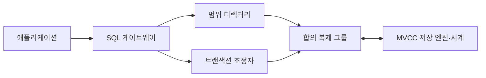
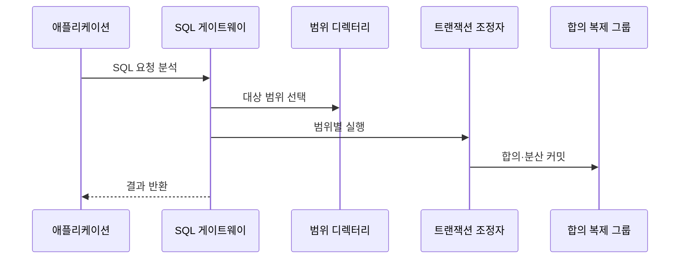

---
sidebar:
  order: 115
  label: "115. NewSQL — CockroachDB·Spanner (NewSQL)"
  badge:
    text: "미출제 · 50%"
    variant: note
title: "NewSQL — CockroachDB·Spanner (NewSQL)"
date: "2026-07-25T11:00:00+09:00"
tags:
  - "notes-software"
weight: 115
extra:
  question_no: "115"
  source_status: "미출제"
  source_history: ""
  priority: 50
  priority_note: "일관성·확장성을 결합한 분산 SQL 현안"
---

## 미리 알고가기

- **뉴SQL(NewSQL)**: SQL과 ACID 트랜잭션을 유지하면서 합의 복제와 분할로 수평 확장하는 관계형 데이터베이스 계열
- **구조화 질의 언어(Structured Query Language, SQL)**: 관계형 데이터의 정의·조회·변경을 선언적으로 표현하는 언어
- **원자성·일관성·격리성·지속성(Atomicity, Consistency, Isolation, Durability, ACID)**: 트랜잭션이 전부 반영되거나 취소되고 유효한 상태와 동시 실행 격리를 지키며 완료 결과를 보존하게 하는 네 성질
- **코크로치DB(CockroachDB)**: SQL을 키 범위 연산으로 변환하고 범위별 Raft 합의와 MVCC를 사용하는 분산 SQL 데이터베이스
- **스패너(Spanner)**: 키 범위를 분할·복제하고 TrueTime 타임스탬프로 외부 일관성을 제공하는 분산 관계형 데이터베이스
- **범위(Range)·분할(Split)**: 범위는 정렬된 연속 키 구간을 저장·복제하는 단위이고 분할은 큰 범위를 둘로 나눠 부하와 용량을 분산하는 동작
- **Raft 합의(Raft Consensus)**: 리더와 다수 복제본이 로그 순서와 확정 결과에 합의하는 프로토콜
- **Paxos 합의(Paxos Consensus)**: 분산 참여자들이 장애 중에도 하나의 값이나 로그 순서에 합의하게 하는 프로토콜 계열
- **다중 버전 동시성 제어(Multi-Version Concurrency Control, MVCC)**: 여러 데이터 버전과 가시성 규칙으로 동시 읽기·쓰기를 제어하는 기법
- **하이브리드 논리 시계(Hybrid Logical Clock, HLC)**: 물리 시각에 논리 순서를 결합해 분산 사건의 타임스탬프를 만드는 시계
- **트루타임(TrueTime)**: 현재 시각을 불확실성 구간으로 제공해 Spanner의 트랜잭션 순서를 지원하는 분산 시계
- **외부 일관성(External Consistency)**: 트랜잭션의 직렬 순서가 실제 관측된 완료 선후와도 일치하는 성질
- **트랜잭션 경합(Transaction Contention)**: 동시 거래가 같은 키나 범위를 변경하려 해 대기·중단·재시도가 생기는 상태
- **SQL 게이트웨이(SQL Gateway)**: SQL을 분석해 대상 키 범위와 분산 실행 계획을 만들고 결과를 병합하는 요청 진입점
- **트랜잭션 조정자(Transaction Coordinator)**: 여러 범위에 걸친 거래의 타임스탬프·커밋·중단을 하나의 결과로 조정하는 구성요소
- **합의 복제 그룹(Consensus Replication Group)**: 같은 범위의 복제본들이 리더를 중심으로 변경 순서와 커밋 여부를 합의하는 단위
- **분산 커밋(Distributed Commit)**: 여러 범위가 모두 성공해야 하나의 트랜잭션을 확정하는 절차로 교차 범위 쓰기의 원자성을 유지
- **리전(Region)·핫스팟(Hotspot)**: 리전은 가까운 데이터센터 묶음이고 핫스팟은 특정 키 범위에 요청이 집중된 상태로 배치와 분할 판단의 대상

## Ⅰ. 개요

- 정의/개념: SQL·ACID와 분산 수평 확장을 결합한다
- **배경/필요성**: 단일 노드의 거래 처리 한계를 넘는다

### 쉽게 이해하기 (학습용)
- SQL 장부를 지점에 나누고 합의로 하나의 거래처럼 처리함

## Ⅱ. 특징

- SQL을 키 연산으로 나눠 여러 범위 결과를 병합한다
- 범위별 합의가 복제본 불일치 커밋을 막는다
- 타임스탬프가 가시성을 정해 일관된 읽기를 만든다
- 리전 왕복·경합은 커밋을 늦춰 처리량을 낮춘다

### 쉽게 이해하기 (학습용)
- 확장과 ACID를 함께 제공하지만 합의 왕복과 재시도 비용이 생김

## Ⅲ. 아키텍처 및 구성요소

| 설계 요소 | 설명 |
|:---|:---|
| SQL 게이트웨이 | SQL을 분석하고 분산 키 연산과 결과 병합 계획을 만듦 |
| 범위 디렉터리 | 키의 범위와 복제본 리더 위치 조회 |
| 트랜잭션 조정자 | 여러 범위의 타임스탬프와 커밋 및 중단을 조정함 |
| 합의 복제 그룹 | 합의 알고리즘으로 변경 순서와 복제본 커밋을 결정함 |
| MVCC 저장 엔진·시계 | 버전 가시성과 시간 순서 관리 |

> 요약: 게이트웨이가 질의를 나누고 조정자와 합의 그룹이 커밋을 결정함

### 쉽게 이해하기 (학습용)
- 질의 창구가 범위를 찾고 거래 조정자와 복제본 합의가 커밋을 확정한다

## Ⅳ. 원리 및 절차 흐름도

| 절차 | 설명 |
|:---|:---|
| SQL 요청 분석 | 질의를 연산으로 바꾸고 트랜잭션 범위를 정함 |
| 대상 범위 선택 | 디렉터리에서 복제 그룹·리더 조회 |
| 범위별 실행 | 조정자가 범위별 읽기·쓰기와 충돌 검사를 요청 |
| 합의·분산 커밋 | 복제 합의와 여러 범위의 원자적 커밋을 확정 |
| 결과 반환 | 커밋·재시도·중단 상태를 응용에 반환 |

> 요약: 대상 범위에서 연산과 합의를 수행하고 커밋 타임스탬프를 조정함

### 쉽게 이해하기 (학습용)
- 질의를 담당 구간에 나눠 보내고 사본 합의와 구간 커밋을 조정함

## Ⅴ. 종류 및 비교

| 판단 기준 | CockroachDB | Spanner |
|:---|:---|:---|
| 핵심 특징 | 키 범위 자동 분할·합의 복제 | 전용 시계 기반 글로벌 SQL |
| 적용 기준 | 배포 통제·클라우드 중립 | 전역 순서·관리형 글로벌 분산 |
| 주요 위험 | 범위 재배치·핫스팟 | 시계 의존·관리형 종속 |

> 요약: 배포 중립은 CockroachDB, 전역 순서는 Spanner다

### 쉽게 이해하기 (학습용)
- 전자는 논리 시계 후자는 물리 시계를 중심으로 전역 순서를 만듦

## Ⅵ. 실무 사례

1. 주문 행을 가까운 리전에 배치해 왕복을 줄인다
2. 계정 키를 분산해 쓰기 핫스팟을 완화한다

### 쉽게 이해하기 (학습용)
- 다중 리전 주문 데이터는 관련 행을 가까운 지역에 배치하고 교차 지역 거래 비율과 커밋 왕복 지연을 측정함
- 계정 원장은 순차 증가 키의 범위 점유율과 재시도율을 감시해 핫스팟과 거래 경합을 줄임

## Ⅶ. 결론

- SQL 호환성과 리전 왕복을 검증해 제품을 선택한다

### 쉽게 이해하기 (학습용)
- NewSQL은 SQL과 ACID를 분산 확장하지만 합의 왕복·핫 범위·교차 지역 거래 비용을 실제 부하와 장애 훈련으로 검증해야 함
