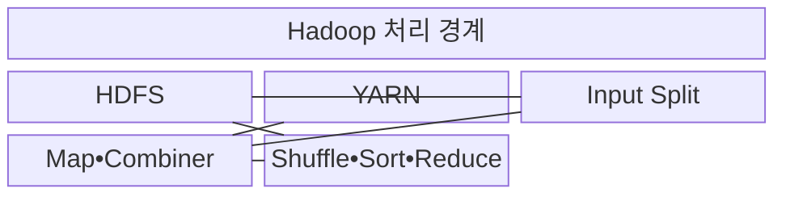
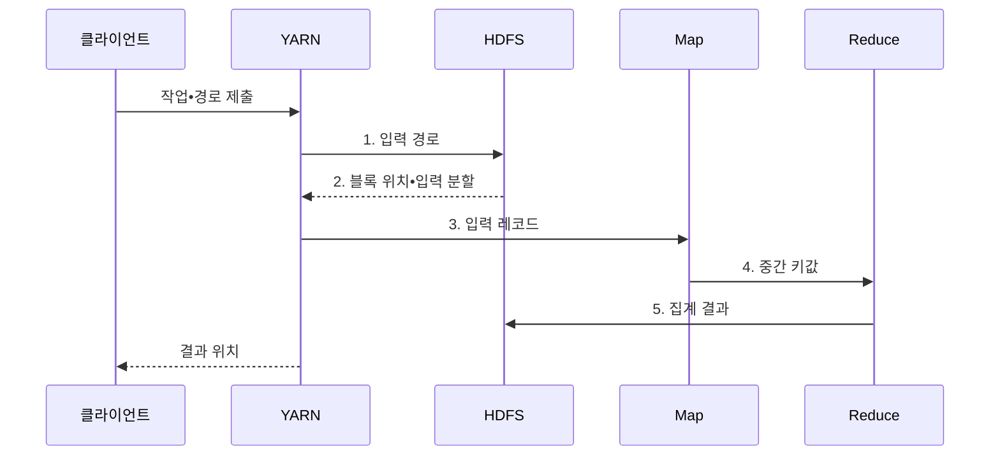

---
sidebar:
  order: 116
  label: "116. 빅데이터 분산 처리: Hadoop•MapReduce•HDFS"
  badge:
    text: "기출 • 30%"
    variant: note
title: "빅데이터 분산 처리: Hadoop•MapReduce•HDFS"
date: "2026-08-04T13:16:00+09:00"
tags:
  - "notes-software"
weight: 116
extra:
  question_no: "116"
  source_status: "기출"
  source_history: "120회"
  priority: 30
  priority_note: "120회 기출 후 저빈도, 배치 분산처리 기초"
---

## Ⅰ. 개요

핵심 용어

- **Hadoop MapReduce**: Map과 Reduce 태스크로 대규모 데이터를 일괄 처리하는 분산 계산 체계이다.
- **하둡 분산 파일 시스템(Hadoop Distributed File System, HDFS)**: 파일을 블록으로 나눠 여러 노드에 복제하는 저장 체계이다.
- **또 다른 자원 협상자(Yet Another Resource Negotiator, YARN)**: 컨테이너 자원과 태스크 실행을 관리하는 체계이다.

- 정의/개념: **HDFS•YARN** 과 태스크를 결합한 **Hadoop MapReduce**
- 배경/필요성: 단일 서버는 대용량 파일의 저장•집계 시간이 **한 장비 용량** 에 종속

#### 한줄 요약
- 파일을 작업자에게 나눠 맡기고 같은 열쇠 결과를 한곳에 모아 집계하는 처리이다.

## Ⅱ. 특징

핵심 용어

- **실패 복구**: 실패한 태스크를 다른 복제 블록이나 노드에서 다시 실행하는 특성이다.
- **분산 저장**: HDFS가 파일을 블록으로 나눠 여러 노드에 복제하는 방식이다.
- **키 처리**: Map이 중간 키값을 만들고 Shuffle이 같은 키를 모으며 Reduce가 최종 집계하는 흐름이다.

- **분산 저장**: HDFS 블록 분할•복제
- **키 처리**: Map•Shuffle•Reduce 집계
- **실패 복구**: 복제 블록으로 태스크 재실행

#### 한줄 요약
- 대용량 파일과 장애 재실행에는 강하지만 반복과 저지연 작업에는 느리다.

## Ⅲ. 구조 및 구성요소

핵심 용어

- **Shuffle**: 같은 중간 키를 담당 Reduce로 전송하는 구성요소이다.
- **Sort**: Reduce 입력을 키별로 그룹화하고 정렬하는 구성요소이다.
- **Reduce**: 키별 값에서 최종 결과를 집계하는 구성요소이다.
- **입력 분할(Input Split)**: 하나의 Map 태스크가 논리적으로 처리할 입력 레코드 범위이다.
- **Map**: 입력 레코드를 중간 키값으로 변환하는 단계이다.
- **Combiner**: 같은 Map 태스크 안에서 중간값을 부분 집계하는 단계이다.

| 구성요소 | 책임 |
|:---|:---|
| HDFS | **입력 블록•결과** 저장 |
| YARN | **컨테이너•상태** 관리 |
| Input Split | Map의 **논리 입력 범위** |
| Map•Combiner | **중간 키값•부분 집계** 생성 |
| Shuffle•Sort•Reduce | **키 그룹화•최종 집계** 수행 |

#### 한줄 요약

- 파일 창고, 작업 배정자, 입력 묶음, 이름표 작업자, 집계자로 구성된다.

## Ⅳ. 흐름도

핵심 용어

- **4. 중간 키값**: Map이 생성해 같은 키를 담당하는 Reduce 파티션으로 전달하는 데이터이다.
- **1. 입력 경로**: 처리할 파일 위치를 자원 관리자가 분산 파일 시스템에 전달하는 단계이다.
- **2. 블록 위치•입력 분할**: 파일 블록이 있는 노드와 Map 태스크별 논리 입력 범위를 반환하는 정보이다.
- **3. 입력 레코드**: 입력 분할에서 읽어 Map 함수에 전달하는 데이터 단위이다.
- **5. 집계 결과**: Reduce가 키별로 계산해 분산 파일 시스템에 기록한 최종 출력이다.

**동작 원리**

1. **입력 경로**: YARN이 HDFS에 처리할 파일 경로 전달
2. **블록 위치•입력 분할**: HDFS가 지역성 기반 실행 정보 반환
3. **입력 레코드**: YARN이 Map에 분할별 레코드 전달
4. **중간 키값**: Map이 Reduce 파티션에 키•값 쌍 전달
5. **집계 결과**: Reduce가 키별 결과를 HDFS에 기록

#### 한줄 요약

- 파일 조각을 가까운 작업자에게 맡기고 같은 이름표의 결과를 모아 합산한다.

## Ⅴ. 종류 및 비교

핵심 용어

- **Hadoop MapReduce**: 디스크 기반 단계 처리로 대형 정렬과 일괄 집계에 적합한 분산 엔진이다.
- **메모리 분산 엔진**: 중간 결과를 메모리에 재사용하고 방향성 비순환 그래프(Directed Acyclic Graph, DAG)로 반복•대화형 분석을 처리하는 엔진이다.
- **단일 서버**: 한 노드의 로컬 파일과 메모리만 사용해 소규모 작업을 단순하게 처리하는 방식이다.

| 분산 처리 엔진 | Hadoop MapReduce | 메모리 분산 엔진 | 단일 서버 |
|:---|:---|:---|:---|
| 적용 기준 | **대형 정렬•집계** | **반복•대화형 분석** | 한 노드 이내 **소규모 작업** |
| 핵심 특징 | **디스크 기반 단계 처리** | **메모리 캐시•DAG** | **로컬 파일•메모리** |
| 한계 | **셔플•높은 시작 지연** | **메모리•클러스터 비용** | **용량 상한•단일 장애** |

#### 한줄 요약

- Map은 이름표를 붙이고 Shuffle은 같은 이름표를 모으며 Reduce는 모인 값을 계산한다.

## Ⅵ. 실무 고려사항 및 대책

핵심 용어

- **파일 병합**: 작은 파일을 큰 파일로 묶어 태스크 시작 비용을 줄이는 방식이다.
- **컨테이너 형식**: 여러 레코드를 한 파일에 저장해 메타데이터 수를 줄이는 형식이다.
- **샘플링**: 처리 전에 키 분포를 측정하는 활동이다.
- **키 분할**: 편향 키에 보조 값을 붙여 여러 Reduce로 나누는 방식이다.
- **중간값 압축**: 셔플 데이터를 압축해 전송량을 줄이는 통제이다.
- **작업 수 조정**: 병렬 태스크 수를 자원량에 맞추는 통제이다.
- **블록 배치**: 입력 블록을 처리 노드 가까이에 두는 방식이다.
- **자원 균형**: 노드별 태스크 자원을 고르게 배정하는 통제이다.
- **멱등 출력**: 재실행에도 중복 결과를 만들지 않는 출력 방식이다.
- **임시 경로**: 결과를 확정하기 전에 태스크별 출력을 기록하는 위치이다.

| 문제 | 대책 | 효과 |
|:---|:---|:---|
| 파일마다 메타데이터•태스크 시작 비용 발생 | **병합•컨테이너 형식** 사용 | **태스크 시작 비용** 감소 |
| 일부 키에 중간값이 집중되어 Reduce 지연 | **샘플링•키 분할** 적용 | **Reduce 병목** 완화 |
| 중간값 전량 전송으로 망•디스크 포화 | **Combiner•압축•작업 수 조정** | **전송•입출력 부하** 감소 |
| 원격 블록 처리로 네트워크 전송 증가 | **블록 배치•자원 균형** | **원격 전송** 감소 |
| 실패 작업의 중복 기록으로 결과 오염 | **멱등 출력•임시 경로** 사용 | **중복 부작용** 방지 |

#### 한줄 요약

- 작은 파일을 미리 묶고 한 키에 일이 몰리지 않게 나누면 작업 준비와 마지막 병목을 줄일 수 있다.

## Ⅶ. 결론

핵심 용어

- **메모리 분산 엔진**: 반복 계산과 대화형 분석에서 중간 결과를 재사용해 지연을 줄이는 엔진이다.

- 대형 일괄 집계는 **MapReduce**, 반복•대화형 분석은 **메모리 분산 엔진** 선택

#### 한줄 요약

- 큰 파일을 한 번에 나눠 계산하는 데 강하지만 빠른 반복 작업에는 다른 엔진이 더 알맞다.
